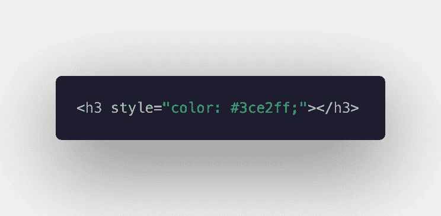
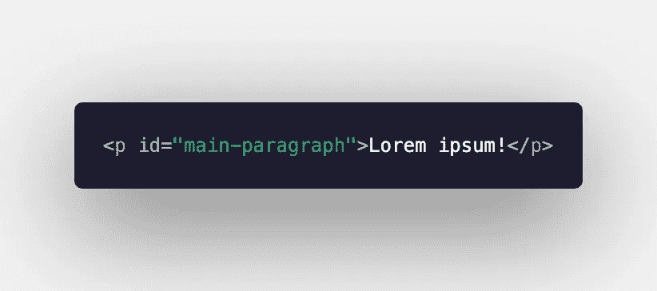
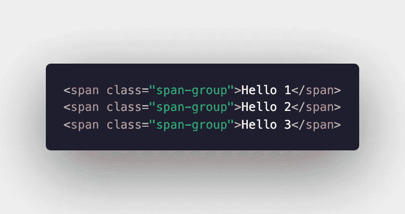
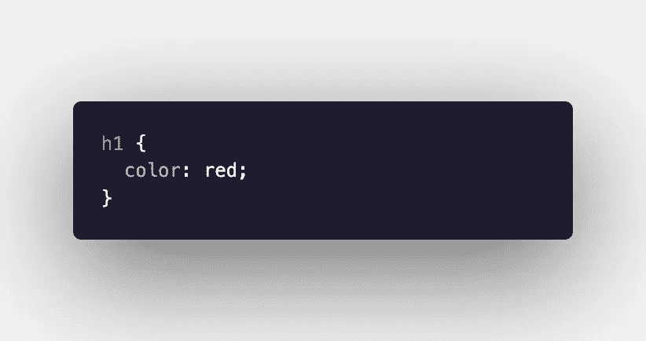
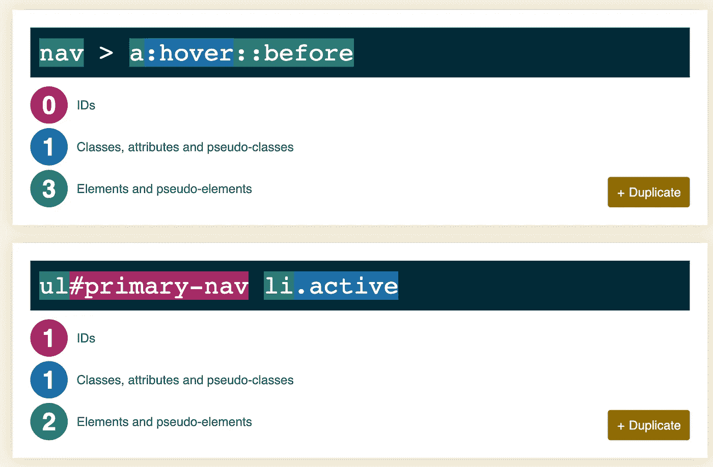

# CSS 特异性变得简单

> 原文：<https://levelup.gitconnected.com/css-specificity-made-simple-772f1d31f094>

如果您曾经尝试将新的 CSS 样式应用于元素，却发现应用于父元素的样式就是无法放弃，那么您可能遇到了特殊性问题。如果多个冲突的 CSS 规则应用于同一个元素，浏览器会根据一组特定的规则选择要应用的样式。一些选择器，比如 ID，非常具体，并且在具体性的顺序中排名很高。其他选择器，如通用选择器(*)，排名要低得多。

# 特异性层次结构

特异性是根据层次结构计算的。这个层次结构分为四类:

1.  内联样式:与 HTML 元素直接一致的样式规则。内嵌样式会覆盖任何其他样式。

2.id:只赋予一个特定元素的唯一标识符。

3.类和伪类:给予多个元素(类)的标识符，包括伪类，如:hover。

4.元素和伪元素:直接引用元素类型的标识符，包括伪元素，如::before。

# 计算特异性

为了计算你的选择器的特异性，你可以使用这个特异性计算器。如果你想自己计算，这里有一个快速的方法:

*   使用了三列。第一列是 ID 选择器的数量(X-0-0)，第二列是类选择器和伪类的数量(0-Y-0)，第三列是元素选择器和伪元素的数量(0-0-Z)。通用选择器不会增加特异性。
*   为每个使用的 ID 选择器在第一列中添加一个。
*   为每个使用的类选择器或伪类选择器在第二列中添加一个。
*   为每个使用的元素选择器或伪元素选择器在第三列中加 1。

在下面的示例中，第二个元素具有更高的特异性，因为数字 112 大于 013。内联样式将覆盖这些(从技术上讲，被赋予 1000 的特异性，因此下面的第一个元素将具有 1，013 的特异性)。

来源:[特异性计算器](https://specificity.keegan.st/)

# ！重要的

添加**的做法！重要提示**如果你不确定哪些样式规则应用于哪些 HTML 元素，覆盖所有其他 CSS 样式可能是一个快速的解决方案，但这通常是一个糟糕的做法。它改变了样式表的自然层叠功能，使调试变得困难。如果你在考虑用**！重要的**，尝试计算你的元素的特殊性，以确定你需要在哪里使你的规则更加具体。

阿曼达·特劳特勒