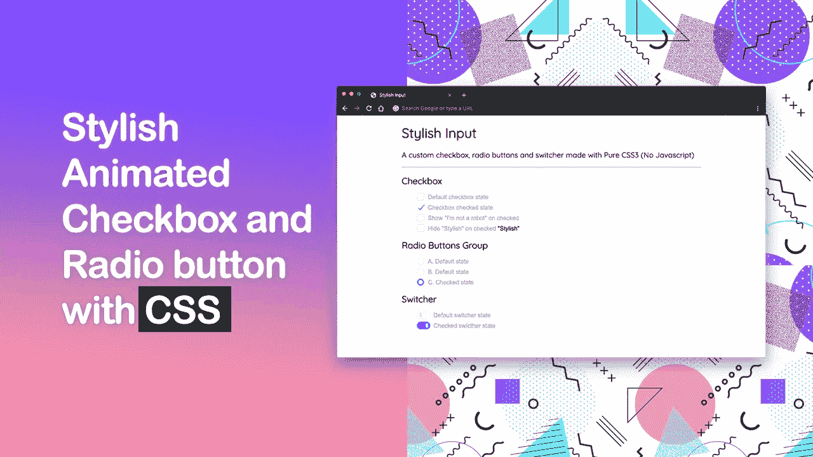

# CSS 时尚的自定义复选框和收音机输入

> 原文：<https://levelup.gitconnected.com/css-stylish-custom-checkbox-and-radio-input-9b465f193355>



复选框和单选输入字段通常用于 web 表单，默认的视觉外观取决于用户使用的浏览器，在不同的平台上可能看起来不一致。

历史上，我们不得不使用 JavaScript 来定制这些元素，以获得基本的效果。幸运的是，现在有更多的技术和不同的方式来完全用 CSS (w/o JavaScript)定制复选框和单选输入字段的外观和感觉，所以我们可以用干净漂亮的 UI 提供更好的用户体验。

在本文中，我将向您展示如何创建一个**时尚的自定义复选框和单选**输入字段的一步一步的方法。

# 演示

为了让你对最终效果有个概念，这是最终的演示

# 语义 HTML

首先，我们需要布局我们的 HTML

```
<label for="..." class="si si-*">
   <input type="..." id="..." />
   <span class="si-label">...</span>
</label>
```

用于包装`input`和`span`元素的`label`标签代表我们定制的输入字段。我们还将创建一个切换器和一些额外的(附加)。

*   `label`元素的`for`属性匹配`input`元素的`id`属性(*必需*)
*   `si`代表“**s**ty lish**I**nput”，后面跟一个带前缀的连字符类(`si-checkbox`、`si-radio`和`si-switcher`)来指定我们想要显示的元素。
*   `si-label`代表标签的文本

# HTML:复选框

```
<label for="defaultCheckbox" class="si si-checkbox">
  <input type="checkbox" id="defaultCheckbox" />
  <span class="si-label">Default checkbox state</span>
</label><label for="checkedCheckbox" class="si si-checkbox">
  <input type="checkbox" id="checkedCheckbox" checked />
  <span class="si-label">Checked checkbox state</span>
</label>
```

# HTML:单选按钮组

```
<label for="defaultRadio" class="si si-radio">
  <input type="radio" id="defaultRadio" name="radioGroup" />
  <span class="si-label">Default radio state</span>
</label><label for="checkedRadio" class="si si-radio">
  <input type="radio" id="checkedRadio" name="radioGroup" checked />
  <span class="si-label">Checked radio state</span>
</label>
```

# HTML:切换器

```
<label for="defaultSwitcher" class="si si-switcher">
  <input type="checkbox" id="defaultSwitcher" />
  <span class="si-label">Default switcher state</span>
</label><label for="checkedSwitcher" class="si si-switcher">
  <input type="checkbox" id="checkedSwitcher" checked />
  <span class="si-label">Checked switcher state</span>
</label>
```

# HTML:附加内容

带有`data-onchecked="..."`的元素将根据输入状态进行切换。可用值`"show"`和`"hide"`。

`data-onchecked="show"`默认情况下会隐藏，输入时:选中会变得可见。

```
<label for="showOnChecked" class="si si-checkbox">
  <input type="checkbox" id="showOnChecked" />
  <span class="si-label">Show "I'm not a robot" on checked</span>
  <span data-onchecked="show">I'm not a robot</span>
</label>
```

`data-onchecked="hide"`默认可见，输入时:选中将变为隐藏。

```
<label for="hideOnChecked" class="si si-checkbox">
  <input type="checkbox" id="hideOnChecked" />
  <span class="si-label">Hide "Stylish" on checked</span>
  <span data-onchecked="hide">Stylish</span>
</label>
```

跨线:通过在 input:checked 状态下向`si-label`添加一个额外的`line-across`类，它将在标签的文本上画一条线

```
<label for="lineAcross" class="si si-checkbox">
  <input type="checkbox" id="lineAcross" />
  <span class="si-label line-across">Mark as done</span>
</label>
```

# 半铸钢ˌ钢性铸铁(Cast Semi-Steel)

从添加通用样式规则开始

```
/* custom properties (AKA css variables) */
.si {
  --color-label: #9aa6bf;
  --color-default: #dee5f2;
  --color-active: #0069ff;
  --rotate-default: 180deg;
  --rotate-active: 40deg;
  --border-size-checkmark: 2px;
  --border-size-box: 1px;
  --input-size: 20px;
  --guter: 15px;
}/* basic reset */
.si,
.si *,
.si *::before,
.si *::after {
  box-sizing: border-box;
}/* label */
.si {
  cursor: pointer;
  position: relative;
}.si .si-label {
  display: inline-block;
  padding-left: var(--guter);
  color: var(--color-label);
  vertical-align: text-top;
}
```

接下来，我们必须隐藏输入字段。有几种方法可以做到这一点:

```
.si > input { display: none; }
/* OR */ 
.si > input { opacity: 0; }
/* OR */ 
.si > input { visibility: hidden; }
```

应用其中任何一项都会使屏幕阅读器无法访问输入字段。有一种优雅的方法可以用`clip-path`隐藏元素并保持它们的可访问性

```
.si > input[type="checkbox"],
.si > input[type="radio"] {
  clip-path: polygon(0 0);
}
```

# 伪元素

我们将使用`::before`和`::after`来代表我们的复选框(正方形和复选标记)和单选按钮(两个圆圈)

```
/* change property values smoothly */
.si .si-label::before,
.si .si-label::after {
  transition: all 0.2s ease-in-out;
}/* an element for both checkbox and radio */
.si .si-label::before {
  content: '';
  display: block;
  width: var(--input-size);
  height: var(--input-size);
  border: var(--border-size-box) solid var(--color-default);
  position: absolute;
  top: -3px;
  left: 0;
  transform: rotate(0deg) scale(1);
}/* feedback when the user interacts with an element */
.si .si-label:hover::before {
  border-color: var(--color-active);
}
```

# CSS:复选框

默认状态:

```
/* checkbox square */
.si.si-checkbox .si-label::before {
  border-radius: var(--border-size-checkmark);
}/* checkbox checkmark */
.si.si-checkbox .si-label::after {
  content: '';
  display: block;
  width: 8px;
  height: 18px;
  border-width: 0 var(--border-size-checkmark) var(--border-size-checkmark) 0;
  border-style: solid;
  border-color: transparent var(--color-active) var(--color-active) transparent;
  position: absolute;
  top: -3px;
  left: 0;
  transform: rotate(var(--rotate-default)) scale(0);
}
```

选中状态:

```
/* checkbox square */
.si.si-checkbox > input:checked + .si-label::before {
  transform: rotate(var(--rotate-active)) scale(0);
}/* checkmark */
.si.si-checkbox > input:checked + .si-label::after {
  left: 8px;
  transform: rotate(var(--rotate-active)) scale(1);
}
```

# CSS:无线电

默认状态:

```
/* circles, alignment */
.si.si-radio .si-label::before,
.si.si-radio .si-label::after {
  border-radius: 100%;
  top: -2px;
}/* radio bullet circle */
.si.si-radio .si-label::after {
  content: '';
  display: block;
  position: absolute;
  width: 12px;
  height: 0;
  top: 100%;
  left: 4px;
}
```

选中状态:

```
.si.si-radio > input:checked + .si-label::after {
  background-color: #fff;
  height: 12px;
  top: 2px;
}.si.si-radio > input:checked + .si-label::before {
  background-color:var(--color-active);
}
```

# CSS:切换器

默认状态:

```
/* switcher label gutter */
.si.si-switcher .si-label {
  padding-left: 45px;
}/* switcher rounded rectangle */
.si.si-switcher .si-label::before {
  content: '';
  width: 36px;
  height: 20px;
  border-radius: 20px;
  top: -2px;
}/* switcher bullet */
.si.si-switcher .si-label::after {
  content: '';
  border-radius: 4px;
  width: 6px;
  height: 12px;
  background-color: var(--color-default);
  position: absolute;
  top: 2px;
  left: 7px;
}
```

选中状态:

```
.si.si-switcher > input:checked + .si-label::before {
  background-color: var(--color-active);
  border-color: var(--color-active);
}.si.si-switcher > input:checked + .si-label::after {
  background-color: #fff;
  left: 24px;
}
```

# CSS:临时演员

```
.si [data-onchecked="show"],
.si > input:checked ~ [data-onchecked="hide"] {
  display: none;
}.si [data-onchecked="hide"],
.si > input:checked ~ [data-onchecked="show"] {
  display: inline-block;
}.si > input:checked + .si-label.line-across {
  text-decoration: line-through;
}
```

> *通用同级组合符“波浪号”匹配所有与 input 同级的* `*data-onchecked="..."*` *元素:勾选后出现。*

[](https://gitconnected.com/learn/javascript) [## 学习 JavaScript -最佳 JavaScript 教程(2019) | gitconnected

### 50 大 JavaScript 教程-免费学习 JavaScript。课程由开发人员提交并投票，从而实现…

gitconnected.com](https://gitconnected.com/learn/javascript)