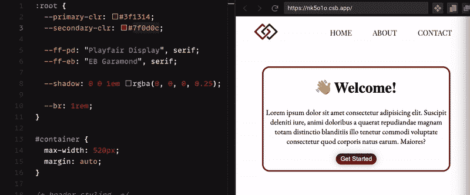

# CSS 变量

> 原文：<https://levelup.gitconnected.com/css-variables-71a217bfc4f4>


谈到 CSS，当一个应用程序在多个地方有相同的颜色或相同的边框半径，而你(或你的客户)决定需要改变时，很容易迷失。假设你在数百个不同的地方都有同样的颜色，并决定它需要更深一些；你是做什么的？查找并替换？用手追踪他们？

谢天谢地，CSS 对此有一个很好的解决方案: **CSS 变量**(有时也称为自定义属性)。CSS 变量对于快速更新特定属性、干燥 CSS 文件以及使代码对其他开发人员来说更加直观非常有用(初步看来，`--primary-color`比`#3f1314`更具描述性)。

我创建了这个简单的欢迎页面来演示如何在代码中实现 CSS 变量。在继续阅读的同时，您可以随意摆弄 style.css 文件，因为它会让您更好地了解自定义属性在应用程序中是如何工作的。

# 什么是 CSS 变量？

CSS 变量是在样式表中定义的自定义属性，可以级联到子元素。每当声明一个自定义属性时，您实际上是在创建一个可以在您的应用程序中使用的新属性。由于这不是像“填充”那样的标准属性，我们需要让浏览器知道新属性是什么。我们可以通过在选择器中声明我们的新属性来做到这一点:

# 分解它。

在上面的例子中，您可能注意到的第一件事是“`:root`”选择器。Root 是一个伪类选择器，它引用文档的根元素(大多数情况下是`<html>`元素)。然而，即使它被用来选择`<html>`元素，root 也有更高层次的特异性。通常最佳实践是在`:root`伪类中声明您的自定义属性，因为这将允许在文档中的任何地方访问变量。

现在我们知道了根选择器是什么，让我们来谈谈正在使用的语法。为了声明新的自定义变量，您需要使用所谓的“自定义属性符号”。这个符号由两个破折号、变量名和变量值组成(如`--name: value;`)。

一旦我们在根元素中声明了变量，我们就可以从文档中的任何地方访问它们。让我们看一下按钮选择器，看看如何访问这些属性。

如上所示，我们通过`linear-gradient()`函数中的`var()`函数访问我们的`--primary-clr`和`--secondary-clr`属性。因为我们的自定义属性是在根元素中声明的，所以我们可以在任何选择器中访问它们。

通过以这种方式声明和调用我们的自定义属性，我们可以从我们的根元素对这些变量进行全局更新:



通过将`--secondary-clr`改为蓝色，我们不仅改变了按钮的颜色，还改变了边框的颜色，因为它也使用了`--secondary-clr`属性。

# 额外收获:使用 CSS 变量的`calc()`函数。

如果我们不希望我们的主边框和按钮有相同的`border-radius`，但是我们仍然希望它们成比例，我们可以使用`calc()`函数。让我们再看一下按钮选择器，特别是`border-radius`属性:

```
border-radius: **calc(**var(--br) **/ 2 )**;
```

我们可以将`var()`包装在一个`calc()`函数中，以对自定义属性执行计算。在这种情况下，我们将它除以 2。通过添加该计算，主边框将保持`border-radius`为`1rem`，而按钮半径将被计算为`0.5rem`。

**TL；博士**

1.  CSS 变量有助于减少 CSS 文件的内容，并使在整个应用程序中更新样式变得更加容易。
2.  CSS 变量通常在用于全局访问的`:root`伪类选择器中声明。
3.  为了让浏览器知道我们的定制属性，我们需要使用定制属性符号来定义它们。
4.  我们可以通过使用`var()`函数来访问这些属性。