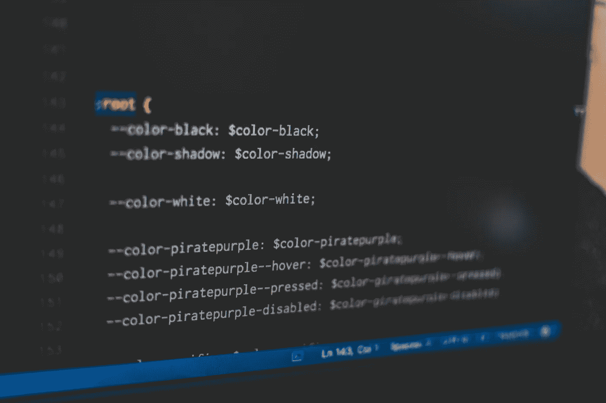
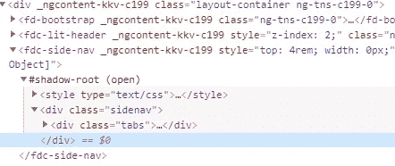

# CSS 变量和 web 组件

> 原文：<https://levelup.gitconnected.com/css-variables-and-web-components-7aaae8d4c6ab>



照片由[潘卡杰·帕特尔](https://unsplash.com/@pankajpatel?utm_source=unsplash&utm_medium=referral&utm_content=creditCopyText)在 [Unsplash](https://unsplash.com/s/photos/css?utm_source=unsplash&utm_medium=referral&utm_content=creditCopyText) 上拍摄

CSS 变量或自定义属性是由 CSS 开发人员定义的值，包含将在整个文档中重用的特定值。

它们是使用自定义属性表示法设置的。

`**--primary-text-color: black;**`

并使用`[var()](https://developer.mozilla.org/en-US/docs/Web/CSS/var)`函数进行访问。

`color: **var(--primary-text-color, #333333)**;`

`var()`的第二个输入是默认值，如果变量未定义或浏览器不支持 CSS 变量，则考虑该值。

我们一直在使用 web 组件开发一个遵循微前端架构的应用程序。有一个主 shell 应用程序在运行时处理路由和提取正确的微应用程序。微应用程序是独立的，用 Angular、Vue 和 Polymer(使用 web 组件构建 Web 应用程序的开源 JavaScript 库)开发。

此外，每个微应用程序都使用一个核心库，其中包含各种可重用的 web 组件，如 Alerts、Spinner、Card、Datatable 等。

有一个特性是从主题列表中设置整个应用程序的主题。此外，用户可以创建自己的主题。主要的挑战是如何从 shell 应用程序或任何微应用程序中改变 web 组件的样式，因为 web 组件有自己的影子 DOM。影子 DOM 用于封装。它允许组件拥有自己的“影子”DOM 树，不能从主文档中访问，可能有本地样式规则，等等。



对我来说，CSS 变量成了救星，因为它们可以穿透影子 DOM，可以应用于 Web 组件中的节点。

下面是我们如何实现它的一个例子。

我们已经在 shell 应用程序中定义了各种 CSS 变量。

```
:root {--primary-text-color: #fff;
--primary-background-color: #ededed;
--secondary-text-color: #53565;
--secondary-background-color:   #cccbcb;}
```

在 web 组件中(使用[@ Vue/we B- component-wrapper](https://github.com/vuejs/vue-web-component-wrapper)库将 Vue 类包装到 web 组件中)。

具有两个属性 type 和 label 的按钮组件。

```
**//Button.vue**<template> <button class="btn" :class="[type]">{{label}}</button></template><script>
  export default { props:{
      label:String,
      type: String,
  }
}</script><style>
.btn {
  display: inline-block;
  font-weight: 400;
  text-align: center;
  white-space: nowrap;
  vertical-align: middle;
  border: 1px solid transparent;
  padding: .375rem .75rem;
  font-size: 1rem;
  line-height: 1.5;
  border-radius: .15rem;
  transition: color .15s ease-in-out,background-color .15s ease-in-  out,border-color .15s ease-in-out,box-shadow .15s ease-in-out;
  margin: 0;
  overflow: visible;
}.primary {
  color: var(--primary-text-color,#f4f4f4);
  background-color: var(--primary-background-color,#49d597);
  border-color:  var(--primary-background-color,#49d597);
}.secondary {
  color: var(--secondary-text-color,#f1f1f1);
  background-color: var(--secondary-background-color,#32c547);
  border-color:  var(--secondary-background-color,#32c547);
}
```

使用**@ Vue/we B- component-wrapper**将 Vue 按钮组件包装并注册为自定义元素。

```
import Vue from 'vue';
import wrap from ‘@vue/web-component-wrapper’;
import Button from './components/Button.vue';const button = wrap(Vue, Button);
window.customElements.define('wc-button', button);
```

按钮 web 组件的用法如下:

```
//In Vue app
<wc-button type="primary" @click="save()" label="Save"></wc-button>
<wc-button type="secondary" @click="reset()" label="Reset"></wc-button>//In angular app
<wc-button type="primary" (click)="save()" label="Save"></wc-button>
<wc-button type="secondary" (click)="reset()" label="Reset"></wc-button>//In plain JS
<wc-button type="primary" onclick="save()" label="Save"></wc-button>
<wc-button type="secondary" onclick="reset()" label="Reset"></wc-button>
```

下面是我们如何根据用户选择的主题改变 CSS 变量的代码。这里我们选择文档的根元素，并使用样式的`setProperty()`方法更改变量值。

当我们更改变量的值时，它会应用于文档中使用该特定自定义属性的所有 DOM 元素。

```
userSelectedtheme = {
 name : "Navy Blue",
 properties: [
    { key: "--primary-background-color", value: "#d2c5ce" },
    { key: "--primary-text-color", value: "#3e3a3a" },
    { key: "--secondary-background-color", value: "#504d4d" },
    { key: "--secondary-text-color", value: "#4c3b3a" },
]}userSelectedtheme.properties.forEach(property => {
  document.documentElement.style.setProperty (
    property.key,
    property.value
  );
});
```

嘣，就这些了，我们完成了…谢谢你的时间…:)