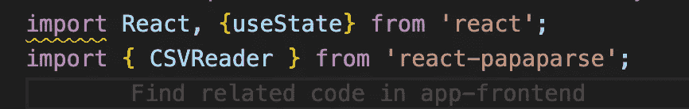

# React 中的 CSV 解析

> 原文：<https://levelup.gitconnected.com/csv-parsing-in-react-8d2a05f844f3>

这篇文章包括 React、JS、Rails 和 PapaParse 的使用

我目前正在开发一个围绕加密货币和气候的应用程序。它要求我们从不同的加密货币交易所收集用户的加密交易，以便对它们进行分析。我想使用比特币基地的 API，因为大多数加密用户都是从他们的产品开始的。比特币基地鼓励用户使用他们的 Oauth2 认证，而不是他们的 API 密钥，所以我花了一些时间试图弄清楚这一点。

我通读了一遍文档，查阅了 StackOverflow 等很多网站，但是都弄不到！首先，我意识到 CB 网站上提供的一个网址是不正确的！这里的接入令牌应该是【https://api.coinbase.com/oauth/token】**。*我尝试使用 Auth0，但无法成功重定向回我的应用程序，也无法使用我的令牌获取数据。我最终搁置了 Oauth2，并把目光放在了 CSV 上传上，因为所有的交易所都允许我们导出 CSV 格式的交易。*

**

*Pierre Borthiry 在 [Unsplash](https://unsplash.com?utm_source=medium&utm_medium=referral) 上拍摄的照片*

*我正在使用 React 前端(利用钩子)和 Rails 后端。我对导入这些 CSV 文件的最佳方式做了一些研究，最终找到了一个名为 [PapaParse](https://www.npmjs.com/package/react-papaparse) 的解决方案。安装完解析器后，我导入了组件并利用了大部分起始代码..PapaParse 文档很好地解释了这个库，只是做了一些小的改动，把它从类组件变成了钩子。*

**

*导入 CSVReader*

**

*用于 CSVReader 的一些代码*

*在实现这些元素、更新代码以利用钩子，并在页面上测试我的代码之后，我利用 State 来保存上传的 CSV 文件。然后我创建了一个“上传”按钮，它将触发 onPost，遍历数据中的每一项。输出的数据有点难以处理，但是通过几个 console.logs 就变得非常清楚了。在这个 for 循环中，我用每个数据项的必要字段创建了一个对象，然后将数据发送到后端。这最后三张图片来自 for 循环，为了清晰起见，我删掉了一些代码。*

******

*这里我们有一个新的获取请求发生在每一行数据上。*

*最后，我们看到一切都传播到了后端！只要数据结构良好，将其析构并发送到后端就相当简单。我希望这对你有所帮助，如果你有任何问题，请随时联系我们！我希望在不久的将来能有一个解释比特币基地 Oauth2 的帖子。*

* [## react-papaparse

### React 最快的浏览器内 CSV(或分隔文本)解析器。它充满了有用的功能，如 CSVReader…

www.npmjs.com](https://www.npmjs.com/package/react-papaparse)*