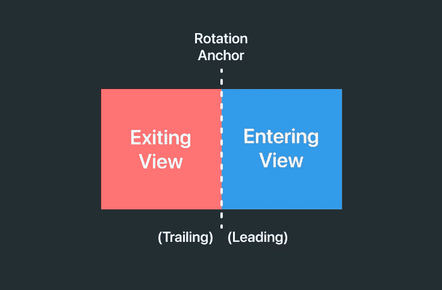

# SwiftUI 立方体旋转过渡教程

> 原文：<https://levelup.gitconnected.com/cube-rotation-transition-b1b5f108f8d0>

## 让-马克·布里安内


SwiftUI 立方体旋转过渡

今天我们将讲述如何创建一个看起来像立方体旋转的自定义`AnyTransition`。看看下面的视频。

> 在开始之前，请考虑使用这个[链接](https://trailingclosure.com/signup/?utm_source=medium&utm_medium=blog_post&utm_campaign=cube_rotation_tutorial)订阅，如果你没有在[TrailingClosure.com](https://trailingclosure.com/?utm_source=medium&utm_medium=blog_post&utm_campaign=cube_rotation_tutorial)上阅读这篇文章，请随时来看看我们！

## 创建自定义`AnimatableModifier`

首先定义一个名为`CubeRotationModifier`的新`AnimatableModifier`。在里面，定义一个名为`pct`的新`Double`，我们将使用它作为我们的`animatableData`来制作过渡动画。

```
import SwiftUI

struct CubeRotationModifier: AnimatableModifier {

    var pct: Double

    var animatableData: Double {
        get { pct }
        set { pct = newValue }
    }

    func body(content: Content) -> some View {
        content
    }
}
```

## 旋转视图

接下来，我们需要沿着 y 轴对视图进行 3D 旋转。旋转的锚点取决于视图来自哪个方向(进入或退出)。下面的两个图表可能有助于澄清任何困惑。



为了区分视图是进入还是退出，我们将创建一个名为`SlideDirection`的枚举。然后我们将使用 enum 来定义一个名为`direction`的属性，该属性将定义我们将使用哪个旋转动画。

```
struct CubeRotationModifier: AnimatableModifier {

    enum SlideDirection {
        case enter
        case exit
    }

    var pct: Double
    var direction: SlideDirection

    var animatableData: Double {
        get { pct }
        set { pct = newValue }
    }

    func body(content: Content) -> some View {
        content
    }
}
```

现在将`.rotation3DEffect()`应用到视图中。

```
func body(content: Content) -> some View {
    content
        .rotation3DEffect(
            Angle(degrees: calcRotation()),
            axis: (x: 0.0, y: 1.0, z: 0.0),
            anchor: direction == .enter ? .leading : .trailing,
            anchorZ: 0,
            perspective: 0.1
        )
}

func calcRotation() -> Double {
    if direction == .enter {
        return 90 - (pct * 90)
    } else {
        return -1 * (pct * 90)
    }
}
```

如你所见，根据`SlideDirection`我们应用了不同的`Angle`和`UnitPoint`(锚)。

*   进入视图从`90`开始，一直到`0`
*   退出视图从`0`开始，一直到`-90`

如果你现在运行它，你可能会看到一些有趣的动画。这是因为我们没有转换视图在屏幕上的`x`位置。现在，它们在开始的位置旋转，一个在另一个上面。

## 翻译视图

为了将视图转换到正确的`x`距离，我们需要获取对框架的引用。我们通过将内容包装在一个`GeometryReader`中并使用它传入的`GeometryProxy`来做到这一点。

```
func body(content: Content) -> some View {
    GeometryReader { geo in
        content
            .rotation3DEffect(
                Angle(degrees: calcRotation()),
                axis: (x: 0.0, y: 1.0, z: 0.0),
                anchor: direction == .enter ? .leading : .trailing,
                anchorZ: 0,
                perspective: 0.1
            ).transformEffect(.init(translationX: calcTranslation(geo: geo), y: 0))
    }
}

func calcTranslation(geo: GeometryProxy) -> CGFloat {
    if direction == .enter {
        return geo.size.width - (CGFloat(pct) * geo.size.width)
    } else {
        return -1 * (CGFloat(pct) * geo.size.width)
    }
}
```

与上面类似，沿着`x`轴平移视图取决于视图移动的方向。

*   进入的视图从等于其`width`的`x`位置开始，并转换为`0`。
*   退出视图从等于`0`的`x`位置开始，并转换到`width * -1`

## 延伸`AnyTransition`

在我们可以使用修饰符之前，我们需要扩展`AnyTransition`来获取`CubeRotationModifier`并将其转换成一个在我们的视图上使用的过渡。

> 注意**过渡是如何不对称的**。在进入和退出时修改方向，以确保视图在屏幕上以正确的方式旋转。

```
extension AnyTransition {
    static var cubeRotation: AnyTransition {
        get {
            AnyTransition.asymmetric(
                insertion: AnyTransition.modifier(active: CubeRotationModifier(pct: 0, direction: .enter), identity: CubeRotationModifier(pct: 1, direction: .enter)),
                removal: AnyTransition.modifier(active: CubeRotationModifier(pct: 1, direction: .exit), identity: CubeRotationModifier(pct: 0, direction: .exit)))
        }
    }
}
```

## 测试运行示例

获取下面的代码，并在您的模拟器或真实设备上运行它。当一个立方体的颜色在屏幕上旋转时，你会看到`.cubeSlide`的转换。

```
import SwiftUI

struct ContentView: View {

    @State var index: Int = 0
    @State var timer = Timer.publish(every: 2, on: RunLoop.main, in: RunLoop.Mode.common).autoconnect()
    var colors: [Color] = [Color.red, Color.blue, Color.green, Color.orange, Color.purple]

    var body: some View {
        ZStack {
            ForEach(colors.indices) { i in
                if index == i {
                    colors[i]
                        .transition(.cubeRotation)
                }
            }

        }
        .frame(width: 200, height: 200, alignment: .center)
        .onReceive(timer) { _ in
            withAnimation(.easeInOut(duration: 1.3)) {
                index = (index + 1) % colors.count
            }
        }

    }
}
```

## 让我们看看你做了什么！

我们想看看你用这个教程做了什么！给我们发照片！在推特 [@TrailingClosure](https://twitter.com/TrailingClosure) 、insta gram[上找到我们，或者发邮件到 howdy@TrailingClosure.com联系我们。](https://www.instagram.com/trailingclosure/)