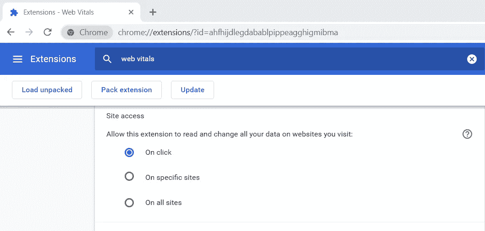

# 累积布局偏移(CLS)

> 原文：<https://levelup.gitconnected.com/cumulative-layout-shifts-cls-ab3ef9b98b70>

## 识别并修复网页上跳动的按钮、文本和其他控件的笨拙用户体验。

你有没有去过令人心惊肉跳的网站？正要点击一个按钮，它动了。我们正在阅读一个帖子，随着内容的移动，我们忘记了自己的位置。发现了一双好的运动鞋，正要挑选，但是它向下移动了，你点击了你从不关心的凉鞋！


图 2:参考，CLS 的 Web 开发文档。https://web.dev/cls/

网页上不稳定的元素会对用户体验产生负面影响。在开发过程中，很难识别、跟踪和修复网页的不稳定性。这个问题可能不会发生，因为大多数资源都缓存在开发和测试工程师的机器上。

CLS(累积布局偏移)是衡量网页视觉稳定性的数据点。在这篇文章中，我将在[我的网页展示](https://kvkirthy.github.io/showcase)上讨论 CLS 的结果。我用了一个新的谷歌浏览器扩展，Web Vitals。

## 网络生命——谷歌浏览器扩展

Web Vitals 简化了网站的性能和用户体验数据点。在 Chrome 网上商店下载并安装 Web Vitals。跟随[这个链接](https://chrome.google.com/webstore/detail/web-vitals/ahfhijdlegdabablpippeagghigmibma)到 Google Chrome 中的扩展，点击*添加到 Chrome* 。

默认情况下，该扩展在所有网站上运行。将设置更改为点击时运行。导航到计算机上所有已安装扩展的列表。找到网络重要信息，然后单击详细信息。注意，在*站点访问*部分，默认选择“在所有站点上”。将设置更改为“单击时”，以便仅在调用扩展时捕获数据。请参见下面的图 1。



图 1:网络生命体征设置

还有其他工具，如 [Lighthouse](https://developers.google.com/web/tools/lighthouse) 、 [Pagespeed Insights](https://developers.google.com/speed/pagespeed/insights/) 和 Chrome DevTools，它们提供深入的网站性能数据。但是，它们提供了很多信息，需要深入了解。Web Vitals 通过关注用户体验的以下三个主要方面进行简化，

1.  使用*最大内容绘制的页面加载性能*
2.  *交互性*，在*第一次输入延迟*的情况下，一个页面准备就绪的速度。
3.  *视觉稳定*带 *CLS。*

## 什么是累积布局偏移(CLS)？

它是一个数据点，表示可见元素中的意外变化。它在资源异步加载时发生。大多数网页不会按顺序加载。当数据可用时，内容就会出现。

考虑一个场景，一个意外的布局变化导致了一场灾难。一则广告延迟发布，将订单*取消*与*确认*互换。假设它发生在用户试图点击取消的时候。视觉描述见下图 2。


图 2:参考，CLS 的 Web 开发文档。【https://web.dev/cls/ 

在上面的场景中，延迟加载广告会导致内容移动。其他一些可能导致此类问题的情况包括调整图像大小、延迟字体下载导致内容高度和宽度发生变化。

另一方面，作为用户交互结果的视觉元素的变化被认为是有意的和预期的。它不会导致 CLS 的失败。例如，单击汉堡菜单会显示或隐藏左侧导航，这会导致页面布局发生相当大的变化。然而，这种布局变化是功能性的和必需的。

在这篇文章中，我将使用 Web Vitals Google Chrome extension 和 Chrome Dev 工具来识别和修复 CLS 问题。

## 在 Showcase 上运行 Web Vitals

接下来，在 [Showcase 网页](https://kvkirthy.github.io/showcase/)上运行 Chrome 扩展。结果见图 3。如前所述，本帖重点关注*累计布局移位*。


图 3:展柜上的网站重要信息

扩展计算 CLS 值为 0.138，并用红色警告。低于 0.1 的 CLS 值被认为是好的(绿色)。这意味着，我的页面上的可见元素移动得太多，这可能会对用户体验产生负面影响。关于如何计算 CLS，请参见 [WebDev 文档](https://web.dev/cls/)。

让我们分析一下这个页面(见图 4)。这是一个繁忙的收集材料设计卡。第一张卡片显示了一篇最近的博客文章。因此，它相对较大，并获得关注。剩余的博客文章占据了页面的剩余空间。


图 4:CLS 分析的展示页面

> **不要脸的插:**查看我关于[Angular for Material Design](https://www.amazon.com/Angular-Material-Design-TypeScript-Interface/dp/1484254333/ref=sr_1_3?keywords=angular+material&qid=1578191826&sr=8-3)的书，了解更多 Angular 中的材质设计实现，包括使用卡片。

现在已经确定 CLS 是我页面上的一个问题，我们需要缩小到不稳定的元素。使用 Chrome 开发工具来直观地识别导致糟糕分数的元素。使用*更多工具*菜单选择*渲染。*确保*布局移位区域*被选中。请参见下面的图 5。


图 5:在 Chrome 开发工具中启用布局移动区域

*布局移动区域*突出显示在两个框架之间移动的页面元素。参见下图 6 中展示页面上的亮点。


图 6: CLS 亮点

## 不稳定元素

在图 6 中，不稳定的元素用蓝色突出显示。它们的开始位置在两帧之间改变(因此它们是不稳定的)。经过一点点调试，我发现布局的变化是由图像引起的。在两个帧之间，当下载和呈现图像(资源)时，``元素的高度变化导致其下的行的布局调整和移动。

> 请注意，不稳定的元素可能不会导致问题。某个图像导致了布局偏移，其起始位置没有改变。因此，它不是不稳定的元素。
> 
> 调试不稳定的卡不会解决问题。我们需要理解是什么导致了布局的变化，在这种情况下，布局是不稳定卡片之上的稳定元素。

在页面加载时设置图像大小。这确保了在通过网络下载图像后没有偏移。考虑下面的 CSS 设置图像元素的最小高度。

```
mat-card img.card-image {
   min-height: 268px;
}
```

让我们回顾一下代码更改后的 CLS。请参见下面的图 7。现在，布局偏移在 0.1 以下，这是一个可以接受的范围。


图 CSS 调整图像尺寸后的 CLS

## 最佳实践

总之，为了避免意外的布局变化，请考虑以下最佳实践:

1.  为呈现图像、视频等资源的元素设置高度和宽度。
2.  不要在当前元素之上添加内容
3.  使用动画实现平滑的布局过渡。

# 参考

1.  [CLS 网站开发文档](https://web.dev/cls/)
2.  [关于网络生命体征](https://web.dev/vitals/)
3.  [网络生命体征，GitHub r](https://github.com/GoogleChrome/web-vitals-extension#web-vitals-chrome-extension-alpha) epo。

# 更多关于我的事

*   在推特@KeertiKotaru 打个招呼。
*   读我的书角材书|角材 v1.x
*   我过去的文章和博客 a)为 [DotNet Curry](https://www.dotnetcurry.com/author/v-keerti-kotaru) 和 b) [Blogger](http://venckicode.blogspot.com/)