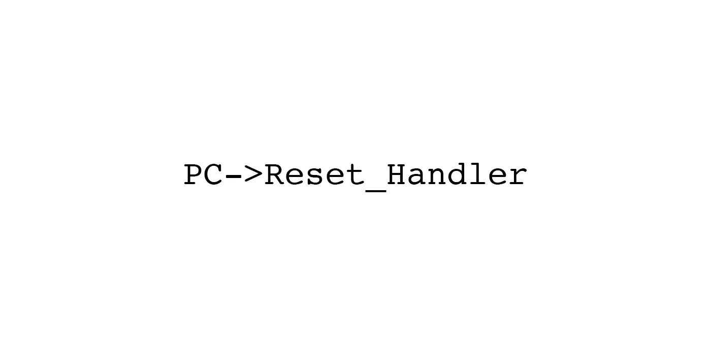
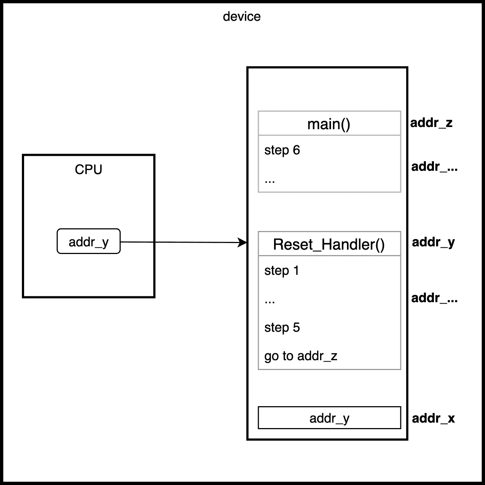

# 好奇心来袭！C 语言中 main()之前的错综复杂

> 原文：<https://levelup.gitconnected.com/curiosity-strikes-the-intricacies-before-main-in-c-d4327714f8ee>

主之前的创世纪()

在本文中，我将讨论通用嵌入式设备中的 C 程序如何进入 main()。我这样写是因为网上的无数解释都是针对特定设备的。他们使用了许多特定于架构的术语，混淆了嵌入式设备复位机制背后的基本原理。我的目标是用简单的术语向您解释设备如何准备自己，以便 main()可以完成它的工作。我希望这将为您的嵌入式系统工具箱打下坚实的基础。

准备好了吗？让我们打开引擎盖下的东西😉

你有没有注意到，每次你试图打开一个设备(从完全关机的状态)，在你看到主屏幕之前有相当长的等待时间？以你的手机为例，在你看到手机制造商的标志之前，它需要几秒钟(甚至几分钟)才能启动。在这段等待的时间里，你可能会也可能不会想它为什么会这样。如果你这样做，下面的讨论概述了一个非常简单的设备复位机制的解释。

# 用一个类比来解释 Reset 处理程序和 main()

当您打开支持数字的设备时(假设从其复位状态(如完全断电状态)开始)，会执行数百条指令来调整设备，以准备好服务于最终用户命令它做的事情。有一个隐藏得很好的回调函数，通常称为 Reset Handler，在将系统移交给 main()之前执行这数百个步骤。我在解释这一点时经常使用的一个很好的类比是，当你给某人冲一杯速溶咖啡时，可能很简单:

1.  打开咖啡袋
2.  将小袋中的内容物倒入杯中
3.  向杯中加入热水
4.  搅动杯子
5.  为顾客服务
6.  顾客要么开始啜饮咖啡，要么先让咖啡冷却到他或她想要的温度，等等

事实上，即使像端一杯速溶咖啡这么简单，你还是要在把咖啡递给那个人之前做一些准备。您可以将它看作是由 Reset 处理程序执行的第 1 步到第 5 步，第 6 步由 main()完成。

# 仔细看看 CPU、Reset_Handler()和 main()

那么，设备如何知道如何找到复位处理程序并执行初步步骤呢？

嗯，现在的设备通常都有内置的 CPU，它被预编程为包含复位处理程序入口点的内存地址。为了更好地理解，请看下图。

在 CPU 获得 addr_x 的内容(即 addr_y)后，PC 现在指向复位处理程序

当执行设备复位时，CPU *跳转*到包含信息的特定存储器地址(addr_x )(另一个存储器地址 addr_y)。CPU 将*加载*该信息(addr_y)到它自己的内部寄存器 PC(程序计数器),该寄存器指向要执行的下一个*指令*,在这种情况下，是复位处理器()函数入口点。从这一点来说，大量的初始化被顺序执行，以使整个系统准备好执行高级应用任务。在最后一步，在先决条件步骤完成之后，处理程序*跳转*到内存地址(addr_z)，main()的入口点。

# 摘要

总之，我已经讨论了通用嵌入式设备如何在调用 main()之前设置自己，而没有深入研究特定于设备的架构，如 ARM、PIC、AVR，甚至 8051。也就是说，在预引导阶段，CPU 的程序计数器(PC)最初包含复位处理程序的地址。CPU *跳转*到那个地址，并执行处理程序中的任何内容(通常是初始化例程)。重置处理程序的最后一步将使 CPU *跳转到 main()入口点，应用程序代码驻留在那里为最终用户服务。*

这就是了。现在，您已经掌握了嵌入式设备复位机制的基本技术知识。如果你真的很好奇，可以随意调整这个概念并实现你自己的重置机制。希望这篇文章对你有用！