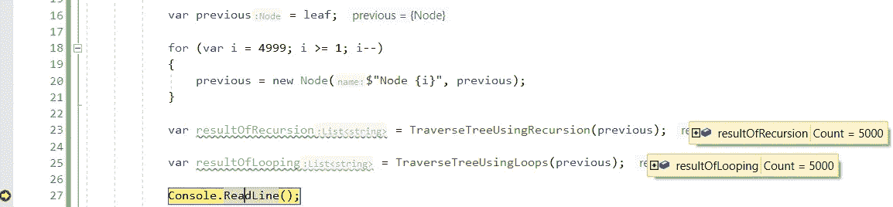
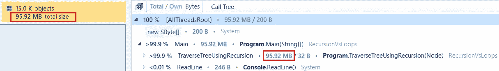
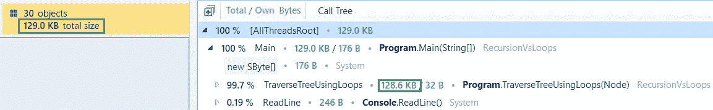
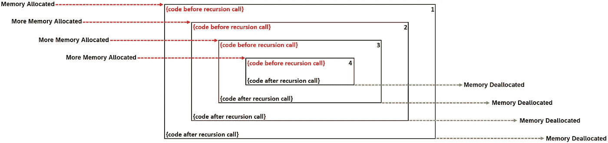
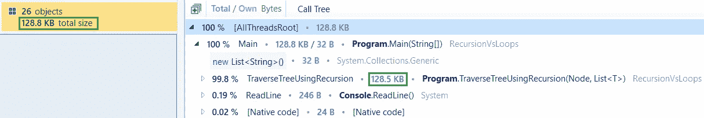
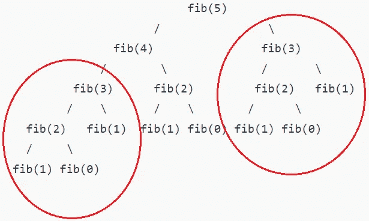

# 递归的诅咒。NET C#

> 原文：<https://levelup.gitconnected.com/curse-of-recursion-in-net-c-b017271ddbe6>

## 最佳实践

## 为什么以及如何在？NET C#

照片由[蒂内·伊万尼奇](https://unsplash.com/@tine999?utm_source=unsplash&utm_medium=referral&utm_content=creditCopyText)在 [Unsplash](https://unsplash.com/?utm_source=unsplash&utm_medium=referral&utm_content=creditCopyText) 拍摄，由[艾哈迈德·塔里克](https://medium.com/@eng_ahmed.tarek)调整

我在执行代码评审时经常遇到的一个著名错误是过多地使用了**递归**。

我现在能听到有人在问:

> 递归有什么问题？！！

我的回答是:

> 如果你知道何时以及如何使用递归，它并不总是坏的。有时候，你可能会错过一些更好的选择。

使用递归的主要问题是它在内存消耗方面代价太高。这就是为什么你需要谨慎使用它。

你不相信我，对吗？让我给你看一个例子。

 [## 🔥订阅艾哈迈德的时事通讯🔥

### 订阅艾哈迈德的时事通讯📰直接获得最佳实践、教程、提示、技巧和许多其他很酷的东西…

medium.com](https://medium.com/subscribe/@eng_ahmed.tarek) 

节点系列示例。由[安德·罗特](https://unsplash.com/@onderortel?utm_source=unsplash&utm_medium=referral&utm_content=creditCopyText)在 [Unsplash](https://unsplash.com/?utm_source=unsplash&utm_medium=referral&utm_content=creditCopyText) 上拍摄，由[艾哈迈德·塔雷克](https://medium.com/@eng_ahmed.tarek)调整

# 节点系列示例

假设我们有一系列节点，其中每个`Node`都引用它旁边的节点。我们的主要目标是遍历这一系列节点。

因此，首先我们如下定义我们的`Node`类:

现在是时候实现一个方法来遍历树了，如下所示:

在这个方法中，我们以这样的方式使用递归，每个`Node`负责从它开始遍历系列的其余部分。

很棒吧？好吧，可以，但是让我给你看样东西。

让我们试着做同样的工作，但是现在用循环代替递归。所以，按照这种思路，我们最终应该得到这样的结果:

如您所见，在这个方法中，我们使用循环来遍历节点。

现在，让我们开始调用这些方法，看看它们是否会产生相同的结果。

这里我们只是创建一系列 5000 个节点，然后调用这两个方法；`TraverseTreeUsingRecursion`和`TraverseTreeUsingLoops`。

运行该应用程序，我们应该得到类似这样的结果:

**结果**。图片由[艾哈迈德·塔里克](https://medium.com/@eng_ahmed.tarek)拍摄

如您所见，两种方法都返回相同的结果，一个包含 5000 个节点名的列表。

但是，我们能说两种方法在性能和内存消耗上完全一样吗？让我给你看一些有趣的东西。

我对这两种方法进行了内存分析，结果如下:

**递归期间的内存分析**。图片来自[艾哈迈德·塔里克](https://medium.com/@eng_ahmed.tarek)

**循环期间的内存分析**。图片由[艾哈迈德·塔里克](https://medium.com/@eng_ahmed.tarek)拍摄

您能注意到这两种情况下内存分配的巨大差异吗？是的，这是真的；**递归**太贵了。

然而，老实说，在这个例子中，即使使用了**递归**，我们也可以应用一些修改来增强性能和内存分配，以匹配循环实现。

现在我听到你问:

> 怎么会？？？

让我给你看一些有趣的东西。让我们来看看**递归**是如何工作的。

**递归函数**。图片由[艾哈迈德·塔里克](https://medium.com/@eng_ahmed.tarek)拍摄

这是一个简单的递归函数。如你所见，我们在递归调用之前有一些代码，递归调用，最后是递归调用之后的代码。

当调用这个函数时，这就是内存分配的情况。

**递归函数内存分配**。图片由[艾哈迈德·塔里克](https://medium.com/@eng_ahmed.tarek)拍摄

如您所见，在遍历递归调用时，内存分配会增加，而内存释放直到最后一个/最深的递归调用被解决后才会开始。

此外，这里值得注意的是{递归调用之前的代码}在内存分配中的贡献最大。因此，这段代码需要的内存分配越大，整个递归调用的开销就越大。

由此我们可以得出结论，如果我们能够最小化{递归调用之前的代码}所需的内存分配，这将显著减少整个递归方法的总内存分配。

现在，回到我们的例子。尝试最小化{递归调用前的代码}的内存分配，我们可以执行以下操作:

看，我们不是在每次递归调用时创建一个`new List<string>`,而是传递一个对列表的引用。因此，所有级别都使用相同的列表，因此每次递归调用都不需要分配内存。

现在，调用`TraverseTreeUsingRecursion`应该如下:

内存分析如下所示:

**增强递归期间的内存分析**。图片由[艾哈迈德·塔里克](https://medium.com/@eng_ahmed.tarek)拍摄

看，这完全不同。

这里值得一提的是，在**递归**方法上实现相同的增强方法并不总是容易的。有时候通话太复杂。在这种情况下，我们有其他的处理方法。

调查结果。照片由 [Afif Kusuma](https://unsplash.com/@javaistan?utm_source=unsplash&utm_medium=referral&utm_content=creditCopyText) 在 [Unsplash](https://unsplash.com/?utm_source=unsplash&utm_medium=referral&utm_content=creditCopyText) 上拍摄，由 [Ahmed Tarek](https://medium.com/@eng_ahmed.tarek) 调整

# 调查的结果

正如我告诉你的，在执行代码评审时，我曾经遇到过一些过多的不必要的**递归**用法。这种情况已经发生了一段时间。

因此，我决定研究这种方式，试图了解开发人员在这一点上的想法。因此，每次遇到这种情况，我都决定停下来问问开发商。

大部分的回答都是关于他没有多想。使用递归对他来说是合理的选择，他甚至没有停下来想一想。

因此，很明显，有时**递归**似乎更自然，更类似于我们大脑的工作方式。简单来说，当你发现自己在脑海中重复一些逻辑时，你的大脑瞬间尖叫 ***递归*** 。

所以，如果你问我，我会建议你抵制使用递归的冲动，并总是试图找到一种替代方法。

总是有可能吗？照片由[艾米丽·莫特](https://unsplash.com/@emilymorter?utm_source=unsplash&utm_medium=referral&utm_content=creditCopyText)在 [Unsplash](https://unsplash.com/?utm_source=unsplash&utm_medium=referral&utm_content=creditCopyText) 上拍摄，由[艾哈迈德·塔雷克](https://medium.com/@eng_ahmed.tarek)调整

# 总是有可能吗？

现在，你可能会想到的问题是:

> 我们总是可以用循环来代替递归吗？

不完全是。有时候递归可能是唯一的方法，但是请相信我，在很多情况下，你可能会错过另一种选择，因为你更关注于小图。

我通常会做的是，当我发现自己试图使用**递归**时，我会尝试访问一些概念，看看它们是否可以替代。

像这样的概念:

*   使用循环？
*   使用堆栈和队列？
*   使用缓存映射(如在动态编程中)？
*   以自下而上的方式使用循环(如在动态编程中)？

如果这些中的任何一个或一些帮助我达到相同的结果，我通常会做一些性能和内存分析，将它们与递归进行比较，并最终使用它们之间的最佳者。

在下一节中，我将向您展示我最喜欢的替代**递归**的方法之一，即**以自底向上的方式使用循环**。

以自下而上的方式使用循环。由[罗马福克斯](https://unsplash.com/@snapsbyfox?utm_source=unsplash&utm_medium=referral&utm_content=creditCopyText)在 [Unsplash](https://unsplash.com/?utm_source=unsplash&utm_medium=referral&utm_content=creditCopyText) 上拍摄，由[艾哈迈德·塔里克](https://medium.com/@eng_ahmed.tarek)调整

# 以自下而上的方式使用循环

这个概念源于**动态编程**概念。解释**动态编程**超出了本文的范围。所以，如果你需要了解更多，你可以搜索互联网，你会找到大量的资源。

让我给你介绍一下**斐波那契**数列。

根据[维基百科](https://en.wikipedia.org/wiki/Fibonacci_number):

> 在数学中，**斐波纳契数列**，通常表示为 *Fn* ，形成了一个[数列](https://en.wikipedia.org/wiki/Integer_sequence)，**斐波纳契数列**，其中每个数字都是前两个数字的和。该序列通常从 0 和 1 开始，尽管一些作者省略了初始项，并从 1 和 1 或从 1 和 2 开始序列。从 0 和 1 开始，序列中接下来的几个值是:[【1】](https://en.wikipedia.org/wiki/Fibonacci_number#cite_note-oeis-1)
> 
> 0, 1, 1, 2, 3, 5, 8, 13, 21, 34, 55, 89, 144, …
> 
> 斐波纳契数列最早在公元前 200 年由[平加拉](https://en.wikipedia.org/wiki/Pingala)在列举由两种长度的音节形成的梵语诗歌的可能模式的工作中，在[印度数学](https://en.wikipedia.org/wiki/Indian_mathematics)、[【2】](https://en.wikipedia.org/wiki/Fibonacci_number#cite_note-GlobalScience-2)[【3】](https://en.wikipedia.org/wiki/Fibonacci_number#cite_note-HistoriaMathematica-3)[【4】](https://en.wikipedia.org/wiki/Fibonacci_number#cite_note-Donald_Knuth_2006_50-4)中被描述。它们以意大利比萨数学家莱昂纳多的名字命名，后来被称为[斐波那契](https://en.wikipedia.org/wiki/Fibonacci)，他在 1202 年的著作 [*Liber Abaci*](https://en.wikipedia.org/wiki/Liber_Abaci) 中将数列引入西欧数学。[【5】](https://en.wikipedia.org/wiki/Fibonacci_number#cite_note-FOOTNOTEPisano2002404%E2%80%9305-5)

换句话说:

*   Fn = Fn-1 + Fn-2
*   F0 = 0
*   F1 = 1

正如你所看到的，斐波纳契数列根据定义是基于 T21 递归的。因此，我们的头脑很容易把它表述为:

会有用吗，肯定会。然而，正如我们之前证明的那样，在内存方面，它的成本太高了。

此外，如果我们试图调用`FibonacciUsingRecursion`传入 **80** 作为输入，编译器根本不会返回。为什么？

如果您尝试按照定义来可视化该系列，您将得到以下结果:

**5 的斐波纳契数列**。**我**法师由[艾哈迈德·塔里克](https://medium.com/@eng_ahmed.tarek)

你看到了吗？你注意到了吗，我们有重复的递归树，它们会被求值不止一次。fib(3)子树将被评估两次。fib(2)子树将被评估 3 次，依此类推…

现在你能想象 fib(80)树的重复子树的数量吗？这将是巨大的。

现在，你可能会问:

> 现在怎么办？我们能做些什么呢？

处理这个问题的方法之一是用不同的方式来思考级数的定义。

我们来分析一下这个:

1.  纤维(5) =纤维(4) +纤维(3)
2.  纤维(4) =纤维(3) +纤维(2)
3.  纤维(3) =纤维(2) +纤维(1)
4.  fib(2) = fib(1) + fib(0) = 1 + 0 = 1

你注意到了吗，为了得到 fib(5 ),我们需要 fib(2)到 fib(4 )?那我们为什么不这样做呢？

我们首先从 fib(2)开始，继续向上，直到到达 fib(5)。实际上，我们可以这样做:

1.  fib(2) = 1 + 0 = 1
2.  纤维(3) =纤维(2) +纤维(1)
3.  纤维(4) =纤维(3) +纤维(2)
4.  纤维(5) =纤维(4) +纤维(3)

这意味着我们只需要从两个值开始；fib(0) = 0 和 fib(1) = 1，然后我们通过将前两者相加并移动这两个值来保持上升。

所以，按照这个，你可以这样做:

现在，如果您运行这个，您将得到与递归解决方案相同的结果，但是具有更好的性能和内存分配。

此外，如果我们试图调用`FibonacciUsingLoops`并传入 **80** 作为输入，编译器会立即返回结果。

因此，我们从中可以学到的是，取代**递归**可以使不可能成为可能。

最后的想法。照片由[杰森·古德曼](https://unsplash.com/@jasongoodman_youxventures?utm_source=unsplash&utm_medium=referral&utm_content=creditCopyText)在 [Unsplash](https://unsplash.com/?utm_source=unsplash&utm_medium=referral&utm_content=creditCopyText) 上拍摄，由[艾哈迈德·塔里克](https://medium.com/@eng_ahmed.tarek)调整

# 最后的想法

如你所见，**递归**太昂贵了，有时它不可能在不遇到障碍的情况下执行一些逻辑。

因此，在使用**递归**之前，你应该总是考虑其他的选择。

最后，我希望你喜欢读这篇文章，就像我喜欢写它一样。

# 希望这些内容对你有用。如果您想支持:

如果您还不是**媒介**会员，您可以使用 [**我的推荐链接**](https://medium.com/@eng_ahmed.tarek/membership) ，这样我就可以从**媒介**那里获得您的一部分费用，您无需支付任何额外费用。订阅 [**我的简讯**](https://medium.com/subscribe/@eng_ahmed.tarek) 将最佳实践、教程、提示、技巧和许多其他很酷的东西直接发送到您的收件箱。

# 其他资源

这些是你可能会发现有用的其他资源。

 [## 将参数传递给. NET C#方法

### 向. NET C#方法传递参数的不同方式。

levelup.gitconnected.com](/passing-parameters-to-a-net-c-method-388badb7c095)  [## 保护公共方法免受不合逻辑的调用。NET C#

### 包含代码示例和解释的完整指南。

levelup.gitconnected.com](/protecting-public-methods-from-illogical-calls-in-net-c-91fcbb8bee33)  [## 标记枚举:如何在一个字段中表示特征组合

### 将[读、写、修改……]等功能及其组合表示到单个字段中。

levelup.gitconnected.com](/flagged-enumerations-how-to-represent-features-combinations-into-one-field-f32e46a0885) 