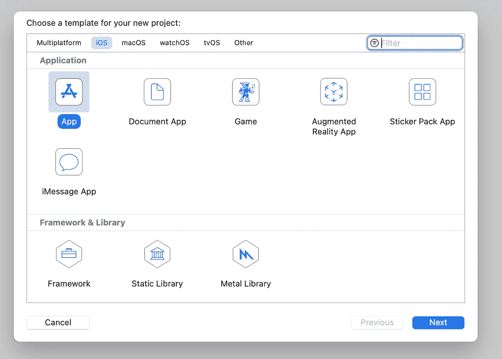
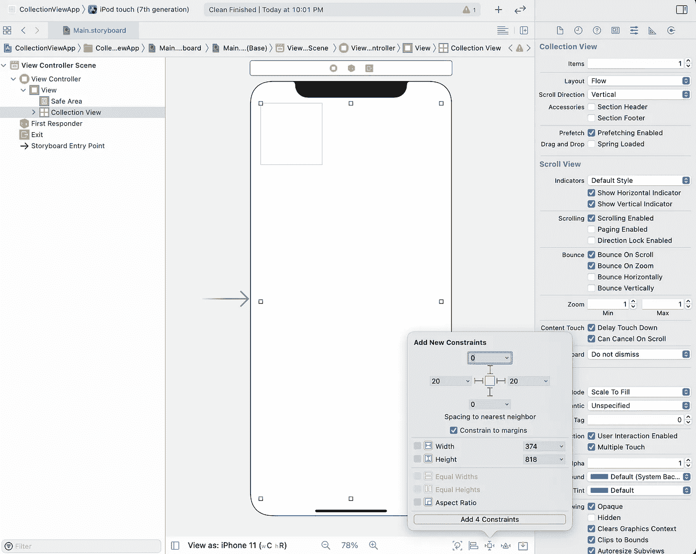

# Swift 5 中的自定义集合视图

> 原文：<https://levelup.gitconnected.com/custom-collectionview-in-swift-5-a11786cbec8>

## 创建自定义集合视图的分步指南

在开发 iOS 应用程序时，您可能会发现自己需要自定义布局，并用动态和可自定义的内容填充表格。`UICollectionView`是一个流行的 UI 元素，用于在可定制的布局中呈现一组项目。本文介绍了创建`UICollectionView`和`UICollectionViewCell`的逐步指南。请注意，本文假设您对 Xcode、Swift 和 UICollectionView 有基本的了解。

# 创建新的 iOS 应用程序项目

从文件浏览器中选择主故事板。通过按`command shift L`打开故事板小部件窗口，添加一个集合视图。将 collectionView 拖动到主视图控制器上。

向 UICollectionView 小部件添加约束，以确保小部件填充所有设备上的屏幕。

故事板中的基础现在已经建立起来了。为了定制 collectionView 和 collectionView 单元格，您需要为每种小部件类型创建定制类，并将这些新创建的类分配给故事板中相应的小部件。

# 创建 UICollectionView 文件

1.  创建新的 Cocoa Touch 类文件。

2.输入类别的名称。子类必须设置为`UICollectionView`。

3.返回到故事板并选择 collectionView 小部件。将类设置为指向新创建的`CustomCollectionView`。

# 创建 UICollectionViewCell 文件

在创建`UICollectionViewCell`文件时，您将希望遵循相同的说明。为新文件选择选项时，确保该文件是`UICollectionViewCell`的子类。

转到故事板并选择 cell 小部件。将类别设置为新创建的类别，在本例中为`CustomCollectionViewCell`。

当我们选择单元格时，将重用标识符设置为`cell`。在定制`CustomCollectionView.swift`文件中的单元格时，将引用该重用标识符。

# 添加一些定制

现在我们已经设置好了类，让我们添加一些定制！

## **单元格定制**

可以通过选择主故事板中的单元格小部件并更新属性编辑器中的`Background`属性来定制单元格背景。在这种情况下，背景设置为蓝色。

按下`command shift L`打开微件窗口。通过将 UILabel 从小部件窗口拖到故事板中的单元格上，向单元格添加标签。通过选择标签，按下`control`并将光标拖动到`CustomCollectionViewCell.swift`文件，为 CustomCollectionViewCell 类的标签创建一个出口。向标签和单元格添加约束。

标签将需要从 UICollectionView 配置。添加一个`setLabel`函数，使标签可配置。

CustomCollectionViewCell.swift

## **收藏视图定制**

在`CustomCollectionView.swift`中，我们需要覆盖定义部分数量、每个部分的项目数量、每个单元格的大小的方法，以及每个单元格对象的任何覆盖和配置更改。

CustomCollectionView.swift

下面是结果！

# 结论

本教程概述了如何构建包含自定义集合视图单元格的自定义集合视图。类似的技术可用于扩展 swift 库中的其他 UI 元素。

# 额外资源

*   [iOS 的收藏查看编程指南](https://developer.apple.com/library/archive/documentation/WindowsViews/Conceptual/CollectionViewPGforIOS/Introduction/Introduction.html#//apple_ref/doc/uid/TP40012334-CH1-SW1)
*   [Swift 5 文档](https://swift.org/documentation/)