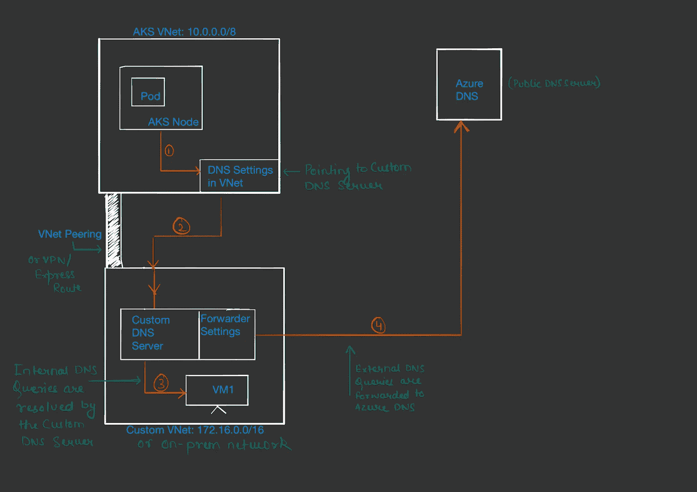
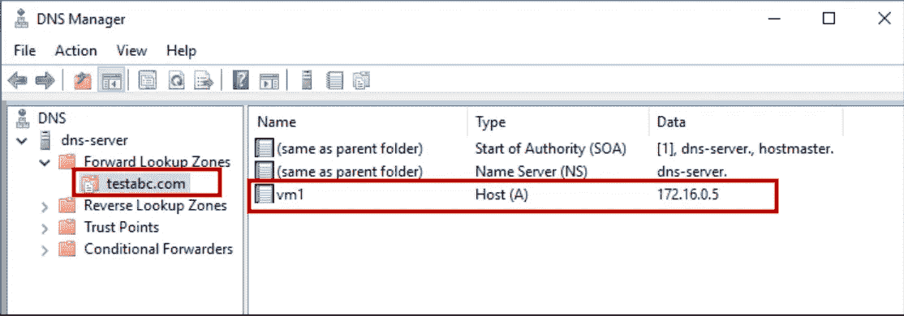
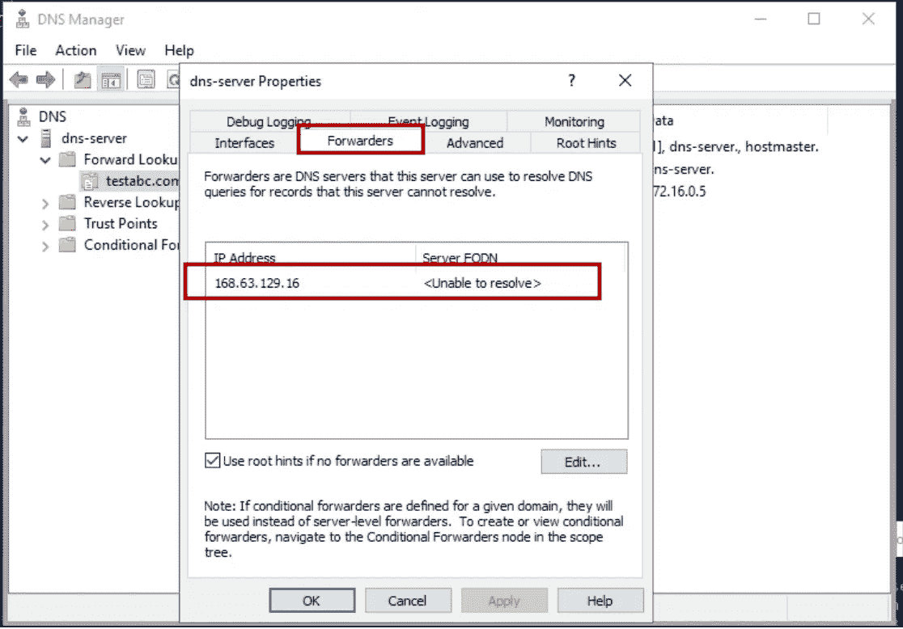
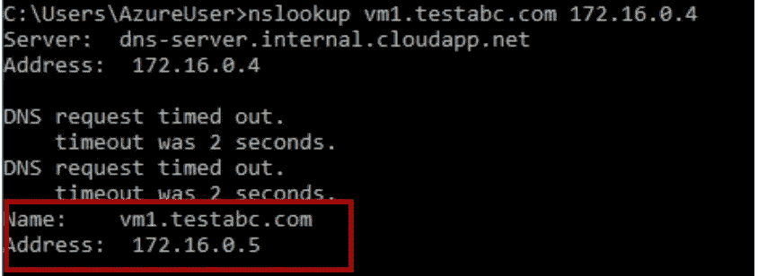
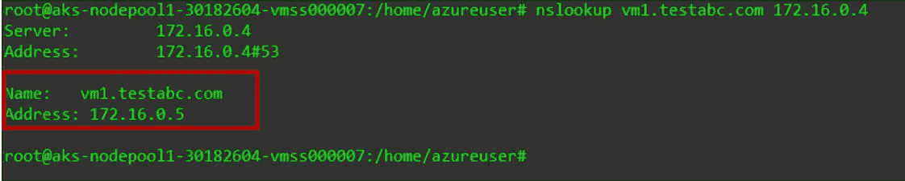
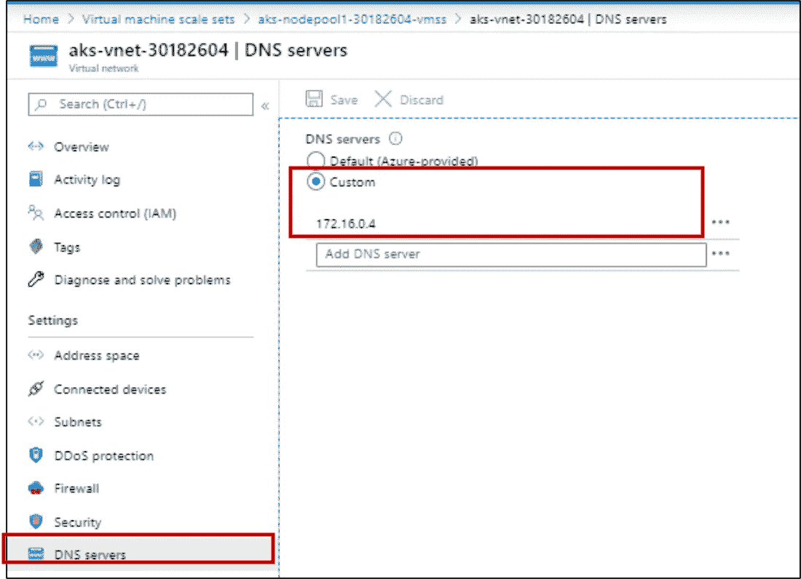
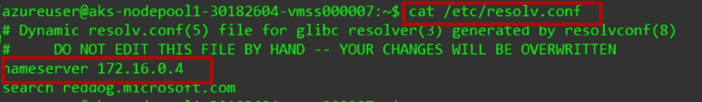
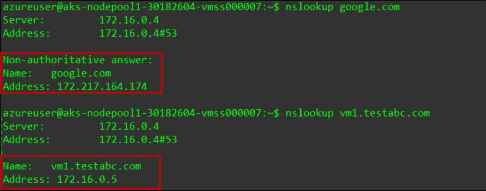
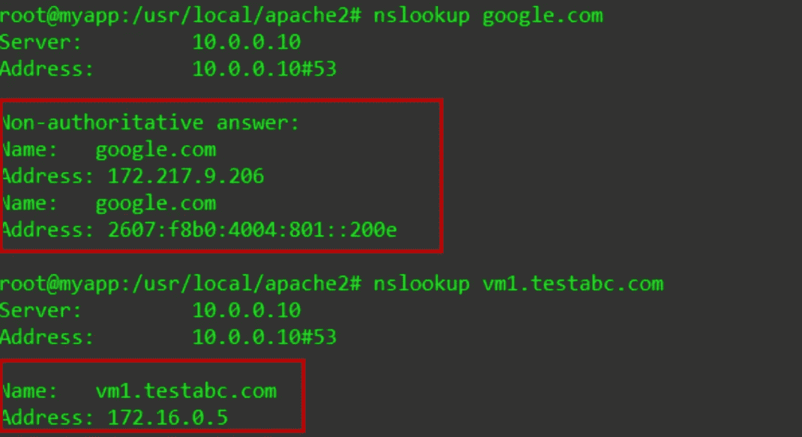

# 自定义 DNS 配置:AKS/Kubernetes

> 原文：<https://levelup.gitconnected.com/custom-dns-configuration-aks-kubernetes-360e481afc1>

*在 AKS Pods 上使用本地 DNS 服务器进行域名解析*

我和很多客户合作过，他们希望使用他们的定制 DNS 服务器来解析 Azure Kubernetes 服务上托管的 pod 的名称。

这些 DNS 服务器可以在本地，也可以在不同的虚拟网络中，或者在同一个虚拟网络中，用于解析自定义域。

我注意到许多人在配置上有困难，然而如果流量畅通的话，这是一个相当简单的问题。

在这篇文章中，我将讨论一种可以用来启用 AKS Pods 和解析自定义域名的方法。另一种流行的方法是修改 CoreDNS 配置，这在这里的另一篇文章中有所涉及:[https://medium . com/@ rish ASI/custom-DNS-configuration-with-CoreDNS-aks-kubernetes-599 ecfb 46 b 94](https://medium.com/@rishasi/custom-dns-configuration-with-coredns-aks-kubernetes-599ecfb46b94)

为了使解决方案有效，简单来说，将所有 DNS 查询转发到自定义 DNS 服务器，并且:

*   使用此自定义 DNS 服务器解析自定义域，以及
*   对于每个其他域，使用 DNS 转发器将请求转发到 Azure DNS。

**一个简单的示意图:**



**接近**:

Pod 请求 DNS 解析，然后将解析转发到在 VNet 设置中配置的 DNS 服务器，比如 10.x.x.x。

这个 DNS 服务器可以是本地的，或者在同一个 VNet 中，或者是对等的 VNet。

DNS 服务器将会看到该请求，并且:

```
*a. If the DNS query is for it’s own custom domain,* It will itself resolve the query and return the IP.*b. If it is any other domain, for example ubuntu.com,* Then the DNS Server will forward the request to the Azure DNS.
```

*要使其工作，您必须设置 DNS 转发器，将外部域的流量路由到公共 DNS 服务器。然而，应该注意的是，由于各种原因，AKS 节点和 pod 可能需要解析其他外部域名，这也包括 Azure 的内部域，如 cloudapp.net。因此，建议将外部查询转发到 Azure DNS 服务器(168.63.129.16)。*

```
Edit:
The above approach works as long as the Custom DNS Server is in Azure. So, setting Azure DNS as the forwarder is straightforward using the Azure DNS IP: 168.63.129.16.However, if the Custom DNS Server is on-prem, or outside Azure, the Azure DNS cannot be reached from there.
So setting Azure DNS as the forwarder will not be that straightforward.In that case, the Custom DNS, which is on-prem, can set the forwarder as:
- another DNS Server configured on Azure VM,
- or Azure Firewall
- or a DNS Proxy on Azure
.. and then that device can use Azure DNS as it's DNS Server.Basically, we cannot reach Azure DNS IP directly from outside Azure, so we first forward queries to a VM/Firewall/DNS Proxy, which is on Azure, and then that device can forward requests to Azure DNS.A little tricky, but hopefully this helps.
```

**这就是了**。如果你理解这个设置，很好。如果没有，不要担心，后面还有更多。

我准备了一个简单的设置来“模仿”所讨论的体系结构，其中 AKS VNet 使用 VPN/ExpressRoute 连接到内部环境。

对于这种设置，

*   启动了 AKS 集群
*   在另一个虚拟网络中创建了 DNS 服务器
*   在 DNS 服务器的虚拟网络(VM1)中创建了一个虚拟机，我们将解析其名称
*   在 AKS 虚拟网络和自定义虚拟网络之间创建了对等连接
*   更新了 AKS VNet 以使用自定义 DNS 服务器，而不是 Azure 提供的默认 DNS 服务器

我没有设置 VPN/ExpressRoute，而是使用了 VNet 对等。基本思想是连接到定制的 DNS 服务器。因此，在这里，自定义虚拟网络可以被认为是本地网络。

创建一个 DNS 服务器是一个障碍，因为我很久很久以前就已经做过了。我使用了一个 Windows 2016 虚拟机，并引用了这篇简单的文章来在其上配置 DNS 服务器:[https://www . host winds . com/guide/how-to-setup-and-configure-DNS-in-Windows-Server-2016/](https://www.hostwinds.com/guide/how-to-setup-and-configure-dns-in-windows-server-2016/)

设置的详细信息:

```
AKS VNet CIDR: 10.0.0.0/8AKS Node IP: 10.240.0.4Custom VNet CIDR: 172.16.0.0/16Custom Domain: testabc.comDNS Server IP: 172.16.0.4VM1 IP: 172.16.0.5Hostname for VM1: vm1.testabc.com
```

DNS 服务器设置:



DNS 转发器设置为 Azure DNS IP:



设置完成后，我首先确保 VM1 的主机名是从 DNS 服务器本身解析出来的。从 DNS 服务器内部的 CMD:



然后我检查了 DNS 是否从 AKS 节点得到解析。通过 SSH 连接到 AKS 节点，并通过 CLI 进行测试:



这里的截图验证了两件事:

1.  另一个 VNet 中的 DNS 服务器可以通过私有 IP 到达，因此对等工作正常，
2.  并且 VM1 的主机名被解析为正确的 IP

到目前为止一切顺利。然而，目前我必须在 nslookup 命令中明确指定 DNS 服务器。我希望默认情况下引用自定义 DNS 服务器。

因此，我更改了 AKS VNet 的 DNS 属性，以引用另一个 VNet 中的自定义 DNS 服务器(由于 VNet 对等，可以通过私有 IP 访问):



必须重新启动 AKS 节点才能传播新设置。机器重启后，我核实了

1.  AKS 节点的 DNS 设置已更新



2.AKS 节点能够解析 VM1 的主机名:



不仅“testabc.com”的内部客户域得到解析，而且外部域也得到解析。

如果你仔细观察，URL google.com 已被非权威服务器解析，这表明自定义 dns 将查询转发到其他 DNS 服务器，这验证了转发到 Azure DNS 的工作正常。

一切正常！！

**现在的主要问题是，我的 pods 能够解析自定义和外部域名吗？**

为了进行测试，我启动了一个简单的 httpd pod，在其上安装了 dnsutils 并执行了测试:



***瞧！*** *，就这么简单。*

从 pod 内部，我能够将 VM1 主机名解析为正确的 IP，并且还能够解析外部域。

## 脚注:

应该注意，我没有为 Pod 指定任何 **dnsPolicy** 。因此，应用了默认策略，其中 Pod 从运行它的节点继承 DNS 配置。

*关于用于 pod 的 dnsPolicy 的更多细节可以在这里找到:*[*https://kubernetes . io/docs/concepts/services-networking/DNS-pod-service/# pod-s-DNS-policy*](https://kubernetes.io/docs/concepts/services-networking/dns-pod-service/#pod-s-dns-policy)

顺便说一下，将外部域名转发到 Azure DNS 的好处是，自定义 DNS 服务器将只负责解析自定义域，其他所有域名都由 Azure DNS 解析，减少了自定义 DNS 服务器的负载。

最后，这种设置可以在任何环境下工作，只需稍作调整，无论是 Azure、AWS、Google Cloud 还是其他环境。要求是确保:

```
a. Custom DNS Server(s) is/are reachable from the Kubernetes Nodes,b. The Nodes have the Custom DNS Servers as the default DNS resolver, andc. the Pods have the default dnsPolicy.
```

希望这解释了在 Kubernetes 集群中使用定制 DNS 服务器所需的配置。

谢谢大家！