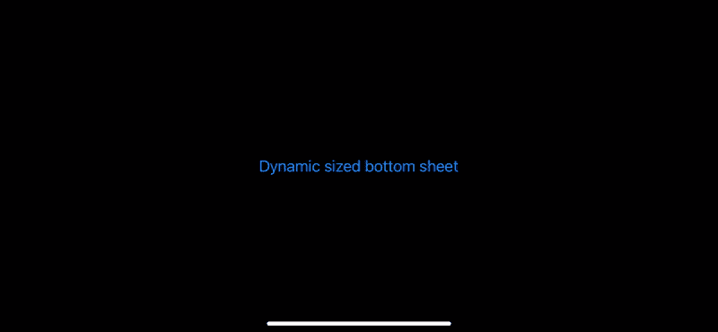
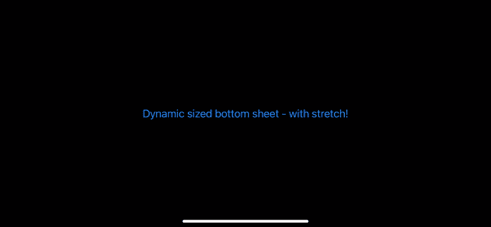
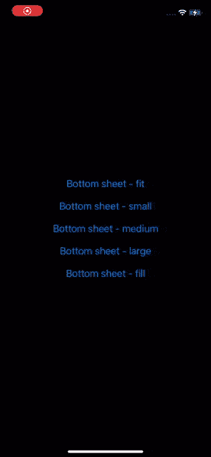
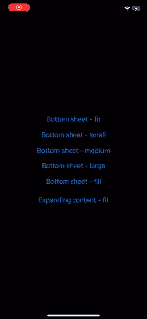

# 自定义动态尺寸底板(iOS)

> 原文：<https://levelup.gitconnected.com/custom-dynamic-sized-bottom-sheet-ios-fbae44485255>

## 创建您自己的自定义动态大小的底部表单，并通过滑动手势使其消失。

滑动和扩展动态大小的底部表单。

在这篇文章中，我们将看看如何实现你自己的交互式动态大小的底部表单。底部的表格可以用来展示各种各样的视图，并且给你的应用程序添加一个非常好的风格！

***更新:现在同拉伸！***

*我现在已经给底部的工作表添加了拉伸，使它在被滑动/拖动时拉伸超过它的边界👏所有代码示例都应该更新。编码快乐！*

滑动和扩展一个动态大小的底层与拉伸！

我们将把底部的表单实现为自定义的 [UIViewController](https://developer.apple.com/documentation/uikit/uiviewcontroller) ，它提供自己的[uiviewcontrollertransitiondelegate](https://developer.apple.com/documentation/uikit/uiviewcontrollertransitioningdelegate)，在`modalPresentationStyle`设置为`.custom`的情况下(使用`present(_:animated:completion:)`)以模态方式呈现时使用。[UIViewControllerTransitioningDelegate](https://developer.apple.com/documentation/uikit/uiviewcontrollertransitioningdelegate)将为 [UIKit](https://developer.apple.com/documentation/uikit) 提供一个自定义的[UIPresentationController](https://developer.apple.com/documentation/uikit/uipresentationcontroller)和用于视图控制器转换的转换对象([UIViewControllerAnimatedTransitioning](https://developer.apple.com/documentation/uikit/uiviewcontrolleranimatedtransitioning)和[uiviewcontrollerinteractive transitioning](https://developer.apple.com/documentation/uikit/uiviewcontrollerinteractivetransitioning))。

> **注意:**如果你打算只支持 iOS 15 及以上版本，你最好使用新的和令人敬畏的[UISheetPresentationController](https://developer.apple.com/documentation/uikit/uisheetpresentationcontroller)！

## 关键要点

*   创建 [UIViewController](https://developer.apple.com/documentation/uikit/uiviewcontroller) (例如 *BottomSheetController)* 的子类，并公开方法/属性来配置底部表单。如大小(例如:动态、小、中、大)、拐角半径、拖动以消除启用/禁用等。此视图控制器将作为您在应用程序中创建的所有自定义底部表单的基础。
*   创建[UIViewControllerTransitioningDelegate](https://developer.apple.com/documentation/uikit/uiviewcontrollertransitioningdelegate)(例如*BottomSheetTransitioningDelegate*)的实现，并将其提供给 *BottomSheetController* 的`transitioningDelegate`属性。**提示:**覆盖 *BottomSheetController* 的属性(`transitioningDelegate`，并从 getter 返回您对[UIViewControllerTransitioningDelegate](https://developer.apple.com/documentation/uikit/uiviewcontrollertransitioningdelegate)的实现。还要记住将 *BottomSheetController* 的`modalPresentationStyle`设置为`.custom`(这也可以通过覆盖属性的 getter 来完成)。
*   创建自己的[UIPresentationController](https://developer.apple.com/documentation/uikit/uipresentationcontroller)的子类(例如*BottomSheetPresentationController*)，并从自己的[UIViewControllerTransitioningDelegate](https://developer.apple.com/documentation/uikit/uiviewcontrollertransitioningdelegate)中返回。该对象将控制*底层控制器*的显示和取消。覆盖其方法(如`presentationTransitionWillBegin()`和`dismissalTransitionWillBegin()`)以挂钩到演示和解散过渡，并添加装饰视图(如背景视图)或手势识别器以实现其他行为(如滑动/拖动以解散)。如果你想让 *BottomSheetController* 有一个动态高度(基于它的内容视图大小)，你需要给显示的视图添加约束，允许它根据它的内容自己调整大小。您通常会在`presentationTransitionWillBegin()`方法中这样做。
*   如果您想要提供自定义演示和/或消除动画，请创建自己的实现[UIViewControllerAnimatedTransitioning](https://developer.apple.com/documentation/uikit/uiviewcontrolleranimatedtransitioning)和[uiviewcontrollerinteractive transitioning](https://developer.apple.com/documentation/uikit/uiviewcontrollerinteractivetransitioning)。如果您希望能够交互式地消除 *BottomSheetController* (例如滑动/拖动以消除)，您将必须实现[uiviewcontrollerinteractive transitioning](https://developer.apple.com/documentation/uikit/uiviewcontrollerinteractivetransitioning)，并让您的[UIViewControllerAnimatedTransitioning](https://developer.apple.com/documentation/uikit/uiviewcontrolleranimatedtransitioning)实现提供一个可中断的动画器(例如[uiviewpropertyinteanimator](https://developer.apple.com/documentation/uikit/uiviewpropertyanimator))。您可以创建自己的[uiviewcontrollerinteractivetransition](https://developer.apple.com/documentation/uikit/uiviewcontrollerinteractivetransitioning)实现，或者使用现有的实现，如[UIPercentDrivenInteractiveTransition](https://developer.apple.com/documentation/uikit/uipercentdriveninteractivetransition)来驱动基于手势的交互式过渡/动画。通过与提供的[UIViewControllerContextTransitioning](https://developer.apple.com/documentation/uikit/uiviewcontrollercontexttransitioning)对象交互，过渡/动画被向前驱动。如果你使用一个实例 uipercentdriveninteractive transition 你就不需要手动这么做。相反，你将与 UIPercentDrivenInteractiveTransition 对象进行交互，并让它为你驱动过渡/动画。

如果您想马上获得一些示例代码，您可以在这里找到本文中使用的示例应用程序的完整代码:[https://github . com/thoms med/IOs-examples/tree/main/bottom sheet controller](https://github.com/thomsmed/ios-examples/tree/main/BottomSheetController)。

# 示例应用程序

带有各种尺寸底板的示例应用程序。

我们将创建一个超级简单的应用程序来展示自定义底部表单控制器的神奇之处。它将包含一个根视图控制器，以及我们的 *BottomSheetController* 的几个示例子类。我们不会详细讨论这些 *BottomSheetController* 子类，但是示例应用程序的完整代码可以在这里找到:[https://github . com/thoms med/IOs-examples/tree/main/BottomSheetController](https://github.com/thomsmed/ios-examples/tree/main/BottomSheetController)。

*底层控制器*的基本用法如下:

## 底板控制器

为了表示底部工作表控制器，我们将创建一个名为 *BottomSheetController* 的视图控制器。这个类将作为我们应用程序中所有底层工作表的基类/超类。我们希望呈现为底部表单的每个视图控制器都将是 *BottomSheetController* 的子类。

*BottomSheetController* 将公开属性，让我们配置底部表单的外观。比如它的首选大小，以及是否可以使用滑动手势来消除它。它还将管理[UIViewControllerTransitioningDelegate](https://developer.apple.com/documentation/uikit/uiviewcontrollertransitioningdelegate)(*BottomSheetTransitioningDelegate*)的自定义实现，该实现将由被覆盖的`transitioningDelegate`属性返回。我们还将覆盖`modalPresentationStyle`，让 getter 总是返回`.custom`。

如果我们在使用`present(_:animated:completion)`呈现时将视图控制器的`modalPresentationStyle`设置为`.custom`，UIKit 将仅使用我们的自定义[UIViewControllerTransitioningDelegate](https://developer.apple.com/documentation/uikit/uiviewcontrollertransitioningdelegate)(来自`transitioningDelegate`属性)。

## **BottomSheetTransitioningDelegate**

UIKit 让我们通过实现[UIViewControllerTransitioningDelegate](https://developer.apple.com/documentation/uikit/uiviewcontrollertransitioningdelegate)来挂钩呈现和取消视图控制器的过程。当使用`present(_:animated:completion)`呈现视图控制器时，我们可以将呈现的视图控制器的`modalPresentationStyle`设置为`.custom`，然后 UIKit 将使用[UIViewControllerTransitioningDelegate](https://developer.apple.com/documentation/uikit/uiviewcontrollertransitioningdelegate)来分配呈现的视图控制器的`transitioningDelegate`属性。

我们将定义自己的[UIViewControllerTransitioningDelegate](https://developer.apple.com/documentation/uikit/uiviewcontrollertransitioningdelegate)(*BottomSheetTransitioningDelegate*)UIKit 可以查询一个[UIPresentationController](https://developer.apple.com/documentation/uikit/uipresentationcontroller)和转换对象([UIViewControllerAnimatedTransitioning](https://developer.apple.com/documentation/uikit/uiviewcontrolleranimatedtransitioning)和[uiviewcontrollerinteractive transitioning](https://developer.apple.com/documentation/uikit/uiviewcontrollerinteractivetransitioning))以在 *BottomSheetController* 的呈现和解除下使用。

我们的[UIViewControllerTransitioningDelegate](https://developer.apple.com/documentation/uikit/uiviewcontrollertransitioningdelegate)会将在 *BottomSheetController* 上所做的任何配置转发给我们的自定义[UIPresentationController](https://developer.apple.com/documentation/uikit/uipresentationcontroller)，以便它可以进一步配置 *BottomSheetController* 的视图的呈现等。

> **注意:**我们的[UIViewControllerTransitioningDelegate](https://developer.apple.com/documentation/uikit/uiviewcontrollertransitioningdelegate)将只提供转换对象([UIViewControllerAnimatedTransitioning](https://developer.apple.com/documentation/uikit/uiviewcontrolleranimatedtransitioning)和[uiviewcontrollerinteractive transitioning](https://developer.apple.com/documentation/uikit/uiviewcontrollerinteractivetransitioning))如果解散是使用手势发起的。否则它将返回`nil`来指示 UIKit 应该使用默认的解散动画。由于我们的[UIViewControllerTransitioningDelegate](https://developer.apple.com/documentation/uikit/uiviewcontrollertransitioningdelegate)没有实现为视图控制器的表示提供转换对象的方法，UIKit 将使用默认的表示动画。

## bottom sheet presentation controller

在视图控制器的呈现过程中，UIKit 使用一个[UIPresentationController](https://developer.apple.com/documentation/uikit/uipresentationcontroller)来控制视图控制器的呈现和取消。通过创建我们自己的[UIPresentationController](https://developer.apple.com/documentation/uikit/uipresentationcontroller)(*BottomSheetPresentationController*)的子类，我们可以挂钩到流程中并添加定制的装饰视图等。我们甚至可以添加手势识别器来支持视图控制器的交互式解除。

我们的[UIPresentationController](https://developer.apple.com/documentation/uikit/uipresentationcontroller)子类将定义手势识别器，使其能够轻敲和轻扫 *BottomSheetController* 。为了支持动态调整底部表单的大小，它将向呈现的视图( *BottomSheetController* 的视图)添加[自动布局约束](https://developer.apple.com/library/archive/documentation/UserExperience/Conceptual/AutolayoutPG/index.html)，这样它就可以根据其内容自行调整大小。

自动布局使创建扩展和动态大小的底板变得容易。

> **注意:**我们的动态自调整底部表单的技巧是使用[自动布局约束](https://developer.apple.com/library/archive/documentation/UserExperience/Conceptual/AutolayoutPG/index.html)来将呈现的视图控制器的视图约束到用于呈现的[容器视图](https://developer.apple.com/documentation/uikit/uipresentationcontroller/1618332-containerview)。通过指定一个具有非常低优先级的高度约束(`.fittingSizeLevel`的优先级为 50)，所呈现的视图控制器的视图只有在不中断其任何内部约束的情况下才会遵守该约束。如果出现这种情况，视图将简单地拉伸超过(或收缩到)高度限制，并停留在合适的高度。

## BottomSheetInteractiveDismissalTransition

作为创建自定义动态调整大小的底部表单控制器的最后一部分，我们将定义一个符合[UIViewControllerAnimatedTransitioning](https://developer.apple.com/documentation/uikit/uiviewcontrolleranimatedtransitioning)和[uiviewcontrollerinteractive transitioning](https://developer.apple.com/documentation/uikit/uiviewcontrollerinteractivetransitioning)的类。我们称之为*BottomSheetInteractiveDismissalTransition*。

当 *BottomSheetController* 使用滑动(向下)手势消除时，该类的对象将负责驱动消除动画。

[UIViewControllerAnimatedTransitioning](https://developer.apple.com/documentation/uikit/uiviewcontrolleranimatedtransitioning)负责创建动画并提供可中断的动画对象(如[uiviewpropertyimator](https://developer.apple.com/documentation/uikit/uiviewpropertyanimator))[uiviewcontrollerinteractive transitioning](https://developer.apple.com/documentation/uikit/uiviewcontrollerinteractivetransitioning)负责驱动动画向前(通过与[UIViewControllerContextTransitioning](https://developer.apple.com/documentation/uikit/uiviewcontrollercontexttransitioning)对象交互)。

> **注意:**可以使用[UIPercentDrivenInteractiveTransition](https://developer.apple.com/documentation/uikit/uipercentdriveninteractivetransition)的一个实例——它实现了[uiviewcontrollerinteractivetransition](https://developer.apple.com/documentation/uikit/uiviewcontrollerinteractivetransitioning)——让你免去自己手动驱动交互动画的工作。然后，在处理滑动手势时，您将与[UIPercentDrivenInteractiveTransition](https://developer.apple.com/documentation/uikit/uipercentdriveninteractivetransition)对象的方法进行交互，而[UIPercentDrivenInteractiveTransition](https://developer.apple.com/documentation/uikit/uipercentdriveninteractivetransition)对象将处理与[UIViewControllerContextTransitioning](https://developer.apple.com/documentation/uikit/uiviewcontrollercontexttransitioning)对象的交互。

这就结束了我们的自定义动态大小的底部表。要创建各种底部工作表视图，您只需子类化 *BottomSheetController* 并像在任何其他视图控制器上一样配置视图。在根据您的需求进行配置后，可以通过调用`present(_:animated:completion:)`来显示底部表单。

本文中展示的示例代码也可以很容易地构成任何其他定制视图控制器表示的基础。使用定制的[UIPresentationController](https://developer.apple.com/documentation/uikit/uipresentationcontroller)你可以修改视图控制器的视图在呈现时的外观。如果需要，您甚至可以在演示文稿中添加额外的装饰视图。通过修改[UIViewControllerAnimatedTransitioning](https://developer.apple.com/documentation/uikit/uiviewcontrolleranimatedtransitioning)和[uiviewcontrollerinteractive transitioning](https://developer.apple.com/documentation/uikit/uiviewcontrollerinteractivetransitioning)协议，您可以轻松添加自己的过渡动画(交互式和非交互式)。

# 摘要

在本文中，我们已经看到了如何创建一个定制的动态大小的底层控制器，它利用[自动布局约束](https://developer.apple.com/library/archive/documentation/UserExperience/Conceptual/AutolayoutPG/index.html)的能力来调整它自己的大小以适合高度。我们还使底部表单具有交互性，并添加了一个手势识别器，使其可以通过滑动(向下)手势来消除。

通过向 [UIKit](https://developer.apple.com/documentation/uikit) 提供我们自己的[UIViewControllerTransitioningDelegate](https://developer.apple.com/documentation/uikit/uiviewcontrollertransitioningdelegate)的实现，我们可以进入呈现和取消视图控制器的过程。我们的[UIViewControllerTransitioningDelegate](https://developer.apple.com/documentation/uikit/uiviewcontrollertransitioningdelegate)实现为 [UIKit](https://developer.apple.com/documentation/uikit) 提供了一个定制的[UIPresentationController](https://developer.apple.com/documentation/uikit/uipresentationcontroller)和转换对象([UIViewControllerAnimatedTransitioning](https://developer.apple.com/documentation/uikit/uiviewcontrolleranimatedtransitioning)和[uiviewcontrollerinteractive transitioning](https://developer.apple.com/documentation/uikit/uiviewcontrollerinteractivetransitioning))来操纵所呈现的视图控制器的视图应该如何显示和行为。我们添加了背景视图和手势识别器，使 *BottomSheetController* 看起来和感觉上都像一个合适的底部表单。

完整的示例代码可以在这里找到:[https://github . com/thoms med/IOs-examples/tree/main/bottom sheet controller](https://github.com/thomsmed/ios-examples/tree/main/BottomSheetController)

编码快乐！