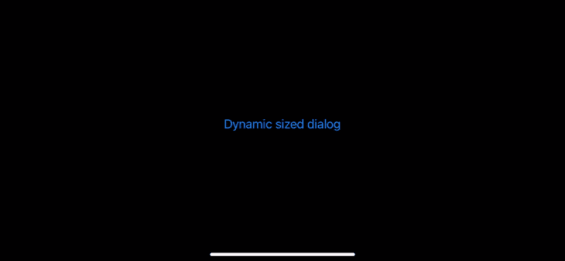
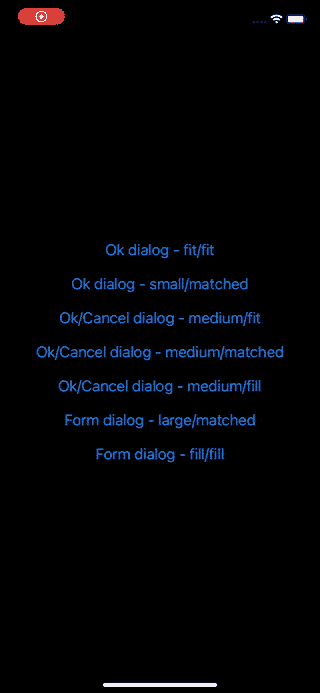
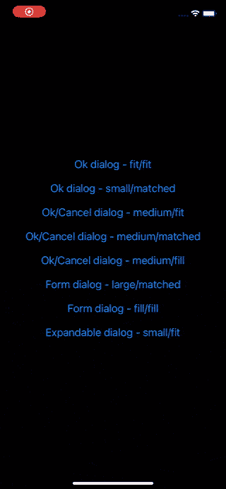

# 自定义动态大小对话框(iOS)

> 原文：<https://levelup.gitconnected.com/custom-dynamic-sized-dialog-ios-84a6e2a2774d>

## 创建您自己的自定义动态大小的对话框，并通过点击手势使其消失。

呈现和扩展动态大小的对话框。

在这篇文章中，我们将看看如何实现你自己的动态大小的对话框。对话框通常用于呈现信息消息、警告或简短的输入表单来吸引用户。

这篇文章是[自定义动态尺寸底板(iOS)](https://medium.com/@thomsmed/custom-dynamic-sized-bottom-sheet-ios-fbae44485255) 的自然延续，内容非常相似(有很多相同的概念等)。因此，也不要犹豫去看看那篇文章。

我们将把这个对话框实现为一个自定义的 [UIViewController](https://developer.apple.com/documentation/uikit/uiviewcontroller) ，它提供自己的[UIViewControllerTransitioningDelegate](https://developer.apple.com/documentation/uikit/uiviewcontrollertransitioningdelegate)，在`modalPresentationStyle`设置为`.custom`的情况下使用`present(_:animated:completion:)`。[UIViewControllerTransitioningDelegate](https://developer.apple.com/documentation/uikit/uiviewcontrollertransitioningdelegate)将为 [UIKit](https://developer.apple.com/documentation/uikit) 提供一个自定义的[UIPresentationController](https://developer.apple.com/documentation/uikit/uipresentationcontroller)和用于视图控制器转换的转换对象(实现[UIViewControllerAnimatedTransitioning](https://developer.apple.com/documentation/uikit/uiviewcontrolleranimatedtransitioning)的对象)。

## 关键要点

*   创建 [UIViewController](https://developer.apple.com/documentation/uikit/uiviewcontroller) (例如 *DialogController)* 的子类，并公开方法/属性来配置对话框。如大小(例如，动态、小、中、大)、拐角半径、点击以消除启用/禁用等。此视图控制器将作为您在应用程序中创建的所有自定义对话框的基础。
*   创建[UIViewControllerTransitioningDelegate](https://developer.apple.com/documentation/uikit/uiviewcontrollertransitioningdelegate)的实现(例如*DialogTransitioningDelegate*)并将其提供给 *DialogController* 的`transitioningDelegate`属性。**提示:**覆盖 *DialogController* 的属性(`transitioningDelegate`，并从 getter 返回您对[UIViewControllerTransitioningDelegate](https://developer.apple.com/documentation/uikit/uiviewcontrollertransitioningdelegate)的实现。还要记住将 *DialogController* 的`modalPresentationStyle`设置为`.custom`(这也可以通过覆盖属性的 getter 来完成)。
*   创建自己的[UIPresentationController](https://developer.apple.com/documentation/uikit/uipresentationcontroller)的子类(如*DialogPresentationController*)，并从自己的[UIViewControllerTransitioningDelegate](https://developer.apple.com/documentation/uikit/uiviewcontrollertransitioningdelegate)返回。这个对象将控制*对话框控制器*的显示和取消。覆盖其方法(如`presentationTransitionWillBegin()`和`dismissalTransitionWillBegin()`)以挂钩到演示和解散过渡，并添加装饰视图(如背景视图)或手势识别器以实现其他行为(如点击背景以解散)。如果您希望 *DialogController* 有一个动态的高度和/或宽度(基于其内容大小)，您需要向呈现的视图添加约束，允许它根据其内容自行调整大小。您通常会在`presentationTransitionWillBegin()`方法中这样做。
*   创建您自己的[UIViewControllerAnimatedTransitioning](https://developer.apple.com/documentation/uikit/uiviewcontrolleranimatedtransitioning)实现，以提供自定义的演示和消除动画，并从您的[UIViewControllerTransitioningDelegate](https://developer.apple.com/documentation/uikit/uiviewcontrollertransitioningdelegate)返回它的实例。

如果您想马上获得一些示例代码，您可以在这里找到本文中使用的示例应用程序的完整代码:[https://github . com/thoms med/IOs-examples/tree/main/dialog controller](https://github.com/thomsmed/ios-examples/tree/main/DialogController)。

# 示例应用程序

具有各种内容和大小配置的对话框的示例应用程序。

我们将创建一个简单的应用程序来展示很酷的自定义对话框控制器。它将只包含一个根视图控制器，以及我们的 *DialogController* 的几个示例子类。我们不会深入讨论这些 *DialogController* 子类的任何细节，但是示例应用程序的完整代码可以在这里找到:[https://github . com/thoms med/IOs-examples/tree/main/dialog controller](https://github.com/thomsmed/ios-examples/tree/main/DialogController)。

*对话框控制器*的基本用法如下:

## 对话控制器

为了表示一个对话框，我们将创建一个名为 *DialogController* 的视图控制器。这个类将作为我们应用程序中所有对话框的基类/超类。我们希望作为对话框呈现的每个视图控制器都将是 *DialogController* 的子类。

*DialogController* 将公开属性，让我们配置对话框的外观。比如它的首选大小配置，以及是否可以使用点击手势来消除它。它还将管理一个自定义实现[UIViewControllerTransitioningDelegate](https://developer.apple.com/documentation/uikit/uiviewcontrollertransitioningdelegate)(*DialogTransitioningDelegate*)，该实现将由被覆盖的`transitioningDelegate`属性返回。我们还将覆盖`modalPresentationStyle`，让 getter 总是返回`.custom`。

如果我们在使用`present(_:animated:completion)`呈现时将视图控制器的`modalPresentationStyle`设置为`.custom`，UIKit 将仅使用我们的自定义[UIViewControllerTransitioningDelegate](https://developer.apple.com/documentation/uikit/uiviewcontrollertransitioningdelegate)(来自`transitioningDelegate`属性)。

## DialogTransitioningDelegate

UIKit 让我们通过实现[UIViewControllerTransitioningDelegate](https://developer.apple.com/documentation/uikit/uiviewcontrollertransitioningdelegate)来挂钩呈现和取消视图控制器的过程。当使用`present(_:animated:completion)`呈现视图控制器时，我们可以将呈现的视图控制器的`modalPresentationStyle`设置为`.custom`，然后 UIKit 将使用[UIViewControllerTransitioningDelegate](https://developer.apple.com/documentation/uikit/uiviewcontrollertransitioningdelegate)来分配呈现的视图控制器的`transitioningDelegate`属性。

我们将定义我们自己的[UIViewControllerTransitioningDelegate](https://developer.apple.com/documentation/uikit/uiviewcontrollertransitioningdelegate)(*DialogTransitioningDelegate*)UIKit 可以查询[UIPresentationController](https://developer.apple.com/documentation/uikit/uipresentationcontroller)和转换对象(实现[UIViewControllerAnimatedTransitioning](https://developer.apple.com/documentation/uikit/uiviewcontrolleranimatedtransitioning)的对象)以在 *DialogController* 的呈现和解除下使用。

我们的[UIViewControllerTransitioningDelegate](https://developer.apple.com/documentation/uikit/uiviewcontrollertransitioningdelegate)会将在 *DialogController* 上完成的任何配置转发给我们的自定义[UIPresentationController](https://developer.apple.com/documentation/uikit/uipresentationcontroller)，这样它就可以进一步配置 *DialogController 的*视图的呈现等。

## DialogPresentationController

在视图控制器的呈现过程中，UIKit 使用一个[UIPresentationController](https://developer.apple.com/documentation/uikit/uipresentationcontroller)来控制视图控制器的呈现和取消。通过创建我们自己的[UIPresentationController](https://developer.apple.com/documentation/uikit/uipresentationcontroller)(*DialogPresentationController*)的子类，我们可以挂钩到流程中并添加定制的装饰视图等。我们甚至可以添加手势识别器来支持视图控制器的交互式解除。

我们的 [UIPresentationController](https://developer.apple.com/documentation/uikit/uipresentationcontroller) 子类将定义一个手势识别器，以便能够轻敲 *DialogController* (通过轻敲背景)。为了支持动态调整大小的对话框，它将向呈现的视图( *DialogController 的*视图)添加[自动布局约束](https://developer.apple.com/library/archive/documentation/UserExperience/Conceptual/AutolayoutPG/index.html)，以便它可以根据其内容和提供的大小配置(在 *DialogController 上设置)*自行调整大小。

自动布局可以很容易地创建一个扩展和动态大小的对话框。

> **注意:**我们的动态自调整对话框的诀窍是使用[自动布局约束](https://developer.apple.com/library/archive/documentation/UserExperience/Conceptual/AutolayoutPG/index.html)来将呈现的视图控制器的视图约束到用于呈现的[容器视图。通过指定具有适当优先级的高度和宽度约束，所呈现的视图控制器的视图的内部约束将决定对话框如何自行调整大小。如果我们希望对话框的高度或宽度适合/环绕所呈现的视图控制器的视图的内容，我们在对话框的 height/with 约束上指定一个低优先级。如果我们希望对话框的高度或宽度有一个固定的大小，我们在对话框的高度/宽度约束上指定一个高优先级——但不要太高，以便显示的视图控制器的视图可以根据其内部约束和优先级收缩或扩展。](https://developer.apple.com/documentation/uikit/uipresentationcontroller/1618332-containerview)

## DialogAnimatedTransition

作为创建自定义动态大小对话框的最后一部分，我们将定义一个符合[UIViewControllerAnimatedTransitioning](https://developer.apple.com/documentation/uikit/uiviewcontrolleranimatedtransitioning)的类。我们称之为*DialogAnimatedTransition*。当*对话框控制器*打开/关闭屏幕时，这个类的对象将负责演示和解散动画。它将提供两种类型的动画，一种用于呈现 *DialogController* 的视图，另一种用于消除 *DialogController* 的视图。

这就结束了我们的自定义动态大小的对话框。要创建各种各样的对话框，你只需子类化 *DialogController* 并像在其他视图控制器上一样配置视图。在根据您的需求进行配置后，可以通过调用`present(_:animated:completion:)`来显示该对话框。

本文中展示的示例代码也可以很容易地构成任何其他定制视图控制器表示的基础。使用定制的 [UIPresentationController](https://developer.apple.com/documentation/uikit/uipresentationcontroller) 你可以修改视图控制器的视图在呈现时的外观和行为。如果需要，您甚至可以在演示文稿中添加额外的装饰视图。通过修改[UIViewControllerAnimatedTransitioning](https://developer.apple.com/documentation/uikit/uiviewcontrolleranimatedtransitioning)协议，您可以轻松添加自己的过渡动画。

# 摘要

在这篇文章中，我们看到了如何创建一个定制的动态大小的对话框，它利用[自动布局约束](https://developer.apple.com/library/archive/documentation/UserExperience/Conceptual/AutolayoutPG/index.html)的力量来调整它自己的大小，以适应高度和宽度。我们还添加了一个手势识别器，通过点击对话框背景使对话框消失。

通过为 [UIKit](https://developer.apple.com/documentation/uikit) 提供我们自己的[UIViewControllerTransitioningDelegate](https://developer.apple.com/documentation/uikit/uiviewcontrollertransitioningdelegate)的实现，我们可以进入呈现和取消视图控制器的过程。我们的[UIViewControllerTransitioningDelegate](https://developer.apple.com/documentation/uikit/uiviewcontrollertransitioningdelegate)实现为 [UIKit](https://developer.apple.com/documentation/uikit) 提供了一个定制的 [UIPresentationController](https://developer.apple.com/documentation/uikit/uipresentationcontroller) 和转换对象(实现[UIViewControllerAnimatedTransitioning](https://developer.apple.com/documentation/uikit/uiviewcontrolleranimatedtransitioning)的对象)来操纵所呈现的视图控制器的视图应该如何显示和行为。我们添加了背景视图和手势识别器，使 *DialogController* 看起来和感觉上都像一个合适的对话框。

完整的示例代码可以在这里找到:[https://github . com/thoms med/IOs-examples/tree/main/dialog controller](https://github.com/thomsmed/ios-examples/tree/main/DialogController)。

编码快乐！