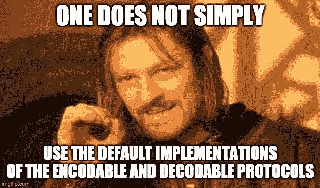

# Swift 中的定制编码和解码 JSON

> 原文：<https://levelup.gitconnected.com/custom-encoding-and-decoding-json-in-swift-a99c80b280e7>



> 这个帖子最初是我在 [Swift Delivery](https://www.leandrofournier.com/custom-encoding-and-decoding-json/) 写的。

在 Swift 系列的上一期[与 JSON 的合作中，我们探索了各种项目:](/working-with-json-in-swift-c5faea0b19a1)

*   `Codable`协议，包含另外两个协议:`Encodable`和`Decodable`
*   如何将 JSON 数据对象解码成可读的 Swift 结构
*   自定义键的使用
*   自定义对象创建
*   数组
*   不同的顶级实体

对于 Swift 中 JSON 的基本用法来说，这就足够了，这将使我们能够读取 JSON 数据(解码)并创建一个新对象，该对象可以转换回 JSON(编码)并将其发送到 RESTFul API。

首先，让我们创建一个对象，并将其转换成 JSON 数据格式。

# 编码

## 默认编码

让我们假设昆虫有以下`struct`:

```
struct Insect: Codable {
    let insectId: Int
    let name: String
    let isHelpful: Bool

    enum CodingKeys: String, CodingKey {
        case insectId = "insect_id"
        case name
        case isHelpful = "is_helpful"
    }
}
```

总结一下，我们有三个属性。 **insectId** 为昆虫标识符， **name** 为其名称，**为帮助性**指定昆虫对我们的花园是否有帮助。其中两个属性使用自定义键(**昆虫**和**是有用的**)。

现在让我们创造一只昆虫:

```
let newInsect = Insect(insectId: 1006, name: "ants", isHelpful: true)
```

我们的 RESTful API 期望收到一个带有新昆虫信息的 JSON。然后我们必须对它进行编码:

```
let encoder = JSONEncoder() 
let insectData: Data? = try? encoder.encode(newInsect)
```

这很简单:现在**昆虫数据**是一个类型为`Data?`的对象。我们可能想要检查编码是否实际工作(只是检查，您可能不会在您的代码中这样做)。让我们重写上面的代码，并使用一些可选的展开:

```
let encoder = JSONEncoder()
if let insectData = try? encoder.encode(newInsect),
    let jsonString = String(data: insectData, encoding: .utf8)
    {
    print(jsonString)
}
```

1.  创建编码器
2.  尝试对我们创建的对象进行编码
3.  如果可能，将`Data`对象转换成`String`

然后我们打印出如下结果:

```
{"name":"ants","is_helpful":true,"insect_id":1006}
```

> 注意，编码时使用的键不是自定义键(**昆虫 Id** 和**有用**)，而是预期键(**昆虫 id** 和**有用**)。不错！

## 自定义编码

假设我们的 RESTful API 期望接收大写的昆虫名称。我们需要创建自己的编码方法的实现，以确保昆虫的名称是大写的。我们必须在我们的**昆虫** `struct`内部实现`Encodable`协议的方法`**func** encode(to encoder: Encoder) **throws**`。

```
struct Insect: Codable {
    let insectId: Int
    let name: String
    let isHelpful: Bool

    enum CodingKeys: String, CodingKey {
        case insectId = "insect_id"
        case name
        case isHelpful = "is_helpful"
    }

    func encode(to encoder: Encoder) throws {
        var container = encoder.container(keyedBy: CodingKeys.self)
        try container.encode(insectId, forKey: .insectId)
        try container.encode(name.uppercased(), forKey: .name)
        try container.encode(isHelpful, forKey: .isHelpful)
    }
}
```

第 13 行是我们创建一个存储编码值的容器的地方。容器必须是一个`var`，因为它是可变的，并且必须接收要使用的键。

第 14 到 16 行用于将值编码到容器中，这是使用`try`完成的，因为其中任何一行都可能抛出错误。

现在，看第 15 行:我们不仅仅是按原样输入值，而是将它大写，这是我们实现自定义编码的主要原因。

如果您运行上面的代码，在那里我们创建了**昆虫**“蚂蚁”，我们将会看到，在将生成的 JSON `Data`编码并转换为`String`之后，我们会得到以下结果:

```
{"name":"ANTS","is_helpful":true,"insect_id":1006}
```

正如你可能已经看到的，昆虫的名字现在是大写的，尽管我们把它变成了小写的。多酷啊！

# 定制解码

到目前为止，我们一直依赖于`Decodable`协议的默认解码方法。但是让我们看看另一个场景。

```
[
   {
      "insect_id":1001,
      "name":"BEES",
      "details":{
         "is_helpful":true
      }
   },
   {
      "insect_id":1002,
      "name":"LADYBUGS",
      "details":{
         "is_helpful":true
      }
   },
   {
      "insect_id":1003,
      "name":"SPIDERS",
      "details":{
         "is_helpful":true
      }
   },
   {
      "insect_id":2001,
      "name":"TOMATO HORN WORMS",
      "details":{
         "is_helpful":false
      }
   },
   {
      "insect_id":2002,
      "name":"CABBAGE WORMS",
      "details":{
         "is_helpful":false
      }
   },
   {
      "insect_id":2003,
      "name":"CABBAGE MOTHS",
      "details":{
         "is_helpful":false
      }
   }
]
```

API 正在检索 **details** 实体内的**is _ helical**属性。但是我们不想创建一个**细节**对象:我们只是想展平那个对象，这样我们就可以使用我们现有的**昆虫**对象。

是时候使用我们自己实现的`Decodable`协议的`**init**(from decoder: Decoder) **throws**`方法和一些额外的工作了。让我们开始吧。

首先，编码键发生了变化，因为**是有用的**不是以前同一级别的键，有一个新的键叫做**细节**。要解决这个问题:

```
enum CodingKeys: String, CodingKey {
        case insectId = "insect_id"
        case name
        case details
    }

    enum DetailsCodingKeys: String, CodingKey {
        case isHelpful = "is_helpful"
    }
```

在第 4 行中，我们用新的密钥替换现有的密钥，**细节**。

在第 7 行和第 9 行，我们创建了一组新的键，这些键存在于**细节**中，在本例中只有一个，**是有用的**。

> 注意，我们没有触及**虫**的属性。

现在让我们深入解码器初始化:

```
init(from decoder: Decoder) throws {
   let container = try decoder.container(keyedBy: CodingKeys.self)

   insectId = try container.decode(Int.self, forKey: .insectId)
   name = try container.decode(String.self, forKey: .name)
   let details = try container.nestedContainer(keyedBy: DetailsCodingKeys.self, forKey: .details)
   isHelpful = try details.decode(Bool.self, forKey: .isHelpful)
}
```

在第 2 行中，我们创建了一个容器，它解码了整个 JSON 结构。

在第 4 行和第 5 行中，我们只解码了 **insectId** 属性的`Int`值和 **name** 属性的`String`值。

在第 6 行中，我们在由全新的**details coding keys**键控的 **details** 键下抓取嵌套容器。

在第 7 行中，我们只是解码了新的**细节**容器中**is help**属性的`Bool`值。

但不是这样。由于我们的 **CodingKeys** 已经通过添加**细节**案例而改变，我们的定制编码实现必须被修复。让我们开始吧:

```
func encode(to encoder: Encoder) throws {
    var container = encoder.container(keyedBy: CodingKeys.self)
    try container.encode(insectId, forKey: .insectId)
    try container.encode(name.uppercased(), forKey: .name)
    var details = container.nestedContainer(keyedBy: DetailsCodingKeys.self, forKey: .details)
    try details.encode(isHelpful, forKey: .isHelpful)
}
```

我们只是改变了编码**is help**属性的方式。

在第 5 行中，我们创建了一个新的嵌套容器，使用了 JSON 中的**details coding keys**中的键，并在 **details** 实体中使用。

在第 6 行，我们在全新的**细节**嵌套容器中编码**是有用的**。

所以，总结一下，我们的**虫**长这样:

```
struct Insect: Codable {
    let insectId: Int
    let name: String
    let isHelpful: Bool

    enum CodingKeys: String, CodingKey {
        case insectId = "insect_id"
        case name
        case details
    }

    enum DetailsCodingKeys: String, CodingKey {
        case isHelpful = "is_helpful"
    }

    init(from decoder: Decoder) throws {
        let container = try decoder.container(keyedBy: CodingKeys.self)

        insectId = try container.decode(Int.self, forKey: .insectId)
        name = try container.decode(String.self, forKey: .name)
        let details = try container.nestedContainer(keyedBy: DetailsCodingKeys.self, forKey: .details)
        isHelpful = try details.decode(Bool.self, forKey: .isHelpful)

    }

    func encode(to encoder: Encoder) throws {
        var container = encoder.container(keyedBy: CodingKeys.self)
        try container.encode(insectId, forKey: .insectId)
        try container.encode(name.uppercased(), forKey: .name)
        var details = container.nestedContainer(keyedBy: DetailsCodingKeys.self, forKey: .details)
        try details.encode(isHelpful, forKey: .isHelpful)
    }
}
```

如果我们解码它:

```
let decoder = JSONDecoder()
if let insects = try? decoder.decode([Insect].self, from: jsonData!) {
    print(insects)
}
```

我们会得到这样的结果:

```
[__lldb_expr_54.Insect(insectId: 1001, name: "BEES", isHelpful: true), __lldb_expr_54.Insect(insectId: 1002, name: "LADYBUGS", isHelpful: true), __lldb_expr_54.Insect(insectId: 1003, name: "SPIDERS", isHelpful: true), __lldb_expr_54.Insect(insectId: 2001, name: "TOMATO HORN WORMS", isHelpful: false), __lldb_expr_54.Insect(insectId: 2002, name: "CABBAGE WORMS", isHelpful: false), __lldb_expr_54.Insect(insectId: 2003, name: "CABBAGE MOTHS", isHelpful: false)]
```

如您所见，没有**细节**实体:只有我们的`struct`属性。

编码也会像预期的那样工作。

这篇文章，加上之前的系列文章，总结了在 Swift 中使用 JSON 时可能遇到的最常见的场景。

# 需要更多信息？

Ben Scheirman 的[Swift JSON 解析终极指南](https://benscheirman.com/2017/06/swift-json/)是我能找到的关于这个主题的最有用的资源。