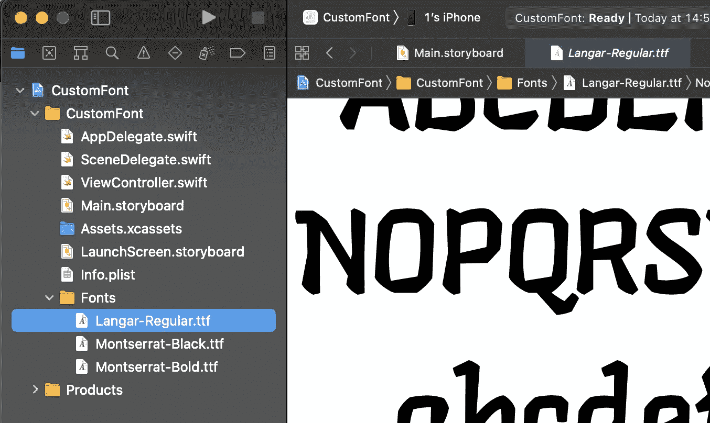
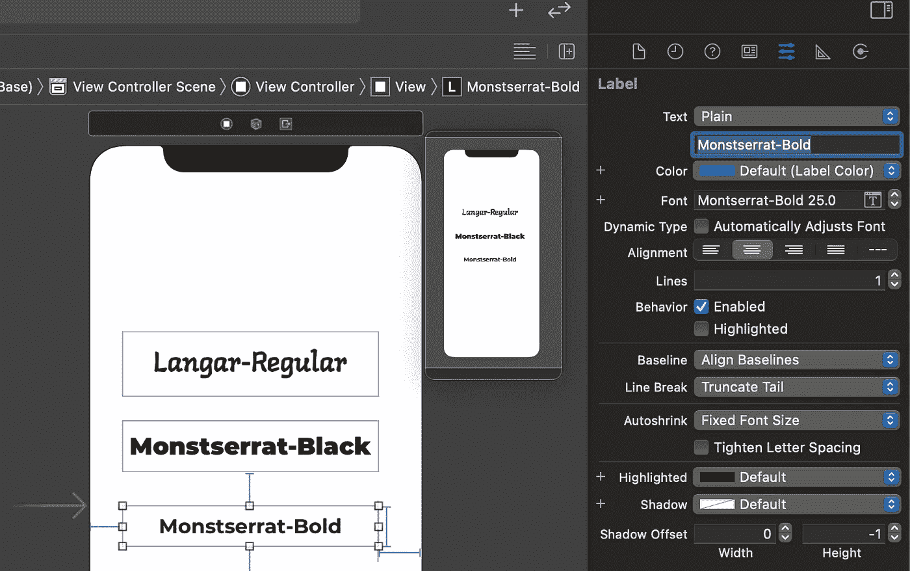
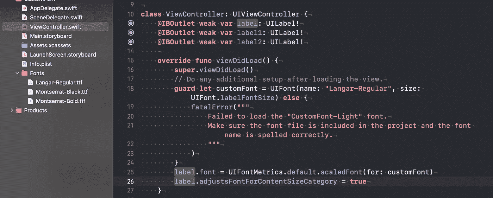

# Swift 中的自定义字体实施

> 原文：<https://levelup.gitconnected.com/custom-font-implementation-in-swift-2db43a668487>

## 有简单解释和大量插图

在 [Unsplash](https://unsplash.com?utm_source=medium&utm_medium=referral) 上由 [Charisse Kenion](https://unsplash.com/@charissek?utm_source=medium&utm_medium=referral) 拍摄的照片

如果你想让更多的人被你的应用程序吸引，漂亮的设计是非常关键的。一个**字体**可以让应用程序看起来非常整洁，但是可能会出现标准字体看起来无聊和无用的情况。这不是问题，因为你可以在几分钟内应用任何你想要的字体！

在我们开始之前，我建议使用[谷歌字体](https://fonts.google.com)，因为它们有不同有趣字体的广泛可变性。当然，你可以选择你的精神所喜欢的。

# 我们开始吧

1.  首先，将找到的字体拖放到 Xcode 中。不要忘记将你的应用添加为目标会员

2.接下来，我们需要在 Info.plist 中指定我们的字体。添加“应用程序提供的字体”,并在每个项目中，写下您的字体名称。

> 注意:有时候，字体的名字并不是那么明显。为了找到你的字体名称，你可以写这样的代码:

3.第三步是简单地在界面构建器中或者以编程方式添加你的字体。

# 包扎

为了集成自定义字体，这就是你应该做的！是不是很酷？

我希望你喜欢这篇文章，并发现它很有趣！

感谢阅读！