# 在 iOS 中创建自定键盘

> 原文：<https://levelup.gitconnected.com/custom-keyboards-in-ios-affb62668d48>

在这篇文章中，我们将从头开始介绍一个自定义键盘的实现，但是它的一些特性与我们通常使用的键盘概念不匹配。

该示例涵盖以下功能:

*   键盘必须将你的电话日程列表显示出来。
*   如有必要，键盘必须请求议程许可。
*   键盘允许使用键盘字母进行过滤。
*   当用户点击一个联系人时，姓名和电话将被复制到文本字段区域。

*注*:我们假设你有关于 Xcode、Swift、UIKit 和 Combine 的基本概念来阅读这篇文章。

# 开始之前

在开始工作之前，我们必须了解键盘扩展的一些建议和限制。有几个，这里我们包括其中的一些:

*   如果键盘与 iPadOS 兼容，请记住它可以呈现为纵向、横向和压缩/扩展模式。在 iPhone 中，记住键盘是可以旋转的。
*   如果您的键盘设计允许，您必须尊重用户为 iPhone 用户设置选择的亮/暗主题。
*   键盘扩展作为独立的进程在系统中运行。这个过程被迫遵循一些限制，比如记忆限制。内存限制因设备而异，但都在 30MB 左右。记住，测试和调试你所有的功能，尽你所能**优化**。
*   如果你想基于习语支持不同的*布局*，你必须为每个布局创建一个新的扩展。

# 开始吧！

本章将分为两个部分:

*   创建项目并配置扩展
*   实现我们的键盘

> 请记住，您可以在这个 [Github 库](https://github.com/daviwiki/medium-keyboard-extension)中查看所有代码。代码是一步一步分开的，每次提交代表本教程的一个不同的步骤。

## 配置键盘扩展

从头开始，创建一个 *Xcode* 项目。这个例子是使用带有 *Swift* 和*故事板的 *Xcode12.5* 创建的。*

接下来，按照以下步骤创建自定义键盘扩展:

1.  文件>新建>目标
2.  搜索“自定义键盘扩展”，点击进入“下一步”

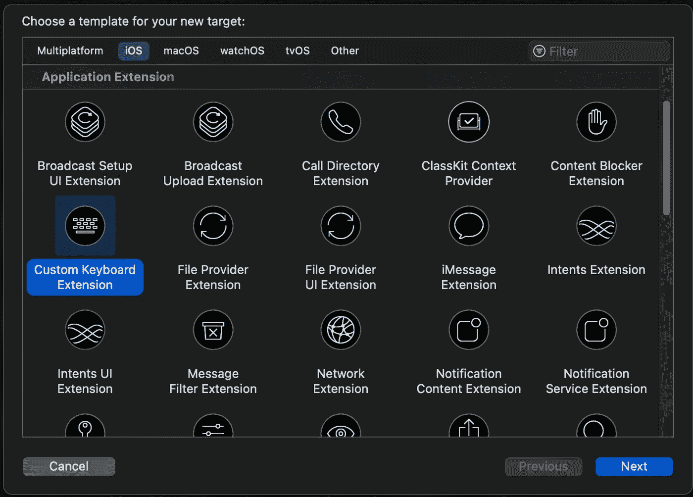

3.包含和扩展名称(例如:*MediumCustomKeyboardExtension*)。对于其余部分，我们保留默认配置。

*注意*:如果您看到以下警告，请选择“激活”。这将配置将扩展链接到应用程序的方案。

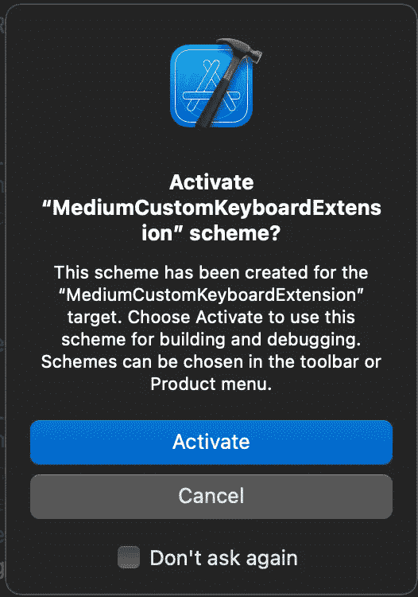

此时，我们创建了新的目标，Xcode 将包含所有必要的文件，包括位于 *KeyboardViewController* 的默认实现，如下图所示:

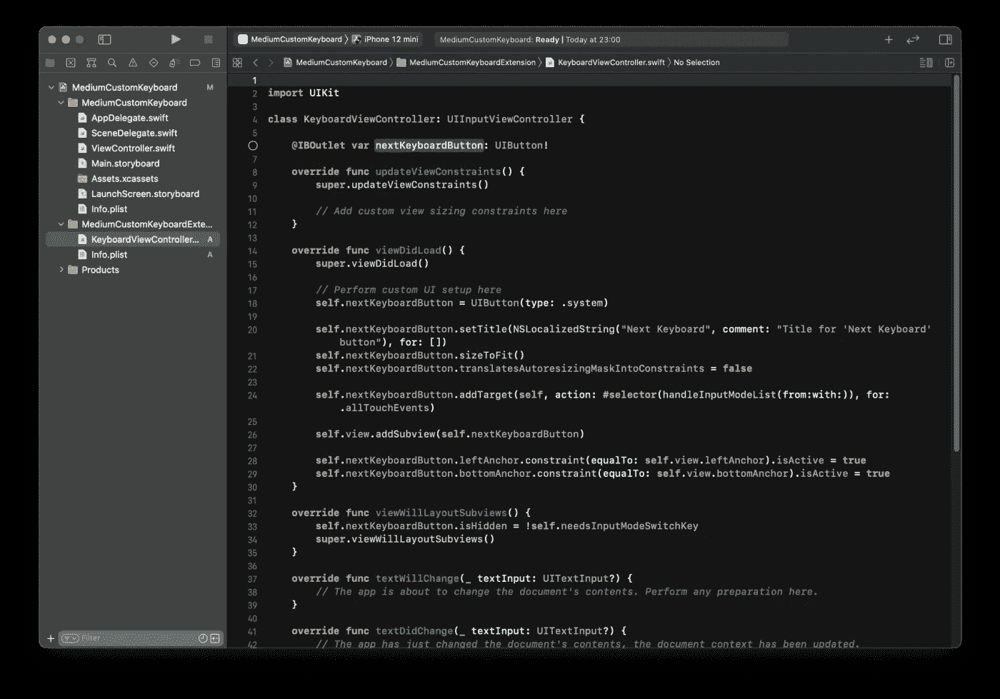

好了，让我们检查一下我们是否已经成功地配置了键盘。

1.  首先将 *UITextField (* 例如 *)* 添加到默认添加到项目中的主 *ViewController.swift* 。
2.  进入方案菜单，选择您的扩展目标，*MediumCustomKeyboardExtension。*
3.  启动键盘扩展方案，并将其链接到应用程序。

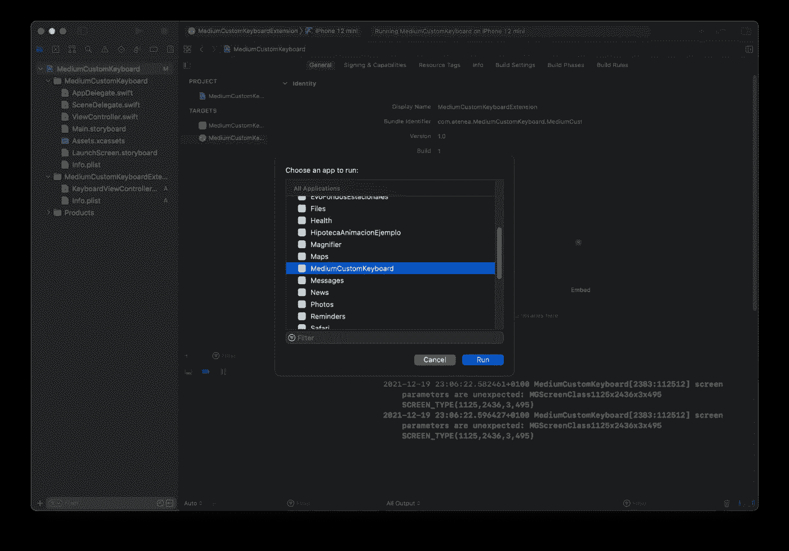

4.如果一切正常，模拟器必须运行并打开我们的 *MediumCustomKeyboard* 应用程序。单击之前包含的*文本字段*以显示键盘。

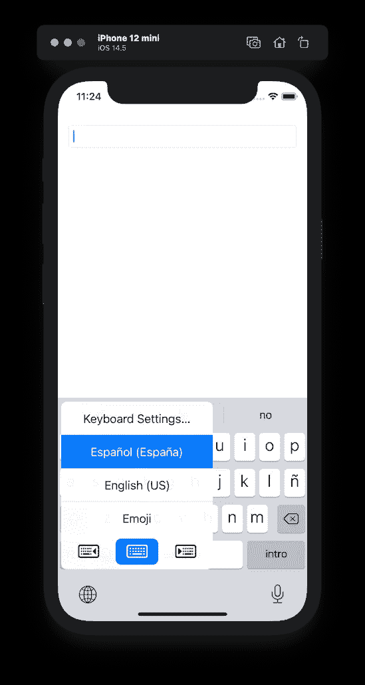

但是…我们的键盘在哪里？可能出了什么问题！？

容易容易，如果你是第一次使用自定义键盘，你必须知道它是必要的手动启用它们。所以…在上一个菜单中:

1.  选择“键盘设置”
2.  键盘
3.  添加新键盘…
4.  进入第三方键盘，你必须找到你的*MediumCustomKeyboardExtension 来启用它。*
5.  回到应用程序，瞧！你的键盘还在那里(空着…)，但是已经准备好接受新的惊人的功能了。

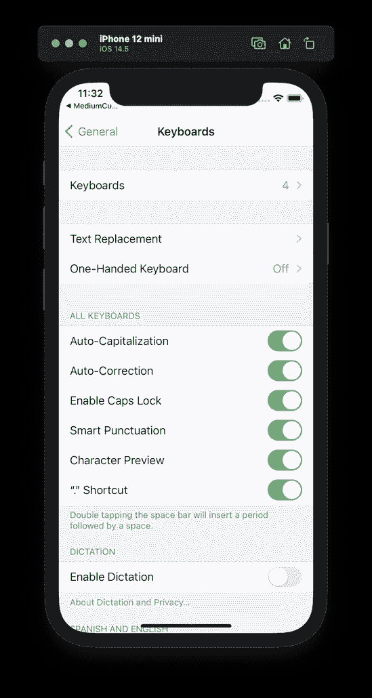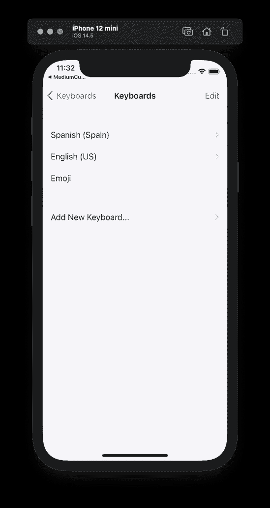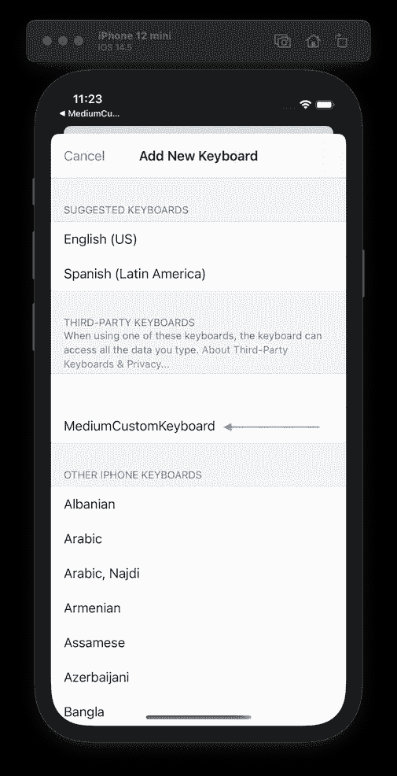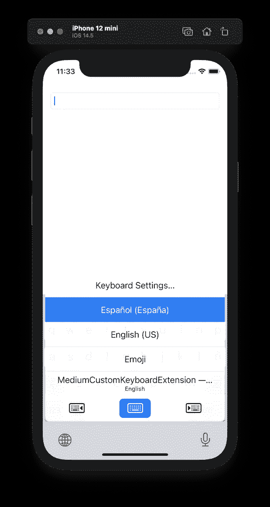

## 的实现。

开始之前，请记住我们想要的功能:

*   绘制电话联系人列表(仅第一个电话)
*   将用户选择的联系人写入文本框
*   使用搜索过滤器过滤联系人

记住这一点，让我们将开发分为两个阶段，第一个阶段我们绘制联系人列表并选择一个项目，最后一个阶段我们实现搜索过滤器。

## 第一相

*   首先，我们必须包含*NSContactUsageDescription*来访问用户议程。所以打开应用程序 Info.plist(记住，不是 Info.plist 扩展)并添加它。

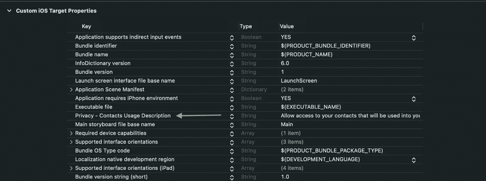

*   实现业务层来访问联系人。

*   一旦数据层准备好了，让我们画出联系人列表，这将是我们定制键盘的基础。我们选择联系人列表的高度为 200 像素，标题区域的高度为 48 像素。所有的实现都可以在*键盘视图*和*键盘视图模型(MVVM)中找到。*

*   最后，我们将键盘锚定到创建扩展时添加的主 *KeyboardViewController* 上，删除所有包含的默认代码。

重新启动，您会看到类似这样的内容:

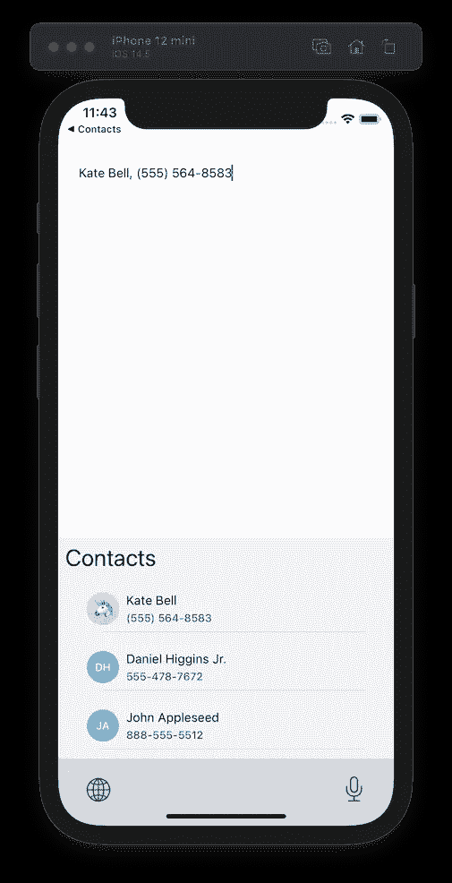

> 检查在 [*仓库*](https://github.com/daviwiki/medium-keyboard-extension) *找到的提交 *482e460，如果你有任何疑问或者你想测试一些其他的东西*来检查实现*

不错！非常棒的作品🏋️‍♂️!你跨越了成为键盘扩展专家的界限。

## 第 2 阶段—过滤

让我们继续，想象你有一个包含 200-300 个联系人的联系人列表，这是一个过滤器，有助于快速找到你要找的人。

但是，在这一点上，也许你有这些问题…

*   我可以在屏幕上编辑键盘的高度吗？
*   如果之前是真的…，键盘的大小是标准的还是根据内容灵活调整？
*   最重要的是，我需要在键盘上写字符，但是…我是一个键盘！…如何将键盘部署到屏幕上？

但是又容易了！我们可以找到所有这些问题的解决方案，因为:

*   是的，我们可以随意改变键盘的高度
*   是的，高度是适应他的内容(如果你锚正确:P)
*   是的，我们可以部署一个键盘**，但**不是系统键盘，所以**我们必须复制**一个键盘作为视图，并将其包含到我们的系统中。

> 在 *github* 中有一些令人惊叹的库，它们已经创建了定制的多习语键盘。我们包括了一个从零开始创建的新键盘，但是如果你想的话，不要忘记搜索或者使用第三方开源键盘

下面的代码包括一个如此简单的键盘实现，它有三行嵌套在包含字母、移除项和关闭项的 UIStackView 中。

一旦我们的键盘被创建，我们必须连接我们所有的部分。我们的 *KeyboardViewModel* 必须驱动编辑/空闲模式来动态改变视图，我们需要包含一些视图来在状态之间改变，因此我们扩展了它的接口:

并且，基于这个定义，我们交流所有基于它的作品。因为这是最后一步，为了避免这篇文章中的所有代码，我们建议您下载并检查它，最重要的是……修改以包含新知识🙃。

这张 gif 图说明了最终结果:

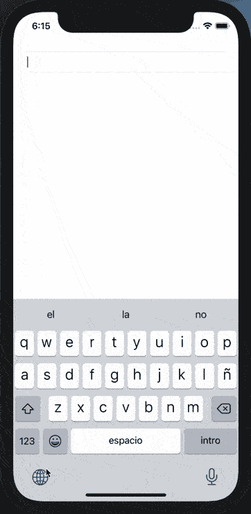

感谢阅读！圣诞快乐！🎉

# **参考书目**

*   [键盘应用扩展编程指南](https://developer.apple.com/library/archive/documentation/General/Conceptual/ExtensibilityPG/CustomKeyboard.html#//apple_ref/doc/uid/TP40014214-CH16-SW1)
*   [人机界面指南——键盘](https://developer.apple.com/design/human-interface-guidelines/ios/extensions/custom-keyboards/)
*   [创建定制键盘—官方](https://developer.apple.com/documentation/uikit/keyboards_and_input/creating_a_custom_keyboard)
*   [Github 范例库](https://github.com/daviwiki/medium-keyboard-extension)
*   [键盘套件(github)](https://github.com/KeyboardKit/KeyboardKit)