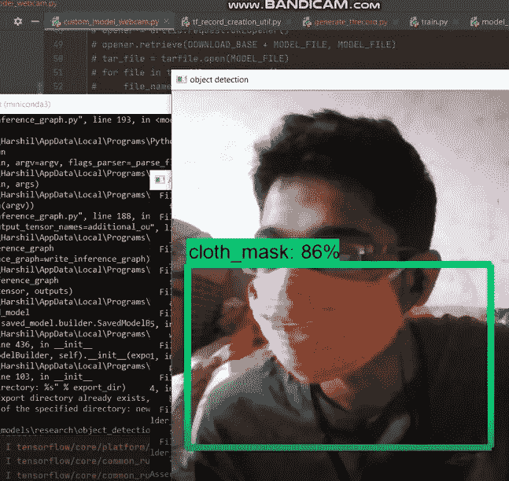
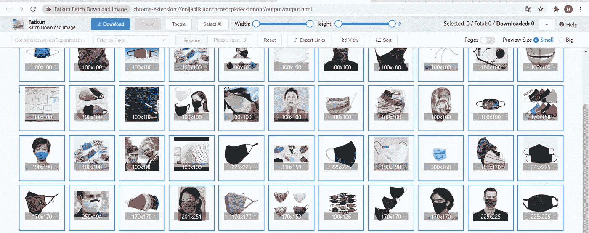
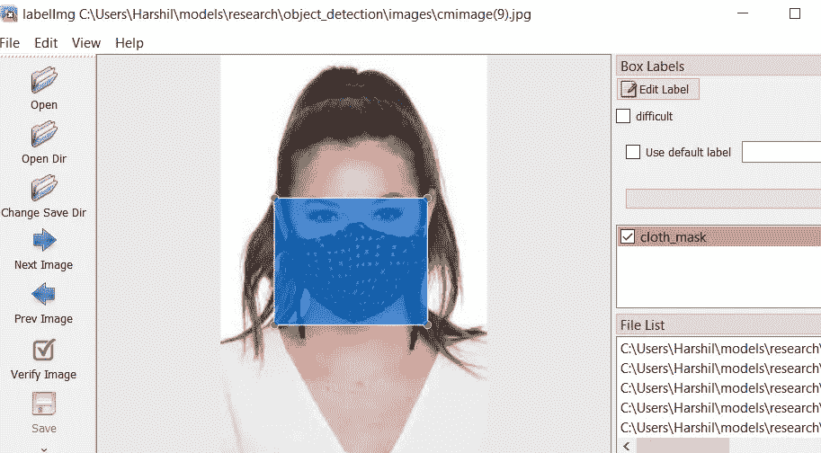
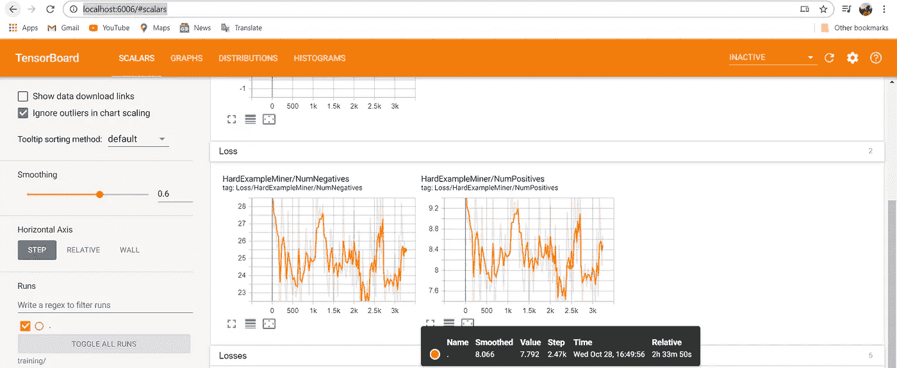

# 使用 TensorFlow 的自定义对象检测—(从头开始)

> 原文：<https://levelup.gitconnected.com/custom-object-detection-using-tensorflow-part-1-from-scratch-41114cd2b403>



作者图片(哈希尔，2020)

在本教程中，我们将使用预训练的 SSD MobileNet V2 模型来创建和训练我们自己的面罩检测器。

首先，我们将创建自己的图像数据集，稍后我们将看到如何训练一个自定义的对象检测模型(本地和谷歌 Colab！)

# 1.装置

## 1.1 张量流

使用以下命令安装 Tensorflow:

`$ pip install tensorflow or pip install tensorflow==1.15`

如果您有可以与 Tensorflow 一起使用的 GPU:

`$ pip install tensorflow-gpu`

## 1.2 其他依赖关系

`$ pip install pillow Cython lxml jupyter matplotlib`

使用自制软件安装 protobuf(你可以在这里了解更多关于自制软件的知识)

`$ brew install protobuf`

对于在其他操作系统上安装 protobuf，请遵循此处的说明[。](http://google.github.io/proto-lens/installing-protoc.html)

## 1.3 克隆 Tensorflow 模型库

在本教程中，我们将使用 Tensorflow 模型存储库中的资源。因为 Tensorflow 安装没有附带它，所以我们需要从他们的 Github repo 中克隆它:

首先进入张量流目录:

```
# *For example: ~/anaconda/envs/<your_env_name>/lib/python3.6/site-packages/tensorflow*$ cd <path_to_your_tensorflow_installation>
```

克隆 Tensorflow 模型库:

`$ git clone [https://github.com/tensorflow/models.git](https://github.com/tensorflow/models.git)`

**从此时起，该目录将被称为** `**models**` **目录**

## 1.4 设置环境

每当您启动一个新的终端窗口来处理预训练的模型时，编译 Protobuf 并更改您的`PYTHONPATH`是非常重要的。

从终端运行以下命令:

```
$ cd <path_to_your_tensorflow_installation>/models/research/$ protoc object_detection/protos/*.proto --python_out=.$ export PYTHONPATH=$PYTHONPATH:`pwd`:`pwd`/slim
```

运行快速测试以确认对象检测 API 工作正常:

`$ python object_detection/builders/model_builder_test.py`

# 2.形象

对于数据集图像，我使用的是口罩图像，你可以使用自己的数据集图像或从谷歌下载。在 google 中启用 **fatkun 批量下载**扩展。下载大量图像，并从下载的文件夹中删除不需要的图像。



作者图片(哈希尔，2020)

现在进入 tensorflow object_Detection 目录**删除数据文件夹。创建一个新的空数据文件夹，“训练”文件夹，“图像”文件夹。**

现在在图像文件夹中创建 2 个新的空文件夹'测试，'训练'。它看起来会像这样。**复制你下载的图片并粘贴到模型中>研究>物体 _ 探测>图片**

```
object_detection
    ├── data
    |   
    ├── training
    |
    ├── images
    |   ├── test
    |   ├── train
    |   ├── ...
```

## 2.1 图像标记

现在来标记镜像克隆—[](https://github.com/tzutalin/labelImg)**repo，转到 anaconda cmd 提示符和 cd 到 labelImg 路径**

```
C:\Users\path\labelImg> python labelImg.py
```

**如果您在运行 cmd 时遇到任何错误，请 pip install lxml。标签窗口打开后，选择打开目录并将目录保存到 object_detection 中的 images 文件夹。**

****

**作者截图(哈希尔，2020)**

**现在使用 **W** 来裁剪图片并给你的图片贴上标签，并以 img 的相同名称保存到 images 文件夹中。以同样的方式裁剪和标记所有图像。如果你有一个以上的标签，确保你可以用不同的名称。确保您获得的 img 和 xml 文件具有相同的名称(没有空格)。**

**现在您已经标记了所有的图像，将 10%的图像和 xml 文件复制到测试中，其余的复制到训练中。**

```
object_detection
  ├── images
    ├── test
    |   ├── cmimage1.jpg
    |   ├── cmimage1.xml
        ├── cmimage2.jpg
    |   ├── cmimage2.xml 
    ├── train
    |   ├── ...
```

**作者将 xml 转换为 CSV python(har shil，2020)**

**现在制作 **xml_to_csv.py** 文件，并将上面的代码粘贴到其中。制作模型中的文件路径>研究>对象 _ 检测。现在创建一个新的文件 generatetfrecord，并将下面的代码粘贴到其中。**

**作者的 tfreorcrd python(har shil，2020)**

**现在为你的模型替换 obj 上的标签和数字。现在打开 conda cmd 和 cd 到 models/research/object _ detection 并运行-**

```
path/object_detection> python xml_to_csv.py
```

**现在 2 个文件将被创建到你的数据文件夹中。打开这两个文件，检查标签和图像的数量。**

## **2.2 生成 _tfrecord**

**既然您已经生成了 csv 文件，现在 cd/ to dir。**

**作者的命令(哈希尔，2020 年)**

**如果你有任何错误，检查图像的文件名和目录。一旦您成功运行两个命令，您将获得 2 个**。将文件记录到数据文件夹**。这是第一部分，如果你已经生成。记录文件你做得很好。**确保使用正确的版本、文件名和目录。项目的路径。****

****我在本次回购中添加了一些 imp 文件—**[**https://github . com/its-harsh il/tensor flow-custom-object detection**](https://github.com/its-harshil/tensorflow-custom-objectdetection)**

****现在我们将训练一个用于对象检测的自定义模型(Local 和 Google Colab！)****

# **1.张量流检测模型**

**[](https://github.com/tensorflow/models/blob/master/research/object_detection/g3doc/tf1_detection_zoo.md) [## 张量流/模型

### 我们提供了一组在 COCO 数据集、Kitti 数据集、开放图像上预先训练的检测模型…

github.com](https://github.com/tensorflow/models/blob/master/research/object_detection/g3doc/tf1_detection_zoo.md) 

打开上面的 repo，下载你想要的任何模型，把文件夹放到 models > research > object _ detection。我用的是 **ssd_mobilenet_v1_coco**

现在将[https://github . com/benge mon 825/TF _ Object _ detection 2020/blob/master/masks/training/SSD _ mobilenet _ v1 _ pets . config](https://github.com/Bengemon825/TF_Object_Detection2020/blob/master/masks/training/ssd_mobilenet_v1_pets.config)pet 文件添加到‘training’文件夹中。

**修改你拥有的对象的路径和数量**

现在复制 **ssd_mobilenet_v1_coco 中的 pipline.conifg 文件，粘贴到培训文件夹中。它应该看起来像这样**

```
object_detection
  ├── data
    ├── object_detection.pbtxt
    ├── train.record
    ├── test.record
    ├── train_lables.csv
    ├── test_labels.csv
 ├── training
    ├── object_detection.pbtxt
    ├── pipline.config
    ├── ssd_mobilenet_v1_pets.config
```

# 2.PBTX 文件

在 training 文件夹中创建一个. txt 文件并粘贴下面的代码

```
item { id: 1 name: 'cloth_mask'}
```

**现在点击另存为，将其命名为‘object-detection . Pb txt ’,选择所有文件并保存**。如果有 n 个标签用于对象检测，请确保使用与 csv 文件中相同的标签名称。**现在复制这个 pbtxt 文件并粘贴到数据文件夹中。**

# 3.培养

现在您已经在数据和培训文件夹中添加了 pbtxt 文件。打开 anaconda cmd cd 到 models \ research \ object _ Detection 并运行-

```
set PYTHONPATH=$PYTHONPATH:"pwd":"pwd"/slim'
```

然后

```
python train.py --train_dir=training/ --pipeline_config_path=training/ssd_mobilenet_v1_pets.config --logtostderr
```

如果您得到错误消息说没有找到模块，那么只需复制文件并粘贴到 object_detection 中。确保你只是复制它，而不是从主目录中删除它。

如果显示任何其他错误，请确保检查您的。记录文件，generate_tfrecord 文件。请确保它们不为空或有任何错误。

一旦你成功地运行了 cmd，你就能看到这个模型是在损失和时间的情况下进行训练的。它看起来会像这样-

```
I1030 12:52:00.296686  3708 learning.py:768] Starting Queues.
INFO:tensorflow:global_step/sec: 0
I1030 12:52:09.401392 30180 supervisor.py:1099] global_step/sec: 0
INFO:tensorflow:Recording summary at step 3217.
I1030 12:52:21.126251 16976 supervisor.py:1050] Recording summary at step 3217.
INFO:tensorflow:global step 3218: loss = 1.7246 (21.576 sec/step)
I1030 12:52:22.335144  3708 learning.py:507] global step 3218: loss = 1.7246 (21.576 sec/step)
INFO:tensorflow:global step 3219: loss = 1.6730 (3.673 sec/step)
I1030 12:52:26.409953  3708 learning.py:507] global step 3219: loss = 1.6730 (3.673 sec/step)
INFO:tensorflow:global step 3220: loss = 1.8269 (4.190 sec/step)
I1030 12:52:30.603331  3708 learning.py:507] global step 3220: loss = 1.8269 (4.190 sec/step)
INFO:tensorflow:global step 3221: loss = 1.9480 (4.277 sec/step)
I1030 12:52:34.883605  3708 learning.py:507] global step 3221: loss = 1.9480 (4.277 sec/step)
INFO:tensorflow:global step 3222: loss = 1.5400 (5.243 sec/step)
I1030 12:52:40.129421  3708 learning.py:507] global step 3222: loss = 1.5400 (5.243 sec/step)
INFO:tensorflow:global step 3223: loss = 1.3421 (5.265 sec/step)
I1030 12:52:45.397172  3708 learning.py:507] global step 3223: loss = 1.3421 (5.265 sec/step)
```

确保你正在产生损失，一旦你的损失率等于或小于 1，按 CTRL+C 停止训练。

# 4.导出图表

现在，您的培训已经结束，请转到 object_Detection 文件夹并打开培训文件夹。你会看到数据，索引，元文件产生了相同的名称。查看最新文件，如 **model.ckpt-3217**

现在运行，用你最新的文件编辑 cmd 下面的 ckpt 文件名。

```
python export_inference_graph.py --input_type image_tensor --pipeline_config_path training/ssd_mobilenet_v1_pets.config --trained_checkpoint_prefix training/**model.ckpt-3217** --output_directory new_graph
```

现在转到 object_detection 文件夹，将生成新的 _graph 文件夹。

# 5.网络摄像头检测

在 object_detection 目录中创建一个自定义网络摄像机检测 python 文件。，粘贴在代码下面—

作者定制的网络摄像头 python(har shil，2020)

现在打开 pycharm 并运行上面的文件。您的网络摄像头将弹出，您将检测到带有标签和准确性的面罩。您甚至可以在 cmd 提示符下运行它。


作者图片(哈希尔，2020)

**如果您无法运行任何 cmd** —

*   检查版本代码
*   检查路径
*   检查。记录，。csv，。config 等文件在那里
*   安装了 lxml、slim 和其他
*   检查标签名称，它应该在 csv 中相同，生成 tf 记录文件和 pbtxt 文件。
*   每个物体使用大约 100 多张图片

# 6.Google Colab

[**ipynb**](https://github.com/Bengemon825/TF_Object_Detection2020/blob/master/ModelTrainingOnColab.ipynb) **文件—**[https://github . com/benge mon 825/TF _ Object _ detection 2020/blob/master/modeltrainingoncollab . ipynb](https://github.com/Bengemon825/TF_Object_Detection2020/blob/master/ModelTrainingOnColab.ipynb)

现在，运行 ipynb 文件中给出的所有代码，并将生成的图形下载到 object detection 文件夹，并在新图形上命名。现在运行网络摄像头检测 python 文件并测试您的模型。

# 7.TENSORBORAD(可选)

TensorBoard 提供了机器学习实验所需的可视化和工具:

*   跟踪和可视化损失和准确性等指标
*   可视化模型图(操作和层)
*   查看权重、偏差或其他张量随时间变化的直方图
*   将嵌入投影到低维空间
*   显示图像、文本和音频数据
*   剖析张量流程序

现在打开另一个 anaconda cmd 并在 object_detection 中运行

```
tensorboard — logdir=training/
```

它将提供到您的本地主机的链接，就像这样 [http://localhost:6006/#](http://localhost:6006/#scalars)



作者截图(哈希尔，2020)

# 现在用更多的物体和更多的图像练习，快乐编码！！！

Imp —链接

*   [https://github.com/tzutalin/labelImg](https://github.com/tzutalin/labelImg)
*   [https://github.com/datitran/raccoon_dataset](https://github.com/datitran/raccoon_dataset)
*   [https://chrome . Google . com/web store/detail/fat Kun-batch-download-IMA/nnjjahlikiabnchcpehcpkdeckfgnohf？hl=en](https://chrome.google.com/webstore/detail/fatkun-batch-download-ima/nnjjahlikiabnchcpehcpkdeckfgnohf?hl=en)**