# iOS 中的自定义推送通知— Swift 5

> 原文：<https://levelup.gitconnected.com/custom-push-notification-in-ios-swift-5-210552643e86>

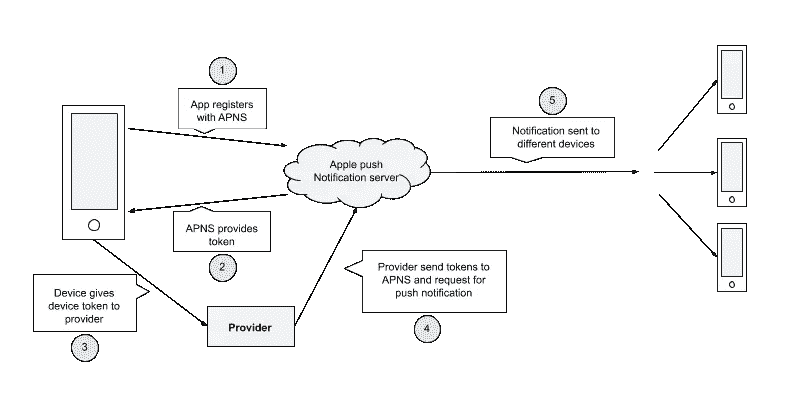

推送通知流

通知是任何用户参与的应用程序的重要组成部分，在本文中，我们将以简单的方式探索推送通知的设置。

## **推送通知的基本设置**

让我们开始创建一个单视图应用程序。输入您的项目名称并选择您的团队。对于推送通知，设置一个苹果开发者帐户是必须的，从这里我们将获得一个 APNS(苹果推送通知服务)证书。

## **项目设置**

在 Xcode 中进入你的 xcodeproj，点击添加功能，选择**推送通知**和**后台模式** > **远程通知**。

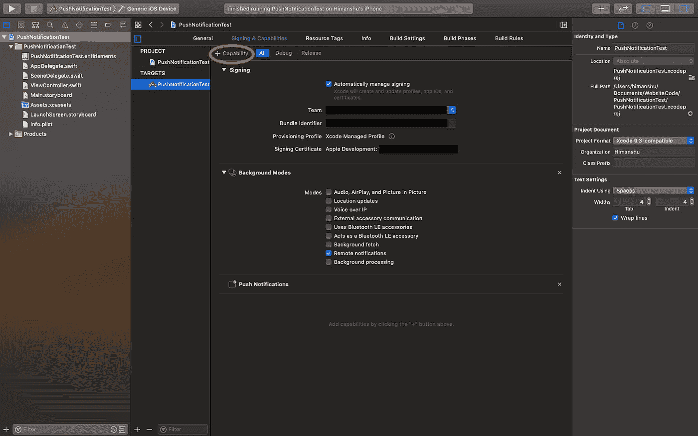

Xcode 项目设置

## **APNS 证书设置**

登录苹果开发者账号，进入**证书、标识符&配置文件** > **标识符** >选择你的 app id >推送通知>配置>选择文件

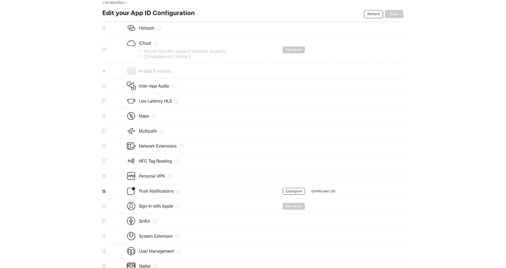

配置推送通知(1)

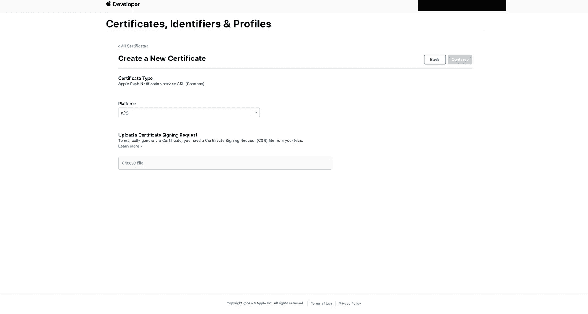

配置推送通知(2)

我们需要创建一个 CSR 文件上传到苹果开发者账户。前往系统中的“钥匙串访问”,向证书颁发机构申请证书，然后选择“存储到磁盘”。现在回到苹果开发者账户，点击选择文件，选择我们创建的 CSR 文件。然后点击继续并下载该证书(app_development.cer ),然后通过双击该证书添加到钥匙串中。

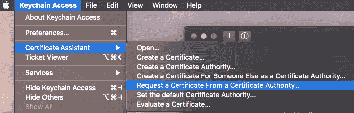

请求 CSR

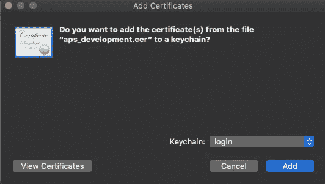

添加证书

## **让我们编码**

转到 app delegate，使用**configure notification(application:ui application)**配置通知，并将此方法调用到 **didFinishLaunching 方法中。**

万岁，你已经在你的项目中实现了推送通知。

## **测试推送通知**

为了测试推送通知，我们需要一个. p12 或。pem 文件。前往“钥匙串”,在“证书”中搜索您的应用 id，并将其导出为. p12。它会要求输入密码(可选字段),然后按“确定”,您的 p12 文件就准备好了。

用于转换。 **p12** 到。pem 文件遵循以下代码:

```
openssl pkcs12 -in pushnotification.p12 -out pushnotification.pem -nodes -clcerts
```

现在我们有了. p12，。pem 文件和设备令牌，我们可以使用任何工具进行测试。我大多用**APN tester**—上传。pem 文件，添加设备令牌和捆绑 id，然后发送消息。它会像魔咒一样起作用。

通知的基本设置已经完成。只要您的应用程序在后台或被终止，iOS 就会自动处理显示您的通知。但是如果 app 主动运行呢？然后你需要决定你想要发生什么。如果你想让 iOS 在你的应用在前台运行时显示你的通知，为此你需要实现这个委托:

让我们开始构建自定义通知。

创建一个名为**CustomNotificationDelegate**的 swift 文件，并添加 **willPresent** 和 **didReceive** 方法**。**像这样:

之后，返回 AppDelegate 并创建一个常量**CustomNotificationDelegate**并在 **configureNotification** 方法中更改代码。

let notification delegate = CustomNotificationDelegate()

## **类别**

有时你想在通知中得到用户的回应，因为 iOS 可以选择在推送通知中附加按钮。为此，在 appDelegate 中创建一个常量，并像这样配置自定义操作:

```
private let categoryIdentifier = "YesOrNO"
```

现在尝试以这种格式发送通知:

现在，您需要在通知上进行 3D 触摸，您将看到附加的按钮为**是**和**否**。

如果用户点击这些按钮中的任何一个，它们都必须被跟踪，为此我们需要对 **didReceive** 方法进行修改。

希望你已经了解了**类别**的基本概念，现在你可以在项目中根据你的要求进行改进了。

## **通知服务扩展**

为了实现**通知服务扩展**，您需要添加一个**扩展目标**，以便您可以处理正在使用的加密。现在转到 xcodeproj 在 xcode 中选择**文件>新建>目标>通知服务扩展>下一个>产品名称(**将其命名为 **PayloadModification) >完成>活动方案弹出(**如果出现则选择**取消)。**

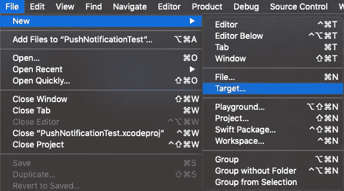

选择目标

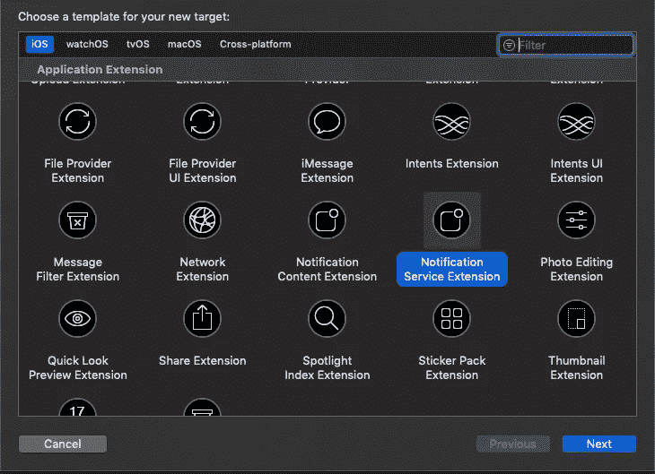

选择通知服务扩展

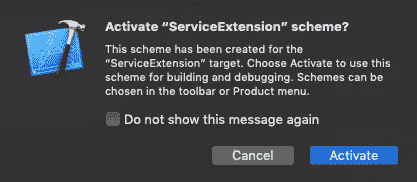

活动方案弹出菜单

如果您转到项目导航器，您会看到有一个名为 **ServiceExtension** 的新文件夹组，还有一个**notification service . swift**文件。在这个文件中已经有两个方法，一个是 **didReceive** ，另一个是**serviceextensiontimewillrexpire。**当你得到通知时， **didReceive** 方法被调用，你有大约 30 秒的时间来执行任何任务，之后 ios 将调用**serviceextensiontimewillrexpire**方法，给你最后一次机会来完成任务。如果你正在使用一个糟糕的连接，那么**serviceextensiontimewillerexpire**方法可能会给你足够的时间来完成你的任务。在**serviceextensiontimewillerexpire**中，我们可以执行需要较少时间完成的任务。

现在构建您的应用程序，并发送一个带有额外键“**可变内容**”的有效负载。

您将收到一个通知，其中包含额外的内容(已修改)，如下所示:


自定义通知

通知服务扩展的设置已完成。现在转到**notification service . swift**并写入任何其他内容，而不是[修改的]内容，您将在通知中看到修改的内容。我们将在下面代码的帮助下，通过更新有效载荷，在通知中添加一个图像。

有效负载格式:

注意:image_url 应该是 HTTPS，如果您想要添加 HTTP URL，那么您必须将 ServiceExtension 的 plist 作为 NSAPPTRANSPORTSECURITY 修改为 True。

万岁，你已经实现了你的第一个自定义通知。

我们甚至可以使用**定制界面**定制通知本身的外观。

让我们开始构建用于通知的**自定义界面**。

## **为自定义接口配置 Xcode】**

这与设置**通知服务扩展的过程相同。**转到 xcode 选择**文件>新建>目标>通知内容扩展>下一个>产品名称(**命名为 **CustomUI) >完成>活动方案弹出(**如果出现则选择**取消)。**

每个**自定义 UI** 必须有其唯一的类别标识符。如果你去项目导航器，你会看到你有一个名为 **CustomUI** 的新文件夹组，还有一个 info.plist，打开 info.plist，转到**n extension，**完全展开它。

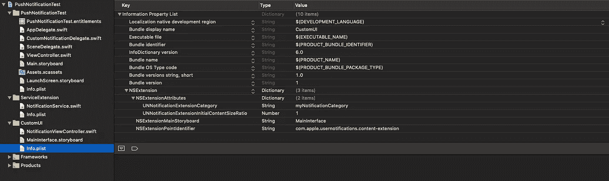

默认 info.plist 设置

**UNNotificationExtensionCategory**包含类别关键字如果您的推送通知包含与此匹配的关键字，将使用您的内容扩展的 UI。如果您有多个类别使用相同的用户界面，那么将**UNNotificationExtensionCategory**从字符串改为数组，并在此列出每个类别的名称。

**unnotificationextensioninitialcontetsizeratio**值默认为 1，我们可以在这里设置 0-1 之间的任意值，它代表高度与宽度的比值。UI 将从您在此给出的百分比的高度开始。您可以尝试用这个值进行更改。

添加**UNNotificationExtensionDefaultContentHidden**键，并将值设置为 **YES。**该设置将显示不带标题的自定义用户界面。

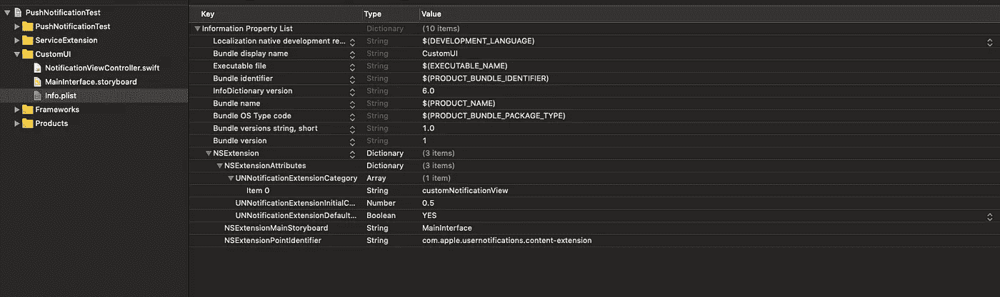

更新的信息列表

转到**main interface . story board**并更改一些 UI，在**notification view controller**中创建 outlets 并将 **didReceive** 方法替换为

出于安全原因，您不能在这里直接访问图像。您必须为它使用 start 和 stop 访问范围。

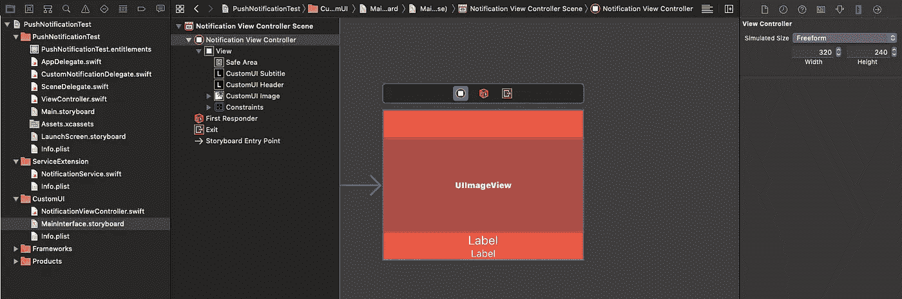

自定义 UI 故事板

现在构建您的应用程序，并使用 APNS 测试器发送通知。

有效负载格式:


自定义 UI 推送通知

如果您想要在扩展和应用目标之间共享数据，那么您必须启用**应用组。**

要启用此功能，请转到 **Xcode** 中的 **xcodeproj** ，点击**添加功能**，并选择**应用程序组。**点击+图标，写下小组名称(始终使用最佳实践—小组。+ bundleID)并在 **ServiceExtension** 目标中做同样的事情。选择您为应用程序目标选择的同一个**应用程序组**。

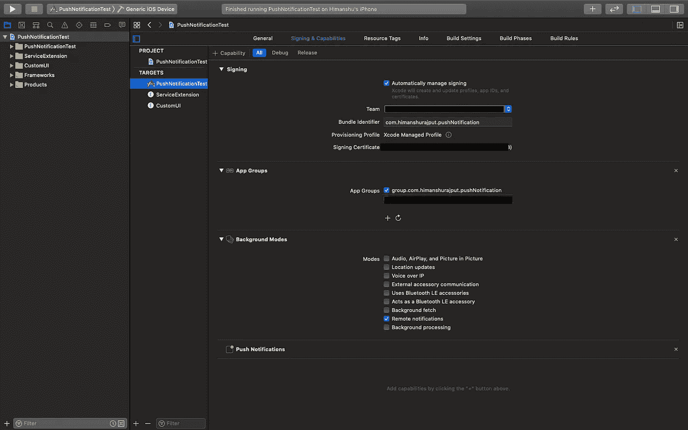

应用程序组设置

现在，从主目标将您想要访问的任何文件添加到扩展中，选择该文件，并在**目标成员身份**部分选中如下复选框:

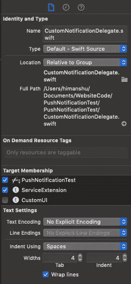

目标成员设置

推送通知到此为止。我希望我已经涵盖了自定义通知的所有主要内容。

感谢您阅读这篇文章。如果你觉得这篇文章有帮助，请不要忘记鼓掌。