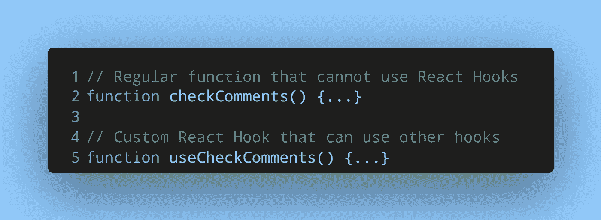
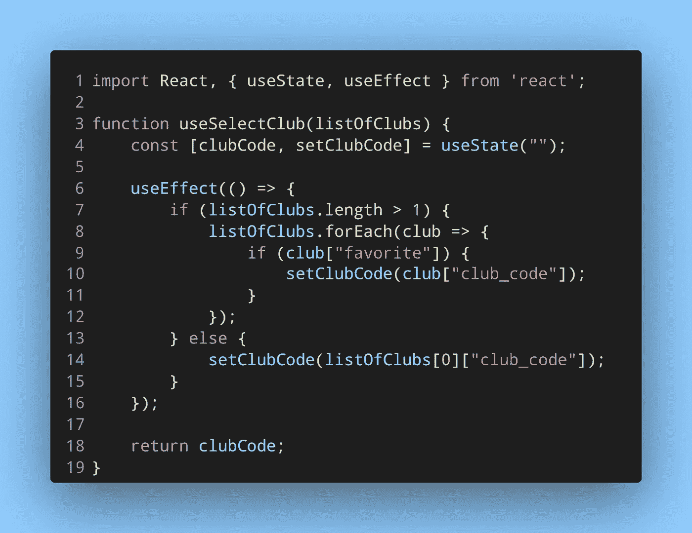

# 自定义反应钩。它们是什么？它们有什么帮助？

> 原文：<https://levelup.gitconnected.com/custom-react-hooks-what-are-they-and-how-are-they-helpful-2251ebead854>

照片由[劳塔罗·安德烈亚尼](https://unsplash.com/es/@lautaroandreani?utm_source=medium&utm_medium=referral)在 [Unsplash](https://unsplash.com?utm_source=medium&utm_medium=referral) 上拍摄

# 介绍

React 挂钩是在 React.js v16.8 中引入的。它们允许我们在功能组件中使用状态，类似于基于类的组件的生命周期挂钩。对于每种情况，都有一个可以使用的 React 钩子。从常用的钩子`useState`和`useEffect`到`useCallback`和`useMemo`，你可以慢慢浏览[文档](https://reactjs.org/docs/hooks-reference.html)来找到你需要的钩子。

既然你可能遇到的几乎每种情况都有钩子，那么你是否需要自己的 React 钩子呢？

# 什么是定制挂钩？

当我们想要在多个地方重用一些逻辑时，我们将它提取到一个函数中。如果我们还想重用一些 JSX，我们将它提取到一个单独的组件中。同样，React 钩子也是一个函数。

如果我们想创建一个可重用的函数，它也使用像`useState`和`useEffect`这样的 React 钩子，我们不能在普通函数中存储这个逻辑。

可以创建一个组件来存储这个可重用的逻辑，这样我们就可以使用钩子了。但是，如果我们在组件中没有任何 JSX 可写，这就不理想了。

在这种情况下，可以将可重用的逻辑提取到自定义的 React 挂钩中。定制 React 挂钩很简单——在函数名前加上前缀*使用*。例如:

一个常规函数与一个自定义的 React 挂钩。

# 自定义挂钩的示例

下面是一些提取到自定义挂钩中的逻辑。

自定义钩子`useSelectClub`将一组体育俱乐部作为参数。一个人可以加入一个或多个体育俱乐部。如果一个俱乐部被标记为某人的最爱，那么该俱乐部的代码被返回。如果用户属于一个俱乐部，则返回该俱乐部的代码。

一个自定义钩子的例子。

# 包扎

我希望这篇简短的指南能帮助你理解 React 中的定制钩子以及如何使用它们。

就像循环 JSX 和逻辑可以被转化为可重用的组件一样，使用 React 钩子的逻辑也可以被转化为可重用的定制钩子。

*原载* [*我的博客*](https://niharraoteblog.netlify.app/custom-react-hooks) *。*

# 分级编码

感谢您成为我们社区的一员！在你离开之前:

*   👏为故事鼓掌，跟着作者走👉
*   📰查看[级编码出版物](https://levelup.gitconnected.com/?utm_source=pub&utm_medium=post)中的更多内容
*   🔔关注我们:[推特](https://twitter.com/gitconnected) | [LinkedIn](https://www.linkedin.com/company/gitconnected) | [时事通讯](https://newsletter.levelup.dev)

🚀👉 [**加入升级人才集体，找到一份惊艳的工作**](https://jobs.levelup.dev/talent/welcome?referral=true)