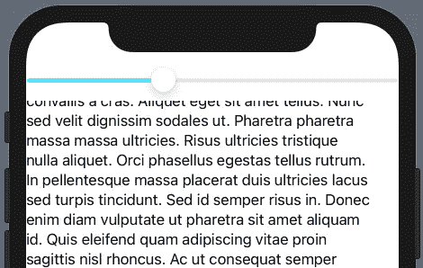
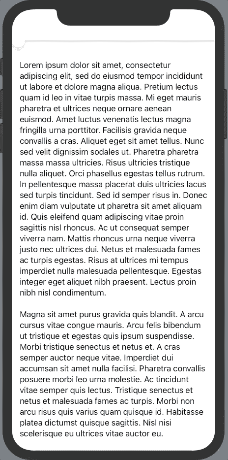

# iOS 14 和 SwiftUI 2 中的自定义滚动控件

> 原文：<https://levelup.gitconnected.com/custom-scroll-controls-in-ios-14-and-swiftui-2-3513fbde478e>

控制文本视图滚动位置的滑块

随着 SwiftUI 2 和 iOS 14 的发布，我们现在可以访问一个名为 [ScrollViewReader](https://developer.apple.com/documentation/swiftui/scrollviewreader) 的新视图，该视图公开了一个名为 [ScrollViewProxy](https://developer.apple.com/documentation/swiftui/scrollviewproxy) 的对象。这允许我们以编程方式控制用户在视图中滚动到的位置，并将用户发送到长视图中的特定位置。

为了测试这一点，我想创建一个自定义的滚动控件，使用一个滑块来确定用户在 ScrollView 中的位置。用户可以拖动控制用户位置的滑块。

幸运的是，SwiftUI 2 中的新视图允许我们这样做。

由滑块控制的滚动视图

要做到这一点，我们首先需要创建一些状态，作为当前滚动位置的真实来源。滚动位置和滑块值都使用 CGFloat。

我们将用它来保持滑块和滚动位置的同步。

接下来，让我们添加复制示例所需的视图。

让我们打开包装:

1.  在第 2 行的**上，将我们的`scrollPosition`绑定传递给我们的滑块值。**
2.  在**第 3 行**中，添加我们的 ScrollView，并将我们的其余内容嵌入其中。
3.  在**第 4 行**添加我们的 [ScrollViewReader](https://developer.apple.com/documentation/swiftui/scrollviewreader) 。这是 SwiftUI 2(在 iOS 14 中推出)中的一个新视图，它允许我们以编程方式滚动到 ScrollView 中的特定位置。这允许我们用一个 [ScrollViewProxy](https://developer.apple.com/documentation/swiftui/scrollviewproxy) 来定义一个回调函数，它让我们可以访问`scrollTo`方法。稍后会有更多相关内容…
4.  在**第 5 行和第 6 行**，我们正在定义文本视图，然后给它一个 id。当我们使用`scrollTo`时，我们需要这个 id 来识别视图。
5.  在第 8 行上，我们使用了新的 [onChange](https://developer.apple.com/documentation/swiftui/windowgroup/onchange(of:perform:)) 方法，SwiftUI 2 中也有介绍。这允许我们监听变化，并定义每次值变化时运行的回调。我们正在监听`scrollPosition`的变化，正如在**行 2** 中定义的那样，并由我们的滑块设置，然后滑块让我们访问回调中的新值。我将此定义为`newScrollPosition`。
6.  在第 9 条线上，我们实际上使用的是 T2 方法。`scrollTo`有两个参数，第一个是我们想要滚动到的条目的 id。在这种情况下，我将 id“text”传递给它，这与我们在第 6 行上给文本视图的 id 相同。如果在滚动视图中有多个项目(例如一个列表)，可以使用该参数滚动到特定的项目。第二个参数是可选的，允许您滚动到项目本身的特定位置。
    这在类型`UnitPoint()`中定义，它有两个值，`x`和`y`。这两个值都需要一个`CGFloat`，一个介于 0.0 和 1.0 之间的数字决定我们想要滚动到多远。在这种情况下，我们将把`x`保留为 0，因为我们不想水平滚动。然后我们将把`y`设置为`newScrollPosition`的值。

因此，每次更新`scrollPosition`时，调用`onChange`回调，其中`newScrollPosition`包含新值。然后用这个新值调用`scrollTo`，导致文本视图滚动位置移动。`newScrollPosition`将是滑块的一个介于 0.0 和 1.0 之间的值，而`UnitPoint()`也描述了视图滚动到相对于视图长度介于 0.0 和 1.0 之间的位置，因此它们完全匹配。

下面是完整的代码:

注意，你可以用任何东西来改变`scrollPosition`。在我的例子中，我想做一个提词器应用程序，让文本随着时间滚动，所以我在一个定时器中调用了`scrollTo`函数。

> 不幸的是，没有办法从另一个方向读出`scrollPosition`——如果它通过用户上下拖动视图而改变的话。例如，滑块不会对用户上下拖动文本视图做出响应。希望这在未来会有所改变。

感谢阅读我的故事——欢迎在评论中留下任何问题，如果有用的话，请鼓掌！否则，请查看我的其他 SwiftUI 帖子:

*   [用 SwiftUI 在 30 分钟内制作一个 app](https://medium.com/@samjwright/making-an-app-in-30-minutes-with-swiftui-602f15c299d4)
*   [Firestore 对象到 Swift 结构并返回，具有复杂的类型、枚举和数组](https://medium.com/@samjwright/firestore-to-swift-models-with-complex-types-enums-and-arrays-282893affb15)