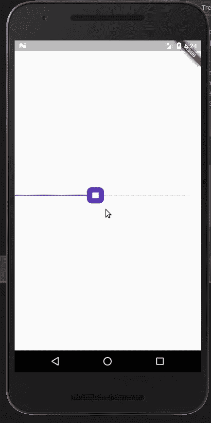
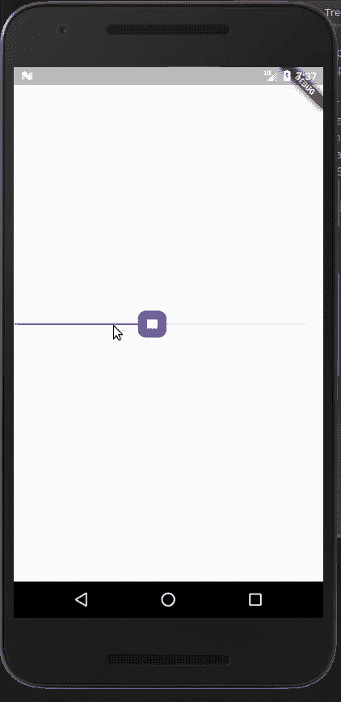

# 颤振中的自定义微调器工具提示

> 原文：<https://levelup.gitconnected.com/custom-spinner-tooltip-flutter-e3576d531488>

欢迎学习构建自定义微调工具提示的教程，

工作由 [Edge Rosalejos](https://edgerosalejos07.wixsite.com/ed-art) 完成。

你可以在 [Instagram](https://www.instagram.com/theboringdeveloper/) 上和我联系

## 让我们从看到我们的最终目标开始

**起始码** [**此处**](https://github.com/GursheeshSingh/Custom_Spinner_part_2) **。**

## 启动代码显示

让我们添加一个工具提示。

默认情况下，点击缩略图不会显示工具提示。

通过使`showValueIndicator = ShowValueIndicator.always`、*、*为所有类型的滑块显示数值指示器。

## 现在让我们看看输出

为了创建一个自定义的微调器，我们需要改变`SliderTheme`的`valueIndicatorShape` 。

`valueIndicatorShape` —将用于绘制滑块值指示器的形状。

为了创建一个定制的值指示器，我们需要创建我们自己的 shape 类并扩展`SliderComponentShape`。

## 现在让我们看看我们在上面的代码中做了什么

1.  创建了一个名为— `CircularValueShape`的类
2.  用`SliderComponentShape`扩展了上面的类
3.  创建了一个构造函数来获取值指示器的半径值、边框粗细和滑块的值。
4.  我们从`getPreferredSize()`方法返回 size，这里是`Size.fromRadius()`做的事情，*创建一个正方形[Size]，它的[width]和[height]是给定的两倍。*

现在在`paint()`方法中，我们绘制我们的值指示器。

## **首先，我们将创建一个简单的值指示器**

## 输出

## 现在让我们看看我们在上面的代码中做了什么。

1.  我们使用 context.canvas 获得画布
2.  创建一个绘制对象来绘制值指示器内部的区域，我们设置颜色和样式
3.  创建一个 paint 对象来绘制值指示器的边框，我们设置颜色、样式和 strokeWidth
4.  然后我们计算价值指示器的位置
5.  之后，我们用填充颜料在画布上画出白色的圆圈
6.  然后，我们在画布上使用 borderPaint 绘制圆形边框

## 在画图中添加文本()

## 检查输出

现在让我们看看我们在上面的代码中对前面的代码片段做了什么修改

1.  我们为值文本创建了一个文本样式
2.  我们用滑块的值创建了一个 TextSpan
3.  然后，我们创建一个 TextPainter 来绘制给定的文本。
4.  然后，我们调用 layout()，它计算用于绘制文本的字形的可视位置。
5.  现在我们使用工具提示圆的位置来计算工具提示文本的位置
6.  然后我们在画布上绘制文本。

点击查看完整项目

谢谢你坚持到最后

更多 flutter spinner 博客:

 [## 颤动-自定义微调器拇指

### 欢迎来到这个自定义微调拇指教程。

medium.com](https://medium.com/@singhgursheesh12/flutter-custom-spinner-thumb-aabd4ce43dda)  [## 颤振-自定义微调器拇指-第 2 部分

### 欢迎来到本教程，建立一个自定义微调控制滑块

medium.com](https://medium.com/@singhgursheesh12/flutter-custom-spinner-thumb-part-2-568629139df8) 

我将会发布更多关于 flutter 的消息，敬请关注:)

 [## Gursheesh Singh -印度昌迪加尔|职业简介| LinkedIn

### 查看 LinkedIn 上 Gursheesh Singh 的专业资料。LinkedIn 是世界上最大的商业网络，帮助…

www.linkedin.com](https://www.linkedin.com/in/gursheesh-singh-a66545154/)  [## 古尔希什·辛格

### 欢迎回到 Instagram。登录查看您的朋友、家人和兴趣爱好捕捉和分享了什么…

www.instagram.com](https://www.instagram.com/igursheesh/)  [## 古尔希什·辛格

### Gursheesh singh 的最新推文(@GursheeshChawla)。商业解决方案开发者| Flutter 开发者| Android…

twitter.com](https://twitter.com/GursheeshChawla)  [## GursheeshSingh -概述

### 在 GitHub 上注册您自己的个人资料，这是托管代码、管理项目和与 40…

github.com](https://github.com/GursheeshSingh)