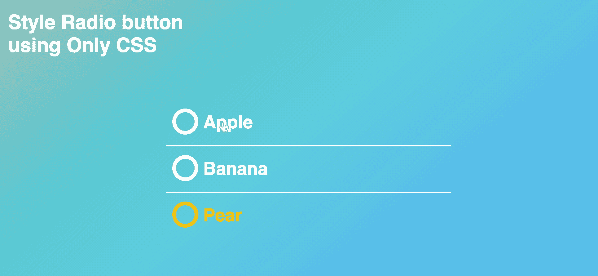
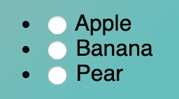
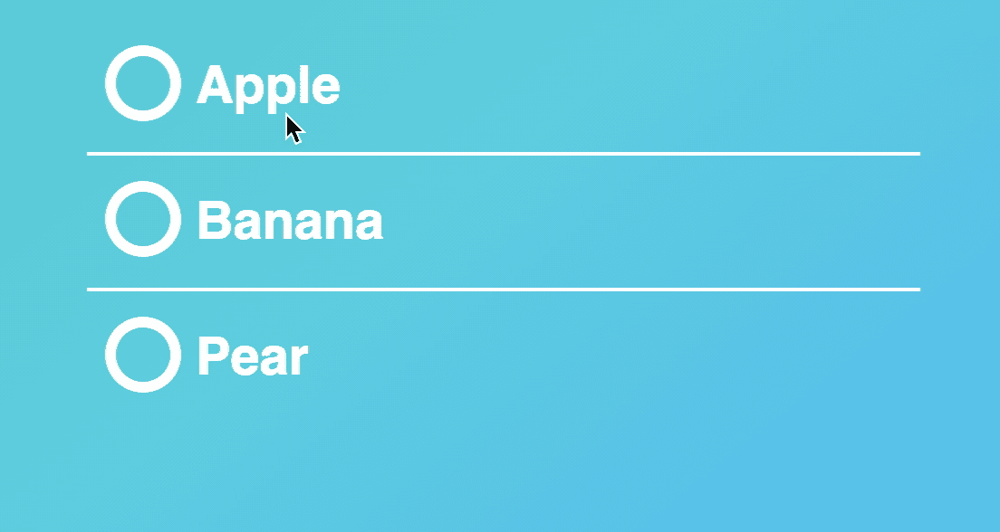
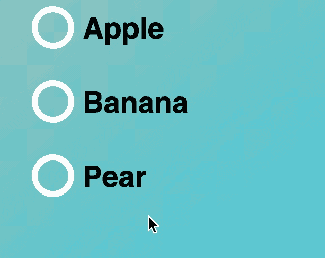
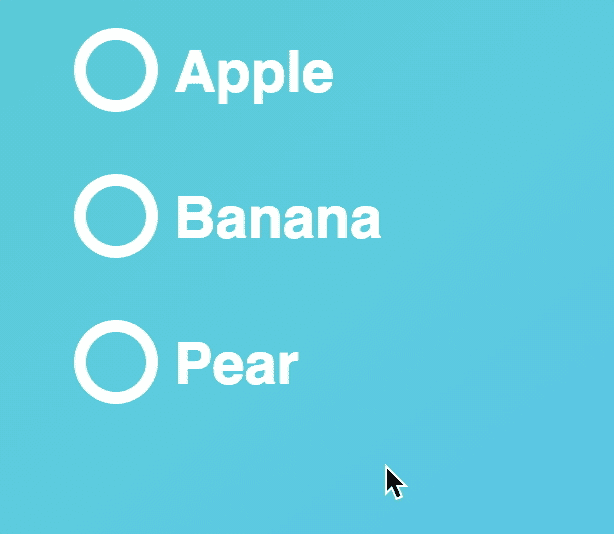
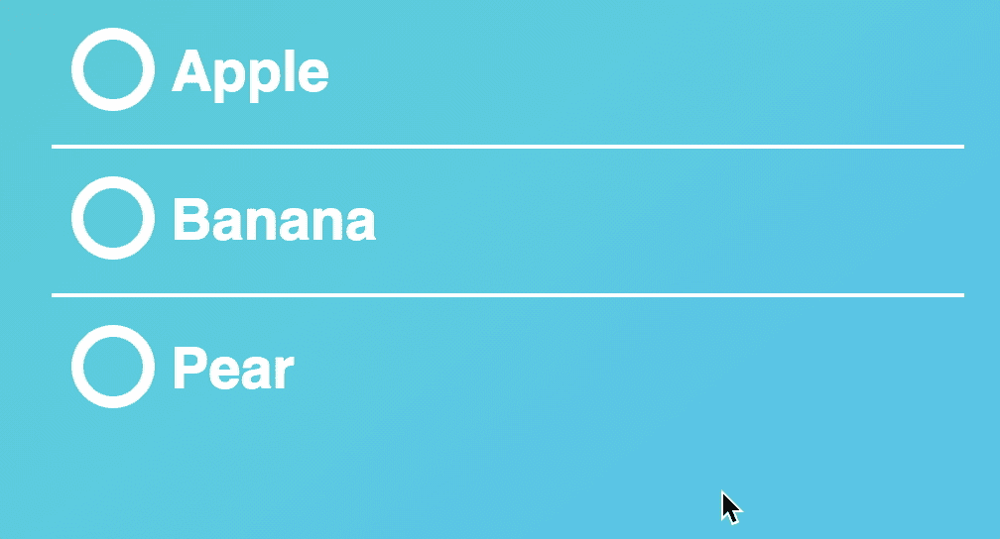

# 定制风格的无线电选择器

> 原文：<https://levelup.gitconnected.com/custom-styled-radio-selector-b0137e5af935>

关于创建自定义样式的`radio`选择器的教程。



定制风格的无线电选择器

# 一个简单的例子

作为背景，这里有一个*非样式化的* `radio`选择器。根据您使用的浏览器，它看起来会有所不同。



浏览器内置单选按钮

下面是同样的`radio`选择器，只用 CSS 直接样式化。



自定义样式的单选按钮

# 第一步:基本外观

## HTML 标记

让我们开始使用*无序列表*制作一个默认 HTML 单选按钮列表:

```
<div class="radiogroup">
  <ul>
    <li>
      <label class="control control-radio" for="1">
        <input type="radio" id="1" name="fruit" value="apple">
        <span>Apple</span>
        <div class="control-indicator"></div>
      </label>
    </li>
    <li>
      <label class="control control-radio" for="2">
        <input type="radio" id="2" name="fruit" value="apple">
        <span>Banana</span>
        <div class="control-indicator"></div>
      </label>
    </li>
    <li>
      <label class="control control-radio" for="3">
        <input type="radio" id="3" name="fruit" value="pear">
        <span>Pear</span>
        <div class="control-indicator"></div>
      </label>
    </li>
  </ul>
</div>
```

请注意，在每个单选按钮的末尾有一个空的 div `<div class="control-indicator"></div>`，它将用于定制单选按钮的显示样式。

## CSS

项目符号是*无序*列表中的默认显示。所以，你需要确保`list-style: none;`被设置在你的*无序*列表中。

```
.radiogroup ul {
  *list-style*: none;
}
```

我们还需要隐藏浏览器内置的单选按钮显示。让我们用`opacity: 0`来做这件事

```
.control input {
  *position*: absolute;
  *opacity*: 0;
}
```

下一步，我们的计划是如下设计单选按钮的样式:


自定义单选按钮

注意有

*   一个 ***外圆边框，*** 用来表示可用的单选按钮
*   以及一个 ***内圆，*** 用于表示被选中的选择。

对于外圆边框，让我们使用`.control-indicator`和`border-radius: 50%`的技巧

```
.control-indicator {
  position: absolute;
  top: 14px;
  left: 10px;
  height: 30px;
  width: 30px;
  background-color: transparent;
  border: 6px solid #ffffff;
  **border-radius: 50%;**
}
```

对于内圈来说，还是用`.control-indicator:after`同招`border-radius:50%`

```
.control-indicator:after {
  content: '';
  position: absolute;
  display: block;
  left: 5px;
  top: 5px;
  height: 20px;
  width: 20px;
  **border-radius: 50%;**
}
```

这是所选选项的 CSS。注意，CSS 选择器`~`用于选择`input:checked`之前的`.control-indicator`

```
.control input:checked ~ .control-indicator {
  border-color: #c0392b;
}
.control input:checked ~ .control-indicator:after {
  background-color: #c0392b;
}
```

现在，您应该能够看到如下效果:



自定义样式单选按钮的基本外观

# 步骤 2:添加悬停和聚焦效果

`:hover`选择器用于在鼠标悬停在元素上时选择元素。`:focus`选择器用于选择具有焦点的元素。让我们在`color`、`background-color`和`border-color`上使用过渡效果`0.3s ease`来设计悬停和聚焦效果。

```
.control span {
  color: #ffffff;
  **transition: color 0.5s;**
}.control-indicator {
  position: absolute;
  top: 14px;
  left: 10px;
  height: 30px;
  width: 30px;
  background-color: transparent;
  border: 6px solid #ffffff;
  border-radius: 50%;
  **transition: border-color 0.5s;**
}.control-indicator:after {
  content: '';
  position: absolute;
  display: block;
  left: 5px;
  top: 5px;
  height: 20px;
  width: 20px;
  border-radius: 50%;
  **transition: border-color 0.5s, background-color 0.5s;**
}**.control input:focus ~ span,
.control input:hover ~ span {
  color: #FBBC05;
}
.control input:focus ~ .control-indicator,
.control input:hover ~ .control-indicator {
  border-color: #FBBC05;
}**
**.control input:checked ~ span {
  color: #c0392b;
}**
.control input:checked ~ .control-indicator {
  border-color: #c0392b;
}
.control input:checked ~ .control-indicator:after {
  background-color: #c0392b;
}
```

现在，您应该能够看到这样的效果:



具有悬停和聚焦效果的自定义样式单选按钮

# 步骤 3:添加边框

最后，让我们在单选按钮之间添加一个边框

```
.radiogroup ul li {
  border-bottom: 2px solid #ffffff;
}.radiogroup ul li:last-child {
  border-bottom: 1px solid transparent;
}
```

现在，您应该能够看到完整的定制单选按钮，如下所示



完整的自定义单选按钮

# 尽情享受吧！

仅此而已。感谢阅读，以下是完整代码: