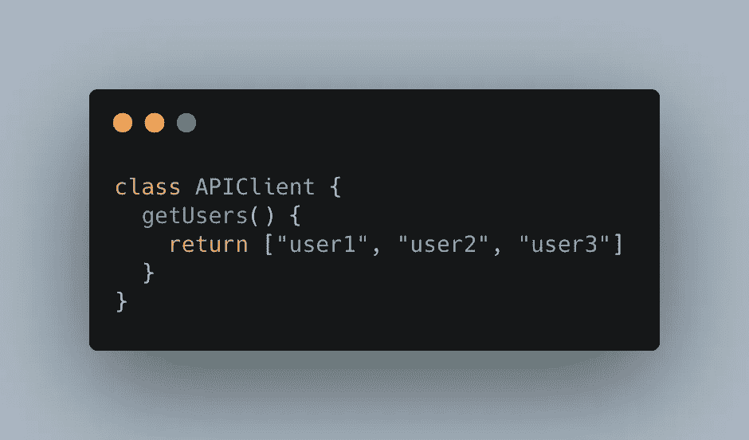

# 用装饰者定制你的类

> 原文：<https://levelup.gitconnected.com/customise-your-classes-with-decorators-11de52225505>

照片由来自 [Pexels](https://www.pexels.com/photo/computer-with-code-4218883/?utm_content=attributionCopyText&utm_medium=referral&utm_source=pexels) 的 [Paras Katwal](https://www.pexels.com/@paras?utm_content=attributionCopyText&utm_medium=referral&utm_source=pexels) 拍摄

我喜欢装修工。即使这个特性仍然没有得到官方支持，它们已经非常有用了！如果你不知道什么是装修工，我强烈建议你先准备好我的文章！

[https://level up . git connected . com/understanding-decorators-in-JavaScript-912 a05d 7a 537](/understanding-decorators-in-javascript-912a05d7a537)

decorators 的用途之一就是给你的类注入方法和属性！这基本上意味着给定一个类，您可以使用生成器在实例化或运行时操作该类中的方法和属性(取决于您是将装饰器放在方法/属性上还是放在类的顶部)

# 为什么我要这样做，而不是从一个类扩展？

好问题！有时候，从一个类中扩展出更多的方法可能会矫枉过正。我们可能想走另一条路，但也要保持最大的通用性。这就是装修工有用的地方！根据定义，装饰器是一个函数。所以你可能不想把它弄得太大或者过多的操作这个类，否则，继承会更好。

# 让我们准备实验吧！

> 在这里，我们要准备好所有的文件来和装饰者一起玩。

在开始之前，您可以访问[本报告](https://github.com/psyycker/decorators-class-custom)中文章的每一步，检查分支以到达您想要去的地方

我们首先要设置我们的项目。此外，由于装饰器在 Typescript 和 Javascript 之间是不同的(就像在 Babel parsed code 中一样)，我们在这里将使用 Javascript。

使用一个空文件夹和命令`npm init -y`创建一个新项目

在 package.json 中，确保 devDependencies 如下所示:

package.json

运行`npm install`来安装所有这些依赖项。

此外，您可以将此命令添加到脚本部分的 package.json 中，以运行您的应用程序:

这意味着您的主 js 文件位于 src 下

然后，我们必须设置我们的。babelrc 允许 babel 解析我们的自定义代码。

。巴伯尔克

该文件中的两个澄清。首先，关于插件提议装饰者。我们必须给它传递一个参数，否则，Babel 不会接受编译。我选择不把它放在出口之前，但那是个人的选择。我们还包含了@ babel/plugin-proposal-class-properties，允许我们在类中放置属性而不使用构造函数。

最后，为了完成所有准备工作，在 src 文件夹中创建一个 index.js 文件，其内容如下:

我们工作的良好开端！

# 装饰师如何与我们的班级互动

> 让我们理解装饰者如何与我们的类交互

如我所说，装饰器是一个函数。所以让我们创建我们的函数。我们称它为`injectHelloWorld`，目前，我们将打印第一个(也是唯一的)参数

你的室内设计师

不要忘记在你的类中使用你的装饰器，并且使用它！

使用`npm run dev`运行您的应用程序，并查看您的控制台。您应该会看到以下输出:

在装饰器中打印类时的控制台输出

这里我们有两个输入。最后一个是酒吧(没有什么大的事情发生)，但第一个是我们的装饰工作！

如果我们仔细看看，我们有种类(在我关于装饰者的文章中解释得更多)和元素，它们是类的不同元素。有一种新的我从来没有谈到过的是`field`，这是只有当你启用了巴别塔插件“@巴别塔/插件-建议-类-属性”。这意味着元素是一个类属性。

现在，如果我们决定调整这个属性呢？没有值栏，我们决定给它赋值`toto`？

为此，我们需要覆盖初始值。初始化器是赋予属性初始值的函数。如果我们现在想把它打印成一个 toString，我们将得到这样的输出:

初始值设定项的 toString()值

所以如果我们想返回`toto`(这里作为一个例子)我们必须把初始化函数改成这样:

初始化函数应该是怎样的

所以，这样做的方法基本上是改变元素 0 的初始化项。

更改该值以返回“toto”

如果您现在检查您的日志，您将会看到`bar`消失了，现在显示的是`toto`！

# 具体例子

> 这在现实生活中怎么用

让我们树立一个榜样。您是一个使用微服务的节点应用程序，您有一个特定的类来对其他服务进行 API 调用。让我们称这个类为`APIClient`，你希望这个客户端在你的每个类中自动初始化。

首先，让我们创建 APIClient 类，并在其上添加一个简单的方法。无需创建新文件！

我们的新 APIClient 类

如你所见，我们不能创建一个更简单的类。这里的目标是看看如何集成它。没必要让一切变得更复杂。

为了使我们的生活更容易，我们还将创建一个函数，在我们的元素列表中注入一个字段。

我们的助手功能

如果没有这些数据，您的应用程序很可能会崩溃。我们必须创建这个对象，然后添加我们的键和值。

最后，让我们创建我们的新装饰。我们称之为`useAPIClient` (React 开发者会喜欢这个语法的！)

我们的新装潢师

这是我们的新装潢师。它的目标是添加一个名为 apiClient 的新字段，其值是 APIClient 类的实例。

别忘了把装饰器应用到你的课堂上！

useAPIClient 应用于我们的类

向我们的类添加一个名为`printUsers`的新方法，该方法将使用 APIClient 来获取用户并打印他们。

从类中删除不需要的代码后，它应该如下所示:

我们与 printUsers 的新类

你现在可以执行你的程序了，不要忘记调用`printUsers`而不是`printFoo`，你的输出应该是用户列表！

# 结论

在本文中，我们可以看到装饰者的多种可能用法之一。还有很多！此外，我决定在这个例子中使用 OOP。但是函数式编程的用法也是多种多样的！

我希望你喜欢这篇文章！感谢您的阅读:)

雷米