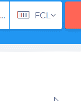
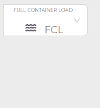
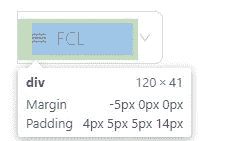
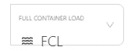
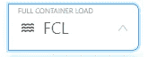
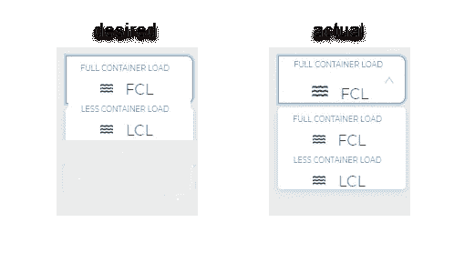
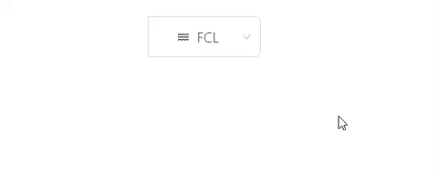

# 自定义 Ant 设计选择组件

> 原文：<https://levelup.gitconnected.com/customize-ant-design-select-component-511ab289f052>


由 [Max Duzij](https://unsplash.com/@max_duz?utm_source=unsplash&utm_medium=referral&utm_content=creditCopyText) 在 [Unsplash](https://unsplash.com/s/photos/code?utm_source=unsplash&utm_medium=referral&utm_content=creditCopyText) 上拍摄的照片

我最近回答了一个关于[堆栈溢出](https://stackoverflow.com/questions/58492391/how-to-set-custom-style-to-antd-select/58493382#58493382)的问题，一个用户试图定制他们的 Ant Design `[Select](https://ant.design/components/select/)`组件的布局/风格。下面是预期的行为。



这是实际的行为。



本质上，理想行为有三个方面。

1.  正确对齐`Select`选项中的文本
2.  菜单打开时只显示描述(即`LESS CONTAINER LOAD`)。
3.  仅显示下拉列表中当前未选中的选项。

让我们先解决造型问题。Ant Design 的 HTML 结构由许多深度嵌套的`div`、`span`等组成。具有 Ant 设计库特有的类。

下面是用户到目前为止的自定义 CSS，意在覆盖 Ant Design 的一些内置风格。

```
.ant-select-selection.ant-select-selection--single {
    border-radius: 0px 8px 8px 0px;
    height: 53px;
}

.ant-select-selection-selected-value {
    height: 53px;
    padding: 0px;
    margin: 0px;
}

.ant-select-selection__rendered {
    padding: 0px;
    margin: 0px;
}

.ant-select-dropdown-menu.ant-select-dropdown-menu-root.ant-select-dropdown-menu-vertical {
    padding: 0px;
    margin: 0px;
}

.ant-select-dropdown-menu-item {
    padding: 0px;
    margin: 0px;
}
```

他们的方向是正确的，但这还不够。首先，我们可以使用[组合子](https://medium.com/better-programming/understanding-css-combinators-a36e013b1bed)来达到那些我们需要调整样式的深度嵌套的`div`。

```
.ant-select-selection.ant-select-selection--single
> div > div > div > div + div {
   margin-top: -5px;
   padding: 4px 5px 5px 14px !important;
}
```

这段代码可以帮助我们瞄准`Select`组件的下面部分，并沿着中间更好地对齐它。



除了这个 CSS，我们还可以隐藏下拉选项的描述，直到下拉被打开。我们可以通过添加以下内容来定位/隐藏下拉列表的这一部分

```
.ant-select-selection.ant-select-selection--single 
> div > div > div > div {
    margin-top: -20px;
}
```

这将指向前一个`div`的前一个兄弟，并将其向上移出视图。没有它，我们将会像这样结束。



然而，当菜单打开时，描述应该在那里。那么我们该如何应对呢？见下文。

```
.ant-select-selection.ant-select-selection--single[aria-expanded="true"]
> div > div > div > div {
   margin-top: -10px;
}
```

当`Select`组件展开时，这将使`div`回到视图中。`[aria-expanded](https://www.accessibility-developer-guide.com/examples/sensible-aria-usage/expanded/)`属性是 Ant Design 用来传达元素的可见性可以切换的。所以上面的 CSS 目标是`div`，如果`aria-expanded="true"`应用样式，否则使用之前的 CSS。我们也可以将`aria-expanded="true"`方法应用到我们的第一个`div`中，因为我们需要调整它的边距。如果我们没有，那么它就会和前面的`div`一起被推倒。让我们添加下面的 CSS。

```
.ant-select-selection.ant-select-selection--single[aria-expanded="true"]
> div > div > div > div + div {
    margin-top: -15px;
}
```

通过减少`margin-top`,我们可以将标签拉得更靠近顶部描述，这样在显示描述的同时保持对齐。



选择被展开。

厉害！这就是我们需要的 CSS。现在我们需要解决布局的第二个需求:*只显示当前没有选择的选项*。



为了实现这一点，我们需要对 JavaScript 做一些修改。通过利用组件`state`，一个将被应用到`Select`组件的`onChange`属性的`handleChange`方法，以及对组件的渲染做一些调整，可以完成上面的布局。先说`state`。

```
this.state = {
     shipmentArr: [],
     shipmentType: {
        sea: [
          { name: "FCL", desc: "FULL CONTAINER LOAD" },
          { name: "LCL", desc: "LESS CONTAINER LOAD" }
        ],
        air: [{ name: "AIR", desc: "AIR DELIVERY" }]
     }
  };**//The user didn't appear to be using shipmentType.air for their component.**
```

`**shipmentType**`是最初提供给`Select`组件的数据。

`**shipmentArr**` 将作为`Select`组件的**新**数据，并将在`componentDidMount`中初始化。在此之前，让我们看看我们的`Select`组件。

```
<Select
    className="container-dropdown"
    onChange={this.handleChange}
    defaultValue={
      <DisplayContainer data={this.state.shipmentType.sea[0]} />
    }
>
    {this.state.shipmentArr.map(x => {
      return (
        <Option value={x.name}>
          <DisplayContainer data={x} /> 
         **{/* Aside from icon logic,** **DisplayContainer doesn't contain pertinent code and thus has been omitted in this post.*/}**
        </Option>
      );
    })}
</Select> 
```

上面的代码类似于用户的代码，除了一个关键的区别:**提供给** `**Select**`的数据。`defaultValue`是`this.state.shipmentType.sea`的第一个结果，也就是`{name: "FCL", desc: "FULL CONTAINER LOAD"}`。然后我们映射`this.state.shipmentArr`并渲染下拉选项，省略`this.state.shipmentType.sea[0]`。这就引出了我们的`onChange`函数。

```
handleChange = value => {
   var newShipmentType = this.state.shipmentType.sea.filter(x => {
      return x.name !== value;
   }); this.setState({
     shipmentArr: newShipmentType
   });};
```

这里我们设置`this.state.shipmentArr`的值等于`this.state.shipmentType.sea`，这里省略了`name`等于`value`的对象。如果`value`是`"FCL"`，这个过滤将给出结果`[{ name: "LCL", desc: "LESS CONTAINER LOAD" }]`。

因为我们用这个新信息更新状态，我们的下拉选项将重新呈现以反映新过滤的选项。这允许我们的`Select`选项保持动态，并根据当前选择的内容进行更新。这让我们回到了我们的`componentDidMount`。

```
componentDidMount = () => {
    this.handleChange(this.state.shipmentType.sea[0].name);
};
```

这里我们调用`this.handleChange`并传递给它`this.state.shipmentType.sea`中第一项的`name`。这与我们用于组件`Select`的`defaultValue`道具的`name`相同。这将允许我们的组件呈现第一个项目，然后更新`this.state.shipmentArr`以包含其他所有内容。

下面是最终结果。



我添加了`test`来确保功能足够动态，可以接受任意数量的选项。下拉选项现在风格一致**和**更新以省略用户当前选择的内容。我已经将[原始问题](https://stackoverflow.com/questions/58492391/how-to-set-custom-style-to-antd-select/58493382#58493382)和解决方案的[代码沙箱](https://codesandbox.io/s/flamboyant-goldwasser-bk393?fontsize=14)包含在我的参考资料中。

在此 *将您的免费媒体会员升级为付费会员，每月只需 5 美元，您就可以收到来自各种出版物上数千名作家的无限量无广告故事。这是一个附属链接，你的会员资格的一部分帮助我为我创造的内容获得奖励。谢谢大家！*

# 参考

[](https://stackoverflow.com/questions/58492391/how-to-set-custom-style-to-antd-select/58493382#58493382) [## 如何将自定义样式设置为 antd Select？

### 我相信我已经能够非常接近你所期望达到的目标。下面是更新后的 custom-antd.css…

stackoverflow.com](https://stackoverflow.com/questions/58492391/how-to-set-custom-style-to-antd-select/58493382#58493382) [](https://ant.design/components/select/) [## 选择蚂蚁设计

### 选择组件以从选项中选择值。

蚂蚁设计](https://ant.design/components/select/) [](https://medium.com/better-programming/understanding-css-combinators-a36e013b1bed) [## 理解 CSS 组合子

### 如何使用它们，为什么

medium.com](https://medium.com/better-programming/understanding-css-combinators-a36e013b1bed) [](https://www.accessibility-developer-guide.com/examples/sensible-aria-usage/expanded/) [## 使用 aria 可扩展的标记元素-扩展

### ARIA 提供了一个属性，该属性允许描述元素的可扩展性状态。它工作起来相当一致…

www.accessibility-developer-guide.com](https://www.accessibility-developer-guide.com/examples/sensible-aria-usage/expanded/)