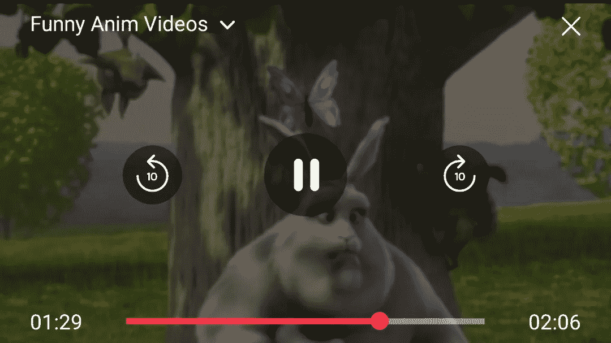
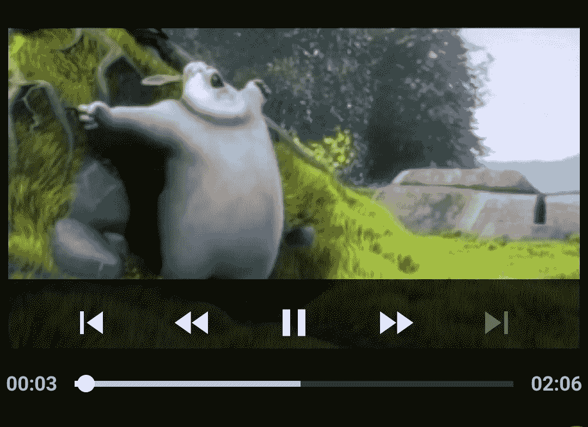
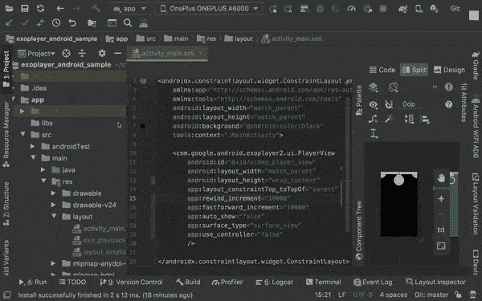
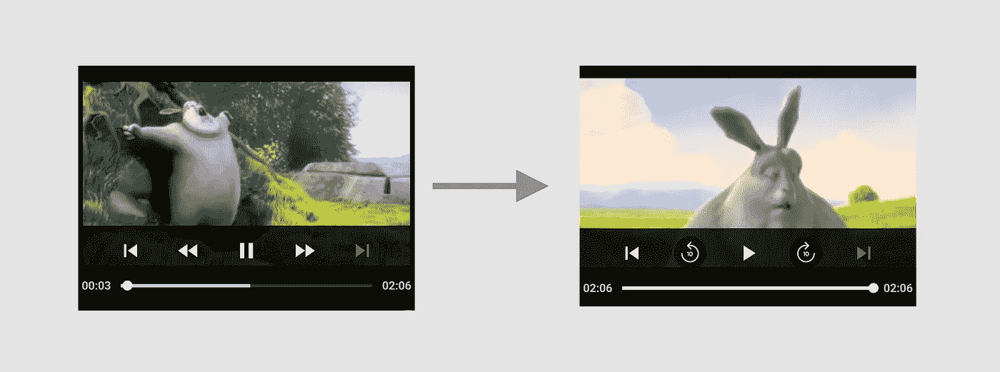
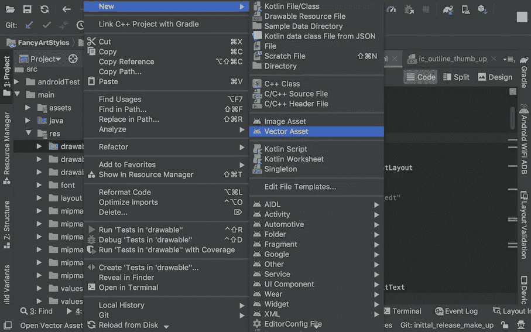
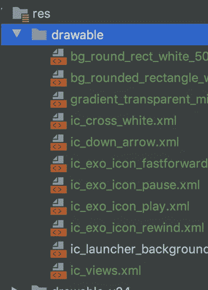

# 自定义 ExoPlayer 覆盖看起来像 Youtube 播放器

> 原文：<https://levelup.gitconnected.com/customize-exoplayer-overlay-look-like-youtube-player-14fdd6d4583d>

为 ExoPlayer 创建自定义 UI 元素



如果你还没有查看我在 ExoPlayer 上的第一部分，如什么是 ExoPlayer，我们为什么需要它和 ExoPlayer 基本集成，请查看 [Android ExoPlayer:在你的应用程序中播放视频，如 YouTube](https://medium.com/better-programming/android-exoplayer-play-videos-in-your-app-like-youtube-486853913397) ，以便在进一步阅读时更好地理解。否则，如果你有一个关于 ExoPlayer 的基本概念，你可以跳过这一步继续。

# 介绍

ExoPlayer 是运行在 Android YouTube 应用程序、网飞、Hotstar、亚马逊 Prime 等中的视频播放器。因为它是一个由谷歌维护的开源项目，有它的好处，而且它是完全免费的，Android 中的大多数播放器应用程序都使用这个 ExoPlayer。另外，另一个原因是定制默认的 MediaPlayer 很难管理，并且不支持灵活使用的许多格式。在我之前的文章中，我们讨论了 ExoPlayer 的重要性和基本用法。在这篇文章中，我们将关注如何根据我们的需求定制一个 ExoPlayer 的 UI。到本文结束时，我们应该会得到一个类似 Youtube 应用程序的用户界面。

如果你是一个代码爱好者，不想要理论，请直接在 [exoplayer_android_sample](https://github.com/pavan5208/exoplayer_android_sample/tree/feature/customizing_ui_youtube) 查看代码。代码在分支`**feature/customizing_ui_youtube**`上

# 如何自定义 ExoPlayer 的 UI？

用户界面(UI)对任何应用的成功都起着关键作用。由于每个人都喜欢在播放器应用程序上拥有自己的 UI 元素，而不是 ExoPlayer 提供的默认元素，因此它提供了非常容易地更改 UI 的灵活性。



上面的屏幕是我们在上一篇文章中实现的 ExoPlayer 在 [exoplayer_android_sample](https://github.com/pavan5208/exoplayer_android_sample) 上的基本实现的输出。上图中的 UI 元素，如播放、暂停、前进等，看起来不太好。让我们看看如何定制它们

可以用来改变视觉外观的最好和最简单的方法是重写布局文件并改变 UI 元素。我们可以简单地从基础中覆盖名为`exo_playback_control_view.xml` 的控制器布局文件，并提供我们的定制元素，或者我们可以创建一个定制布局，并将其作为值提供给`app:controller_layout_id`。但是在直接进入之前，让我们先探索一下 ExoPlayer 的一些属性。

# 自定义 ExoPlayer 属性

让我们向布局文件中的 ExoPlayer 视图添加一些属性来定制它的行为。下面是添加的几个属性的片段

让我们了解他们每一个人

`**rewind_increment**` —这是用于指定当用户点击倒带按钮时所应用的倒带持续时间的属性。持续时间以毫秒为单位。使用零来禁用倒回按钮。

`**fastforward_increment**` —这是用于指定当用户点击前进按钮时应用的前进持续时间的属性。持续时间以毫秒为单位。使用零禁用前进按钮。

`**auto_show**` **—** 该属性用于指定播放开始、暂停、结束或失败时是否自动显示控件。如果设置为 false，可以使用`[showController()](https://exoplayer.dev/doc/reference/com/google/android/exoplayer2/ui/PlayerView.html#showController--)`和`[hideController()](https://exoplayer.dev/doc/reference/com/google/android/exoplayer2/ui/PlayerView.html#hideController--)`手动操作播放控制。默认值为`true`

`**surface_type**` -该属性用于指定用于视频回放的表面视图类型。支持的值有`surface_view`、`texture_view`、`spherical_gl_surface_view`、`video_decoder_gl_surface_view`和`none`。在纯音频应用的情况下，建议使用`none`，因为创建表面的成本很高。对于视频应用，建议使用`surface_view`。注意，TextureView 只能在**硬件加速**窗口中使用。在软件中渲染时，TextureView 不会绘制任何内容。默认值将被视为`surface_view`

`**use_controller**` **—** 该属性用于指定播放控件是否可以显示。其默认值为`true`。相应的方法`[setUseController(boolean)](https://exoplayer.dev/doc/reference/com/google/android/exoplayer2/ui/PlayerView.html#setUseController-boolean-)`可以在类级别使用来操作它。

> 注意——如果`**use_controller**`设置为 false，我们需要实现定制的 UI，并为所有动作编写我们自己的逻辑，因为默认的不适用。

是的，我们已经了解了一些重要的属性，现在让我们来看看玩家用户界面的定制

# 奥弗雷丁`exo_playback_control_view.xml`

这种方法很简单。我们只需要从库中复制`exo_playback_control_view`布局文件，并将该文件粘贴到我们的布局文件夹中，并根据我们的要求更改 UI 元素。只需更改 drawable 并运行它来检查 UI 更改。

让我们看看如何到达`exo_playback_control_view`布局文件。遵循 gif 中的以下说明



现在，在复制的布局文件中更改可绘制的源，并运行以验证更改是否正确反映。我改变了前进和倒退的图标，并运行它检查下面的差异



视频位于不同的位置，但前进和后退图标发生了变化

如果没有预定义的图标集来替换，请从 Vector Asset Studio 导入所需的图标。如果你是新手，可以看看我在 [Android Vector Drawables](https://medium.com/android-dev-hacks/android-vector-drawables-bfb515ba8f2e) 上的帖子，它简要介绍了 Android Studio 中可用的 [Vector Asset Studio](https://medium.com/android-dev-hacks/android-vector-drawables-bfb515ba8f2e)



修改后的 XML 如下所示

从库中复制的文件只有两行更改

```
<ImageButton android:id="@id/exo_ffwd"
  style="@style/ExoMediaButton.FastForward"
   ** android:src="@drawable/ic_exo_icon_fastforward"**/><ImageButton android:id="@id/exo_ffwd"
  style="@style/ExoMediaButton.FastForward"
    **android:src="@drawable/ic_exo_icon_fastforward"**/>
```

现在让我们跳到提供完全定制的布局并将其附加到播放器视图的概念。

# 将 ExoPlayer 覆盖自定义为 YouTube 播放器

为此，让我们在布局文件夹中创建一个布局文件，并根据您的方便为其命名。我想把它命名为`layout_exoplayer_control_view`。

让我们按照玩家的设计把布局分成三个部分

**第 1 部分** —标题容器，它在顶部保存用于信息目的的项目，如标题、副标题、消除覆盖的十字，以及根据我们的要求的其他内容。

**Section 2** —底部容器，容纳底部的项目，如搜索栏，在覆盖图中显示当前和总时间的文本，其他内容取决于我们的要求。

**第 3 部分** —中间的容器，根据我们的要求，它包含播放器中心的项目，如播放、暂停、前进、倒带等。

预先添加所有需要的图像。我已经添加了下面的图标列表，您可以从 vector asset studio 或从我们的 [exoplayer_sample git repo 通过转移分支到](https://github.com/pavan5208/exoplayer_android_sample/tree/feature/customizing_ui_youtube) `[feature/customizing_ui_youtube](https://github.com/pavan5208/exoplayer_android_sample/tree/feature/customizing_ui_youtube)`来使用它们



将所有三个部分放在一起的最终设计布局文件如下所示

> 注意—不要更改视图的 id 或样式，否则可能会对工作产生不良影响。我知道很少的东西可以从上面修改得到一个更好的版本，但需要花更多的时间，所以你要投入更多的时间去试验

现在最后使用`**controller_layout_id**`将布局附加到玩家视图

```
<com.google.android.exoplayer2.ui.PlayerView
    android:id="@+id/video_player_view"
    android:layout_width="match_parent"
    android:layout_height="wrap_content"
    app:layout_constraintTop_toTopOf="parent"
    app:rewind_increment="10000"
    app:fastforward_increment="10000"
    app:auto_show="true"
    app:surface_type="surface_view"
    app:use_controller="true"
 **app:controller_layout_id="@layout/layout_exoplayer_control_views"**    />
```

运行并检查输出


最终实现了类似 youtube overlay 的版本。但是可以处理很多事情，比如状态维护、加载时显示进度条等等，以获得更好的用户体验，

# 摘要

暂时就这些了。我希望你学到了新东西。让我们在我即将发表的文章中检查高级状态处理、实时流处理、轮换处理等。敬请期待！

要了解更多关于科特林的信息，请查看我的帖子

*   [使用 ExoPlayer 进行流媒体播放](https://medium.com/@pavan.careers5208/kotlin-guide-for-beginners-5ba6018b5368#0)

请让我知道你的建议和意见。

你可以在 [**中**](https://medium.com/@pavan.careers5208) 和[**LinkedIn**](https://www.linkedin.com/in/satya-pavan-kumar-kantamani-61770a9b/)……

感谢阅读…