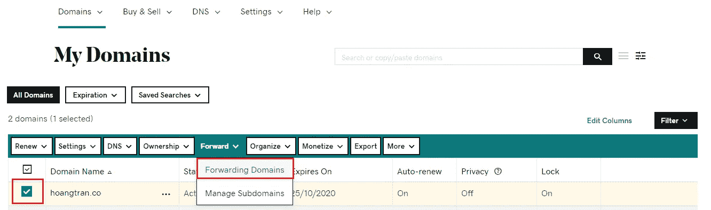
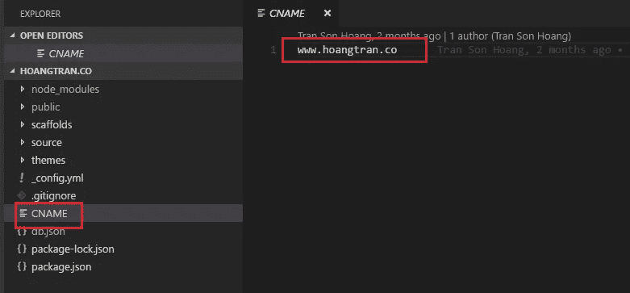

# 用 GitHub 页面创建自定义域——一小时内创建一个博客(第 3 部分)

> 原文：<https://levelup.gitconnected.com/customize-github-domain-part-3-927c645d0ce9>

## 你自己的博客

## 将 xxx.github.io 免费域名从 github 改为我们个人域名的指南

泰勒·弗兰茨在 [Unsplash](https://unsplash.com/s/photos/coffee?utm_source=unsplash&utm_medium=referral&utm_content=creditCopyText) 上的照片

在第 1 部分和第 2 部分之后，指导如何不用编码创建快速博客。

 [## 编写你的博客网站——在一小时内建立一个博客(第 1 部分)

### 关于如何创建博客、选择好的主题并将其发布到 GitHub 资源库的指南。

levelup.gitconnected.com](/setup-project-for-blog-in-fastest-way-part-1-54e6d47e2c44)  [## 为您的博客生成免费的 GitHub 域——一小时内创建一个博客(第 2 部分)

### 关于构建本地源代码的指南，部署到公共 GitHub 库，从 GitHub 获得一个免费域

levelup.gitconnected.com](/generate-free-github-domain-for-your-blog-part-2-9c284fcdc693) 

在这篇文章中，我将展示如何使用 Github 作为一个免费的主机和自定义域。

1.  购买域名
2.  配置 DNS
3.  删除 WWW
4.  添加 CNAME

在前两部分，我演示了如何在 GitHub 上建立一个博客并免费托管它。

【https://betterfullstack.com 查看 [*更多类似内容*](https://betterfullstack.com)

# 购买域名

有许多方法可以购买域名。但是在这个部分，我使用的是 [godaddy](https://my.godaddy.com/) 。

[https://my.godaddy.com/](https://my.godaddy.com/)

在那里搜索一个域名，然后购买。好的域名是:

1.  容易记住
2.  单个英语单词
3.  右域名扩展名如**。com** ，**。io** 。

# 配置 DNS

域名系统(DNS)是一种分层命名系统，它将可理解的域名转换为与 web 主机相关联的数字标识符(IP 地址)。

我会为我在 GoDaddy 上买的域名配置 DNS 到 GitHub 域。

首先，点击标题上的**用户名**。我们可以看到下面的**快速链接**和**管理域名**链接。

管理快速链接中的域

于是，我点击购买的域名。

点击域名

有时，我们至少需要**一个小时或更多**才能看到我们购买的域名显示在**我的域名**屏幕上。

现在，点击**管理 DNS。**

转到 DNS 管理页面

最后，添加一条新记录，其中**类型**为 **CNAME** ，**主持人**为 **www** ，**指向**是 **github 博客网址，**和 **TTL** 是 **1 小时。**

将 CNAME 添加到您的 github 链接

搞定了。这需要时间来发挥作用。

# 删除 WWW

现在我们有域[**https://www.hoangtran.co**](https://www.hoangtran.co/)。那么如果我们想要它而没有“www”呢？

从“我的域”屏幕中，选择域并单击转发，然后选择转发域。

转发域

现在，我把配置添加到前锋型**hoangtran.co[到**www.hoangtran.co**](http://www.hoangtran.co)**T27 与**前锋型**永久型。****

添加转发配置

# 添加 CNAME

现在我们需要一个 **CNAME** 文件在源代码中如下所示:

在源代码中添加 CNAME

然后，当我们构建源代码时，你会在**公共**文件夹中看到一个 **CNAME** 文件。

当我们构建源代码时，CNAME 文件将被克隆到公共文件夹中

恭喜你！我们已经尽力了。从新的领域享受你的网站。

# 摘要

本文是如何将 GitHub 域更改为自定义域的分步指南。我们还将学习如何使用 [GoDaddy](https://my.godaddy.com) 上的**转发**功能从域中删除 **www** 。

本文将不包括源代码，因为我没有钱购买一个新的域来制作教程，所以我决定使用我的个人博客中的配置。

我希望这篇文章对你有用！你可以在[媒体](https://medium.com/@transonhoang?source=post_page---------------------------)上关注我。我也在[推特](https://twitter.com/transonhoang)上。欢迎在下面的评论中留下任何问题。我很乐意帮忙！

 [## 故事-更好的全栈

### 关于 JavaScript、Python 和 Wordpress 的有用文章，有助于开发人员减少开发时间并提高…

betterfullstack.com](https://betterfullstack.com/stories/)