# 自定义颤振中的英雄动画(第 1 部分)

> 原文：<https://levelup.gitconnected.com/customize-hero-animation-flutter-83f6a35c79d4>

欢迎来到这个在 Flutter 中定制英雄动画的教程

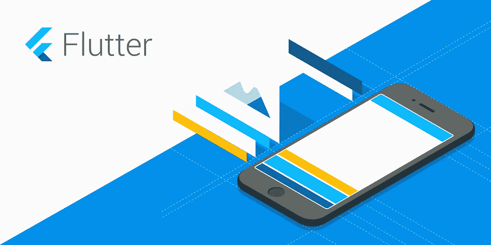

你可以在 [Instagram](https://www.instagram.com/theboringdeveloper/) 上和我联系

## 让我们从看到我们的最终目标开始

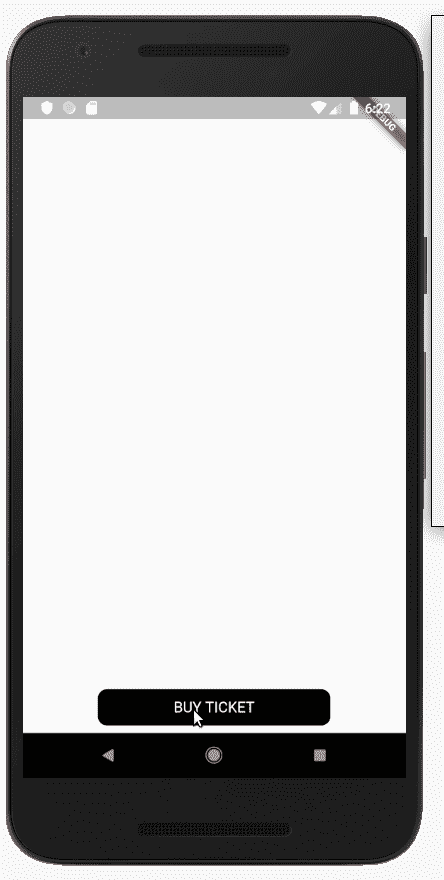

现在你可能认为创作这样的动画会让用户感到沮丧，是的，你是对的。

我放慢了动画的速度，这样我们可以很容易地理解我们的目标。
我们可以通过改变 ***时间膨胀*** 来减缓应用程序中的动画速度

更多信息—[https://api.flutter.dev/flutter/scheduler/timeDilation.html](https://api.flutter.dev/flutter/scheduler/timeDilation.html)

```
@override
Widget build(BuildContext context) {
 timeDilation = 7.0;
 return MaterialApp(
     title: ‘Customize Hero Demo’,
     home: Screen1(),
 );
}
```

现在让我们看看发生了什么:

1.  点击按钮时，文本立即消失(不重要)
2.  点击按钮时，圆形按钮的宽度开始减小
3.  如果我们仔细观察，我们会发现按钮的圆度开始增加
4.  现在宽度减小，圆度增加，直到我们得到一个圆
5.  得到圆后，圆的半径开始增加
6.  圆圈将自身转换为下一个屏幕(屏幕 2)的背景

以下是在屏幕 1 上显示一个按钮的启动代码:

屏幕 1.dart

主.镖

上面代码的输出:

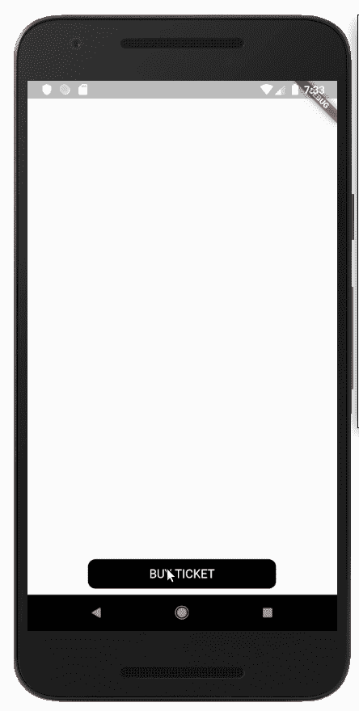

添加动画后:

屏幕 1.dart

上面代码的输出:


我们已经完成了步骤 1 到 4。

屏幕 2 的代码:

上面代码的输出:

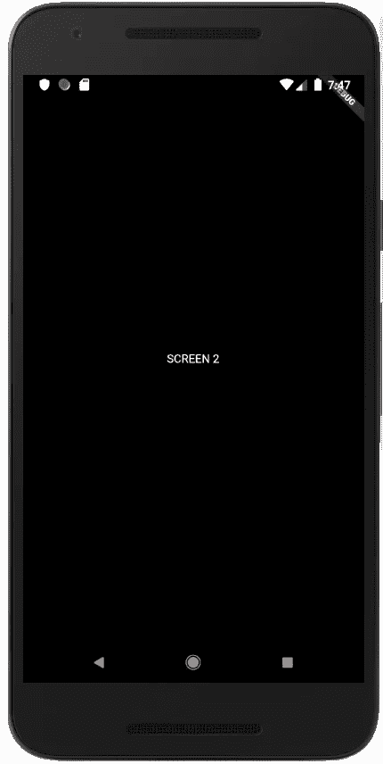

现在，在按钮动画完成后，我们需要从屏幕 1 导航。

我们在 *initState()中添加以下代码片段:*

```
_controller.addStatusListener((status) {
  if (status == AnimationStatus.completed) {
    Navigator.push(
      context,
      MaterialPageRoute(builder: (context) {
        return Screen2();
      }),
    );
  }
});
```

在上面的代码中，一旦按钮动画完成，我们就导航到**屏幕 2**

添加以下代码后的输出:

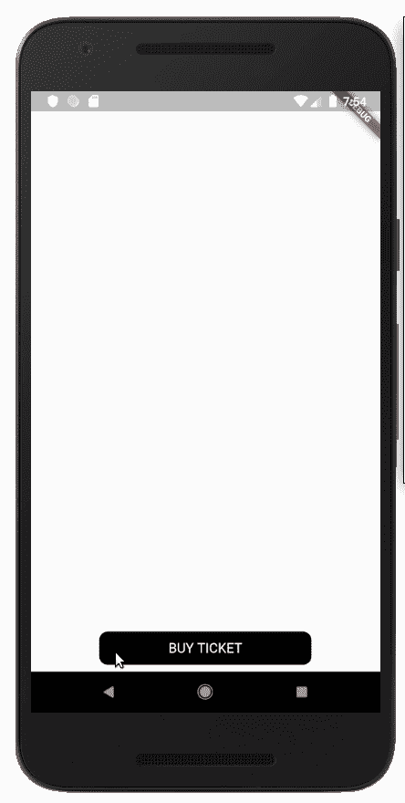

现在让我们在两个屏幕中都添加英雄。

在屏幕 1 中

```
child: Hero(
  tag: 'blackBox',
  child: Container(
    width: _widthAnimation.value,
```

在屏幕 2 中

```
return Material(
  child: Hero(
    tag: 'blackBox',
    child: Container(
      color: Colors.black,
```

更改后的输出:

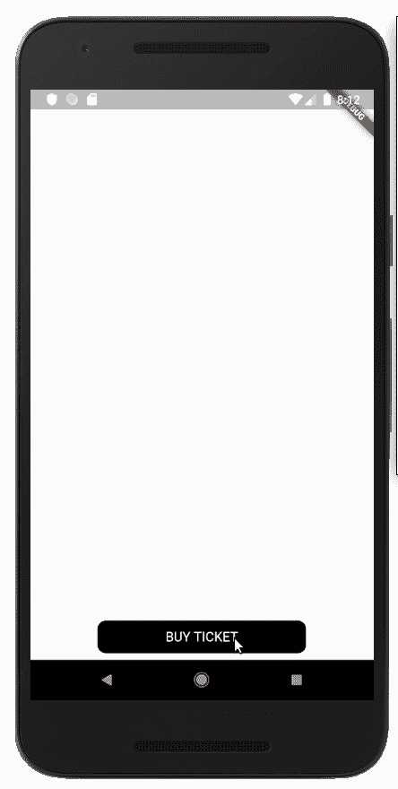

我们可以清楚地看到，标准的英雄动画并没有给我们最终的目标。

## **关键注意事项-**

1.  我们需要的是

> 得到圆后，圆的半径开始增加

如果我们仔细注意，我们可以看到在圆形动画完成后，圆形突然转变为矩形，然后开始扩展。

2.一个不太明显的观察是

在动画过程中，矩形的中心向屏幕中心移动。

如果我们仔细观察最终目标，我们可以看到，随着圆的增长，圆心保持不变。

## **我们需要把问题分解成**

1.  将矩形展开转换为圆形展开
2.  在膨胀过程中，中心应该保持不变

## 现在让我们看看 Hero 小部件的属性

[***createRectTween***](https://api.flutter.dev/flutter/widgets/Hero/createRectTween.html)→定义目的地英雄的边界在从起始路线飞到目的地路线时如何变化。

当英雄飞行时，它的矩形边界使用英雄的`[createRectTween](https://api.flutter.dev/flutter/widgets/CreateRectTween.html)`属性中指定的[补间<矩形>、](https://api.flutter.dev/flutter/animation/Tween-class.html)来设置动画。默认情况下，Flutter 使用[materialcrectartween，](https://api.flutter.dev/flutter/material/MaterialRectArcTween-class.html)的一个实例，它沿着一条弯曲的路径为矩形的对角设置动画。

[***flight shuttle builder***](https://api.flutter.dev/flutter/widgets/Hero/flightShuttleBuilder.html)→可选覆盖提供一个在英雄飞行过程中显示的小部件。

[***Placeholder builder***](https://api.flutter.dev/flutter/widgets/Hero/placeholderBuilder.html)→一旦航班起飞，占位符小部件作为英雄的[子](https://api.flutter.dev/flutter/widgets/Hero/child.html)留在原地。

## 从上面的定义，我们可以得出结论-

1.  问题一可以使用***flight shuttle builder***解决，方法是显示将默认的矩形扩展改为圆形扩展
2.  问题二可以通过***createRectTween***解决，保持中心不变

# 让我们先解决问题二

在 Screen2 类中添加此方法

```
static RectTween _createRectTween(Rect begin, Rect end) {
  return CircularRectTween(begin: begin, end: end);
}
```

让我们实现这个类

现在我们需要从 ***lerp【双 t】****，*返回一个 Rect，它指定了主人公的位置和界限。

我们将使用返回 Rect

```
Rect.fromCircle(center: , radius: );
```

我们会保持中心不变，随着 ***t*** (我们可以把 ***t*** 看成时间)的增加而增加半径。

***begin*** 和***end****Rect 参数包含关于英雄动画前后小部件的信息。*

*我们将使用 ***begin*** 来计算英雄动画开始时的中心。*

```
*double startWidthCenter = begin.left + (begin.width / 2);
double startHeightCenter = begin.top + (begin.height / 2);*
```

*现在我们可以回来了，*

```
*return Rect.
fromCircle(center: Offset(startWidthCenter, startHeightCenter), radius: );*
```

*现在让我们给它一个恒定的半径，看看会发生什么。*

```
*return Rect.
fromCircle(center: Offset(startWidthCenter, startHeightCenter), radius: 100);*
```

*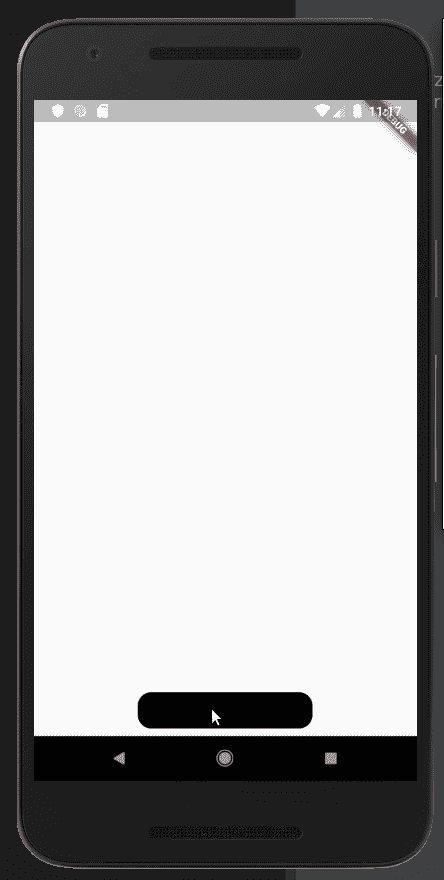*

*我们成功地给了动画一个恒定的中心。*

*现在我们需要逐渐增加半径。*

*我们可以在英雄动画结束时使用*

```
 *end.width*
```

*为了得到 ***t*** 处的宽度，我们使用*

```
*final double width = lerpDouble(begin.width, end.width, t);*
```

*在这个 ***的值中，begin.width*** 和 ***end.width*** 将保持不变，但是 ***t*** 的值将增加，据此我们将得到一个持续增加的宽度。*

*让我们更新 ***lerp(双 t)****

```
*@override
Rect lerp(double t) {
  final double width = lerpDouble(begin.width, end.width, t);
  double startWidthCenter = begin.left + (begin.width / 2);
  double startHeightCenter = begin.top + (begin.height / 2);

  return Rect.fromCircle(center: Offset(startWidthCenter, startHeightCenter), radius: width);
}*
```

*现在的输出:*

*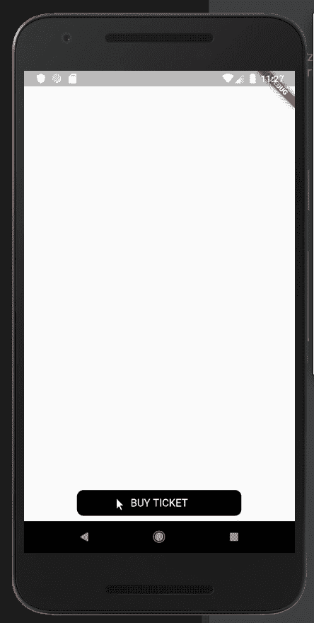*

*现在我们可以看到，半径很好地增加了，但最终仍然没有填满整个屏幕，所以我们将做出改变。*

```
*return Rect.fromCircle(center: 
Offset(startWidthCenter, startHeightCenter), radius: width * 1.7);*
```

*立即输出:*

*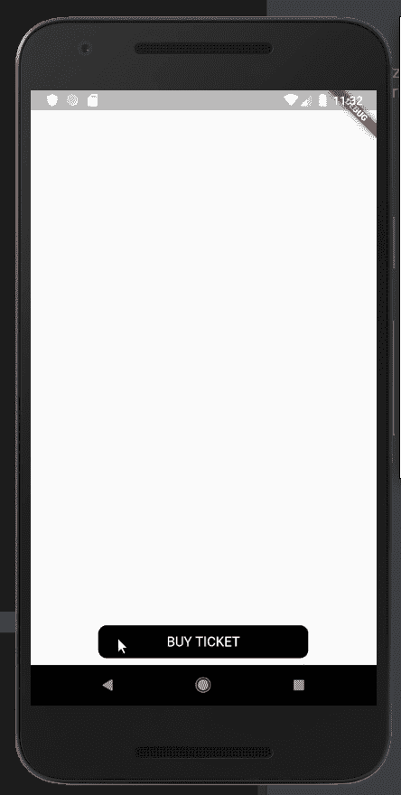*

> *暂时忽略过渡期间的屏幕 2 文本。*

*现在我们已经部分解决了问题 2 和问题 1。*

*然而，我们仍然需要确保我们得到的是圆形展开，而不是矩形展开。*

# *问题一解决方案-*

*我们需要使用 Screen1 上的***flight shuttle builder***属性。*

*让我们在***flight shuttle builder***中返回一些东西，看看它实际上做了什么*

*立即输出:*

*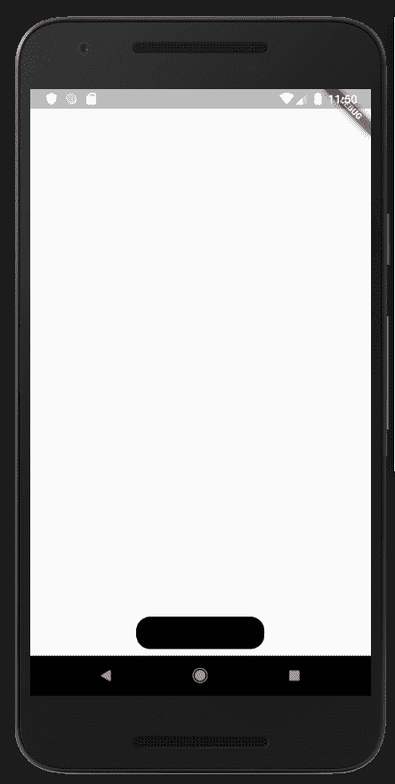*

*让我们把形状改成圆形*

```
*return Container(
  decoration: BoxDecoration(
    color: Colors.black,
    shape: BoxShape.circle,
  ),
);*
```

*注意:我们不能同时指定颜色和装饰。*

*现在让我们看看输出*

*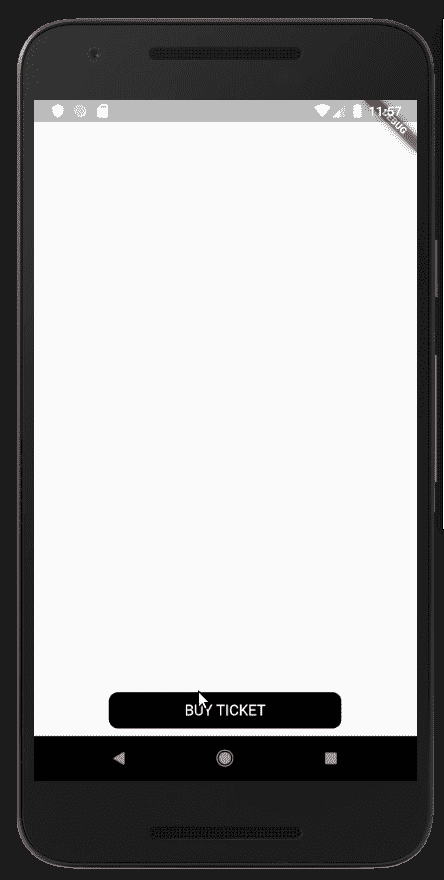*

*我们还修复了屏幕 2 的文本。*

*以下是结果文件:*

*更多有用的资源-*

1.  *[https://medium . com/flutter-community/a-deep-dive-into-hero-widgets-in-flutter-d 34f 441 EB 026](https://medium.com/flutter-community/a-deep-dive-into-hero-widgets-in-flutter-d34f441eb026)*
2.  *[https://flutter . dev/docs/development/ui/animations/hero-animations](https://flutter.dev/docs/development/ui/animations/hero-animations)*

*我将会发布更多关于 flutter 的消息，敬请关注:)*

 *[## Gursheesh Singh -印度昌迪加尔|职业简介| LinkedIn

### 查看 LinkedIn 上 Gursheesh Singh 的专业资料。LinkedIn 是世界上最大的商业网络，帮助…

www.linkedin.com](https://www.linkedin.com/in/gursheesh-singh-a66545154/)*  *[## 登录* Instagram

### 欢迎回到 Instagram。登录查看您的朋友、家人和兴趣爱好捕捉和分享了什么…

www.instagram.com](https://www.instagram.com/igursheesh/)*