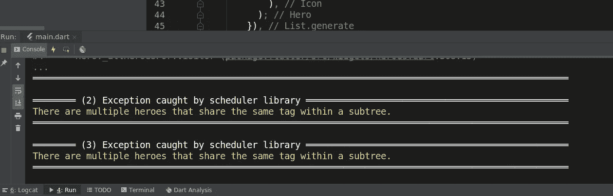
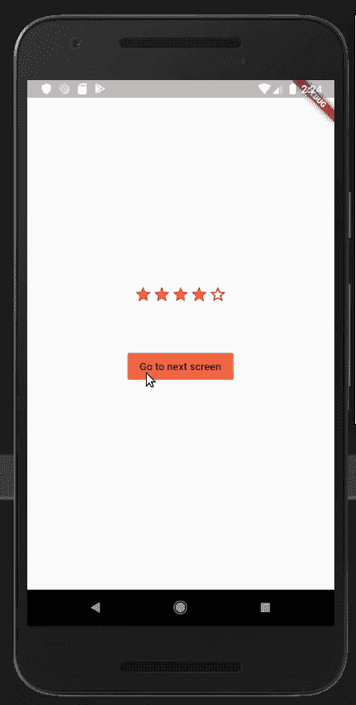
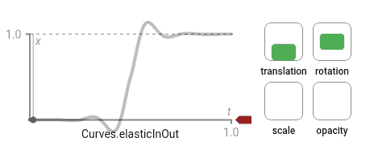
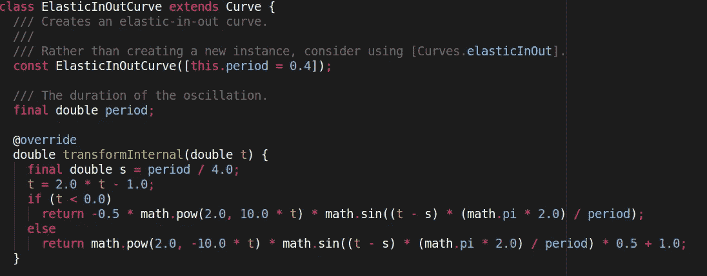
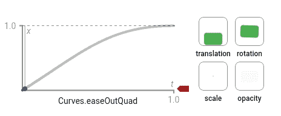

# 自定义抖动中的英雄动画(第二部分)

> 原文：<https://levelup.gitconnected.com/customize-hero-animation-part-2-flutter-4a5b67ee2037>

欢迎来到这个在 Flutter 中定制英雄动画的教程——第 2 部分。

查看第一部分来看看不同的英雄动画实现。


你可以在 [Instagram](https://www.instagram.com/theboringdeveloper/) 上和我联系

## 让我们从看到我们的最终目标开始


现在让我们看看发生了什么:

1.  点击按钮时，我们从*屏幕 1* 导航到*屏幕 2*
2.  在屏幕导航期间，使用 Hero 小部件将星星动画显示到新的位置

下面是启动代码:

## 上面代码的输出:


## 现在让我们添加英雄小部件

在这里，我们需要在每个星形图标周围添加英雄小部件

```
children: List.generate(5, (index) {
  return Hero(
    tag: 'ratingStar',
    child: Icon(
      index < rating ? Icons.star : Icons.star_border,
      color: kCoolOrange,
      size: size,
    ),
  );
}),
```

## 现在让我们检查输出:


# 我们有麻烦了。

让我们检查一下控制台-



所以看起来标签在子树中共享相同的标签名。

让我们试着给每个英雄分配一个不同的标签。

```
children: List.generate(5, (index) {
  return Hero(
    tag: 'ratingStar$index',
    child: Icon(
      index < rating ? Icons.star : Icons.star_border,
      color: kCoolOrange,
      size: size,
    ),
  );
}),
```

现在，标签名称将为 ratingStar0、ratingStar1、ratingStar2、ratingStar3、ratingStar4。

## 让我们检查输出:



然而，我们不能正确地看到过渡，所以让我们放慢它。

[](https://stackoverflow.com/questions/53727361/how-to-change-speed-of-a-hero-animation-in-flutter) [## 如何在抖动中改变英雄动画的速度

### 我不认为实现这一点的唯一方法是通过改变 PageRoute 转换持续时间。我认为你可以…

stackoverflow.com](https://stackoverflow.com/questions/53727361/how-to-change-speed-of-a-hero-animation-in-flutter) 

我们将进行以下更新

```
Navigator.push(
  context,
  PageRouteBuilder(
    transitionDuration: Duration(seconds: 2),
    pageBuilder: (_, __, ___) => Screen2(),
  ),
);
```

它减缓了页面转换的速度。

## 现在让我们检查输出:


看起来不错，但不是我们想要的。

## 我们想要什么？

1.  我们希望恒星快速启动，然后减速
2.  左边的星星应该比右边的快

# 让我们解决这个问题

> 你可以跳过这一部分，如果你看我以前的博客[这里](https://medium.com/@singhgursheesh12/customize-hero-animation-flutter-83f6a35c79d4)

## 现在首先让我们看看 Hero 小部件的属性-

[***creatercttween***](https://api.flutter.dev/flutter/widgets/Hero/createRectTween.html)→定义目的地英雄的边界在从起始路线飞到目的地路线时如何变化。

当英雄飞行时，它的矩形边界使用英雄的`[createRectTween](https://api.flutter.dev/flutter/widgets/CreateRectTween.html)`属性中指定的[补间<矩形>、](https://api.flutter.dev/flutter/animation/Tween-class.html)来制作动画。默认情况下，Flutter 使用[material rectartween，](https://api.flutter.dev/flutter/material/MaterialRectArcTween-class.html)的一个实例，它沿着一条弯曲的路径为矩形的对角设置动画。

[***flight shuttle builder***](https://api.flutter.dev/flutter/widgets/Hero/flightShuttleBuilder.html)→可选覆盖提供一个在英雄飞行过程中显示的小部件。

[***Placeholder builder***](https://api.flutter.dev/flutter/widgets/Hero/placeholderBuilder.html)→一旦航班起飞，占位符小部件作为英雄的[子](https://api.flutter.dev/flutter/widgets/Hero/child.html)留在原地。

# 从上面的定义，我们可以得出结论

我们可以通过提供我们自己的[***creatercttween***](https://api.flutter.dev/flutter/widgets/Hero/createRectTween.html)实现来解决这个问题

在 RatingBar 类中添加此方法:

```
static RectTween _createRectTween(Rect begin, Rect end) {
  return CustomRectTween(begin: begin, end: end);
}
```

## 让我们实现这个类:

```
class CustomRectTween extends RectTween {
  CustomRectTween({Rect begin, Rect end})
      : super(begin: begin, end: end) {}

  @override
  Rect lerp(double t) {
    //Add implementation here
    print(t); //Returns value from 0.0 to 1.0.
  }
}
```

现在我们需要从 ***返回一个 Rect lerp(double t)****，*其中指定了主人公的位置和界限。

我们将使用以下内容返回 Rect:

```
return Rect.fromLTWH(left, right, width, height);
```

我们将提供动画路径的左侧和右侧。

***开始*** 和 ***结束*** Rect 参数包含关于英雄动画前后的小部件的信息。

```
double height = end.top - begin.top;
double width = end.left - begin.left;
```

这里我们计算过渡完成前后的高度和宽度差。

在我们的例子中，宽度不会改变，因为我们只是垂直移动。

***t*** 的值从 0 到 1 线性增加。

让我们更改 ***lerp()*** 功能:

## 让我们检查输出:


这似乎与默认动画的工作方式完全相同，即动画以恒定速度移动。

***重要:*** 要改变平移我们需要改变方式*改变数值。*

 *[## 曲线类

### 常见动画曲线的集合。另请参阅:曲线，由可从…获得的常数实现的接口

api.flutter.dev](https://api.flutter.dev/flutter/animation/Curves-class.html)* ****

*在上图中我们可以看到 ***曲线* s** 将*的一个给定值转换成一个新值。**

**我们可以用这个来改变翻译的方式。**

**在上面的代码中，我们只使用 y 轴上的曲线来转换到一个新值。**

## **让我们看看输出:**

****

## **让我们试试其他曲线**

****

## **让我们检查输出:**

****

**我们已经解决了第一个问题，因为恒星现在开始很快，然后慢下来。**

# **让我们解决问题 2**

**右边的星星应该比左边的移动得慢**

**现在让我们修改我们的代码，让它对不同的星星使用不同的曲线。**

**我们正在分配一个基于指数的曲线。**

## **让我们检查输出:**

****

**完整的代码可在[这里](https://github.com/GursheeshSingh/HeroCustomAnimationPart2)获得。**

**谢谢你坚持到最后。**

**我将会发布更多关于 flutter 的消息，敬请关注:)**

 **[## Gursheesh Singh -印度昌迪加尔|职业简介| LinkedIn

### 查看 LinkedIn 上 Gursheesh Singh 的专业资料。LinkedIn 是世界上最大的商业网络，帮助…

www.linkedin.com](https://www.linkedin.com/in/gursheesh-singh-a66545154/)**