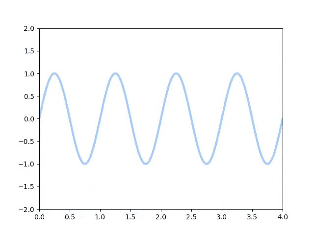

# 使用部分函数定制或扩展 Python 第三方模块

> 原文：<https://levelup.gitconnected.com/customize-or-extend-python-third-party-modules-using-partial-function-6729f738dfdf>

## 我举个例子解释一下。

# 介绍

部分函数允许我们固定函数的一些参数的值，并生成一个新的函数。部分功能的常见示例如下:

这个例子是部分函数的一个很好的开始例子，但是感觉更像是一个语法糖，而不是功能增益。当你受到你无法控制的第三方模块或代码的限制时，部分功能会大放异彩。

# 示例简介

我在摆弄 [Matplotlib 动画](https://matplotlib.org/stable/api/animation_api.html)模块，发现[保存方法](https://matplotlib.org/stable/_modules/matplotlib/animation.html#Animation.save)有一个进度回调函数。回调函数带两个参数(current_frame & total_frames)，但是一个没有文件名和经过时间之类元数据的进度条用处不大。所以我们会用*的部分功能*来增强。

动画保存功能

# 创建动画折线图

# 写入磁盘

借助部分功能创建的进度条

# 外卖食品

分部函数给你更多的控制，特别是当你在别人写的代码上添加特性的时候。

# 资源

 [## Matplotlib 动画

### 动画是展示一种现象的有趣方式。我们人类总是被动画和…

towardsdatascience.com](https://towardsdatascience.com/animations-with-matplotlib-d96375c5442c)