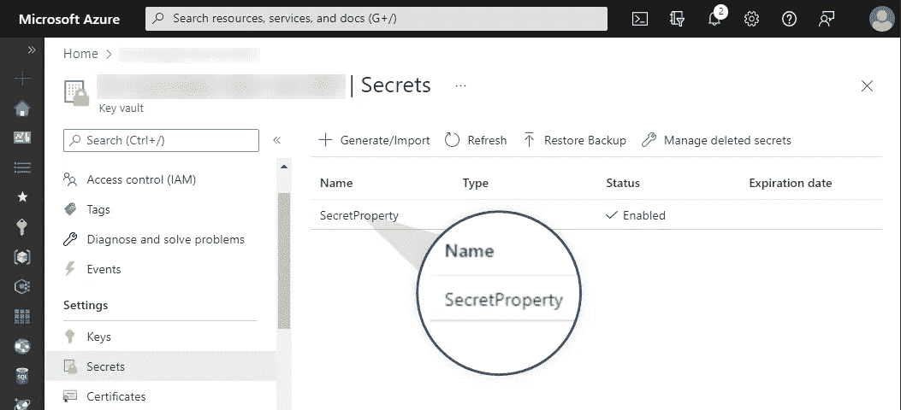
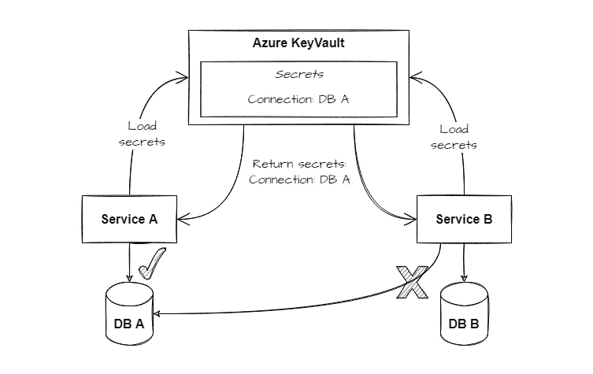
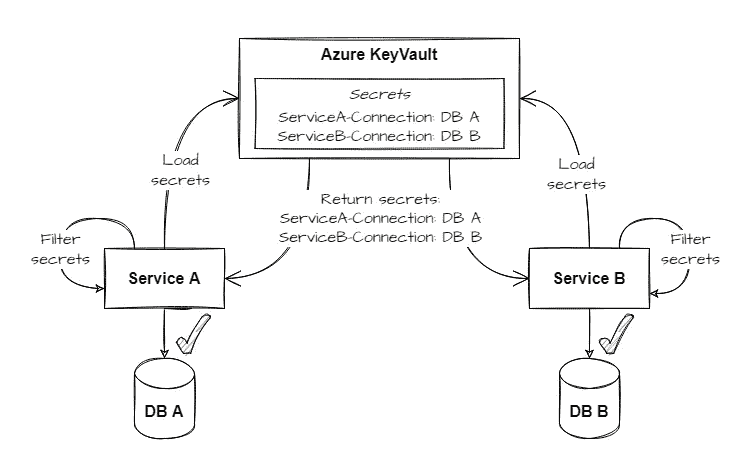

# 用 ASP 中的 Azure Key Vault 自定义秘密处理。网

> 原文：<https://levelup.gitconnected.com/customize-secret-handling-with-azure-key-vault-in-asp-net-380a676dd369>


谈论秘密(密码、令牌等)时。)，不言而喻，这种数据必须得到保护。有了 Azure Key Vault，您可以依靠托管服务来安全地管理应用程序的密钥、机密和证书。

有时，尤其是在开发基于服务的应用程序时，可能需要单独的秘密处理。在本文中，我将向您展示为什么定制的秘密处理可能与您相关，以及如何使用 ASP.NET 为 Azure Key Vault 实现它。

# 在 ASP 中使用 Azure Key Vault。网

使用 ASP.NET 开发的应用程序通常通过使用一个或多个[配置提供者](https://docs.microsoft.com/en-us/aspnet/core/fundamentals/configuration/?view=aspnetcore-6.0#cp)来使用嵌入式系统进行配置。提供者从特定的来源读取键值对，并通过统一的接口使整个配置可用。

最常见的提供者是负责处理`appsettings.json`文件的 [JSON 配置提供者](https://docs.microsoft.com/en-us/aspnet/core/fundamentals/configuration/?view=aspnetcore-6.0#json-configuration-provider)。另一个重要的提供者是[环境变量配置提供者](https://docs.microsoft.com/en-us/aspnet/core/fundamentals/configuration/?view=aspnetcore-6.0#non-prefixed-environment-variables)。顾名思义，这个提供程序从环境变量中加载设置。

```
var builder = WebApplication.CreateBuilder(args);
var app = builder.Build();

app.MapGet("/", () => "Hello World!");

app.Run();
```

上面的代码片段显示了一个最小的。默认情况下，它注册各种配置提供程序。由提供程序映射的属性根据注册顺序排列优先级。这意味着当多个配置提供程序包含相同的属性时，将使用最新提供程序的值。

> 调用栈:
> [WebApplication。CreateBuilder(…)](https://github.com/dotnet/aspnetcore/blob/00706e7699009e67f48987491a8b54820649dba5/src/DefaultBuilder/src/WebApplication.cs#L105) - > [新建 HostApplicationBuilder(…)](https://github.com/dotnet/runtime/blob/30dc7e7aedb7aab085c7d9702afeae5bc5a43133/src/libraries/Microsoft.Extensions.Hosting/src/HostApplicationBuilder.cs#L142)->-[HostingBuilderExtensions。ApplyDefaultAppConfiguration(…)](https://github.com/dotnet/runtime/blob/30dc7e7aedb7aab085c7d9702afeae5bc5a43133/src/libraries/Microsoft.Extensions.Hosting/src/HostingHostBuilderExtensions.cs#L227)
> 
> 默认配置提供者:
> JSON，用户机密，环境变量，命令行

要将 Azure Key Vault 添加为配置提供程序，我们必须首先添加 NuGet 包:

```
dotnet add package Azure.Extensions.AspNetCore.Configuration.Secrets
```

现在，我们可以添加 Azure Key Vault 作为额外的配置数据源，如下例所示:

```
using Azure.Identity;var builder = WebApplication.CreateBuilder(args);// Add Azure Key Vault as a configuration provider
// To benefit from authorization using DefaultAzureCredential,
// please install Microsoft.Identity.Web in addition.
builder.Configuration.AddAzureKeyVault(
  new Uri(builder.Configuration["KeyVaultUri"]), 
  new DefaultAzureCredential());var app = builder.Build();app.MapGet("/", () => "Hello World!");app.Run();
```

在这种情况下，我们使用如下所示的`appsettings.json`文件:

```
{
  "Logging": {
    "LogLevel": {
      "Default": "Warning"
    }
  },
  "KeyVaultUri": "https://<<key-vault-name>>.vault.azure.net/",
  "SecretProperty": ""
}
```

在我们的 Azure KeyVault 中添加了一个名为`SecretProperty`的秘密后，通过`appsettings.json`定义的值将被替换为我们的 Vault 中的值。



正如你所看到的，使用 Azure Key Vault，你的应用程序中的弹性和安全的秘密管理可以非常简单。记住这些基础知识后，我们现在可以开始定制秘密处理了。

# 为什么要自定义秘密处理？

想一个基于微服务的应用。两个服务使用一个名为的机密，该机密具有相同的密钥，但具有特定于服务的值。当两个服务现在使用相同的 Azure 密钥库时，我们必须考虑对相同密钥的服务特定值的需求。

为了使它更具体，让我们考虑下面的例子:
一个名为`Connection`的属性在两个服务中都可用，但它表示每个服务到一个单独数据库的连接。因此属性的值对于每个服务来说必须是独立的。否则，将导致错误配置，如下图所示:



在上面的例子中，我们不能在 KeyVault 中使用名为`Connection`的属性，因为我们必须覆盖不同的值。当然，我们可以使用不同的密钥名来避免这种行为。但这不是一个干净的解决方案。还好有`KeyVaultSecretManager`班。它允许我们修改秘密如何被消费和转移到应用程序配置的行为。在下一节中，我们将看一个使用前缀来区分两个服务设置的示例实现。

# 如何定制秘密处理？

Azure Key Vault SDK 已经支持注册一个`KeyVaultSecretManager`，它允许我们定制如何处理秘密。因此，secret manager 实例可以与 Azure Key Vault 注册一起传递。在下一个示例代码中，`PrefixPreferredKeyVaultSecretManager`被用作一个定制的 secret manager 实现。

```
using Azure.Identity;var builder = WebApplication.CreateBuilder(args);// Add Azure Key Vault as a configuration provider
// To benefit from authorization using DefaultAzureCredential,
// please install Microsoft.Identity.Web in addition.
builder.Configuration.AddAzureKeyVault(
  new Uri(builder.Configuration["KeyVaultUri"]), 
  new DefaultAzureCredential(),
  new PrefixPreferredKeyVaultSecretManager("ServiceA"));var app = builder.Build();app.MapGet("/", () => "Hello World!");app.Run();
```

但是`PrefixPreferredKeyVaultSecretManager`实际上是做什么的？
你会在下图中找到答案:



Azure Key Vault 现在包含两个秘密，每个秘密代表特定服务所需的值。在应用程序启动期间，所有的秘密都被加载，然后根据定义的规则进行过滤。在我们的例子中，我们使用基于前缀的方法。秘密`ServiceA-Connection`被应用于`ServiceA`，秘密`ServiceB-Connection`在`ServiceB`内使用。

现在是时候仔细看看下面代码块中显示的`PrefixPreferredKeyVaultSecretManager`实现了:

```
internal sealed class PrefixPreferredKeyVaultSecretManager : KeyVaultSecretManager
{
    private readonly string _prefix; public PrefixPreferredKeyVaultSecretManager(string prefix) => _prefix = $"{prefix}-"; public override Dictionary<string, string> GetData(IEnumerable<KeyVaultSecret> secrets)
    {
        return base.GetData(secrets)
            .GroupBy(x => x.Key.Replace(_prefix, string.Empty))
            .Select(x => new { x.Key, Value = x.OrderByDescending(y => y.Key).First() })
            .ToDictionary(x => x.Key, x => x.Value.Value);
    }
}
```

`PrefixPreferredKeyVaultSecretManager`继承自`KeyVaultSecretManager`。因此，我们可以通过覆盖方法`GetData(IEnumerable<KeyVaultSecret> secrets)`来集成到秘密加载机制中。首先，我们调用基方法来检索所有可用的秘密。假设我们在 Azure Key Vault 实例中存储了以下机密:

*   连接:回退
*   服务 a-连接:值 a
*   服务 b-连接:值 b

在第二步中，根据以下模式应用基于前缀的过滤逻辑:

1.  按密钥分组

```
- Connection
 - Connection:Fallback
 - ServiceA-Connection:ValueA
- ServiceB-Connection
 - ServiceB-Connection:ValueB
```

2.按组排序以找到前缀的正确值

```
- Connection
 - ServiceA-Connection:ValueA
 - Connection:Fallback
- ServiceB-Connection
 - ServiceB-Connection:ValueB
```

3.使用每组的第一个条目作为最终配置值

```
- Connection -> ValueA
- ServiceB-Connection -> ValueB
```

上面的方法允许我们指定特定于服务的秘密以及在没有特定于服务的秘密可用时使用的一种“回退”秘密。该方法仅代表一种可能的方式，当然，它可以进一步改进，例如通过从其他服务中移除值。但基本上，这就是在 ASP.NET 用 Azure Key Vault 实现个人秘密处理所要做的全部工作。

# 包扎

在本文中，我解释了为什么定制的秘密管理是有用的，以及如何在 ASP.NET 项目中将它与 Azure Key Vault 一起使用。`KeyVaultSecretManager`的一个示例实现展示了如何将前缀优先的方法集成为一个可能的解决方案。当然，还有很多其他的选择。所以你可以根据自己的要求找到合适的方式。

感谢您花时间阅读我的文章。😄

如果你喜欢它，并希望看到更多与编码相关的内容，请关注我的社交资料。不要犹豫，喜欢，评论或分享这篇文章。我非常感谢对这篇文章的任何反馈。

# 分级编码

感谢您成为我们社区的一员！在你离开之前:

*   👏为故事鼓掌，跟着作者走👉
*   📰查看[升级编码出版物](https://levelup.gitconnected.com/?utm_source=pub&utm_medium=post)中的更多内容
*   🔔关注我们:[Twitter](https://twitter.com/gitconnected)|[LinkedIn](https://www.linkedin.com/company/gitconnected)|[时事通讯](https://newsletter.levelup.dev)

🚀👉 [**加入升级达人集体，找到一份惊艳的工作**](https://jobs.levelup.dev/talent/welcome?referral=true)