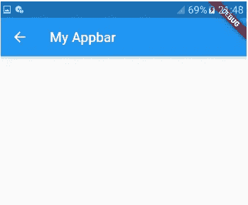

# 在 Flutter 中自定义应用程序栏

> 原文：<https://levelup.gitconnected.com/customizing-app-bar-in-flutter-29f3ea16468d>

几乎每个移动应用都使用应用栏。它为各种操作提供了快捷方便的工具，也让我们的应用程序看起来更好更一致。

在你进入应用程序栏的实际编码之前，首先你真的需要知道它的组件。应用程序栏通常包含以下组件。

-容器
-导航图标
-标题
-行动项目

# **一个带有容器和标题的简单应用程序栏**

现在让我们尝试在 Flutter 中创建一个简单的应用程序栏。我们的应用程序栏应该是这样的。

flutter 中的简单应用程序栏

好了，现在让我们进入上述代码的细节。由于 flutter 中的所有东西基本上都是小部件，所以 app bar 通常是 **Scaffold** 小部件的子小部件。Scaffold 小部件有一个名为 *appBar* 的属性，该属性将 **AppBar** 小部件作为其值。

AppBar 小部件有一个默认的容器，具有恒定的高度和宽度，以及预定义的颜色。既然我们已经定义了容器，我们可以使用 *title* 属性设置应用程序栏的标题。该属性采用一个文本小部件，并且可以使用 *centerTitle* 属性居中。

我们还可以使用文本小部件的属性来改变它的版式和装饰。 *backgroundColor* 属性用于更改应用程序栏的颜色，我们还可以使用 *elevation* 属性提升我们的应用程序栏，这使我们的应用程序栏与脚手架的主体截然不同。如果你是 web 开发领域的，那么你可以把 elevation 作为 z 轴值，里面带点阴影。

# 在我们的应用程序栏中添加导航图标

AppBar 小部件有一个名为*的布尔属性，如果为真，它会添加一个后退图标，作为 Flutter 中的后退按钮。我们还可以使用 AppBar 小部件的 *leading* 属性将任何图标或图像或任何小部件放置在标题的左侧。*

我们可以使用 *leading* 属性来放置一个导航抽屉图标，但是我们有另外一个由 Scaffold 小部件提供的简便方法。Scaffold 小部件提供了一个名为 *drawer* 的属性，该属性接收一个用于导航抽屉的 **Drawer** 小部件，它会自动在应用程序栏中放置一个导航图标。很酷吧。

# 添加行动项目

*拍拍自己，因为我们在 flutter 里已经差不多涵盖了 app bar 的基础知识。*

现在是时候定制我们的应用程序栏了，这样它也包含一些方便的功能，如通知图标，搜索图标，或标题右侧的溢出图标。你可能在大部分应用里都见过这种应用栏。

带有导航图标和操作部件的最终应用程序栏如下所示。

带有导航图标和操作小部件的应用程序栏

AppBar 小部件附带了另一个强大的属性，叫做 *actions* 。该属性接受一个小部件列表，放在应用程序栏的标题之后。在上面的例子中，我们在 actions 属性的小部件列表中放置了一个搜索图标、通知图标和溢出图标。您可以根据需要添加或删除图标。

请记住，我们应该在动作小部件列表中放置一两个图标，以使我们的应用程序栏看起来漂亮和用户友好。使用不必要的图标会导致混乱或者糟糕的 UX 设计。

*你也可以使用动作小部件列表来放置标题、导航图标或任何东西，而不使用 AppBar 的其他属性，但我打赌你不会这么做。这不必要地增加了我们的努力。*

**除了 Scaffold 的应用程序栏，Flutter 还有一个银色的应用程序栏，除了应用程序栏之外，它还有更多功能。**

你可以在这里阅读我在 Flutter 上关于导航抽屉的文章。

 [## 飘动中的导航抽屉

### 移动应用程序有不同的方法在几个屏幕之间导航，如导航抽屉、底部导航…

medium.com](https://medium.com/@bhandariaakash9/navigation-drawer-in-flutter-4fe70cbce328)