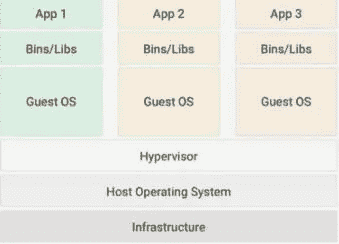
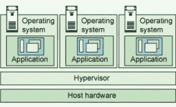
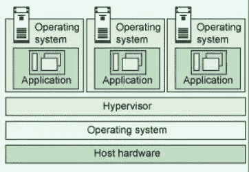
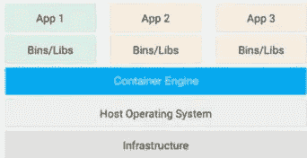

# 容器是如何出现的

> 原文：<https://levelup.gitconnected.com/d-5628b7e984dc>

在这篇博客中，我将讨论容器的概念，但首先我们必须了解这个术语是何时出现的，以及它是如何让开发人员的生活变得更容易的。

为此，我们首先必须了解容器的前身，为什么需要转换到容器，并讨论虚拟机和容器的架构。

尽管这两个术语的目标是相似的(即，将应用程序及其依赖项隔离到一个可以在任何地方运行的自包含环境中)。这意味着它可以运行在你的本地机器上，你同事的机器上，或者像 AWS 这样的云提供商的服务上。

虚拟机和容器之间的主要区别在于它们虚拟化操作系统的架构方法。

现在，我们将深入探讨他们各自的架构方法。

# **虚拟机**

虚拟机基本上为我们提供了模拟独立操作系统的能力。这意味着它允许我们在另一个操作系统中运行一个操作系统。

假设您的系统使用的是 Windows 操作系统，而您想在您的系统上运行 Linux 操作系统。在这种情况下，虚拟机开始发挥作用。事实上，一台物理服务器中可以有多个虚拟机。

我们来讨论一下它的架构:

虚拟机架构。

在上图中，有 3 个虚拟机运行在虚拟机管理程序之上。这些运行在主机操作系统上的虚拟机(**使用虚拟机管理程序**)也称为“来宾”操作系统。这些来宾操作系统包含应用程序的所有依赖项和需求。主机还向虚拟机提供资源(**，再次使用管理程序**)，比如 RAM 和 CPU。这些资源可以根据应用程序的需求进行划分。

让我们把它变得更简单:一个**虚拟机管理程序**是一个软件/固件，用于将主机操作系统的资源共享给客户操作系统，有两种类型的虚拟机管理程序。

*   **裸机虚拟机管理程序**
    这种类型的虚拟机管理程序直接与硬件连接，不需要运行主机操作系统。

来源: [IBM](https://developer.ibm.com/articles/cl-hypervisorcompare/)

*   **托管的虚拟机管理程序**
    这种类型的虚拟机管理程序是在主机操作系统上运行的软件

来源: [IBM](https://developer.ibm.com/articles/cl-hypervisorcompare/)

正如我们所知，在我们的现代世界中，我们的应用程序会占用大量资源，这迅速增加了 RAM 和 CPU 的使用，这是不经济的，这导致开发人员从虚拟机转向容器。

# **集装箱**

容器还提供了一种隔离应用程序的方法，并为应用程序的运行提供了一个虚拟平台。那么它和虚拟机有什么不同呢？

*   虚拟机提供**物理/硬件级**虚拟化，但容器提供**操作系统级**虚拟化，也称为容器化。这允许我们处理多个不使用主机设备物理资源的隔离平台。就内存和 CPU 使用而言，这是一种更有效的方法。
*   容器与其他容器共享主机的系统内核。

这两点我们来讨论一下。

容器的结构。

我认为这个图缺少一些关于管理程序的功能，有多个容器运行在一个容器引擎上。与虚拟机相比，与其他容器共享内核空间(OS)使得容器非常轻量级。

一般来说，容器由一个**容器引擎**管理，该引擎负责通过与内核通信为运行中的容器分配资源。基于容器的虚拟化使用主机操作系统的内核来运行来宾实例，也称为操作系统级虚拟化。由于 Containers 不包含 guest a OS，这意味着 container 不需要自己的操作系统。它使用较少的资源，并且只消耗启动容器时运行的应用程序所需的资源。

正如我们前面讨论的，容器与其他容器共享主机系统内核。共享操作系统资源(如库)大大减少了复制操作系统代码的需求，这意味着一台服务器可以通过一个操作系统安装运行多个工作负载。

与虚拟机相比，应用容器的优势在于:

*   体积小的
*   它们共享主机系统内核
*   开始得更快
*   与启动整个操作系统相比，它们只占用一小部分内存

但是仅仅因为容器非常受欢迎，并不意味着虚拟机过时了。如果您公司的第一要务是安全，那么您现在也会想继续使用**虚拟机**。

在现实世界中，我预计我们大多数人将在我们的云和数据中心同时运行容器和虚拟机。规模集装箱的经济意义重大，不容任何人忽视。

感谢阅读，希望你喜欢。:)