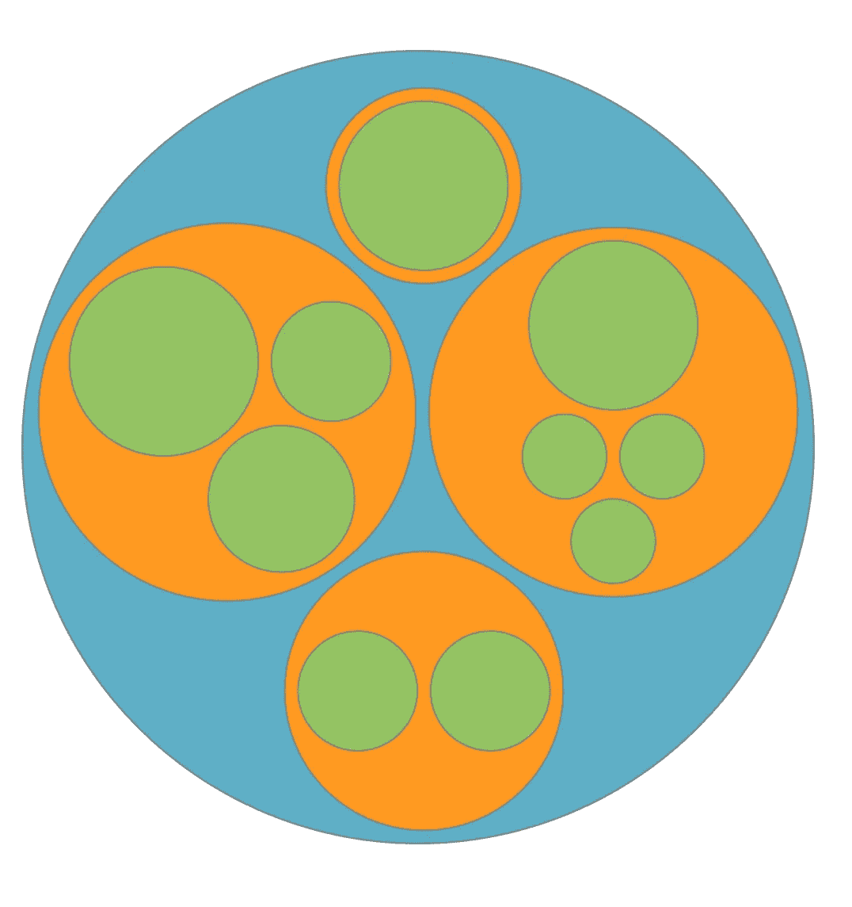
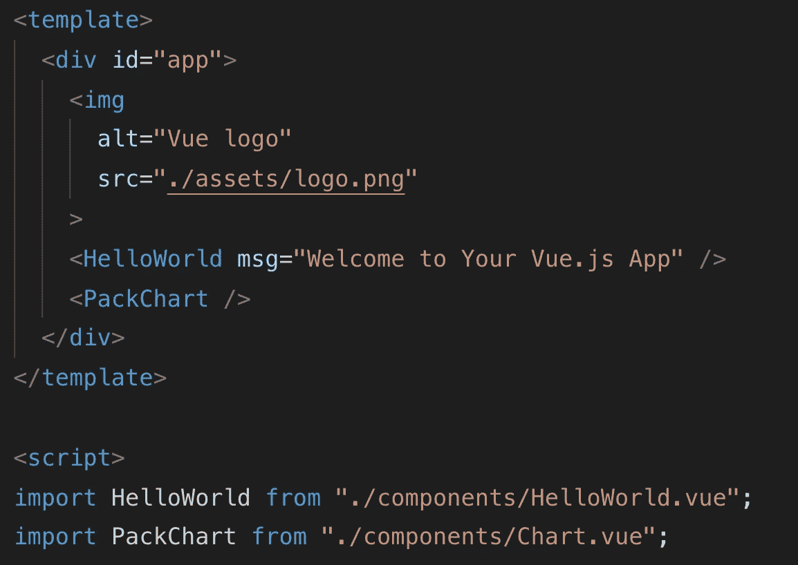
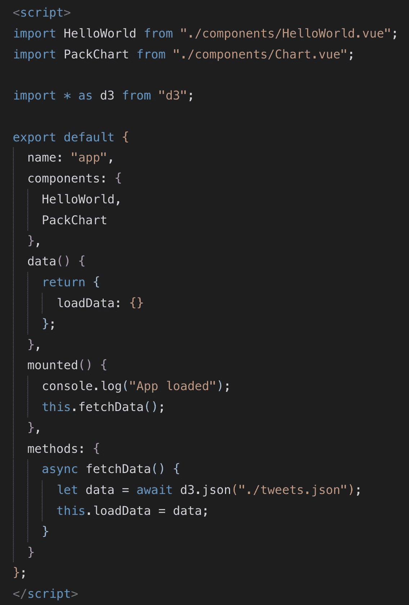
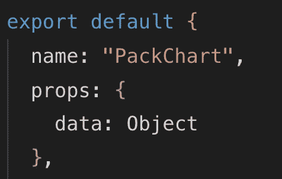
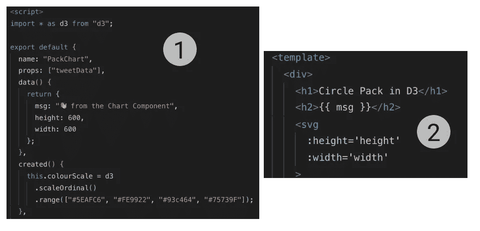
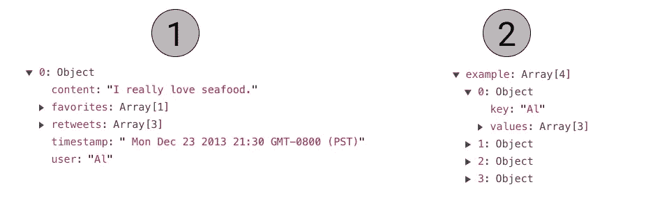
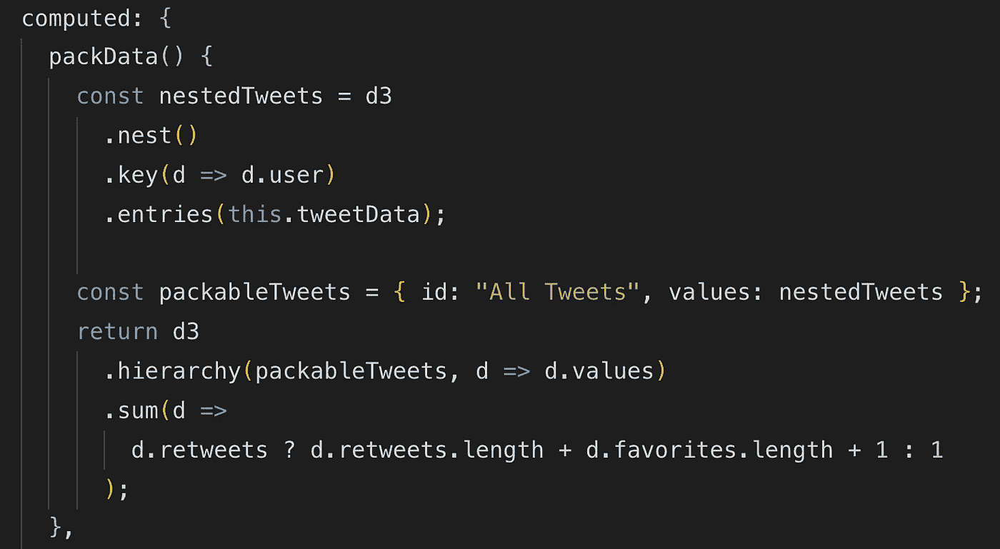
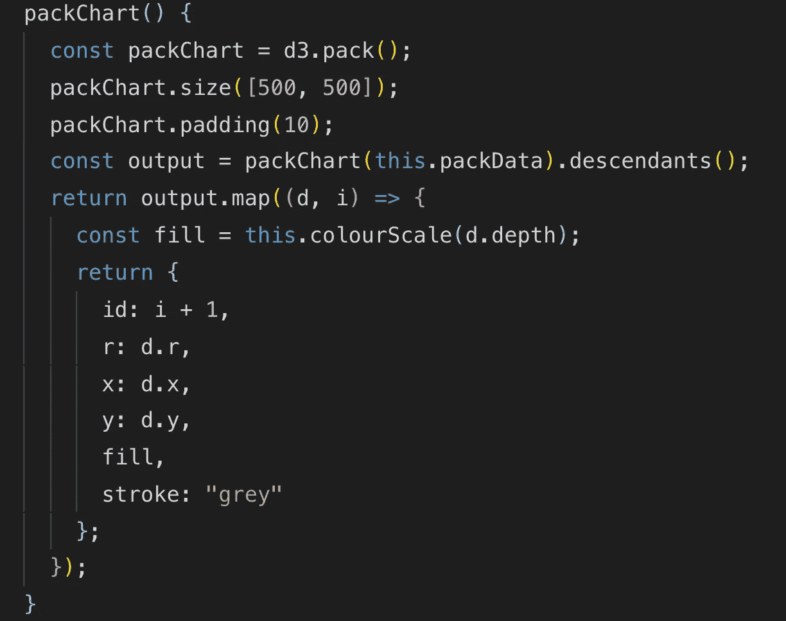
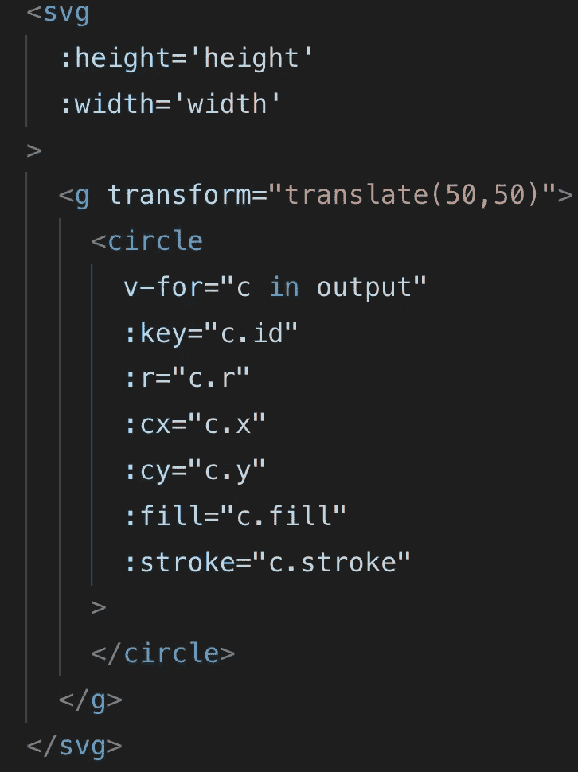

# D3.js 和 Vue。射流研究…

> 原文：<https://levelup.gitconnected.com/d3-js-and-vue-js-7a6a721eb79f>


在这篇博客中，我将描述如何将 D3 集成到 Vue.js 中。D3 是一个流行的 JavaScript 库，使用 web 标准(HTML、CSS、JavaScript 和 SVG)来可视化数据。Vue.js 是前端的[后起之秀](https://hasvuepassedreactyet.surge.sh/)，最近在 web 开发领域广受欢迎。这是一个类似 React 和 Angular 的前端框架，允许您构建可伸缩的用户界面。

> 我正在学习 D3，在过去的几个月里，我用了很多 Vue.js，我想练习一下如何将两者结合起来会很有好处。我仍然在学习和提高我的 D3 技能，所以我想如果我几个月后再看这篇文章，我会看到错误或我要改变的东西，所以请在下面的评论中强调任何问题或建议。

我从 [Elijah Meeks](https://medium.com/@Elijah_Meeks) (下图)那里借用了我为这篇博客文章重新制作的图表，他写了一本关于 D3.js 的优秀书籍，名为[“D3 . js 在行动”](https://www.amazon.com/D3-js-Action-Data-visualization-JavaScript/dp/1617294489/ref=sr_1_2?ie=UTF8&qid=1546022089&sr=8-2)。如果你想学习更多关于这个 JavaScript 库的知识，那么这应该是你的第一站(所以是的，一定要买这个)。

在第 9 章中，他写了关于集成 D3 和 React 的文章，我在 GitHub 和 B.locks 上看到了很多这种结合的好例子。但是关于集成 D3 和 Vue.js 的资源并不多。我找到了一些其他关于 Medium 的文章和一篇关于 B.locks 的文章，但是到目前为止最好的一篇文章是来自自由软件工程师和数据可视化专家 Shirley Wu 的报告。



[【圆形图】](https://andre347.github.io/d3-vue-example/)用于显示分层数据——摘自 D3js 的第 6.3.1 章

## 如何开始使用 Vue

让我们从搭建一个 Vue 项目开始——对于那些来自 React 世界的人来说，这类似于`create-react-app`。我使用的是 Vue CLI 版本 3。如果您没有安装，请运行:

```
$ npm install -g [@vue/cli](http://twitter.com/vue/cli)
```

我知道只对一个图表组件使用 CLI 有点大材小用，但是我想你会将 D3 集成到一个更大的应用程序中，你会希望使用所有的 Vue 功能。`-g`标志意味着你正在你的机器上全局安装它，所以下次你使用 Vue 时没有必要再次运行它。安装 Vue 后，是时候创建一个新项目了。在您的终端中逐一运行以下行:

```
$ vue create d3-vue-example
$ cd d3-vue-example
$ npm run serve
```

使用`npm run serve`,您将启动一个启用了“热重装”的开发服务器。这意味着，当您对几乎所有文件进行更改时，这些更改会立即显示出来。一旦你运行了这个服务器，是时候安装 D3 了。你可以这样做:

```
$ npm i --save d3
```

如果你在你最喜欢的编辑器中打开`d3-vue-example`文件夹(我使用 [VS 代码](https://code.visualstudio.com/)，然后你会看到一堆文件和文件夹列表。现在重要的是`package.json`文件在那里。这是您通过`npm`安装的所有软件包出现的地方。D3 现在也应该出现在这个`package.json`文件的依赖项下。

## 创建图表组件

对我们来说最重要的文件和文件夹都在`*src*` 文件夹中。`App.vue`是您的应用程序的主入口。在这个文件中，您希望导入您创建的所有组件。默认情况下，您在这里只能看到一个导入的组件；`HelloWorld`。该组件文件位于 components 子文件夹中。最佳做法是将所有组件放在该文件夹中。

让我们也在这个文件夹中创建一个`Chart.vue`文件。然后回到你的`App.vue`文件，复制第 9 行，用新创建的`Chart`文件替换`HelloWorld`。之后，您必须将`Chart`添加到这个文件中要导出的 JavaScript 对象的 components 属性中。下一步是在`App.vue`文件的模板部分引用该组件。



组件“PackChart”正在 App.vue 中导入并在模板中使用

好吧，如果你是前端框架和使用`npm`的新手，这可能会让你有点困惑。如果你想看完整版，可以去我的 Github 页面找源代码。

转到您的`localhost`端口 8080 (http://localhost:8080 ),在那里您将受到 Vue 默认模板的欢迎。如果你不熟悉 Vue.js，那么这个新的文件扩展名`.vue`可能看起来有点陌生。实际上，这就是 Vue 的美妙之处——在这个文件中，你可以创建自己的组件，并把所有的 HTML(模板)、JavaScript 和 CSS 放在一起。复习 Vue 的所有基础知识对这个博客来说太多了，所以我建议花点时间参加[Maximilian Schwarzüller](https://twitter.com/maxedapps?lang=en)的 Udemy 的[课程。](https://gitconnected.com/site/redirect/tutorials/2052)

## 将 D3 添加到 Vue

我倾向于在我创建的所有组件(包括`App.vue`)中导入 D3，但是最好不要这样做，只导入一次，或者只导入你需要的 API 元素。D3 模块导入的说明可在[这里](https://stackoverflow.com/questions/50606982/what-is-the-correct-way-to-import-and-use-d3-and-its-submodules-in-es6/50610922)找到。您可以在每个组件中导入 D3，方法是在 vue 文件的脚本部分的顶部引用它，如下所示:

```
import * as d3 from 'd3'
```

另一种方法是将 [CDN 链接](https://cdnjs.com/libraries/d3)包含在`index.html`文件的头部分，但是最好使用节点模块。尽管使用 CDN 方法意味着你可以在应用程序的任何地方使用它。

## 构建图表组件

如果你回到你的`App.vue`文件，那么我们将设置数据道具。 [Props](https://vuejs.org/v2/guide/components-props.html) 是您想要从父组件`App.vue`文件发送到子组件的数据，在本例中是`Chart.vue`。让我们首先创建一个数据属性，我们将在其中推送数据(我称之为`loadData`)。我们将使用米克斯书中的`tweets.json`文件——你可以在这里获得文件[。下载完成后，将文件移动到项目文件夹的 public 文件夹中。](https://github.com/emeeks/d3_in_action_2/blob/master/data/tweets.json)



当应用程序装载后，在 App.vue 中加载数据

Vue.js 有几个“生命周期”挂钩。这些与应用程序的不同“状态”相对应。在上图中，您可以看到 Vue 实例中的“mounted”属性。当应用程序加载后，它将在“数据”对象中找到的所有属性添加到其反应系统中。这意味着，如果数据发生变化，您的应用程序也会更新(它变得被动)。如果你是前端框架的新手，一开始可能会有点难以理解“状态”的概念以及元素是如何被移除和更新的。但是如果你熟悉 D3，这可能会让你想起什么。把它想象成一个完整的“进入-更新-退出”模式。



将此添加到 Chart.vue 文件中

回到安装的对象。在 D3 版本 5 中，我们必须使用承诺来加载我们的数据。这使得生活变得容易多了，因为以前你不得不使用回调，这往往变得有点混乱。在这种情况下，mounted 所做的是从 JSON 文件中加载数据，并在 DOM 被“挂载”时使其可用。之后，您需要将数据添加到我们在`Chart.vue`组件中创建的道具中(见左图)。然后将这个道具绑定到`App.vue`文件中的`Chart`组件，如下所示:

```
<PackChart :data=loadData />
```

这意味着“loadData”中的任何对象都将被推入子组件，即`Chart.vue`文件(称为 PackChart)。

> 如果你不熟悉这种处理承诺的 Async/Await 语法，那么我建议你看一下 Wes Bos 的这个演讲。

## 创建 D3 图表

`Chart.vue`文件脚本部分的第一部分包含导入 D3，返回`data`对象(带有显示在组件中的消息，以及包含图表(1)的 SVG 的`width`和`height`)。这个`width`和`height`然后被绑定到模板(2)中的 SVG。



Vue 实例的数据对象中指定的 SVG 的宽度和高度

在“创建的”生命周期钩子中，我为圆图的颜色定义了一个`scale`函数。因为我们有一组嵌套气泡列表(离散列表)作为输入，所以我们可以使用`scaleOrdinal`标度。然后，这个标度返回颜色的离散输出(我们在数组中定义的那些)。如果你想了解更多关于 D3 的不同等级，那么我推荐你去[这一页](https://d3indepth.com/scales/)。

下一步是创建一个计算属性，在该属性中我们重新构造数据，以便我们可以将它用作一个层次结构。D3 有几个有用的函数，可以帮助您为显示层次结构的图表准备数据。其中之一就是 [nest()](http://learnjsdata.com/group_data.html) 函数。这样做的目的是将一个平面结构变成一个嵌套结构(1 = > 2)。然后你可以定义如何`nest`它(哪个属性)以及嵌套多深。在我们的例子中，我使用“用户”作为顶级属性。这意味着我们的新数组包含四个对象(每个用户一个)。



使用 nest()从每个对象一个 tweet 到每个用户一个对象(tweet 作为子对象)

在这个相同的计算属性中，我使用了 hierarchy 模块。该模块获取一个根(名为 packableTweets 的新对象——见下图),并返回一个新布局。



按照之前的图像创建层次结构

为了在屏幕上实际绘制一些东西，我们需要返回一些可以绑定到模板中的 SVG 的数据。为此，我创建了另一个 computed 属性，该属性接受前一个属性(`packData()`)并返回一个 JS 对象数组，该数组包含`x` & `y`坐标和圆的半径。然后它也使用在创建的钩子中定义的`colourScale`(见下图)。



返回一个对象数组(包含圆形数据)

然后，我们可以用`v-for`指令遍历这个数组，并在视图中显示圆及其对应的`x`和`y`坐标、半径和颜色。



如果你在这里做到了，那么你已经遵循了相当多的步骤。如果你中途遇到困难，那么我建议你去我的 GitHub，克隆 [repo](https://github.com/andre347/d3-vue-example) 并检查图表[这里](https://andre347.github.io/d3-vue-example/)。我对反馈持开放态度，因为我确定我要么过于复杂，要么忽略了代码中的元素。

[](https://levelup.gitconnected.com/)[](https://gitconnected.com/learn/d3-js) [## 学习 D3.js -最佳 D3.js 教程(2019) | gitconnected

### 7 大 D3.js 教程。课程由开发者提交并投票，让你找到最好的 D3.js…

gitconnected.com](https://gitconnected.com/learn/d3-js) [](https://gitconnected.com/learn/vue-js) [## 学习 Vue.js -最佳 Vue.js 教程(2019) | gitconnected

### 27 大 Vue.js 教程。课程由开发者提交并投票，让你找到最好的 Vue.js…

gitconnected.com](https://gitconnected.com/learn/vue-js)