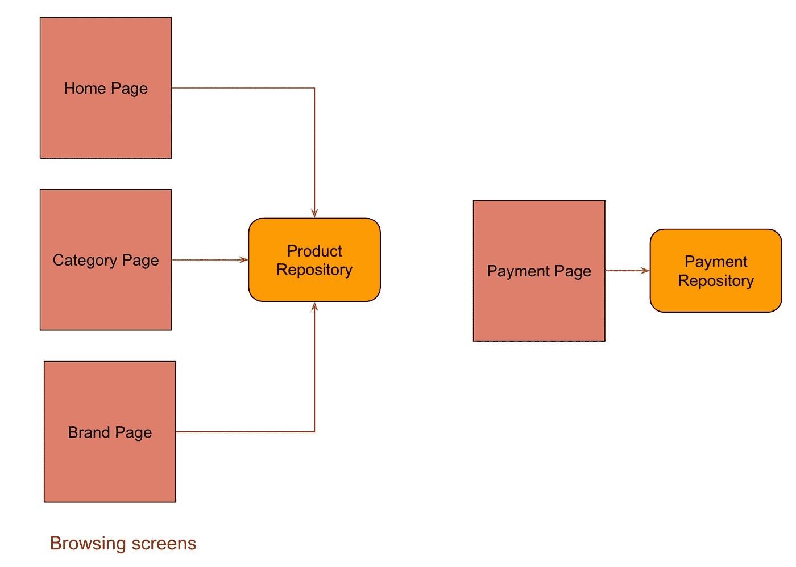
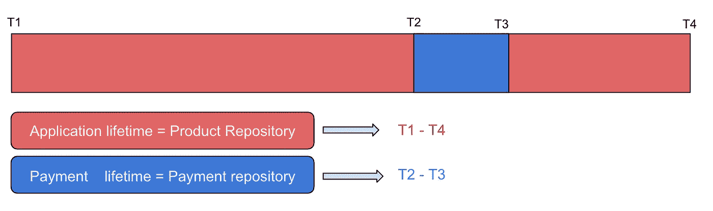

# Dagger 2 —利用范围和子组件

> 原文：<https://levelup.gitconnected.com/dagger-2-leveraging-subcomponents-and-scopes-2aef78a291c9>

克里斯·劳顿在 [Unsplash](https://unsplash.com?utm_source=medium&utm_medium=referral) 上拍摄的照片

## **范围是什么意思？**

范围是指对象的生存期。考虑一个简单类的例子。

*   `largeScope` —它的作用域与类的生存期相关联。可以在类中的任何地方访问它。
*   `smallerScope` —其范围仅限于函数的生存期。它只能在`myFunction`块中访问。在这个函数之外它是不被识别的。
*   范围意味着定义对象的生存期。

## 为什么作用域很重要，它在 Dagger 中有什么用途？

匕首里的瞄准镜没什么不同。考虑一个购物应用程序，您可以浏览不同的屏幕(👇)，将商品加入购物车，最后进行支付。

浏览和支付屏幕

让我们看看这是如何实现的。

1.  `HomePage`、`CategoryPage`和`BrandPage`是依赖于`ProductRepository`的浏览画面。
2.  `PaymentPage`依靠`PaymentRepository`进行支付。

一种常见的模式是在应用程序启动时立即创建两个存储库，将它们存储在 Dagger 图中，并提供给不同的屏幕。这是它看起来的样子。Appcomponent 提供了这两种存储库。

提供所有依赖关系的 Appcomponent

在主页和支付页面使用它进行注射。

使用 app 组件进行注入

只要应用程序还活着，在应用程序级别创建的存储库就会一直存在。请求它们的屏幕将获得相同的存储库实例。

**关注点**:这完全没问题，因为存储库通常是无状态的，只作为一个助手类从 API 获取数据。但是当存储库做更多的事情时，问题就出现了。

假设`PaymentRepository`设置不同支付厂商的 SDK，运行 API 服务以保持会话活跃，并定期发送位置更新。在这种情况下，存储库的创建和处理将是一件昂贵的事情。这将需要更多的时间来初始化，并张贴它不断消耗资源，如网络资源和电池，只要它还活着。

> 支付存储库问题=初始化+资源消耗

**如何克服这一点？—** 每次打开应用程序，你最终都会进行购买，这种情况并不常见。所以更好的方法是，

*   仅在需要时创建[在 **T2** 创建]
*   仅在支付会话有效时保留它[在 **T3** 销毁它]。

范围的图形表示

# 履行

## 1.定义范围

`AppScope`和`PaymentScope`是两个范围。AppScope 指的是应用的生命周期，`PaymentScope`指的是支付功能的生命周期。当它们与组件相关联时，范围就有了意义👇。

## **2。正在创建 AppComponent**

AppComponent.kt

`AppComponent`与 AppScope 相关联。它是在`ShoppingApplication`类【应用层】中创建的。因为它是在应用程序级别创建的，所以它的图表只在应用程序启动时构建一次，并在应用程序被销毁之前一直使用。

下面是使用 AppComponent 为主页注入依赖项的演示。对于类别和品牌页面也可以这样做。

主页从 AppComponent 获取依赖关系。

## 3.创建支付组件

与在应用程序级别创建的 AppComponent 不同，支付组件是在支付功能级别创建的。该组件可以有两种类型。

*   首先，`PaymentComponent`可以从另一个组件(`AppComponent`)请求依赖关系。在这种情况下，PaymentComponent 将是 AppComponent 的子组件。
*   第二，`PaymentComponent`可以是一个独立的组件，并且自己满足所有的依赖关系。

**3.1 *当 PaymentComponent 依赖于 app component***

`AppComponent`和`PaymentSubcomponent`有父子关系。子节点所需的一些依赖项由父节点提供。在这种情况下，组件被定义为子组件。

`@Subcomponent`注释意味着它是一个子组件，要构建它，它需要一个父组件(AppComponent)。

`UserSession`PaymentSubcomponent 需要的依赖关系应该由它的父 AppComponent 提供。

> 注意:子组件不知道它的父组件。父组件有责任包含子组件并提供必要的依赖关系。

相应地，`AppComponent`应该声明它将满足 PaymentSubcomponent 的依赖关系。要使 AppComponent 充当父组件，需要进行以下更改。请注意，它提供了其子节点所需的`UserSession`。

PaymentSubcomponent.kt 从另一个组件请求依赖关系

使用 PaymentSubcomponent 在 PaymentPage 中提供依赖关系👇🏻。

**3.2 *支付组件独立时***

这很简单，因为它本身满足了所有的依赖关系。将其声明为普通组件，并在支付页面中构建。

payment component . kt——满足其自身的依赖性

使用 PaymentComponent 的支付页面

在上述两种情况下，`PaymentSubcomponent(3.1)` & `PaymentComponent(3.2)`都是在 PaymentPage 中创建的，它们一直存在，直到活动被销毁。这样，它的范围仅限于 PaymentPage 的生存期。

**结论**

*   AppComponent 是在应用程序级别创建的(在 Application 类中)。所以构建 AppComponent 的图形所花费的时间会影响应用程序的启动时间。为了获得更好的性能，考虑在开始时只初始化记录器、API 客户端、崩溃逻辑、分析、用户会话等。
*   请注意，`PaymentComponent`和`PaymentSubcomponent`只有在应用程序导航到限制其生命周期的支付页面时才会构建。当`PaymentPage`被摧毁时，它也被摧毁。
*   从今以后，最好将依赖项分离到不同的组件中，而不是将所有东西都集成到一个单独的 AppComponent 中。这样你就有能力控制他们的一生。

您还可以查看**依赖组件**，它类似于子组件。但是相反，子组件知道父组件，而父组件不知道它的从属组件。这在使用动态特征模块时很有用。