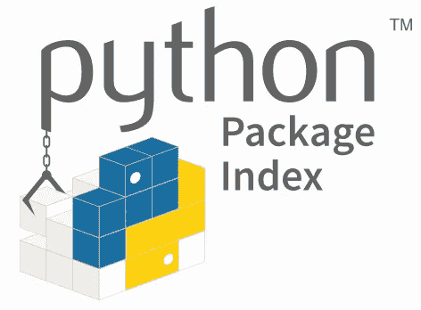

# 保持 Python 技能的每日资源

> 原文：<https://levelup.gitconnected.com/daily-resources-for-keeping-your-python-skills-sharp-d9ffe77eb179>

在 [Unsplash](https://unsplash.com/s/photos/code?utm_source=unsplash&utm_medium=referral&utm_content=creditCopyText) 上拍摄的 [ThisisEngineering RAEng](https://unsplash.com/@thisisengineering?utm_source=unsplash&utm_medium=referral&utm_content=creditCopyText)

学习一门编程语言不仅仅是记下基本的语法，然后一路过关斩将。成为一名程序员意味着持续的教育。您需要保持对新版本代码的了解，并留意不推荐使用的库。你日常工作的一部分应该包括消费一些形式的节目新闻和更新。这个例程还应该有一些资源，让你接触到新的想法或编写代码的方法。每天进行 Python 练习的最好方法之一是拥有一组可靠的资源。

在本文中，我们将查看一些以 Python 为中心的资源，以了解该语言所提供的最新和最棒的内容。这些资源中的一些不仅适用于 Python，但是为了本文的目的，我们将把重点放在一种语言上，以使事情更简单。我们还将检查一些简短且易于快速完成的学习资源，以便您可以继续您的一天。让我们开始吧。

## [推特:Python 软件基金会](https://twitter.com/ThePSF)

来源:[https://www.python.org/community/logos/](https://www.python.org/community/logos/)

Python 软件基金会(PSF)是负责 Python 的实体。与语言整体发展方向相关的更大的新闻和公告由 PSF 提供。了解新的语言特性和最新的弃用更新非常重要。快速消费这类信息的最佳场所之一是 Twitter。即使你没有 Twitter，定期查看 PSF 的页面也会给你提供大量的更新。

在 Twitter 上关注 PSF 的一个更有趣的方面是，你得到了一个更加以社区为中心的方法。您可以跟随讨论，看看 Python 社区的其他成员是如何互动的。这非常有价值，因为它是 Python 社区中的又一层内容。参与讨论并与他人交流信息是很重要的。

你也可以通过他们在 http://pyfound.blogspot.com/的博客直接阅读 PSF 新闻和更新。

## [PyCoder 周刊](https://pycoders.com/)

 [## PyCoder 周刊|每周一期的 Python 电子邮件时事通讯

### 这是一份免费的每周电子邮件时事通讯，面向那些对 Python 开发和围绕 Python 的各种主题感兴趣的人。

pycoders.com](https://pycoders.com/) 

首先是 PyCoder 周刊。这是一个免费的出版物，包含了大量的 Python 新闻和信息。这不仅仅是 Python 新闻，PyCoder 的周刊包括精彩的教程、课程，甚至每个版本都有最近的招聘公告板。这篇时事通讯的优点是它不像其他的一些一样枯燥。你从不同的来源接触到各种不同的信息。

虽然这不是每天都发布的，但这绝对应该是你在一周开始时要做的事情。时事通讯中发布了许多新闻和更新，所以留出一些专门的时间来回顾是一个很好的主意。

你也可以在他们的网站上查看新闻简报[的样本版本。](https://pycoders.com/issues/444)

## [Instagram:神奇蟒蛇 3](https://www.instagram.com/amazing_python3/)

来源:[https://www.instagram.com/amazing_python3/](https://www.instagram.com/amazing_python3/)

Instagram 不仅仅是有影响力的人向你兜售营养补充剂的扩音器。编程世界也已经进入了这个平台。不同之处在于，你实际上可以找到一些关于编写代码的非常可靠的教育和信息资源。为 Python 使用这个平台更好的一点是，大部分时间资源都是交互式的，并融入到您的日常“滚动”中。

Instagram 上有许多基于 Python 的账户，虽然有些更“以迷因为中心”，但其他账户有实际内容。像这样伟大的账户的一个例子是 [amazing_python3](https://www.instagram.com/amazing_python3/) 。这个帐户提供定期张贴编码视频的例子。这些视频相对较短，是关于如何使用从基本语法到有趣的第三方库的内容丰富的课程。总的来说，这是一个值得在 Instagram 上关注的好账户，因为即使你发现自己在无休止地滚动，你仍然会不时地看到 Python 的镜头。

## [代码大战](https://www.codewars.com/?language=python)

 [## 代码战争:通过挑战达到精通

### Codewars 是开发人员通过挑战掌握代码的地方。在道场训练形，达到你的最高境界…

www.codewars.com](https://www.codewars.com/?language=python) 

这是我个人最喜欢的日常编程练习之一，可以让你的故障排除和一行程序技巧保持锋利。Codewars 是一个交互式网站，用于培训你所选择的编程语言。他们不仅有 Python，而且还有大量其他你可以用来写作的语言；不仅仅是少数受欢迎的。

在 Codewars 中，你可以在越来越困难的挑战场景中测试你的技能。每个挑战(或“形”)都会给你加分，你可以和其他成员一起合作达到不同的等级。这是一个非常酷的网站，你应该经常访问，以确保你的技能得到检验。这些挑战可能非常有趣，并迫使你批判性地思考你以前可能没有见过的问题。

尽管人们在 Codewars 上编造的一些一行程序难以理解，但看到解决特定问题集的所有可能性还是很有趣的。当您试图使用 100 个字符长的正则表达式来解析整个文件时，请注意不要激怒您的同事。

## [浏览 PyPI](https://pypi.org/)

来源:https://pypi.org/

我想探索的最后一个资源是许多 Python 程序员已经在日常使用的资源。PyPI (Python 包索引)。这是命令行软件包管理器工具 [PIP](https://en.wikipedia.org/wiki/Pip_(package_manager)) 背后的软件包仓库之一。PyPI 集合是不同包的海洋，它们增强并扩展了 Python 的功能。很有可能您之前已经安装了 PyPI 的一个包，所以让我们看看如何将它作为我们的日常资源之一。

简单地浏览 PyPI 存储库是我喜欢做的更有趣的活动之一。这有助于扩展您对可用包的了解，并展示了您以前可能没有接触过的 Python 编程新领域的优秀示例。我浏览 repo 的方法之一是导航到搜索部分，然后[过滤趋势 Python 包](https://pypi.org/search/?q=&o=-zscore&c=Programming+Language+%3A%3A+Python)。这是一个很好的方法来查看最近哪些包是最活跃的，并检查它们。你可能会发现一些有趣的东西，并学到一些东西。

*感谢阅读！我希望您已经喜欢了这些每天磨练您的 Python 技能并保持在最新新闻和更新顶端的伟大资源。在* [*Twitter*](https://twitter.com/Tate_Galbraith) *上寻找一些你最喜欢的日常资源。*