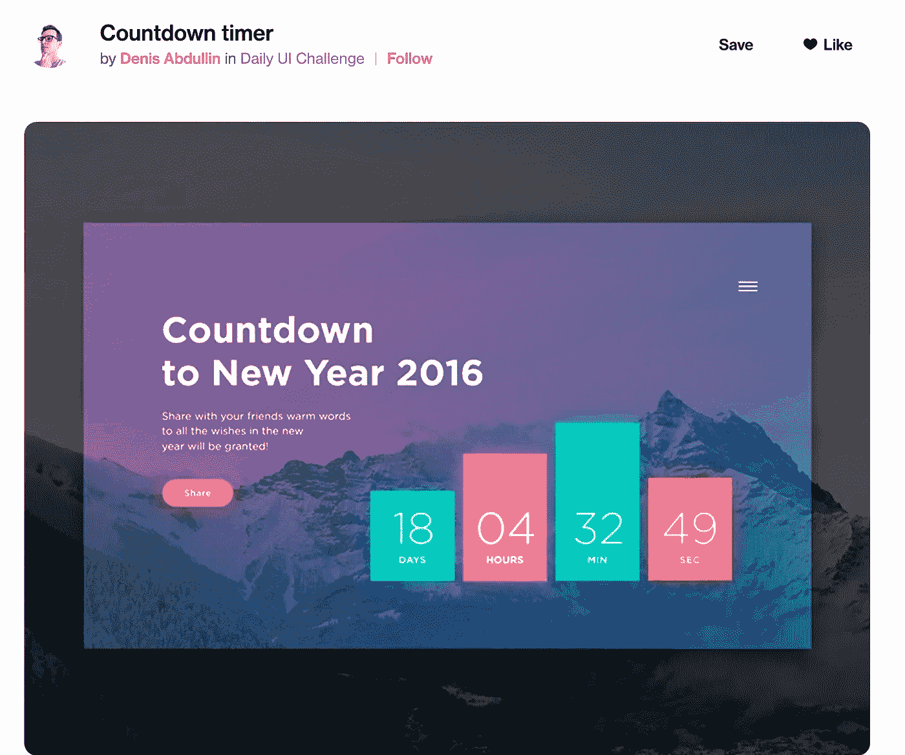
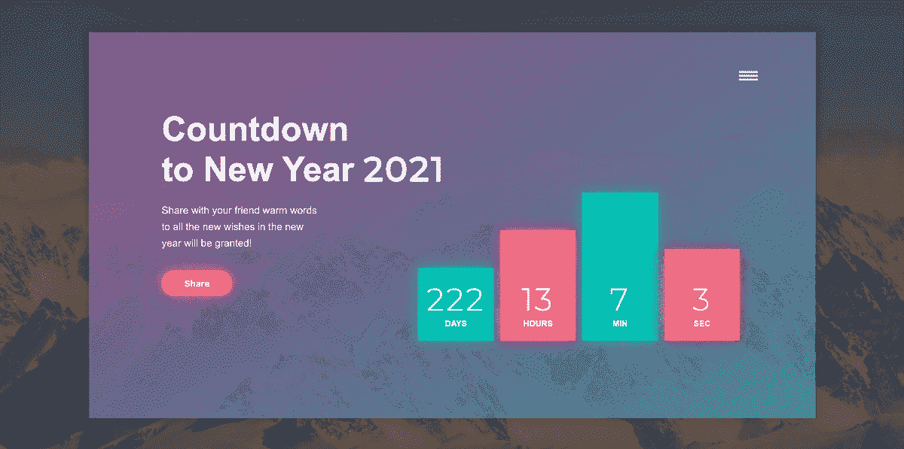
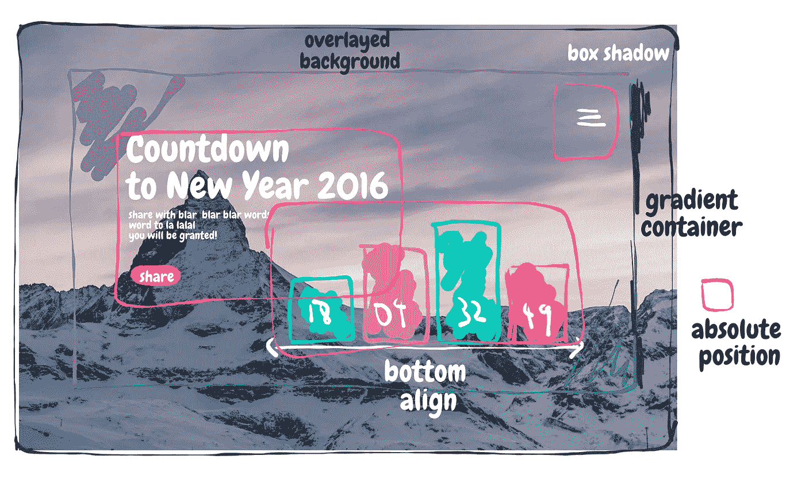
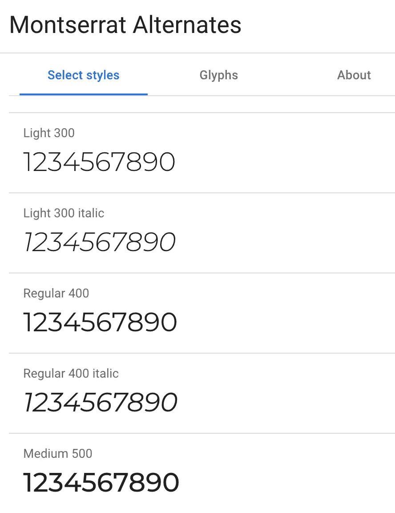
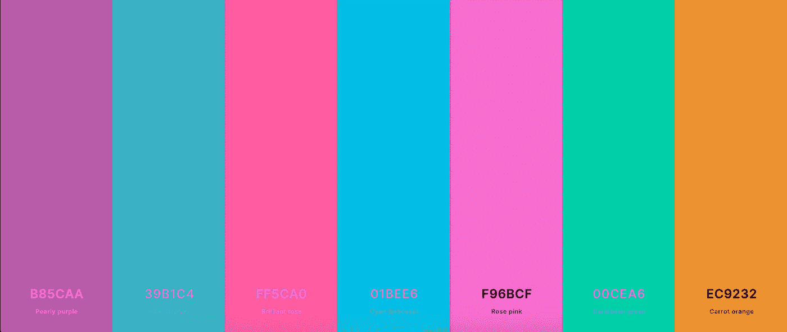
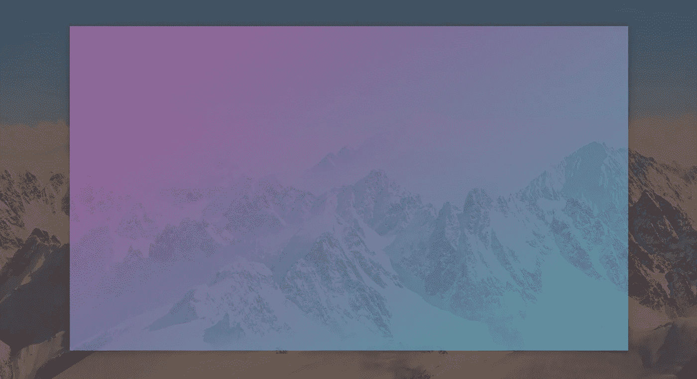
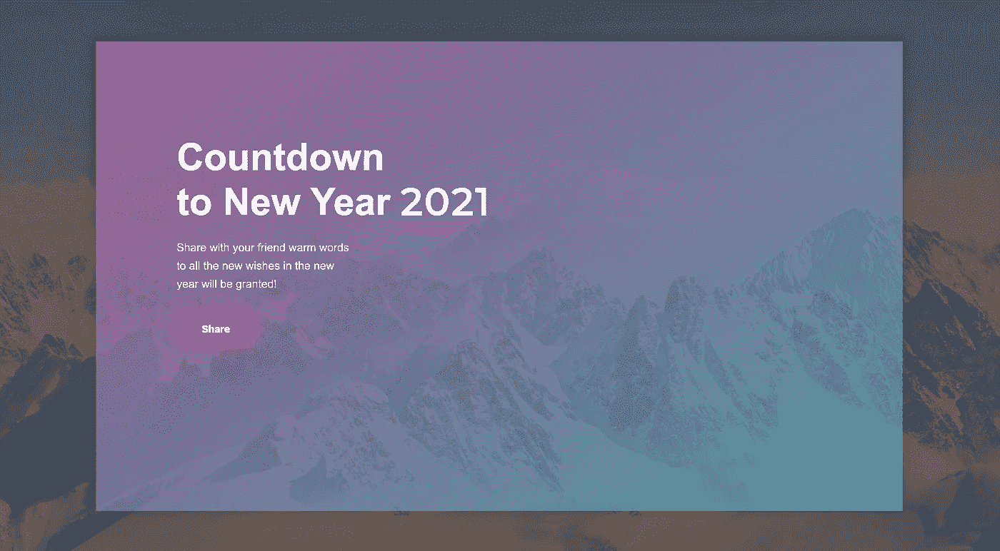
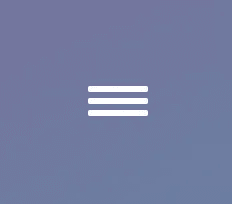
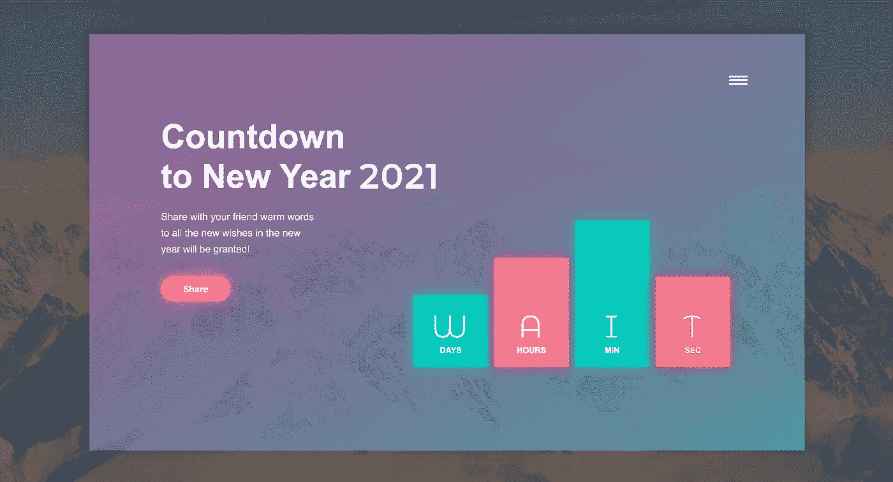

# 每日用户界面挑战—倒计时

> 原文：<https://levelup.gitconnected.com/daily-ui-challenge-countdown-6eb0d865a7e>

如何创建新年倒计时的一步一步的旅程。

# 内容

1.  介绍
2.  结果演示
3.  先决条件
4.  逐步指南
5.  结论

# 介绍

“每日用户界面挑战”([https://www.dailyui.co/](https://www.dailyui.co/))是对用户界面/UX 设计师的挑战。他们每周都提供不同类型的 UI 元素(如登录、用户资料、搜索等)，挑战赛的设计师们试图创建他们自己的版本。许多设计都很有启发性和创造性。

在本文中，我将选择一个有趣的“倒计时”的例子，并尝试用代码实现它。这次我选的例子是@ [丹尼斯·阿卜杜拉林](https://dribbble.com/deab)([https://dribbble.com/shots/2402479-20 倒计时器](https://dribbble.com/shots/2402479--20-Countdown-timer))的《倒计时器》

这是我们将尝试在代码中实现的设计

我喜欢这个设计的一点是颜色组合的运用。整体颜色主题看起来非常清新，背景与倒计时容器完美匹配。容器的渐变和不透明度也很迷人，从紫色到蓝绿色的微妙变化。

在编码层面，整体设计比较简单。倒计时会涉及一些 JS，但应该不是大问题。

> *像这样的注意通常是进一步的解释(或者只是随意的思考)*

# 结果演示

这是我在 codepen 中创建的最终结果:

我找不到背景图片，所以我需要使用另一个

Codepen 演示:

> 它没有响应，在屏幕宽度大于 1024 像素的情况下观看效果最好

# 先决条件

基本的 HTML、CSS 和 SASS/SCSS CSS 预处理程序

基本的 JS 和 jquery

# 逐步指南

**第一步:设计草图**

让我们做一个设计的快速草稿，以获得对它的一些理解和如何接近它。

我在草稿上选择了一个随机的背景，但后来又改变了主意

设计上没什么特别的。我们有一个大的背景图像，上面有一些覆盖设置其颜色更深。在背景图像的顶部，有一个带有线性渐变背景颜色的大容器。在容器内部，结构非常简单。你可以看到我用一个粉红色的矩形来封装这三个容器，它们将被放置在绝对位置。

剩下的只是仔细研究字体，颜色，每个元素的比例。

设计中有两种字体，文字只是 Arial，而数字是另一种字体。我试着使用谷歌字体，最终选定了字体“蒙特塞拉特岛备用”。

而对于背景，最好是找一张半山半天的图片，山应该是深色的。没找到原图，找累了。所以我选择了这个:

找到合适的颜色也是一项永无止境的努力，对于这个设计来说更是如此，因为上面的颜色会和背景混在一起。所以结果是两者的混合。由于我的背景图像与原始设计不同，我对颜色做了一些实验，得出了一组看起来足够接近的图像。

我使用的最终颜色主题

好吧。一切就绪后，让我们开始编码。

**第二步:构建背景和容器**

第一步是设置背景和渐变容器。它们是其他一切的舞台。

HTML:

SCSS:

我在背景上使用了`:before`元素来创建一个覆盖图。如果你想让事情变得简单，就用 photoshop 对图像进行预过滤。在代码中使用覆盖可以让你更好地控制过滤器和微调结果。

对于容器，我在`:after`元素上添加了`linear-gradient`背景，而不是容器。原因是背景本身应该是半透明的，而不是容器本身。如果`opacity`直接应用于容器类，那么里面的所有东西也将共享`opacity`。

结果看起来是这样的:

顶部和底部的填充偏离了最初的设计，但这是我的屏幕到目前为止

好了，现在我们有了背景设置，我们可以逐步填充内容。

**第三步:构建文本容器**

接下来让我们做课文。我们可以将大文本、小文本和按钮组合到同一个容器中，因为它们通过左边界对齐。

HTML:

SCSS:

> 我让自己放松，没有为字体和填充创建变量，对于更复杂的设计，最好有标准的大小

这里没什么好说的。没有花哨的属性，只是不同字体大小的组合。

**第四步:创建菜单**

接下来，让我们创建菜单按钮。既然用代码做这么简单，我就懒得打开 photoshop 画了。此外，用代码制作菜单，同样，给你更多的控制权，甚至动画，如果你想。

HTML:

SCSS:

用 flex 和简单的背景色和边框，我们创建了菜单图标。

有 3 个跨度的菜单图标

**第五步:创建倒计时容器**

下一步是创建容器的静态布局。我们将在稍后的代码中普及这些内容。现在，我们只关注设计。

基本上四个倒计时列有相同的基类，我们只需要给它们不同的背景颜色，高度和阴影。

HTML:

SCSS:

> 实际上，我一开始在倒计时栏的编码上犯了一些错误，我使用了左右填充来给它需要的宽度，但是很快意识到当内容改变时，栏的大小也会改变。所以最终我硬编码它来固定宽度

一个旁注，CSS 有一个变量 call `currentColor`，但是，没有 currentBackgroundColor。所以我不能在盒子阴影上使用它，需要在每个颜色类中重复我自己。

等待文本是一个自然的负载指示器

**第六步:创建倒计时功能**

最后要做的是设置倒计时功能是 JS。我使用了 moment.js 库，这是一个非常好的完整的日期时间函数库，大大缩短了开发过程。

 [## Moment.js | Home

### npm 安装力矩-存纱添加力矩安装-包力矩. js spm 安装力矩-存流星添加…

momentjs.com](https://momentjs.com/) 

逻辑很简单，我会获取明年 **1 月**1 日的时间，然后设置一个函数获取从现在到那个时间的不同时间。并更新 HTML 中的每个数字。

JS:

这是不言自明的，对于现在和新年之间不同的计算，我参考了 slack overflow 中的解决方案:(因为为什么要重新发明轮子？)

 [## 获取日、小时和分钟差异时刻 js

### 感谢贡献一个堆栈溢出的答案！请务必回答问题。提供详细信息并分享…

stackoverflow.com](https://stackoverflow.com/questions/49385109/get-days-hour-and-minutes-diff-moment-js) 

完成我们的设计:

长得差不多？从上面看，这是同一个图像

# 结论

我非常喜欢这个设计。从编码的角度来看，设计本身并不复杂(谢谢你，设计师)，但颜色的使用使它看起来非常专业。倒计时功能虽然代码并不复杂，但也是每个开发人员必须尝试实现一次的功能。

这是我构建这个设计的方法，并不声称它是最好的方法或完美的。如果你喜欢这篇文章，请鼓掌并发表评论！