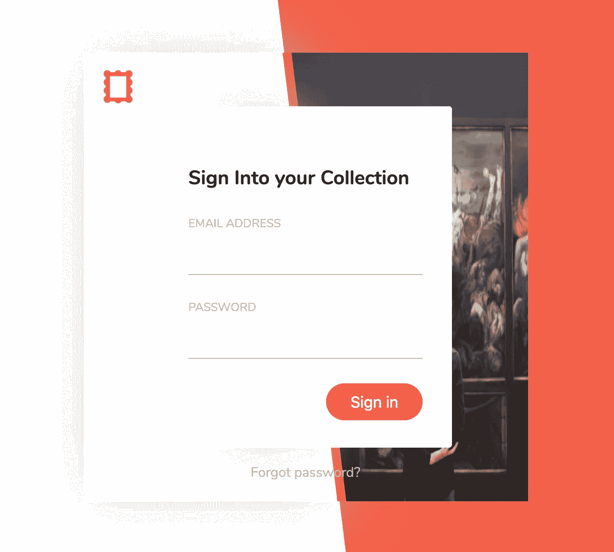

# 每日用户界面挑战强加—登录表单(分步教程)

> 原文：<https://levelup.gitconnected.com/daily-ui-challenge-impose-sign-in-form-step-by-step-tutorial-cef28f5a1b5f>

一步一步的旅程，从日常的 UI 挑战中创造一个好的设计

# 内容

1.  介绍
2.  结果演示
3.  先决条件
4.  逐步指南
5.  结论

# 介绍

“每日用户界面挑战”([https://www.dailyui.co/](https://www.dailyui.co/))是对用户界面/UX 设计师的挑战。他们每周提供不同类型的 UI 元素(如登录、用户资料、搜索等)，而挑战赛的设计者试图创建他们自己的版本。许多设计都很有启发性和创造性。

在本文中，我将为“登录”表单选择一个有趣的例子，并尝试用代码实际实现它。我选的例子是本杰明·克罗([https://dribbble.com/shots/3270775-Art-Platform-Login](https://dribbble.com/shots/3270775-Art-Platform-Login))的“艺术平台——登录”

这是我们将尝试在代码中实现的设计

> 像这样的注意通常是进一步的解释

# 结果演示

这是我在 codepen 中创建的最终结果:

你能看出这和最初的设计有什么不同吗？(剧透:有很多)

代号:[https://codepen.io/josephwong2004/full/NWGBRJQ](https://codepen.io/josephwong2004/full/NWGBRJQ)

# 先决条件

基本的 HTML、CSS 和 SCSS/SASS

# 逐步指南

**第一步:创建一个快速草稿**

我做的第一件事是自己快速起草设计，并在编码中将其分解为不同的元素。

请容忍我糟糕的画

我注意到的第一件事是设计的不同层次。从下到上:

1.  背景为白色和橙色双色
2.  “卡片”形状的容器，用于保存图像。此外，它有一个橙色的边缘
3.  在表单中弹出登录

我在这里也有一些个人的解释。我假设背景中的橙色和卡片上的橙色是分开的。虽然在最初的设计中没有那么明显，但我相信既然卡被“举起”，橙色边缘部分也应该被举起。使其从背景中延伸出一点。

第二步:制作背景

我们将逐一创建三个不同层次的设计。从背景开始。我们需要把它分成白色和橙色。我的解决方案是使用一个白色背景的 div，并为橙色部分使用一个带有 clip-path 的“before”元素。

> 在完成整个事情后，我想了想，我应该使用背景`linear-gradient`来达到同样的效果。这是一种更优雅的方式，我们不需要仅仅为了背景色而使用“before”元素。
> 
> 如果你有兴趣:[https://stack overflow . com/questions/25958315/use-linear-gradient-in-CSS-to-split-div-in-2-colors-but-not-in-equal-halves](https://stackoverflow.com/questions/25958315/use-linear-gradient-in-css-to-split-div-in-2-colors-but-not-in-equal-halves)

所以让我们直接进入 html 和 css。

HTML(只有一行作为背景):

SCSS:

SCSS 里有很多东西，但大多数都是为将来使用而设置的。比如颜色、字体和辅助混合。

我发现关于剪辑路径的一件事(不确定是否是浏览器特有的问题)是，当两个 div 重叠时，有时它会在剪辑区域周围显示一个微小的白色边框。因此，作为一种变通方法，您可以看到我的$path 实际上超过了 100%和 0%。

非常简单，我们有双色分割的背景。下一步是创建卡片容器。

**第二步:创建卡片容器**

好了，这部分和背景很像。我们基本上需要创建相同的东西，只是宽度和高度较小，周围有一个方框阴影。

一个棘手的问题是，如果你只是在整个卡片容器上使用一个盒子阴影(比如浅灰色)，当灰色阴影投射到背景上时，你会看到在白色背景部分，你会得到一个黑色的阴影，而在橙色背景部分，你会得到一个白色的阴影。这就是我所说的:

颜色是一样的，但是我们的眼睛会有两种不同颜色的错觉

从最初的设计来看，卡片的橙色部分没有“白影”。因此，我假设那部分根本没有阴影。为了只在卡片的“白色部分”应用阴影，我使用了剪辑路径和`filter: drop-shadow`，因为剪辑路径和`box-shadow`不能一起工作。

这是卡容器部分的代码:

HTML:

> 你可以看到我有一个容器阴影类。这就是我所说的在白色部分投下阴影

SCSS:

> 为 clip-path 使用 mixin 的一个好处是，我可以很容易地修改和试验“clip ”,直到它对我来说是完美的。有一个 mixin 大大简化了这个过程。
> 
> 对于容器阴影，我们需要两个元素，一个父元素和一个子元素来应用投影。父元素的大小与容器相同，而子元素(在元素之后)被裁剪

结果看起来是这样的:

仔细看的话，橘色边缘还有点“史特影”。但不会影响整体设计

这看起来有点奇怪，因为我们没有添加图像。让我们接下来做那个。

**第三步:填充图像和图标**

接下来，我们需要填充图像和图标。我花了一些时间找到原始图像(看画的人)。用谷歌图片搜索类似的照片，我终于得到了它的原始尺寸。对于图标来说，如果我把它从设计中去掉，它会太模糊。所以我用 photoshop 做了一个类似的。

这不一样，但足够接近

准备好图像资产后，我们可以填写卡片:

HTML:

SCSS:

这里没什么好说的。我们只是在图像上重复使用剪辑路径混合。同样，最终的剪辑百分比只是凭经验(通过试错)。

我们快到了！

**第四步:创建注册表单**

最后但同样重要的是(实际上是最重要的部分)，我们必须创建登录表单 UI。使用 box-shadow 将表单提升到容器上。同样，我们也面临着同样的问题，当阴影放在亮背景和暗背景(图像)上时，颜色看起来不同。因此，我们将应用同样的技术，只在亮的部分投射阴影。

输入部分非常简单。虽然没有详细说明输入对焦点的反应，但我只能自己假设。我将边框线设置为橙色，并在鼠标悬停时将按钮变暗。

代码的登录表单部分如下所示。

HTML:

SCSS:

> 它可能看起来有很多风格，但把它们一个一个分解，就没有什么花哨的属性了。我只是试图捕捉设计中的 UI 元素，并使它们看起来相似。

这是最终的结果。希望你喜欢！

# 结论

复制 UI 并尝试尽可能精确地自己实现，这是一个非常有趣的练习。我犯了很多错误(比如没有为橙色背景分割使用背景色和线性渐变),通过做这个练习，我学到了很多。

你可能在 codepen 上注意到的一件事是，我做的这个设计在 responsive 上没有很好地扩展。图像只是不断缩小调整大小。全新的设计可能需要不同的尺寸。

你可以看到图像按比例变形

但总的来说，我很喜欢这个设计。如果你喜欢这篇文章，请随时发表评论！