# 每日用户界面挑战—定价计划

> 原文：<https://levelup.gitconnected.com/daily-ui-challenge-subscription-plan-card-dd35b4e0a18f>

如何创建订阅计划卡设计的分步教程

# 内容

1.  介绍
2.  结果演示
3.  先决条件
4.  逐步指南
5.  结论

# 介绍

“每日界面挑战”([https://www.dailyui.co/](https://www.dailyui.co/))无需赘述。成千上万的设计师提出有趣的用户界面/UX 元素设计，并定期与互联网分享。许多设计都很有启发性和创造性。

在这篇文章中，我将为“定价计划”挑选一个有趣的例子，并尝试用代码实际实现它。我这次选的例子是[uixNinja](https://medium.com/u/e496e2b19499?source=post_page-----dd35b4e0a18f--------------------------------)(【https://dribbble.com/shots/3171200-Plan】T4)的《计划》

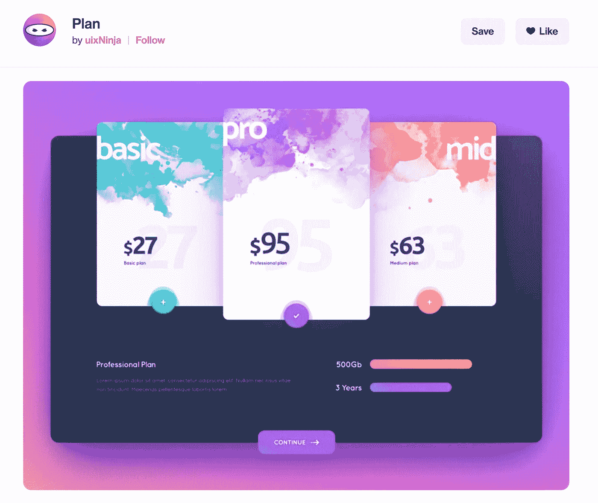

这是我们将要复制的设计

该设计包括三个不同的卡片，用于不同的“计划”(无论是什么计划)，以及一个用于描述所选计划的详细区域。卡片本身非常醒目，墨滴图案，清晰对齐的标题、成本和按钮设计。此外，还有许多不同的层次，例如卡片层次、容器和按钮都在设计中占据不同的视觉空间。

# 结果演示

这是我在 codepen 中创建的结果:

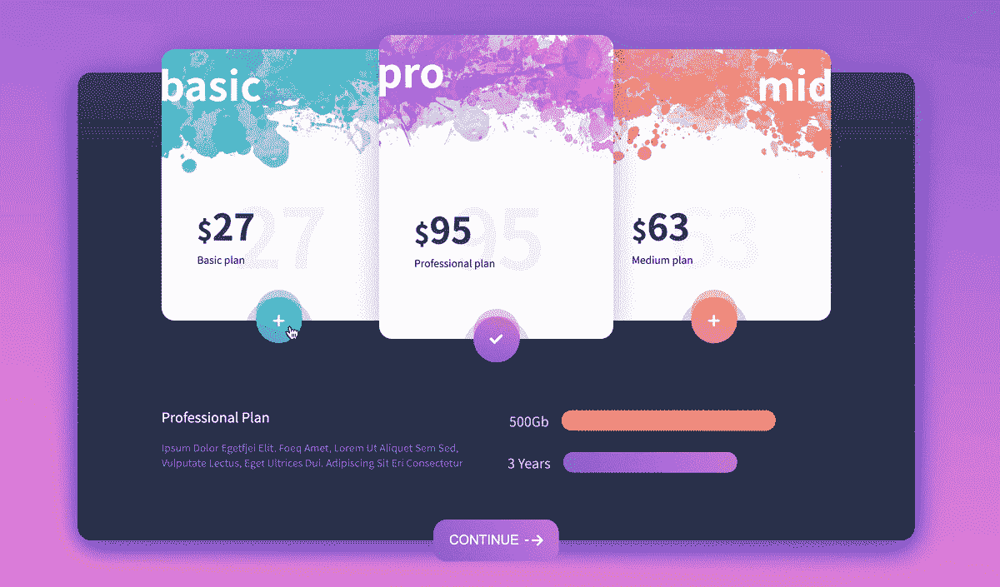

卡片的比例与设计不同，但总体来说我很满意

**Codepen 演示:**

> 你可以在这里运行笔，但我建议在更大的屏幕上运行它，以获得更好的结果

# 先决条件

基本的 HTML、CSS 和 SASS/SCSS CSS 预处理程序

基本的 JS 和 jquery

# 逐步指南

**第一步:分解设计**

我们要做的第一件事是观察设计，并将其分解为不同的组件。

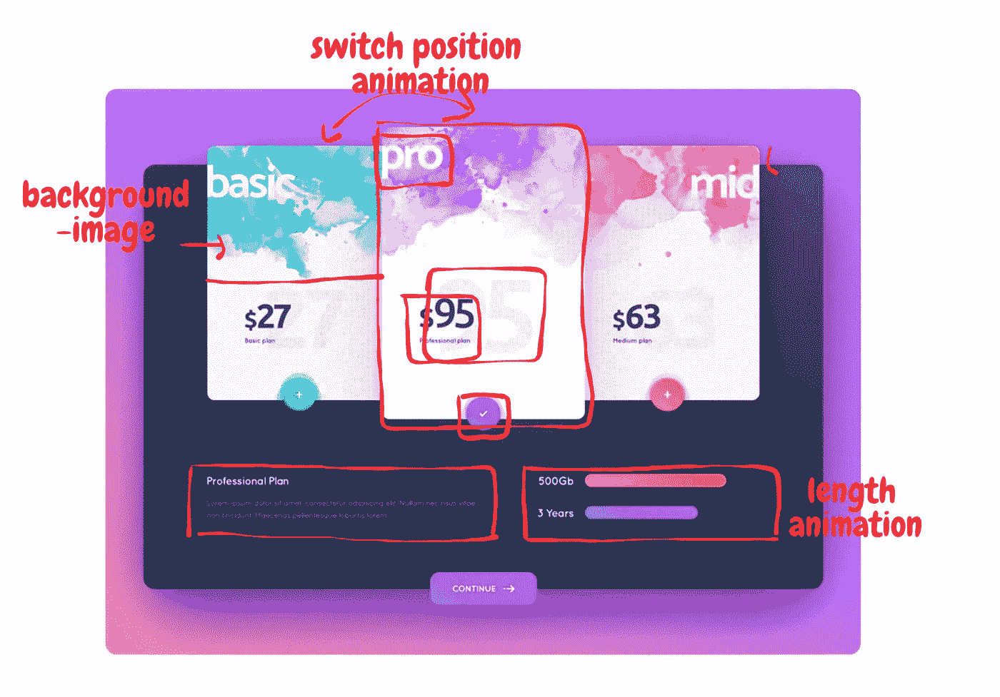

背景和容器都很标准。这种设计的主要挑战是卡。卡片设计非常优雅，在墨迹图案背景上巧妙地放置了文字。因为我们无法从设计中获得墨迹图像，所以我们需要自己绘制。

第二个挑战是当用户选择另一张卡片时，卡片如何动画。自然地，用户会假设选择的卡直接在他们前面，因此我们将在选择的卡和当前活动的卡之间实现交换。为了让事情看起来更一致，我们还希望平面图细节中的两个“条”也能有动画效果。

事不宜迟，让我们开始吧。

**第二步:设置基本**

我们需要做的第一件事是选择一个字体系列。经过一些测试，我最终选择了谷歌 noto san。

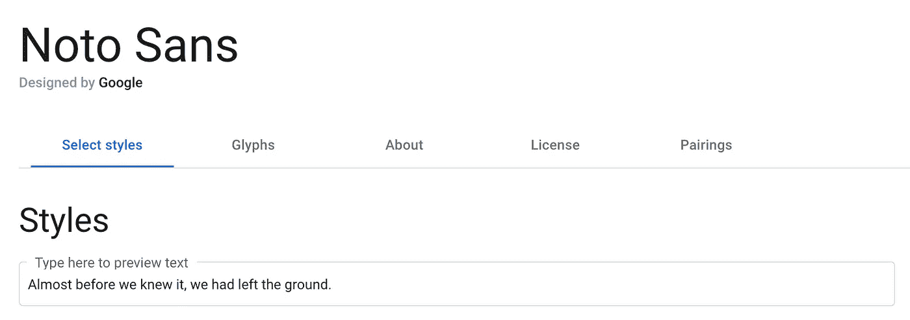

虽然这个字体里的数字和原设计不太一样，但是确实得到了整体相似的感觉。

接下来就是挑选底色了。在这个设计中有很多线性渐变，基色只是设计的基础，我们会使用很多 SCSS 颜色函数在代码中修改它。

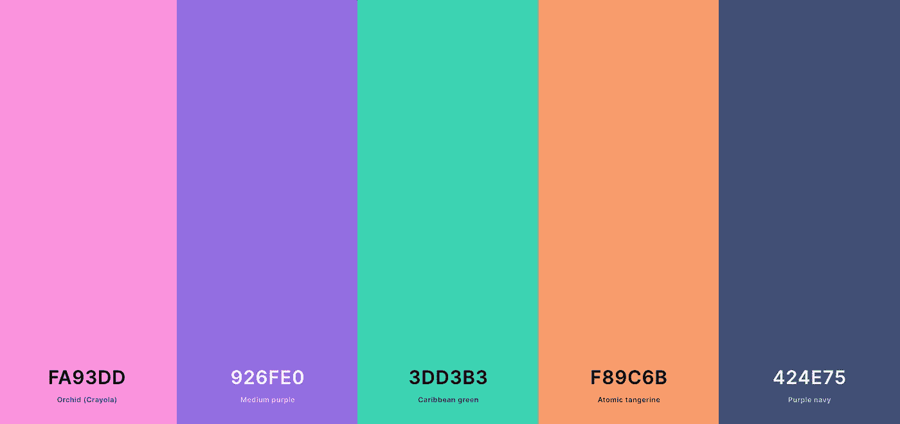

随着字体和颜色的选择，现在有趣的部分。我们需要为我们的卡片创建一个墨水图案背景图像。我试着用谷歌搜索了一下，但是找不到一个看起来足够好的，所以最终，我决定用 photoshop 自己制作。

**步骤 3:创建墨水图案**

用 photoshop 创建墨水图案非常容易。我们需要做的第一件事是给自己买一把“墨水”刷子。幸运是，我们不需要自己创建，因为网上有很多自定义的笔刷模式可以免费下载:

 [## 无墨画笔- (1，121 个免费下载)

### 来自 Brusheezy 社区的 1，121 个最佳无墨画笔下载。创作共用许可下的无墨画笔…

www.brusheezy.com](https://www.brusheezy.com/free/ink?content-type-brushes=true) 

我选择了一个画笔，并将其导入到 photoshop 中，然后开始使用不同的不透明度和大小的墨水。

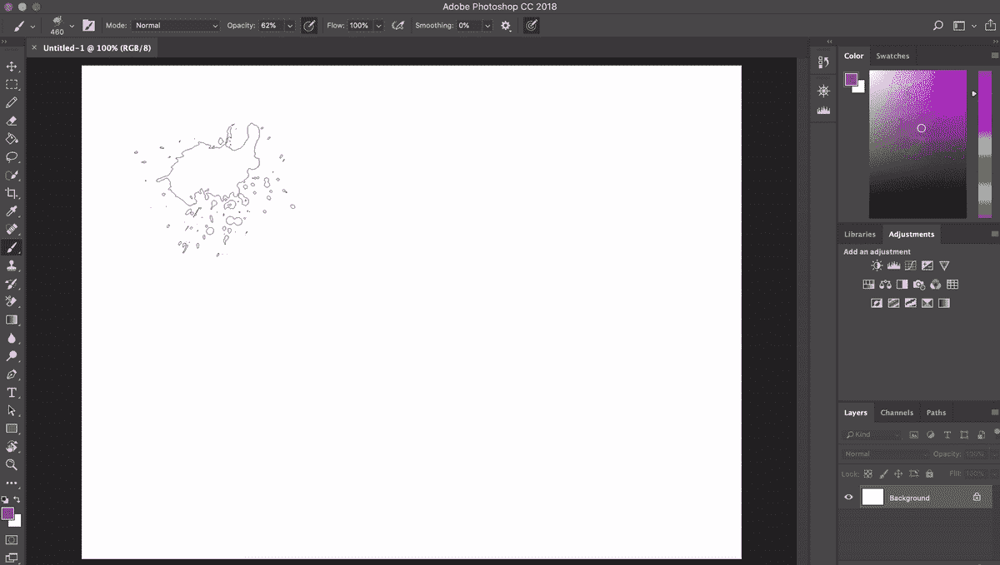

一旦你拿到画笔，就很容易创作出图案

最终，我想出了这三种墨水背景:

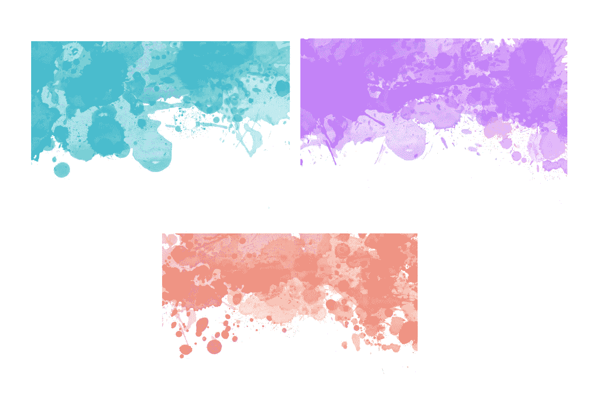

有了所有资产集，我们终于可以开始编码了。

第三步:创建背景和容器

好了，让我们进入代码。在我们做任何事情之前，让我们为颜色、尺寸和一些辅助函数设置变量。

> 尺寸实际上是在实际实现 UI 元素的过程中出现的，当试图在开始时设置尺寸时，大多数时候我们都弄错了。但是没关系，我们可以随时修改它

让我们添加背景和容器类:

HTML:

SCSS:

这是最简单的部分，我们只是在基色上下功夫，直到找到一个看起来最接近原始设计的颜色。

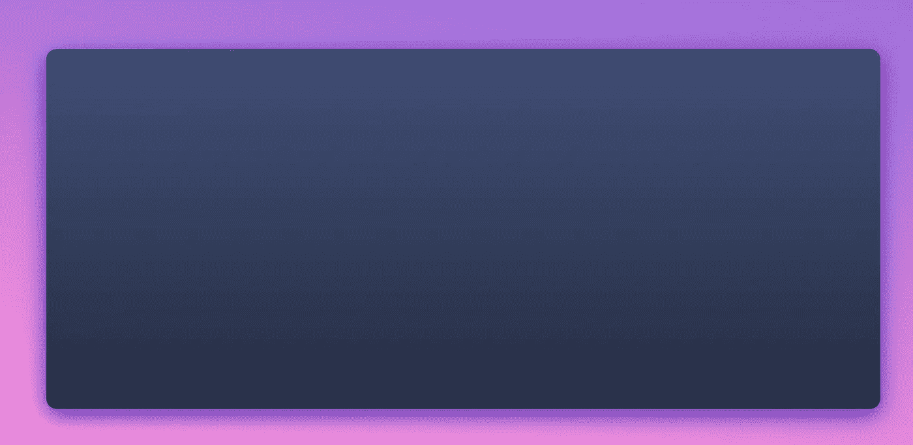

**第四步:创建卡片容器**

卡片稍微复杂一点。这三张卡片应该有一个共同的设计类别，同时有它们自己的位置类别:左、中、右，以及它们的颜色类别:蓝色、紫色、橙色。

由于三张卡都差不多，这里我只打算分享一张。如果你有兴趣，可以在我的 codepen 里看到。

HTML:

SCSS:

分解代码，我们使用 mixin `splash`向色卡添加:after 元素，在色卡顶部创建背景图像。中间卡的类别`.active`，使其大小不同于其他卡。同样，我们用`.left,` `.right`和`.middle`类来给卡片定位。

文字和数字类相对简单，也有与所有卡片共享的。

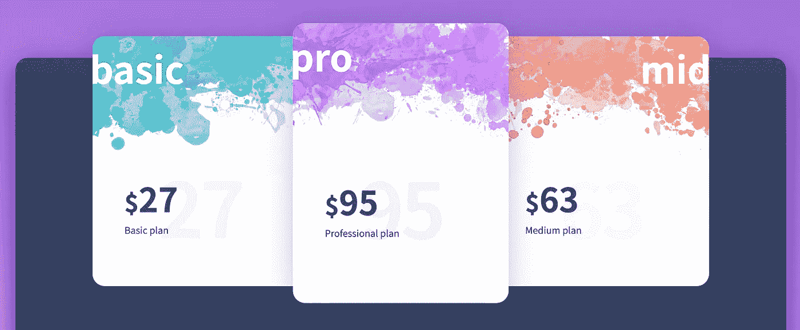

**第五步:创建按钮**

现在我们移到按钮上。按钮有点烦人，让我们先来看看:

这是设计中的按钮

这个按钮有一个线性渐变，后面有两个不同大小的阴影。我的第一个解决方案是使用框阴影来创建按钮的阴影背景，但后来我意识到这并不容易。因为按钮本身在卡片上延伸，但是“阴影”被卡片夹住。如果我们将 overflow: hidden 设置为卡片本身，按钮也会被裁剪。

理想情况下，我们希望只修剪阴影。因此，我想出了另一个解决方案，为阴影使用一个单独的 div，给它一个高度，将其与卡片底部和`overflow: hidden`对齐，然后用`:after`添加其内部的阴影。

HTML:

> onClick 稍后用于将该卡设置为所选卡

SCSS:

这个实现中按钮看起来像这样:

**第六步:创建计划明细容器**

好了，我们完成了设计中最难的部分。现在继续创建卡片下面的文本，以及“进度条”元素。这很简单:

HTML:

SCSS:

> 在栏中，我添加了`.basic`、`.mid`、`.pro`类，用于后期动画制作。

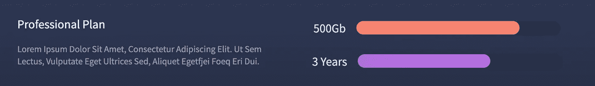

同样，这是非常直接的。让我们在容器的底部创建按钮:

HTML:

SCSS:

> 有趣的事实:字体 awesome 图标的样式是:before 元素，所以我们只能使用:after 来添加任何东西。在这种情况下，破折号。

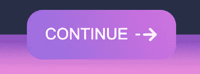

我们已经将前端静态元素准备就绪。最后要做的是在选择卡片上制作动画。

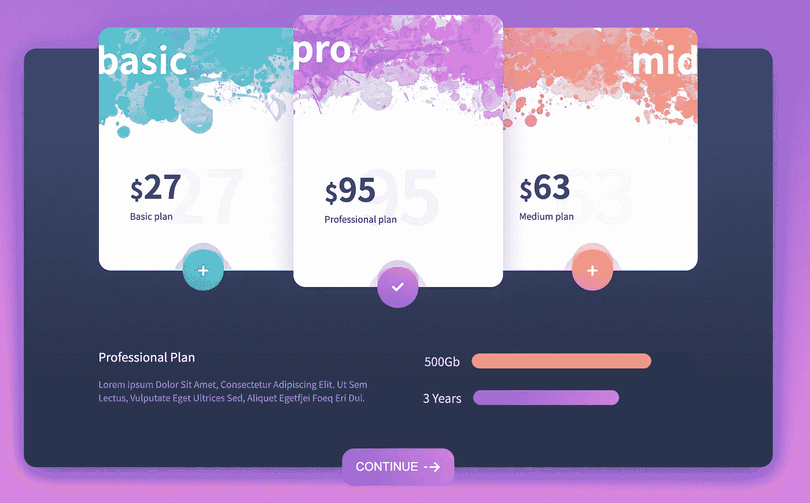

我们的代码现在是静态的，让我们添加一些功能

**第七步:在选择**时激活卡片

让我们设计如何制作卡片动画。当用户单击该卡时，应该会发生以下情况:

1.  所选卡片移动到中央，按高度放大
2.  位于中间的前一张选定的卡将移动到选定卡的位置
3.  对于所选卡片，卡片的按钮从“加号”变为“勾号”,反之亦然
4.  计划详细标题(基本/中等/专业)和内容变更
5.  Gb 和年份栏改变

就其本身而言，所有的动画都非常简单。使用 CSS transition 属性，当我们向一个类添加新的样式时，在 transition 属性中标记的任何改变的样式都将被动画化。在这个例子中，大部分动画只是位置或大小。我们可以使用过渡来实现动画。

而对于文本/图标的改变，我们只需要用新的内容替换原来的内容。

而对于“交换”动画，我通过首先获得所选卡的“位置类”来实现它(左/右，因为所选卡永远不会是中间的一张)，然后将它与当前所选的卡交换(它永远是中间的)

JS 中的最终代码(使用 jquery):

> 我使用拆分、排序和连接功能随机交换细节文本的内容。同样，对于 jquery 来说，操作这个类是一件痛苦的事情，在一个更大规模的项目中，有更多这样的动画，我肯定会使用 JS 框架

添加 JS 后，我们现在可以选择卡片了。

# 结论:

有一件事我显然没有费心去解决，那就是当他们交换位置时，卡上的文字(basic/pro/mid)被中间的卡挡住了。这很烦人，但由于文本对齐本身是设计的核心部分，我不想对它进行太多的更改。

总的来说，我对最终的结果很满意。没有花哨的功能或 CSS 属性，我只是使用基本的。感谢@uxuininja 创造了如此令人惊叹的设计，从事这项工作真的很有趣。喜欢的话，欢迎留言评论，鼓掌！