# 每日用户界面挑战——经典美食菜单

> 原文：<https://levelup.gitconnected.com/daily-ui-challenge-vintage-food-menu-5a18437332d3>

创建复古设计食物菜单的分步指南

# 内容

1.  介绍
2.  结果演示
3.  先决条件
4.  逐步指南
5.  结论

# 介绍

如果你对 UX/UI 或前端开发感兴趣，你可能听说过“每日 UI 挑战”([https://www.dailyui.co/](https://www.dailyui.co/))。对于 UX/UI 设计来说，提出一个不同于普通前端元素的设计是一个挑战，例如注册表单、登录按钮、信息卡和 e.t.c .数以千计的天才设计师创建了他们自己版本的 UI 元素设计，并与互联网共享。

在本文中，我将为“**食物菜单**”挑选一个有趣的例子，并尝试用代码实际实现它。我这次挑的例子是 pixel code([https://dribbble . com/shots/2668255-Daily-UI-043-Food-Drink-Menu](https://dribbble.com/shots/2668255-Daily-UI-043-Food-Drink-Menu))的**“食物/饮料菜单”**

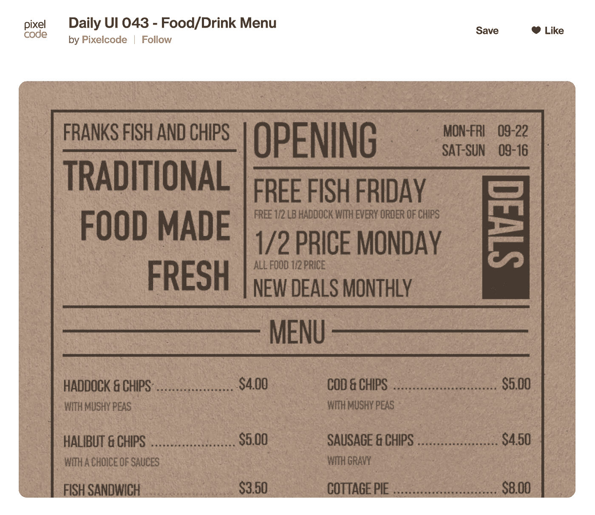

这是我们试图用代码构建的设计

这种设计与我们认为的“标准”网页/应用程序 UX/用户界面元素非常不同。它具有非常复古和简约的风格，复制了牛皮纸上印刷菜单的感觉。布局也很有结构和秩序。在一个充满花哨的动画、引人注目的图像和视频的世界里，这种设计注重功能性并创造自己的噱头。

# 结果演示

这是最后的结果:

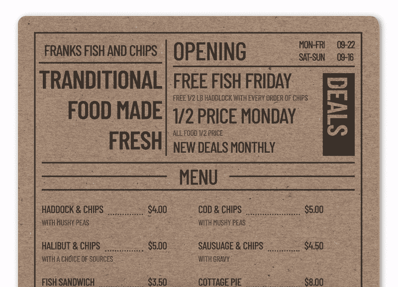

我用了深色的背景

Codepen 演示:

> 这是一个没有 JS 的解决方案，你可以在 codepen 上玩代码

# 先决条件

HTML、CSS 和 SCSS/SASS(任何 CSS 预处理器)

本教程(主要)面向初学者

# 逐步指南

**第一步:起草设计方案**

我总是做的第一步是起草设计并研究它的结构，并试图观察设计中是否有任何需要解决的具体问题。

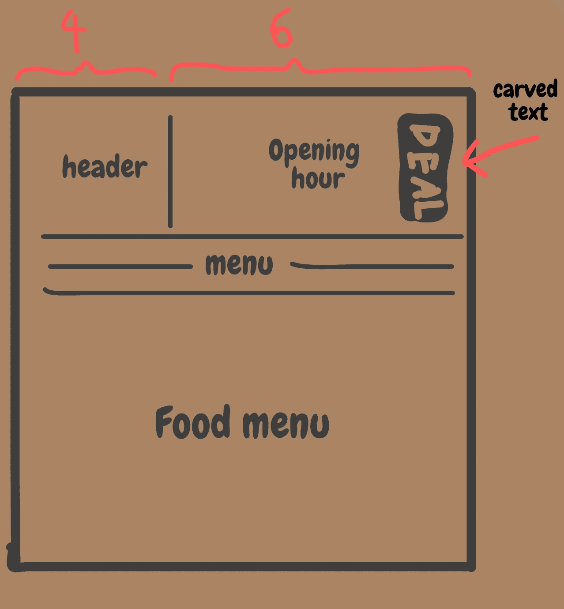

基本上这是一个非常简单的设计。就布局而言，我们没什么可担心的。我们有标准的盒装组件。每个容器用半封闭的边界封装。就设计而言，我们需要解决几个问题:

1.  **背景纹理**
2.  **“交易”刻文**

设计的背景是棕色牛皮纸。不要试图用复杂的 CSS 线性渐变或属性来复制它，我们可以只使用一个大的图像作为背景。第二个问题是“交易”文本，这是一种从黑色层中“雕刻”出来的垂直文本，并通过牛皮纸颜色使其成形。我们将在本文的后面部分进行更详细的讨论。

总的来说，这是一个非常简单的设计。为了让事情变得更有趣，我还想给文本添加一个动画，所以当鼠标悬停时，它用白色填充。

**第二步:设置基本**

在我们研究了设计之后，让我们建立项目的基本结构。我们需要做的第一件事是选择一个匹配设计的字体样式。经过一番测试，我决定用**巴洛浓缩**:

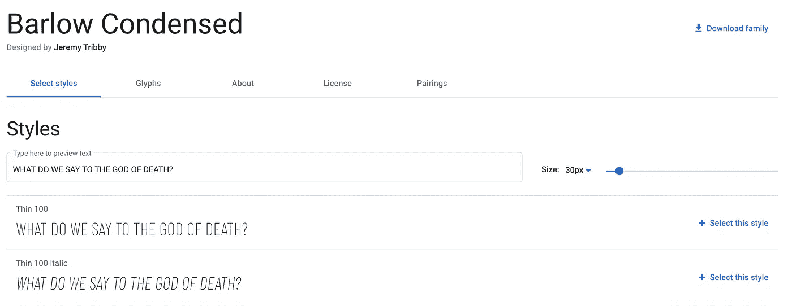

> 虽然，设计中的字体确实有一个很特别的“&”，这是这种字体所缺少的。整体外观和感觉是相似的

而对于背景，我在谷歌上搜索了“牛皮纸”，做了一些“photoshop-ping”(这是真的单词吗？).最终的结果是更粗糙的纹理，我认为这更加突出了复古的感觉:

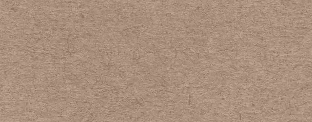

从完整的背景图像中提取

对于这个设计，我们只有一种颜色:黑色(其实是#453B34)。所以我们不需要担心挑选颜色。我们还可以预定义一些字体大小变量，以便以后帮助我们。

让我们设置 CSS 的基本样式:

> 如果你不熟悉什么是框定尺寸，请看:[https://css-tricks.com/box-sizing/](https://css-tricks.com/box-sizing/)(TLDR:框定尺寸:边框框使定位更直观，至少在大多数情况下对大多数人是这样。)
> 
> @mixin 是 SCSS 的一个特性，用于编写“模块化”风格，以后可能会被@include

有了基本的 SCSS 风格，我们可以设置背景下一步。

**步骤 3:创建背景**

由于我们的设计是纸上的食物菜单，为了使它看起来更自然，而不是使用整个屏幕，我们将为菜单创建一个圆边框容器，用一些阴影来显示它与白色背景处于不同的层次。代码非常简单:

HTML:

SCSS:

由于我们之前设置了全局 SCSS 规模变量，我们可以在这里使用变量，而不需要考虑每个规模。对于这种特殊的设计，元素的大小非常相似。如果我们后来发现大小不正确，我们可以只改变一次变量，所有其他使用它的样式都会被更新。

为了让我们的生活更轻松，我们还设置了`text-transform: uppercase`来节省 html 中的时间类型大写。

`.container`类为我们的菜单内容创建了一个边框，以及默认的边距和填充，所以我们不需要担心每个容器内部的填充。

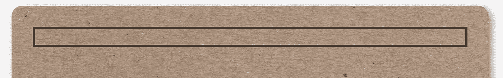

> 我们的容器现在没有任何内容，所以它非常狭窄。但是没关系，一旦我们添加内容，它会自动缩放。

**第四步:创建头部容器**

让我们首先创建菜单的顶部，标题(左上角是餐厅的标题和口号，右上角是营业时间和特色)。该容器是一个简单的 flex 布局，具有不同的文本大小和边框位置。让我们看看如何分离容器:

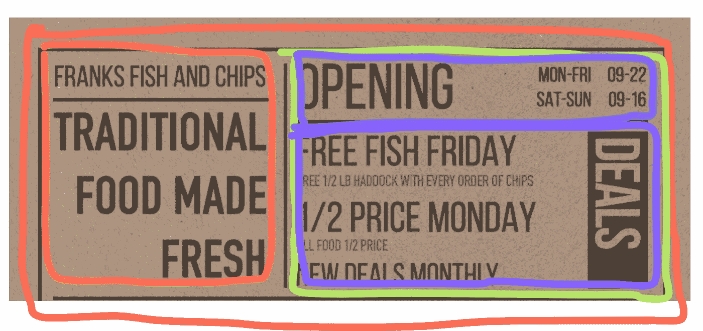

画直线不是我最擅长的游戏

我们首先有一个外部容器(红色)，在它里面，我们有标题容器(橙色)和功能容器(绿色)，在功能容器里面，我们有开放时间(蓝色)和功能容器(紫色)。让我们直接进入代码。

HTML:

SCSS:

> 代码很长，但是概念很简单。我们识别结构，然后将内容放入正确的容器中。我们从粗略的定位开始，慢慢调整风格，让事情看起来更好。

我们创建了一个全局 mixin `subtitle`，这在我们稍后设计菜单文本时会很有用。

结果看起来像这样:

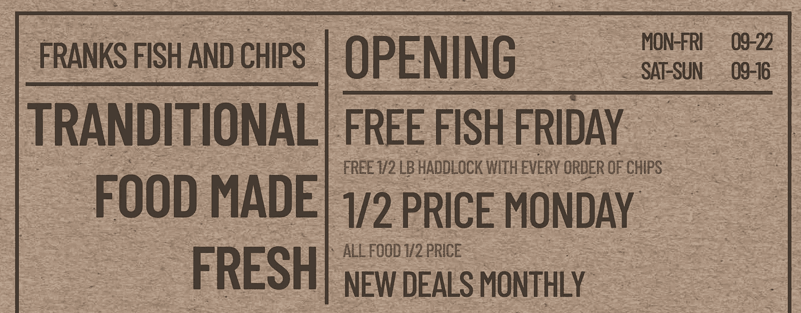

接下来，让我们在右侧创建“DEAL”文本块。

**第五步:创建“交易”文本**

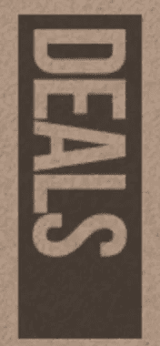

“透明”文本

好的，这部分很有趣。我们需要将文本从它的黑色块形状中“雕刻”出来，换句话说，我们需要用文本的形状在黑色中创建一个“洞”，这样“交易”就有了背景色和纹理。

一个懒惰的解决方案是为文本使用棕色。但是因为我们的牛皮纸有纹理，所以对观众来说很明显有些不对劲。我们不会采用那种解决方案。相反，我们将使用一个属性:`background-clip: text;`这个属性允许我们将背景裁剪成文本的形状，例如:

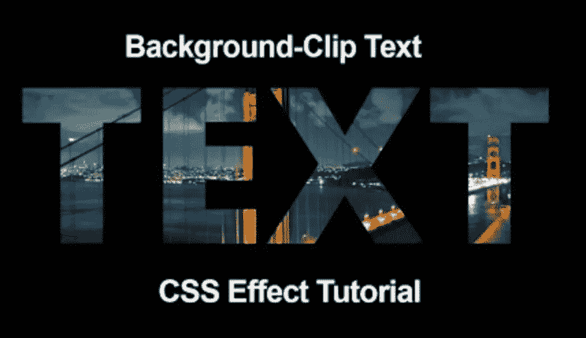

图片来自谷歌

你可以看到“文本”剪辑其背景形状。对于我们的情况，我们需要做的是相反的事情。我们只希望删除“交易”文本。不幸是，没有反剪辑属性。

为了创造我们想要的效果，我们将:

1.  首先，将文本放入一个 div 中，其中 div 包含与我们的背景相同的背景图片。
2.  给 div `background-clip: text`属性，允许我们得到一个带有背景纹理文本。
3.  最后，我们把这个 div 放到一个黑色背景的 div 上面。

对于垂直对齐，我们可以只使用`writing-mode: vertical-rl`

代码如下所示:

HTML:

SCSS:

为我们提供了这个结果:

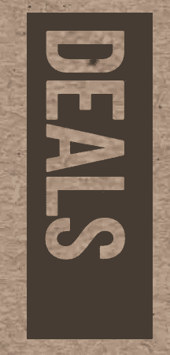

> 因为我们使用的是 vertical-rl，如果你看得足够近，你可以看到纹理的排列是不一样的。为了让它看起来更好，你可以简单地从背景中裁剪出另一个图像，旋转，然后用它作为交易的背景

**第六步:菜单分隔符**

下一部分是“菜单”分隔符。我们实际上可以创建只有一个 div 的分隔符。(使用 before 和 after 元素)

HTML:

SCSS:

> 有了 mixin，我们可以节省大量时间来编写重复的样式，而且它也为以后一次改变一切提供了可行性。

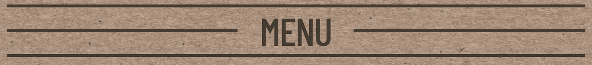

你会惊讶地发现，有多少东西可能只是一个 div

**第七步:食物菜单容器**

最后一部分(对于静态设计)是食物菜单。同样，它并不复杂，本质上是一个固定高度的 flex 列容器，它在溢出时换行到另一列。

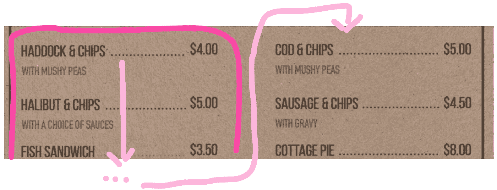

达到高度限制时，项目会换到另一列

为了让菜单看起来更自然，我还添加了一些食物来延长容器的长度。所有的食物都有相同的风格。所以我不打算在这里复制整个 html。

HTML:

SCSS:

> 我用“点状”边框来创造设计的圆点效果。然而，有一个缺点，不同的浏览器渲染“点”不同，我们对此无能为力。我发现“圆形”点一旦小于大约 2px 就变成了“矩形”。

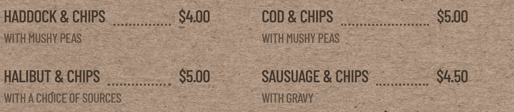

如果你仔细看，这个点实际上是长方形的

我还在菜单底部添加了一个页脚文本，这也是为了让整个设计看起来更可信。

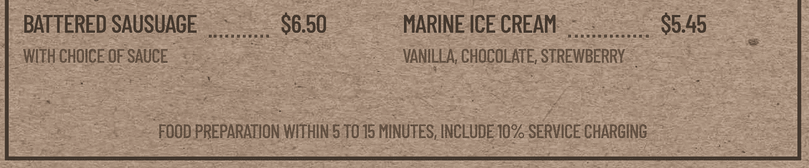

代码太简单了，所以我不会在这里展示

现在我们已经完成了整个设计。为了让事情更有趣，让我们添加一些动画。

**第七步:添加动画**

我想添加的动画是在悬停时填充颜色。当用户将光标指向文本时，白色将从左向右流动，将整个文本颜色从黑色变为白色。

为了创建填充颜色的效果，我们实际上可以再次应用“背景-剪辑:文本”。我们有一个文本，背景尺寸是**宽度的 200%** ，并且有明显的白色和黑色渐变，各取**宽度的 100%** 。文本本身是透明的，通过剪切掉背景来获得颜色。

默认情况下，文本是黑色的，因为它剪切掉了黑色背景。悬停时显示白色，我们需要做的就是**将背景位置向右移动**，逐渐显示白色背景

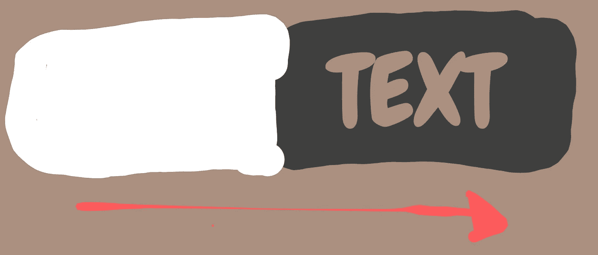

文字本身不会变色，但背景会。

我们还想让它成为一个全局混合，这样我们就可以将它应用于不同的文本。

SCSS:

最终结果看起来像这样:

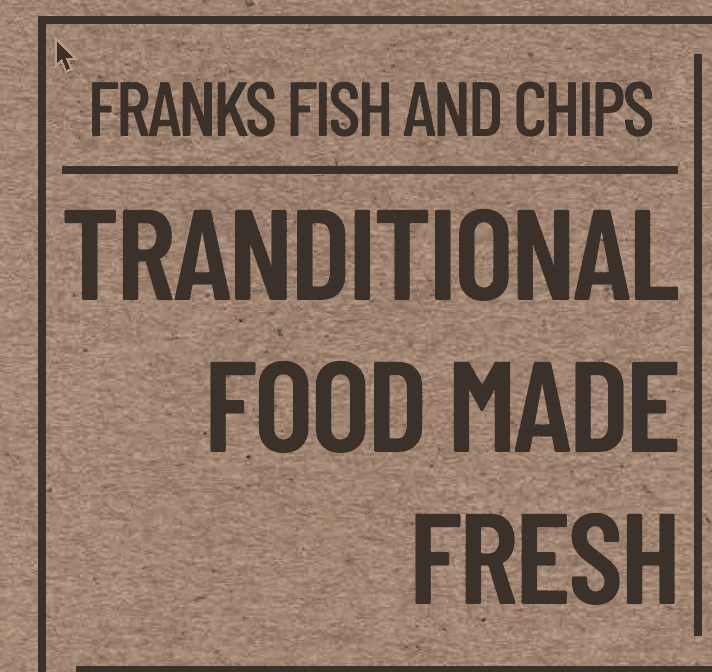

看起来相当不错！

# 结论

这是一个非常有趣的编码设计。乍一看，它看起来和其他的网页界面设计很不一样，而且看起来很难。但是，一件件分解下来，其实大部分都是我们熟悉的 CSS 样式。

有一件事可以做得更好，那就是动画线条，或者在文本着色和边框着色之间建立一个时间差。

总的来说，我对这个设计很满意。这不是我通常做的事情，但结果是令人满意的。喜欢的话可以随意留个掌声或者评论:)