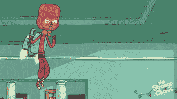
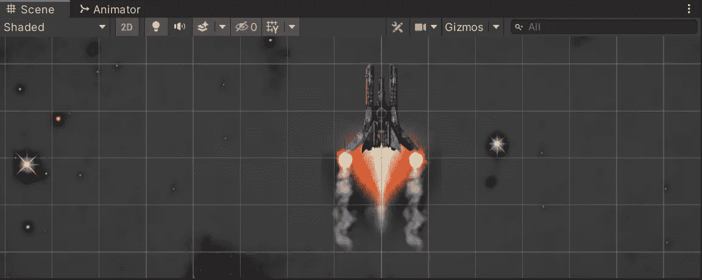
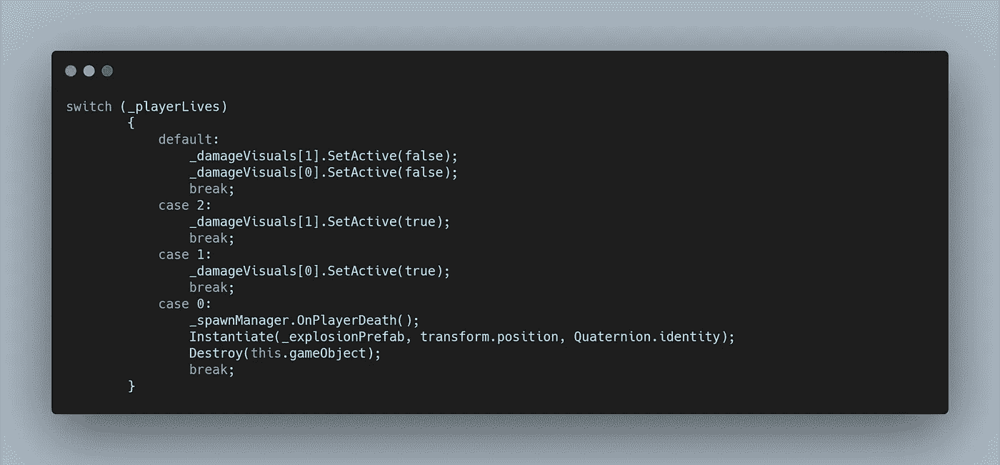

# 在 Unity 中使用动画精灵伤害 VFX

> 原文：<https://levelup.gitconnected.com/damage-vfx-using-animated-sprites-in-unity-382c2f46356f>

每当我们的玩家失去一条生命，我们应该用 VFX 和我们的 UI 来表示。对于每一个失去的生命，我们可以在每一个机翼上“引爆一个引擎”。

让我们将这两个伤害精灵作为玩家的子对象。

两者都将使用相同的动画和控制器，所以让我们创建一个并从两个游戏对象中访问它。

在我们的玩家脚本中，我们需要创建一个变量来访问游戏对象。我们可以使用一个数组来存储它们，因为我们可能还想在将来添加更多的损坏指示器。在我们的 TakeDamage 方法中，我们可以使用 switch 语句来运行每个生命数量的代码，而不是使用 if 语句来检查我们是否已经死亡。在这种情况下，我们可以简单地使用。相应地打开我们的游戏对象。

现在，随着我们生命减少，我们的飞船会受到更多的伤害。