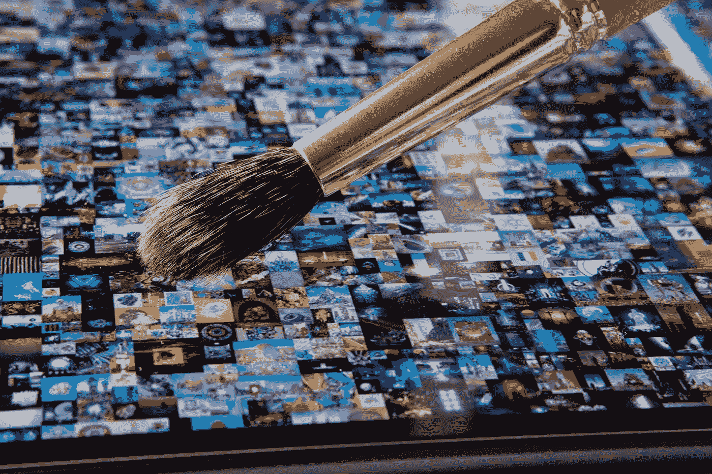

# 达明安·赫斯特的 NFT 实验将测试人们对金钱的看法，而不仅仅是对艺术的看法

> 原文：<https://levelup.gitconnected.com/damien-hirsts-nft-experiment-will-test-perceptions-about-money-not-just-art-4e89b603d59d>

## 证明价值是由集体协议塑造的(或者这应该是错觉)

比普尔的“每天:第一个 5000 天”NFT -图片来自 [Shutterstock](https://www.shutterstock.com/image-photo/tablet-beeple-digital-art-everydays-first-1937763139)

英国艺术家达明安·赫斯特以保存动物为特色的艺术最为著名。他创作于 1991 年的作品名为[“在一个活着的人看来，死亡在生理上是不可能的”](https://www.damienhirst.com/the-physical-impossibility-of)，作品描绘了一具悬挂在甲醛罐中的虎鲨尸体。它已经在伦敦领先的当代艺术画廊展出，据报道在 2004 年以至少 800 万美元的价格售出[。](https://en.wikipedia.org/wiki/The_Physical_Impossibility_of_Death_in_the_Mind_of_Someone_Living)

赫斯特的作品展示了艺术的两个关键原则:

*   艺术之所以成为艺术，是因为创作者和消费者之间达成了一种默契。
*   赋予艺术价值的是创作者和那些愿意交换同等价值的东西来拥有它或体验它的人之间的集体理解。

这两条原则也适用于金钱的概念——赫斯特的最新项目将证明这一理论。我特别兴奋的是，在这样做的过程中，他将证明同样的原则适用于传统艺术、加密货币和传统货币。

# “货币”

赫斯特的最新项目——*货币*是他第一次真正涉足[不可替代代币(NFTs)](/the-exact-process-i-used-to-create-and-sell-my-own-nft-art-on-the-ethereum-blockchain-698d9c59a2fe)——使用区块链技术存在的代币化和独特的艺术创作。[2021 年 3 月](https://news.artnet.com/art-world/damien-hirst-22-million-nft-cryptocurrency-1951847)——紧随艺术家皮普尔以 6900 万美元拍卖其 [NFT 之后](/what-makes-a-digital-image-file-worth-69-million-4d49a9eabcb7)——[赫斯特提供了一系列限量版版画](/how-to-use-nft-technology-to-issue-a-limited-edition-run-of-digital-prints-d06575d1fc23)，可以使用加密货币以太网或比特币购买。

在他的新项目[中，赫斯特将出售 10，000 幅 NFTs】，每幅都对应于他在 2016 年创作的一件实物艺术品。每个 NFT 和实体印刷品的组合将被出售一次，但这里有一个转折——买家必须决定他们是希望收到实体艺术品还是 NFT(区块链上存在的一种独特的数字“令牌”，将通过所有者的加密钱包以数字形式持有)。](https://news.artnet.com/art-world/damien-hirst-the-currency-1988535)

每位买家都有 12 个月的时间来决定是否用代币换取实物艺术品。在 2022 年年底，任何没有被 NFT 认领和交换的实物照片都将被烧毁。

这项实验将梳理出艺术品收藏家是否相信实物艺术品中存在价值，或者与之相对应的数字符号。一定程度上，这是由于 NFT 技术的出现以及一个不争的事实，即以前不存在的数字收藏品市场现在存在。

尽管从概念上来说，这个实验不仅仅是关于是什么让一件东西成为艺术，是什么赋予了这件艺术品内在的价值。同样的问题存在于金钱上，同样的答案也适用于金钱。

赫斯特没有忘记这种相似之处——该项目于 7 月 14 日启动，并在一段视频中进行了宣传，视频中他与英国央行前行长马克·卡尼和《金融时报》记者讨论了货币 T2。

来源:[推特](https://twitter.com/hirst_official/status/1415265847547940867?s=20)

# 什么是艺术？

我们可能都看过艺术作品，并暗自相信我们可以做得更好。许多父母表示，他们 4 岁的孩子可以复制一些世界上最受尊敬的现代艺术作品——一些父母已经进行了实验来证明这一点。

纪录片 [*我的孩子可以画出*](https://youtu.be/j46V9wclBaw) 探讨艺术价值是否存在于创作本身，或者它是否需要由特定类型的人创作才能具有真正的价值。

纪录片中的孩子据称从他们的画中赚了几十万美元——这证明了这一点:

> 不管是什么东西，是一幅画，一个雕塑，还是一个有形或虚拟的象征；它起源于哪里，谁创造了它，谁对它负责，都不重要；如果我们一致认为它有价值，那么它就有价值。

图片来自 [Shutterstock](https://www.shutterstock.com/image-photo/happy-shoutting-arrogant-rich-kid-boy-1425877793)

# 金钱也是如此

就像艺术一样，我们的货币体系也有价值，因为我们一致认为它有价值。

在你看来，你口袋里的 5 美元等同于 5 美元的购买力。
超市会允许你把它换成价值 5 美元的杂货。他们的供应商将向他们提供价值 5 美元的股票作为交换。
供应商的银行会在他们将 5 美元支付到他们的账户时认可这 5 美元的价值。

同样的道理也适用于我们在自动取款机屏幕上看到的数字，或者我们智能手机上的银行应用——数字 *5.00* 对我们来说意味着 5 美元的价值。我们不需要提取现金来确认这种信念。当银行挤兑发生时，人们急于取出他们的钱，这给了他们一种安全感，他们可以把钱握在手中——但随着我们走向一个现金不那么普遍、金钱不再受黄金支持的世界(几十年来都不是这样),这种安慰是空洞和毫无根据的。价值的集体认同才是最重要的。

重点是？我们的货币体系之所以有效，是因为我们集体同意参与其中，并认同屏幕上的数字和我们视为有价值的非贵金属、纸张或聚合物代币所代表的价值概念。

我们的货币碰巧是美元、英镑、欧元或日元，因为这些是我们储存和交换价值的公认工具。它很可能是比特币、达明安·赫斯特版画或小熊软糖。

从这个意义上来说，赫斯特的实验是他的艺术收藏者中公众意见的晴雨表。它将建立起集体情绪，我们将了解到他的客户中有多少人愿意通过数字令牌来证明他们拥有赫斯特的作品，而那些客户只允许自己通过能够指向和触摸物理印刷品来相信它。

# 稀缺很重要

赫斯特的项目展示了衍生价值的另一个重要因素——稀缺性和有限供给。关于货币的集体共识是，价值(部分)是由于在我们的经济体系中货币的供应是有限的。这使得我们拥有的金钱对我们来说变得稀缺而珍贵。

我们不能凭空合法地创造更多，而是必须工作以赚取更多或出售我们在价值交换中赚取的东西。集体错觉是，我们继续忽视我们的政府正在印刷越来越多的货币并将其注入我们的经济，而没有质疑这可能削弱我们已经拥有的货币的价值。

赫斯特的项目充分说明了稀缺的重要性。他的 NFT 以每个 2000 美元的固定价格出售，实物艺术品具有各种保护措施以防止假冒。存在于 Palm 区块链上的 NFT 采用了确保每个令牌都是唯一的、不可改变的并且被密码保护以防复制的技术。像比特币网络一样，*货币*是一个受保护的封闭“网络”,有着内在的有限供应。与每个 NFT 相关联的价值被保护免受供给膨胀的影响，供给膨胀可能在名义上稀释每个原始代币的价值。

赫斯特明白，他的艺术品的价值在一定程度上源自稀缺和对供应的控制，就像比特币所有者明白，他们持有的价值不会被未来大量发行的额外比特币稀释一样。开采和发行的比特币最多只有 2100 万枚，这一点已经写入了协议，就像赫斯特在*货币中设定了限量供应一样。*

# 价值上升(和下降)

艺术品的价值，就像货币的相对价值一样，基于多种因素而上下波动。

感知再次成为一个重要因素。我现在可能觉得持有美元比阿根廷比索更舒服，因为前者被广泛接受为全球储备货币，相对稳定，而后者正在以惊人的速度贬值。我可能更倾向于购买知名艺术家的印刷品，而不是我最喜欢的本地艺术家的原创作品，因为印刷品的市场更大，我更有可能让作品保持其价值。风险和市场力量对艺术品和货币的价值都有影响。

同样，许多人也在投机他们持有的艺术品和货币的价值。那些将比特币视为投机性投资的人希望，他们的投资可能会产生改变人生的回报，但他们也担心，比特币特有的价格暴跌可能会让他们的投资血本无归。那些购买赫斯特作品的人大概会希望它们也能升值。

2022 年 7 月最值得关注的是，有多少买家保留了他们的 NFT，又有多少人将它们换成了实物印刷品。相应的价格变化也将是有趣的观察。

那些选择纸质印刷品的人可能会期待它的价值会随着时间的推移而升值，尤其是当一些印刷品遭到破坏、稀缺性增加的时候。但是同样的市场力量可能会控制剩下的非功能性交易。最有趣的将是看哪一个升值(或贬值)更多——数字 NFT 和纸质印刷品。

作为公众意见的晴雨表，看看哪个价格更高将是非常有趣的，并且很可能提供关于公众接受纯数字资产作为相对于有形资产的价值储存手段的程度的见解。

可以合理地认为，与可以有物理表现的货币(例如美元)相比，同样的接受也适用于仅以数字形式存在的货币(例如比特币)。

通过这种方式，真实世界可以被视为模仿艺术世界(反之亦然)

# 为什么重要？

有些人可能会问，这些为什么重要？

许多人会认为花 2000 美元买一个数字代币，甚至是一件实物艺术品都是无聊的。

其他人会认为实验结束时烧毁剩余的指纹是肆意破坏。

有些人会认为艺术和金钱的实验是第一世界的特权，在许多方面他们可能是对的。

但这个实验不仅仅是一个自我放纵的项目或一个旨在冒犯或引发讨论或思考的艺术姿态——不像将动物保存在甲醛中，并在美术馆展出，以激发对生死的讨论。这是对价值概念的探索，以及我们作为个体对什么有价值，什么没有价值的感受。

这是关于金钱作为一个概念，以及我们对在现代数字时代赋予金钱价值的集体认知。

金钱可能被认为是万恶之源。这可能是世界运转的原因。但是它影响到我们所有人，不管我们是谁，也不管我们每个人拥有多少。

鉴于金钱在很大程度上是一种感知、错觉或集体共识，我们每个人都更好地理解它似乎很重要。

我会饶有兴趣地观看赫斯特的实验。

*如果你喜欢阅读这样的故事，并且愿意支持 Medium 上的作家，考虑注册成为 Medium 会员。一个月 5 美元，给你无限的故事。如果你注册使用我的链接，我会赚一小笔佣金。*

 [## 阅读托比·黑兹伍德(以及媒体上成千上万的其他作家)的每一个故事

### 作为一个媒体会员，你的会员费的一部分会给你阅读的作家，你可以完全接触到每一个故事…

tobyhazlewood.medium.com](https://tobyhazlewood.medium.com/membership) 

注:*本文仅供参考。不应将其视为财务或法律建议。在做任何重大财务决定之前，先咨询财务专家。*

## 如果你喜欢这篇文章，请随时加入我的电子邮件列表。