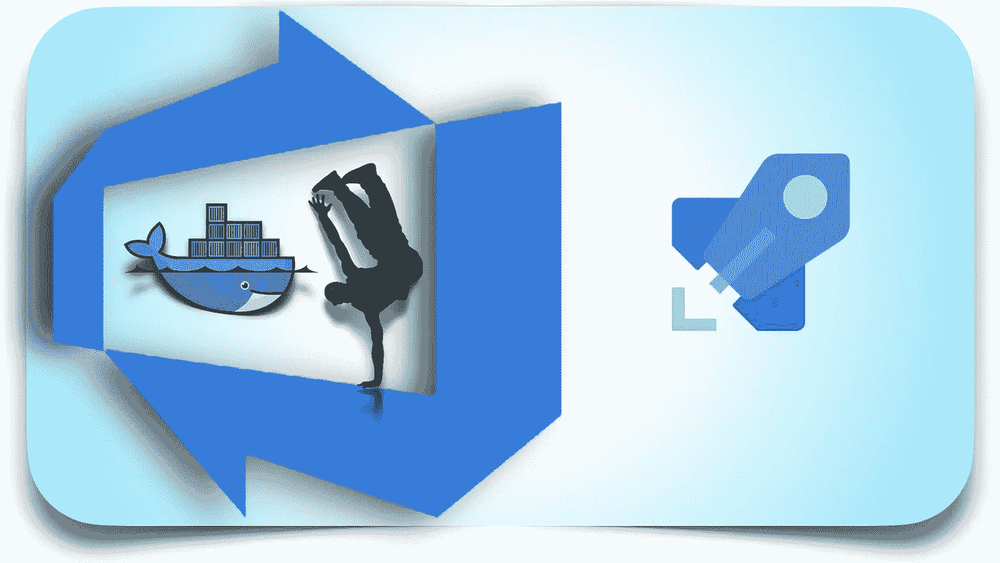
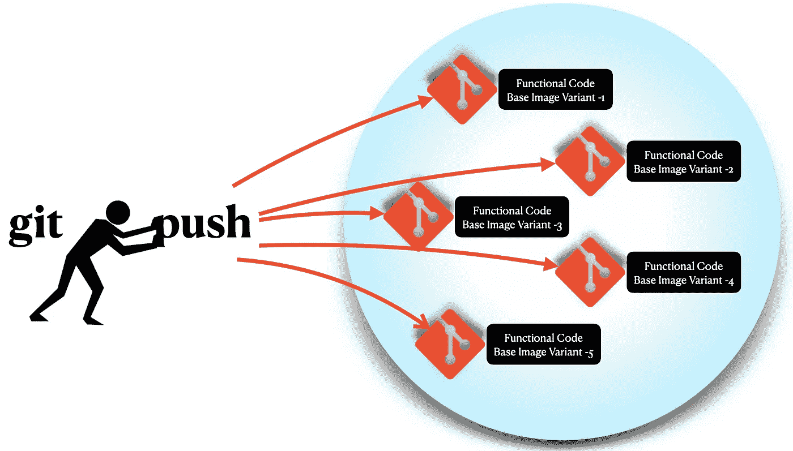
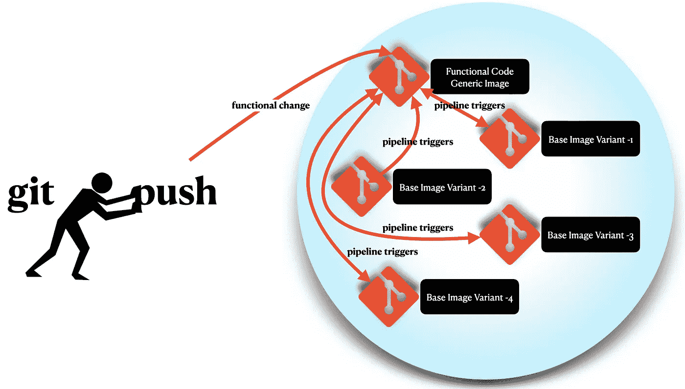
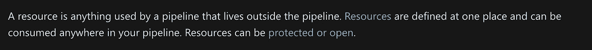
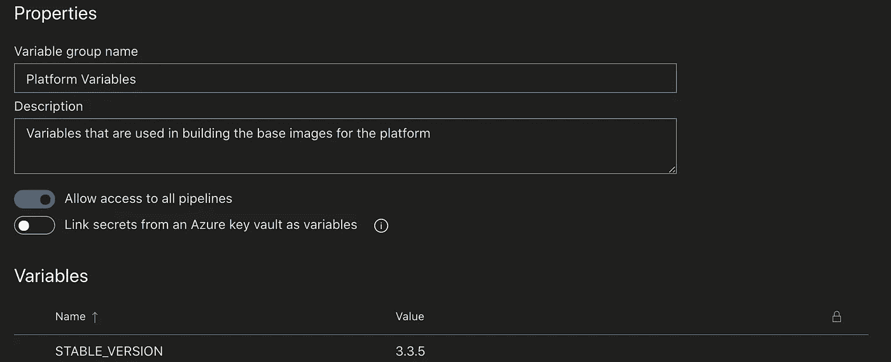
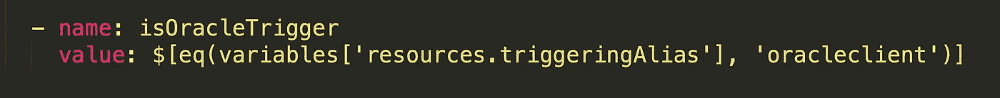
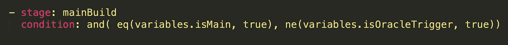
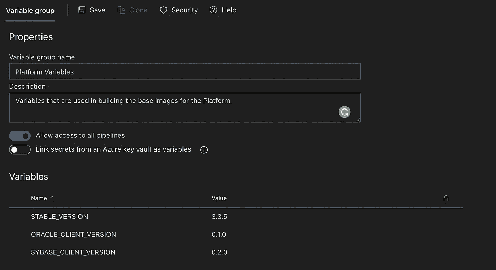
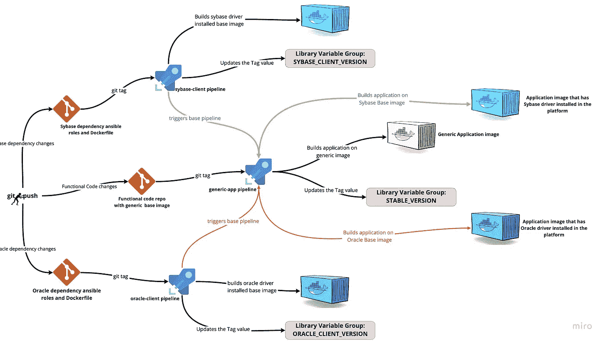

# 在 Azure DevOps 中与 Docker 图像共舞

> 原文：<https://levelup.gitconnected.com/dancing-with-docker-images-in-azure-devops-86da86e828d1>

## 通过触发器动态翻转 Azure 管道中的 docker 基本图像



在 Azure DevOps 中与 Docker 图像共舞

由于集装箱的兴起，建造集装箱的过程也发生了变化。构建容器映像的安全性和效率方面也是如此。

在许多方面，较小的容器映像更有效；即更少的存储空间、更快的拉速率、减少攻击面等。但同时，人们可能需要构建相同图像和功能的稍微不同的变体。也许因为你需要不同的工具或驱动程序。

这种场景的一个更好的例子是容器化一个应用程序，并部署它的多个实例，这些实例执行相同的功能，但与不同的数据库对话。因此，将所有的驱动程序预安装在映像中，并且只对每个实例的特定数据库使用它，将会导致容器中有太多过载和未使用的驱动程序。这将违反我们简单讨论过的较小图像尺寸策略。

但是从代码功能的角度来看，用相同的功能代码和映像构建逻辑创建太多的存储库也会导致太多的维护开销。因为如果功能发生变化，所有复制的存储库中的代码也需要改变。



需要将功能代码的更改推送到所有重复的回购中

相反，如果有一个构建通用应用程序的基本默认模板，并根据触发器翻转基本图像以产生变体，那就太好了。这将对代码的功能给予更多的控制，并且还允许开发者容易地引入对驱动程序的任何改变或升级，而不打扰功能代码报告，反之亦然。



对功能代码的更改只需推送到基础，所有映像变体都是通过管道触发器构建的

# 如何实现这一点？

这就是我们要用 docker 文件中的基本图像跳舞的地方。我的意思是，我们将在 Dockerfile 文件中定义一个基本的默认图像，并根据来自各个存储库的触发器翻转该基本图像，并在 Azure DevOps 管道中相应地标记它们。

在我们的场景中，我们正在创建一个 nodeJS 应用程序，它连接不同的数据库，即、Oracle、Sybase、MSSQL、PostgreSQL 等。为了使 nodeJS 与 oracle 连接，它需要将这里定义的 Oracle 驱动程序[预安装在平台中。同样，对于 sybase nodeJS 驱动程序，npm 包](https://github.com/oracle/node-oracledb) [node-sybase](https://www.npmjs.com/package/sybase) 需要预装 java 运行时。其余的数据库如 MSSQL、PostgreSQL 没有任何特殊的平台依赖性。这意味着我们需要使用一个基础图像

*   通用数据库，如 mssql、postgresql 等。,
*   为 oracle 应用程序安装的 oracledb 相关性，
*   为 sybase 应用程序添加了 sybase 依赖项。

我们将要处理的存储库命名如下，以消除混淆，并作为本文的参考。

*   ***ci_templates:*** 保存模板以备重用
*   ***generic-app:*** 在 generic 基础之上构建应用，并带有功能代码
*   ***oracle 客户端:*** 仅构建包含 oracle 客户端特定库的基础映像
*   ***sybase-client:***仅构建包含 Sybase 特定依赖项的基本映像。

# 配置项模板

在构建通用应用程序映像之前，我们将创建一个 docker 构建和 docker 推送模板。这将是同样的事情，我们要做的是建立有味道的基础形象。

Azure Pipelines 提供了一种重用其资源的方式。据 Azure 报道，



资源定义— Azure

我们将利用[存储库资源](https://docs.microsoft.com/en-us/azure/devops/pipelines/process/resources?view=azure-devops&tabs=schema#resources-repositories)。我们将创建一个名为`*ci_templates*`的公共模板库，并为 docker 构建存储模板。docker 构建和推送模板如下所示。

ci_templates repo 中的 docker 构建和推送模板

现在让我们用上面的模板构建通用的应用程序。稍后我们将再次访问模板库，以进一步添加模板。目前,`ci_templates`存储库的结构如下所示。

```
|_ docker.yml
```

# 通用应用程序

应用程序的 docker 文件如下所示。这是在`generic-app`库下创建的。

```
ARG BASE_IMAGE=node:alpine3.12
FROM $BASE_IMAGERUN mkdir -p /usr/src/app
WORKDIR /usr/src/app
COPY . /usr/src/app
RUN npm install
RUN npm run buildCMD ["npm", "start"]
```

上面的 Dockerfile 文件显示，如果没有构建参数传递给`*docker build*`命令，默认的基本映像将是`*node:alpine3.12*`。使用这个 *Dockerfile* 构建映像并在 Oracle 或 Sybase 上运行是行不通的。因为它们需要平台级的依赖性。

`generic-app`存储库结构将如下所示。

```
|_ Dockerfile
|_ package.json
|_ <nodeJS application logic folders/files>
|_ azure-pipelines.yml
```

默认 docker 文件的`*azure-pipelines.yml*`文件如下所示。

azure-pipelines.yml，用于通用应用程序报告中的通用映像构建

假设为运行作业正确定义了`*trigger*`和`*pool*`，上面的管道将执行以下操作。

***第一步:*** 导入`*MyProject*` *下名为`*ci_templates*`的库，*将其称为`*templates*` *。*

***第二步:*** 导入变量组`*Admin Variables*`和`*Platform Variables*`下的变量。我们在`*Admin Variable*`组下保存了一个 PAT。`*Platform Variables*`用于存储我们正在使用的存储库的最新标签。

***第三步:*** 流水线会确定`*isMain*`和`*isTag*`变量的值。这用于通过执行条件检查来运行管道定义中的正确阶段。

***步骤 4:*** 根据是`*main*`分支构建还是`*tag*`删除的条件，通过从称为`*templates*`的库中导入 docker 模板来执行相应的阶段。

***步骤 6:*** 如果管道被标记丢弃触发，标记值的更新将发生在上述样本文件中第 29 行的`*updateVariable*`阶段。

在这个阶段，我们将作业作为*容器化的*作业运行，并为其使用`*gkarthics/ci-swiss-knife*`映像。我们使用以下命令登录 Azure DevOps

```
echo ${AZURE_DEVOPS_CLI_PAT} | az devops login
```

其中`*AZURE_DEVOPS_CLI_PAT*`是存储在`*Admin Variables*`变量组中的 PAT 令牌。

之后，我们使用命令设置默认的 *Azure 组织*和*项目*，

```
*az devops configure --defaults organization=*[*https://azure.com/MyORG*](https://azure.com/MyORG) *project=$PROJECT_NAME --use-git-aliases true*
```

登录并设置默认值后，标签值需要在*库组变量*中更新。为此，请在管道中使用以下命令。

```
*az pipelines variable-group variable update --group-id <GROUP_ID_VALUE> --name <VARIABLE_NAME> --value $TAG*
```

这将更新该值，并将其存储在指定的变量组下，以供将来参考。这将看起来像下面的。



更新了库变量组中的 STABLE_VERSION 值

# Oracle 基本变体

既然已经使用默认的基本映像构建了通用应用程序，并且最新的标记存储在变量中，那么让我们使用 ansible 构建一个包含 Oracle 库的映像。Dockerfile 和 Ansible 将如下所示。

要求. yml

Ansible 中的`*requirements.yml*`文件用于定义需要安装的集合。在上面的文件中，我们已经定义了使用`gkarthiks.ansible_oracledb_client.`这也可以在 [Ansible Galaxy](https://galaxy.ansible.com/gkarthiks/ansible_oracledb_client) 中查看。

playbook.yml

`*playbook.yml*`将记录并执行配置。在我们的`playbook.yml`文件中，我们添加了 *oracledb-client* 作为要执行的角色，它是在上面的 requirements.yml 文件中定义的。

Dockerfile 文件

在构建在`*Dockerfile*.`中定义的映像时会用到这些，现在让我们为 Azure 管道定义`*azure-pipelines.yml*`。

OracleDB 客户机的基本映像构建管道

与前面的 docker 映像构建类似，上面的管道将按照 *ansible-playbook* 中的说明，安装 *oracledb-client* 来构建容器映像。一旦标签被丢弃，标签也将被存储在名为*平台变量的*库组变量*中。*

# 管道触发器

既然已经构建了映像，我们需要触发主存储库的管道。以便具有 Oracle 依赖性的新基础映像将与功能代码一起使用。

Azure DevOps 提供了一种方法，可以轻松地将一个存储库的管道作为资源包含到另一个存储库中。更多细节请点击[这里](https://docs.microsoft.com/en-us/azure/devops/pipelines/process/resources?view=azure-devops&tabs=schema#resources-pipelines)。这将让存储库的管道在包含的管道完成时自动触发。

让我们稍微改变一下原始的基本映像存储库管道，以适应上面的逻辑。将下面的代码包含到基本通用应用程序库管道中的`resources`部分。

将管道资源添加到通用应用程序报告中

上面定义了`generic-app`仓库中的管道将在`oracle-lient` repo 中的阶段`updateVariable`成功完成后不久被触发。

这将触发`generic-app`存储库中的管道，但也会有点混乱，因为它将触发默认分支。我们需要为 oracledb-client 基本映像定义特定的触发条件，以便可以传递自定义映像名称和自定义标记。让我们稍微改变一下管道的定义，来定义具体的工作。

要做到这一点，我们需要确定触发源。预定义的环境变量`resources.triggeringAlias`将给出触发管道的名称。在这种情况下，我们需要根据字符串`oracleclient`进行验证，因为这是我们在参考资料中定义的名称。这将看起来像下面的。



通用应用程序报告管道中触发器名称的变量解析

现在，这被添加到同一个 *azure-pipelines.yml* 文件中的其他变量列表中。下一步是在其余作业中排除该触发器的运行，并定义特定的作业。排除条件将如下所示。



排除管道触发器的主生成中的条件

在定义管道触发器作业之前，让我们为构建创建一个公共模板。因为这在以后的 sybase 映像中也是一样的。

ci_templates repo 中的上游 docker 构建和推送模板

现在`ci_templates`存储库结构将有一个附加文件，如下所示。

```
|_ docker.yml
|_ upstream-docker.yml
```

现在让我们使用来自`ci_templates`仓库的模板为触发器定义作业。

通用应用程序报告中的 oracle 客户端触发器作业定义

只有当`orcale-client`流水线成功执行`updateVariabvle`阶段时，上面定义的作业才会被触发。传递给这个具有 oracle 依赖关系的应用程序的自定义映像名称是`query-engine-oracle-client.`，它也用自定义标记值标记为<generic-app-tag _ Oracle-client-tag>。

仔细查看参数，一个`buildArgs`正在被传递给构建命令。这用于传递在`generic-app`存储库中的 Dockerfile 中定义的参数`BASE_IMAGE`的值。执行该命令时，该参数的值将被解析为由`oracle-client` repo 构建的图像`oracle-client:0.1.0`。因此，该作业的 docker 文件将如下所示。

```
FROM oracle-client:0.1.0RUN mkdir -p /usr/src/app
WORKDIR /usr/src/app
COPY . /usr/src/app
RUN npm install
RUN npm run buildCMD ["npm", "start"]
```

现在，用它构建的映像可以在 Oracle 数据库上运行，不会出现任何问题。

# 构建 Sybase 变体

既然我们已经为`oracle-client`定义了一个逻辑及其相应的助手模板，那么对于`sybase-client`来说也是一样的。

安装 Sybase 依赖项的`playbook.yml`文件如下所示。

为 Sybase 安装 JRE 的行动手册

`sybase-client`存储库对应的 Dockerfile 看起来将会像这样

sybase-client repo 中的 Dockerfile

sybase-client 存储库的`azure-pipelines.yml`文件将看起来像这样

sybase-client repo 中 Sybase 客户端的基本映像构建管道

现在，与`oracle-client`类似，我们必须对`generic-app`存储库的管道做一些改变。编辑后的管道将如下所示。

在通用应用程序报告中完成 azure-pipelines.yml

注意，您必须在主分支构建中排除`sybaseTrigger`和`oracleTrigger`。

这是一种方式。现在，如果`sybase-client`或`oracle-client`存储库中有变化，那么`generic-app`存储库将被触发，并且将构建一个新的应用程序映像。当功能代码发生变化时，为了达到同样的目的，在`oracle-client`和`sybase-client`库中添加触发器和相应的条件。

最终的变量组将如下所示，所有的`STABLE_VERSION`、`ORACLE_CLIENT_VERSION`和`SYBASE_CLIENT_VERSION`的值都已更新。



具有所有标签值的库变量组根据标签删除进行更新

这就是我们如何在 Azure devo PS Pipelines***中与 Docker 图像共舞💃*** 。



该图显示了我们在文章中讨论过的单向管道触发器

如果你喜欢这篇文章，请通过拍手帮助其他人找到它，并在这里和 Twitter 上关注我以获取更多更新。

# 参考

*   [天蓝色管道](https://docs.microsoft.com/en-us/azure/devops/pipelines/get-started/what-is-azure-pipelines?view=azure-devops)
*   [Azure 管道预定义变量](https://docs.microsoft.com/en-us/azure/devops/pipelines/build/variables?view=azure-devops&tabs=yaml)
*   [Dockerfile 参数 ARG](https://docs.docker.com/engine/reference/builder/#understand-how-arg-and-from-interact)
*   [蔚蓝管道资源](https://docs.microsoft.com/en-us/azure/devops/pipelines/process/about-resources?view=azure-devops)
*   [Ansible OracleDB 客户端](https://galaxy.ansible.com/gkarthiks/ansible_oracledb_client)
*   [CI 瑞士刀容器图像](https://hub.docker.com/repository/docker/gkarthics/ci-swiss-knife)
*   [nodeJS Sybase 驱动](https://www.npmjs.com/package/sybase)
*   [节点-OracleDB 驱动程序](https://oracle.github.io/node-oracledb/)