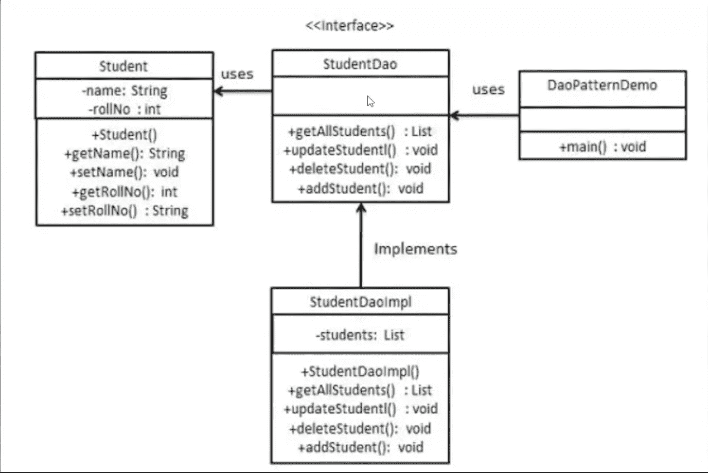

# DAO(数据访问对象)模式

> 原文：<https://levelup.gitconnected.com/dao-data-access-object-pattern-16afde253dc3>

## 这是什么设计模式，它有什么作用？

DAO 通常用在使用数据库的应用程序中。它是应用于数据库接口的 MVC(模式)模式的一个特殊实例。

## 什么是设计模式？

*设计模式描述了一个在面向对象编程中反复出现的问题，然后描述了该问题解决方案的核心，以这种方式，你可以使用这个解决方案一百万次，而不必以同样的方式做两次。*

*—克里斯多夫·亚历山大*

《设计模式》是 1994 年出版的一本书，它对面向对象编程非常有影响。作者通常被称为“四人帮”。[【1】](https://wgu.hosted.panopto.com/Panopto/Pages/Viewer.aspx?id=1fd36595-7809-4475-a395-ada401479280)

## 什么是 MVC 模式？

MVC 是模型-视图-控制器模式。这种模式用于分离应用程序的关注点。

**模型** —代表一个对象。它通常携带数据或状态，如果数据发生变化，它可以有逻辑来更新控制器。[【1】](https://wgu.hosted.panopto.com/Panopto/Pages/Viewer.aspx?id=1fd36595-7809-4475-a395-ada401479280)

**视图** —表示模型包含的数据的可视化。[【1】](https://wgu.hosted.panopto.com/Panopto/Pages/Viewer.aspx?id=1fd36595-7809-4475-a395-ada401479280)

**控制器** —作用于模型和视图。它控制进入模型对象的数据流，并在数据改变时更新视图。它将视图和模型分开。[【1】](https://wgu.hosted.panopto.com/Panopto/Pages/Viewer.aspx?id=1fd36595-7809-4475-a395-ada401479280)

## 什么是数据访问对象设计模式？

DAO 模式用于将低级数据访问 API 或操作与高级业务服务分开。

以下是刀型的碎片。

**数据访问对象接口** —定义要在模型对象上执行的标准操作[【1】](https://wgu.hosted.panopto.com/Panopto/Pages/Viewer.aspx?id=1fd36595-7809-4475-a395-ada401479280)

**数据访问对象具体类** —实现上述接口[【1】](https://wgu.hosted.panopto.com/Panopto/Pages/Viewer.aspx?id=1fd36595-7809-4475-a395-ada401479280)

**模型对象或值对象** —一个简单的 POJO (Plain Old Java Object ),包含 get/set 方法来存储使用 DAO 类检索的数据。[【1】](https://wgu.hosted.panopto.com/Panopto/Pages/Viewer.aspx?id=1fd36595-7809-4475-a395-ada401479280)

## 什么是 POJO(普通旧 Java 对象)？

当我们谈论 POJO 时，我们描述的是一种简单的类型，不涉及任何特定的框架。**POJO 对我们的属性和方法没有命名约定**。

让我们创建一个基本的员工 POJO。它有三个属性。名字、姓氏和开始日期:

```
public class **EmployeePojo** { public String firstName;
    public String lastName;
    private LocalDate startDate; public **EmployeePojo**(String firstName, String lastName, LocalDate startDate) {
        this.firstName = firstName;
        this.lastName = lastName;
        this.startDate = startDate;
    } public String **name**() {
        return this.firstName + " " + this.lastName;
    } public LocalDate **getStart**() {
        return this.startDate;
    }
}
```

这个类可以被任何 Java 程序使用，因为它不依赖于任何框架。[【2】](https://www.baeldung.com/java-pojo-class#what-is-a-pojo)

## Java 中简单 DAO 应用程序的 UML 图示例



在上面我们看到一个接口在中间上方，具体类在中间下方，模型类在左边。右边是 main，使用 DAO 的程序入口。[【1】](https://wgu.hosted.panopto.com/Panopto/Pages/Viewer.aspx?id=1fd36595-7809-4475-a395-ada401479280)

# 参考

[] WGU 大学幻灯片。C195。软件 II —高级 Java 概念。C195 组织你的代码。[https://wgu.hosted.panopto.com/Panopto/Pages/Viewer.aspx?id = 1fd 36595-7809-4475-a395-ada 401479280](https://wgu.hosted.panopto.com/Panopto/Pages/Viewer.aspx?id=1fd36595-7809-4475-a395-ada401479280)

[2]什么是 POJO？[https://www.baeldung.com/java-pojo-class#what-is-a-pojo](https://www.baeldung.com/java-pojo-class#what-is-a-pojo)