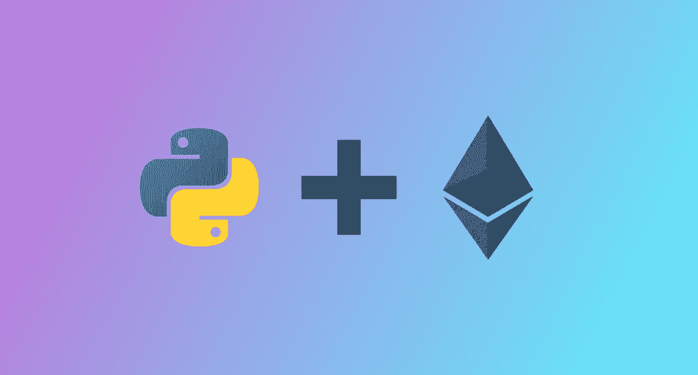
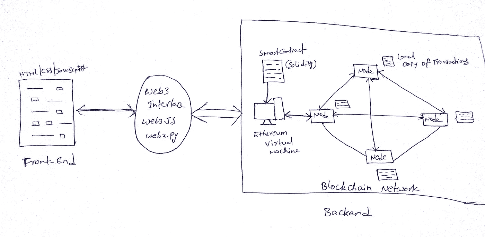

# Python 程序员的 DApp 开发

> 原文：<https://levelup.gitconnected.com/dapps-development-for-python-developers-f52b32b54f28>



图片由 hackernoon 的 Nick Willams 提供

# **什么是 DApp**

“DApp”代表分散应用。像传统的应用程序一样，去中心化的应用程序有前端(客户端)和后端(服务器端)。DApp 的用户界面可以用任何语言编写(就像传统的应用程序一样),并且可以调用它的后端。

那么，Dapps 和传统 app 有什么不同呢？DApp 的后端代码运行在分散的对等网络(即区块链)上。你可能听说过 **BitTorrent、Tor、爆米花时间**——它们是运行在对等网络上的 DApps，但不在区块链上。

区块链 DApp 有自己的后端代码，称为**智能合约**，可以部署到区块链(最常见的以太坊)。智能合约定义了整个 DApp 的逻辑。这是使用区块链作为后端的生命线。

你可能会想“这是个玩笑，对吗？你说的是传统前端，并将其连接到区块链。一个 Python 开发者在哪里可以利用呢？”重点来了——**web 3**。Web3 是一个库的集合，它允许你与本地的以太坊区块链互动。简单地说，web3 是与你的后台(区块链)沟通的桥梁。幸运的是，以太坊开发者制作了一个用于与以太坊交互的 python 库 **web3.py** 。它的 API 源自 web3 的 JavaScript 版本。因此，除了 web3.js，我们还可以通过 web3.py 库与区块链进行交互。



DAPP 架构

Dapps 开发包括三个简单的步骤

1.  在区块链网络上部署智能合同
2.  从已部署的智能合约中读取数据
3.  将事务发送到已部署的智能合约

我们将使用 web3.py 库在 python 环境中一步一步地执行这三个操作。

要与区块链交互，我们必须连接到任何完全同步的节点。在本教程中，我们指向一个 Infura 节点。确保你有一个以太坊钱包(用 Metamask chrome 扩展或 [myetherwallet](https://www.myetherwallet.com/create-wallet) 创建以太坊钱包，并安全存储你的私钥)并在其中添加一些测试以太进行操作。

**先决条件**

1.  [Python 2.7 +](https://www.python.org/downloads/)
2.  [节点. js](https://nodejs.org/en/)
3.  松露

```
npm install -g truffle
```

4.点

```
npm i pip
```

5.web3.py

```
pip install web3
```

6.Infura 项目 API

前往 [Infura 站点](https://infura.io/register)进行注册。创建一个新项目并复制 Ropsten Infura RPC URL。我们将在 Ropsten 测试网络中部署我们的智能合约。

## **智能合约**

每个程序员都用他们最喜欢的编程语言执行过“hello world”程序，以了解运行该语言的基础知识。这是我们用 Solidity 语言编写的简单的“hello world”版本的 greeter smart contract，我们可以在区块链上添加一个问候并检索它。Solidity 是编写智能合同的最常见语言，它编译成字节码，可以在运行于节点上的以太坊虚拟机上执行。

您可以通过传递一个字符串值使用`greet()`方法添加问候语，并使用`getGreting()`方法检索问候语。

## 1.在区块链网络上部署智能合约

**a)创建项目:**

```
mkdir pythonDappcd pythonDapptruffle init
```

项目初始化成功后，进入你的文件夹，在你的`/contracts`目录下创建`greeter.sol`文件。在网络上部署契约之前，我们必须编译它并构建工件。

**b)智能合同的编制:**

所以对于编译，我们将使用 Truffle `solc`编译器。在主目录中，运行以下命令:

```
truffle compile

      (or)truffle.cmd compile #(for windows only)
```

上面的命令将在`/contracts` 目录中编译您的合同，并在`/build`目录中创建二进制工件文件`greeter.json`。

**c)部署合同:**

打开你的 python IDLE 编辑器，用下面的代码在主目录`deploy.py`中创建一个新文件，然后在你的目录中运行`py deploy.py`。

我是这样做的:

*   导入的 web3 库和所有其他必需的模块
*   通过指向 Ropsten Infura 节点启动了 web3 提供程序
*   为签名交易添加了帐户地址和私钥。不要忘记在代码中添加您的凭据。
*   通过指向 Truffle 编译的工件文件`greeter.json`的`abi`和`bytecode`启动合同实例
*   增加了 **construct_txn** 参数，如 **nonce** ， **gas，gasPrice。**这里的 **gas** 是指以太坊中一个交易应该使用并付费的最大计算资源量。**气价**是指[交易](https://ethgasstation.info/)中使用该数量气的最小乙醚量。**到**是指您发送交易的地址。仅当您向帐户或智能合同发送以太网时，才需要**至**参数。
*   用我们的私钥签署交易并在网络上广播。
*   控制台中记录的事务哈希和部署的合同地址。根据以太坊，transacton 处理时间为<20 secs. So you must wait for 20 secs to get the deployed contract address. Your backend is successfully deployed on the Ethereum blockchain now. Now you can interact with your smart contract with this address. Copy this contract address.

## **2。向已部署的合同发送交易**

在我们的契约中，有一个方法`greet()`。我们可以单独用这个方法在我们的合同中添加一个问候语。让我们看看如何用 web3.py 实现它。

打开 python 空闲编辑器，用下面的代码创建一个新文件`sign.py`。然后在你的目录中运行`py sign.py`。

我是这样做的:

*   导入的 web3 库和所有其他必需的模块
*   通过指向 Ropsten Infura 节点启动了 web3 提供程序
*   添加了用于签名交易的帐户地址和私钥
*   通过指向块菌编译工件文件`greeter.json`的`abi`和`bytecode`发起契约实例
*   创建了`tx`对象来添加问候“你好，我所有的好朋友”并构建了一个事务
*   用我们的私钥签署交易并在网络上广播。
*   在控制台中记录事务哈希。您可以使用您的交易散列在 [etherscan](https://ropsten.etherscan.io/) 上检查交易状态。一旦交易被矿工验证，我们的问候将被添加到区块链。您可以使用`getGreeting()`功能检索问候语，如下所述。

## 3.从部署的智能合同中读取数据

在我们的契约中，有一个方法`getGreeting()`在区块链中检索我们添加的问候语。我们将用 web3.py 调用这个方法

打开 python 空闲编辑器，用下面的代码创建一个新文件`read.py`。运行`py read.py`读取问候语

我是这样做的:

*   导入的 web3 库和所有其他必需的模块
*   通过指向 Ropsten Infura 节点启动了 web3 提供程序
*   通过指向`abi`和`contract_Address`创建了`contract`实例(来自上一步)
*   调用`getGreeting()`方法并在控制台中打印结果

## 结论

现在，您应该已经了解了如何使用 web3.py 部署、交互和签署事务。让我们通过查看我使用 web3.py 创建的实时 [DApp](https://github.com/Salmandabbakuti/Python-Dapp) 并将 flask 用于前端服务器[来将所有部分结合在一起。它将帮助您更深入地了解用 Python 进行 DApp 开发。](https://github.com/Salmandabbakuti/Python-Dapp)

如果你也熟悉 JavaScript，你可以在这里看一篇类似的文章