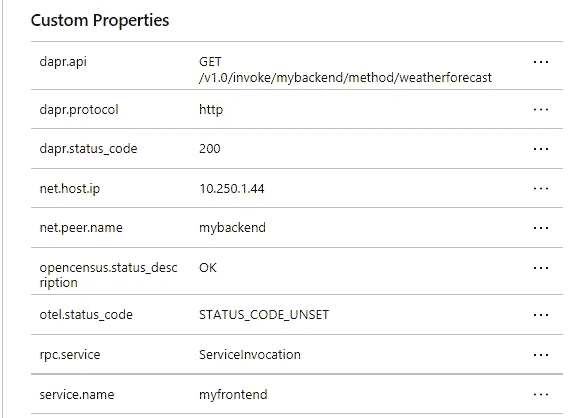
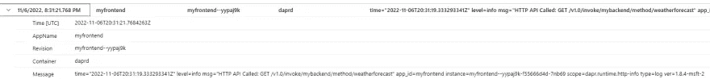

# Azure 容器应用程序的 Dapr 服务调用

> 原文：<https://levelup.gitconnected.com/dapr-service-invocation-with-azure-container-apps-5918f59db088>

## 通过与 Azure 容器应用的集成，我们可以使用 DaprService 调用来调用其他容器应用。


上周我有一点时间来学习 Dapr，所以我开始阅读。NET 开发者的电子书，可以在我们的文档中找到(顺便说一下，完全免费！).在前面的一章中，该书概述了一个教程，您可以在本地运行该教程，以使用服务调用在两个应用程序之间进行通信。

在本地运行相当简单，所以我想将这两个应用程序部署为容器应用程序，因为它在平台中支持 Dapr。

因此，本文将简单介绍 Dapr 中的服务调用，容器应用程序如何支持 Dapr，以及我们如何设置容器应用程序环境来支持我们的 Dapr 应用程序。

# Dapr 中的服务调用

Dapr 有几个构建块，我们可以用它们来构建分布式微服务。构建块是可以从应用程序代码中调用的 HTTP 或 gRPC APIs。它们有助于解决我们在构建微服务时面临的挑战，并将最佳实践和模式整理成文。

其中一个构建块支持服务调用，这允许您的应用程序使用 HTTP 或 gRPC 与其他应用程序进行可靠的通信。服务调用就像一个反向代理，提供服务发现、访问控制、指标、重试等等。

关于 Dapr 中服务调用的更多信息，[查看文档](https://docs.dapr.io/developing-applications/building-blocks/service-invocation/service-invocation-overview/)。

# Azure 容器应用中的 Dapr

可以在容器应用上构建 Dapr 应用。您可以在您的环境中启用容器应用程序来使用 Dapr，并且可以在环境级别配置 Dapr 组件，这些组件可以在多个容器应用程序之间共享。

我们为支持 Dapr 的容器应用程序提供一个标识符，用于服务发现、状态封装和发布/订阅消费。

对于这个例子，我们不会配置任何 Dapr 组件。通过服务调用，我们将只使用 Dapr 在我们的应用程序之间进行通信。如果我们要为我们的容器应用程序使用组件，我们可以将我们的组件扩展到需要使用这些组件的特定 Dapr 应用程序。

更多关于 Dapr 与 Azure 容器应用集成的信息，[请看下面的](https://learn.microsoft.com/en-us/azure/container-apps/dapr-overview?tabs=bicep1%2Cyaml)。

# 在我们的应用中使用服务调用。

在我的[示例代码](https://github.com/willvelida/aca-dapr-service-invocation)中，我有两个 C#项目:一个是 ASP.NET 核心 web 应用程序(充当我们的前端应用程序)，它将通过 Dapr 与 ASP.NET 核心 Web API(将成为我们的后端应用程序)通信。它所做的就是使用服务调用构建块从 API 中检索天气预报。

为了实现这一点，我们需要在前端应用程序中进行以下更改。首先，我们需要安装 Dapr。NET SDK:

```
Install-Package Dapr.AspNetCore
```

然后，我们需要在 Program.cs 文件中添加 DaprClient:

```
// Add services to the container.
builder.Services.AddDaprClient();
builder.Services.AddRazorPages();

// REST OF THE FILE
```

这将向 ASP.NET 核心依赖注入系统注册 DaprClient。现在，当我们需要与服务调用构建块通信时，我们可以将 DaprClient 实例注入到代码中。

我们将在主页上显示天气预报数据，因此需要在 Index.cshtml.cs 文件中进行更改。在我们的 OnGet()方法中，我们需要进行以下更改:

```
public async Task OnGet()         {             var forecasts = await _daprClient.InvokeMethodAsync<IEnumerable<WeatherForecast>>(                 HttpMethod.Get,                 "mybackend",                 "weatherforecast");              ViewData["WeatherForecastData"] = forecasts;         }
```

InvokeMethodAsync 正在进行服务调用调用。查看参数:

*   HttpMethod。Get =这是我们将对服务使用的 HTTP 方法。在本例中，我们对容器应用程序发出 GET 请求。
*   “my back end”=这是我们调用的 Dapr 应用程序的应用程序 Id，我们将在容器应用程序配置中设置它。**请注意**在编写的时候，容器应用程序有一个限制，即应用程序名称必须全部小写，所以请确保在这个方法中使用正确的名称。
*   “weather forecast”=这是我们后端将调用的方法名。这将是我们后端 api 中的“GetWeatherForecast”方法。

# 配置我们的 Bicep 代码以支持 Dapr

正如我前面提到的，Dapr 是在容器应用程序级别启用的。Dapr APIs 通过 Dapr sidecar 暴露给每个容器应用程序，Dapr sidecar 将通过 HTTP 从我们的容器应用程序调用。

我们将在 Bicep 模板中为两个容器应用程序启用 Dapr:

```
var frontendName = 'myfrontend'
var backendName = 'mybackend'

// Omitted Bicep code

resource env 'Microsoft.App/managedEnvironments@2022-06-01-preview' = {
  name: containerEnvironmentName
  location: location
  tags: tags
  properties: {
   daprAIConnectionString: appInsights.properties.ConnectionString
   appLogsConfiguration: {
    destination: 'log-analytics'
    logAnalyticsConfiguration: {
      customerId: logAnalytics.properties.customerId
      sharedKey: logAnalytics.listKeys().primarySharedKey
    }
   } 
  }
}

resource frontend 'Microsoft.App/containerApps@2022-06-01-preview' = {
  name: frontendName
  location: location
  tags: tags
  properties: {
    managedEnvironmentId: env.id
    configuration: {
      activeRevisionsMode: 'Multiple'
      ingress: {
        external: true
        transport: 'http'
        targetPort: 80
        allowInsecure: false
      }
      dapr: {
        enabled: true
        appPort: 80
        appId: frontendName
      }
      secrets: [
        {
          name: 'container-registry-password'
          value: containerRegistry.listCredentials().passwords[0].value
        }
      ]
      registries: [
        {
          server: '${containerRegistry.name}.azurecr.io'
          username: containerRegistry.listCredentials().username
          passwordSecretRef: 'container-registry-password'
        }
      ]
    }
    template: {
      containers: [
        {
          image: frontendImage
          name: frontendName
          env: [
            {
              name: 'ASPNETCORE_ENVIRONMENT'
              value: 'Development'
            }
          ]
          resources: {
            cpu: json('0.5')
            memory: '1.0Gi'
          }
        }
      ]
      scale: {
        minReplicas: 0
        maxReplicas: 5
      }
    }
  }
  identity: {
    type: 'SystemAssigned'
  }
}

resource backend 'Microsoft.App/containerApps@2022-06-01-preview' = {
  name: backendName
  location: location
  tags: tags
  properties: {
    managedEnvironmentId: env.id
    configuration: {
      activeRevisionsMode: 'Multiple'
      ingress: {
        external: false
        transport: 'http'
        targetPort: 80
        allowInsecure: false
      }
      dapr: {
        enabled: true
        appPort: 80
        appId: backendName
      }
      secrets: [
        {
          name: 'container-registry-password'
          value: containerRegistry.listCredentials().passwords[0].value
        }
      ]
      registries: [
        {
          server: '${containerRegistry.name}.azurecr.io'
          username: containerRegistry.listCredentials().username
          passwordSecretRef: 'container-registry-password'
        }
      ]
    }
    template: {
      containers: [
        {
          image: backendImage
          name: backendName
          env: [
            {
              name: 'ASPNETCORE_ENVIRONMENT'
              value: 'Development'
            }
          ]
          resources: {
            cpu: json('0.5')
            memory: '1.0Gi'
          }
        }
      ]
      scale: {
        minReplicas: 0
        maxReplicas: 5
      }
    }
  }
  identity: {
    type: 'SystemAssigned'
  }
}
```

在我们的容器应用程序环境中，我们正在配置我们的 Application Insights 实例，以收集当我们的不同服务之间发生通信时，Dapr 将生成的遥测数据。

在本例中，我使用连接字符串连接到我的 Application Insights 工作区。在 2025 年 3 月 31 日，[对 Application Insights 中检测密钥摄取的支持将终止](https://learn.microsoft.com/en-us/azure/azure-monitor/app/separate-resources#about-resources-and-instrumentation-keys)，所以现在就开始使用连接字符串吧。(也不是容器应用特定的)。

在我们的容器应用中，我们像这样配置 Dapr:

```
var frontendName = 'myfrontend'
var backendName = 'mybackend'

// frontend dapr config
dapr: {
  enabled: true
  appPort: 80
  appId: frontendName
  enableApiLogging: true
}

// backend dapr config
dapr: {
  enabled: true
  appPort: 80
  appId: backendName
  enableApiLogging: true
}
```

在我们的两个容器应用程序中，我们将 appId (Dapr 应用程序标识符)设置为容器应用程序的名称。回想一下，在我们的前端代码中，我们使用“mybackend”的 appId 对后端进行服务调用，因此这需要成为我们后端应用程序的 appId。

我们还为 Dapr 边车启用了 API 日志。在 Bicep 中，我们可以为 Dapr 边车设置日志级别。我没有设置一个明确的值，而是将它保持为默认值“info ”,但是您可以定义一个符合您需求的级别。请记住，此遥测数据将由 Application Insights 收集，可能会产生额外的相关费用。

要了解如何在 Bicep 中为您的容器应用程序配置 Dapr，请查看[容器应用程序环境](https://learn.microsoft.com/en-us/azure/templates/microsoft.app/managedenvironments?pivots=deployment-language-bicep)和[容器应用程序](https://learn.microsoft.com/en-us/azure/templates/microsoft.app/containerapps?pivots=deployment-language-bicep)参考文档。

# 监控我们的容器应用

看看应用洞察，我们可以看到 Dapr 生成的以下遥测数据:



这里，我们看到 Dapr 正在向我们的后端服务发出 GET 请求，以检索我们的天气预报信息。在我们的前端代码中，每当我们导航到主页时，我们就定义这个 GET 调用。“mybackend”是我们的容器应用程序的 Dapr Id，而“weatherforecast”是我们想要调用的方法。我们可以在“rpc.service”属性中看到，该调用已被标识为对我们的“service . name”my front end 的 ServiceInvocation 调用。

在日志分析中，通过运行以下 KQL 查询，我们可以看到从我们的容器应用程序发出的日志:

```
ContainerAppConsoleLogs_CL
| where ContainerAppName_s == 'myfrontend'
| project Time=TimeGenerated, AppName=ContainerAppName_s, Revision=RevisionName_s, Container=ContainerName_s, Message=Log_s
| take 100
```

容器应用程序中有两种类型的日志。控制台日志(由您的应用发出)和系统日志(由容器应用服务发出)。查看我们的前端应用程序的控制台日志(在本例中，它将由我们的 Dapr sidecar 生成)，我们可以看到我们的前端正在对我们的后端进行服务调用:



关于登录 Azure 容器应用的更多信息，请看下面的[文档](https://learn.microsoft.com/en-us/azure/container-apps/logging)。

# 结论

在本文中，我们讨论了服务调用如何在 Dapr 中工作。然后，我们讨论了 Dapr 如何与 Azure 容器应用程序集成，我们如何在容器应用程序中配置 Dapr，以便我们可以在代码中调用服务。最后，我们讨论了如何监控我们的容器应用程序，并查看由我们的容器应用程序和 Dapr sidecar 生成的日志。

如果你对以上内容有任何疑问，欢迎在 twitter 上联系我

下次见，编码快乐！🤓🖥️