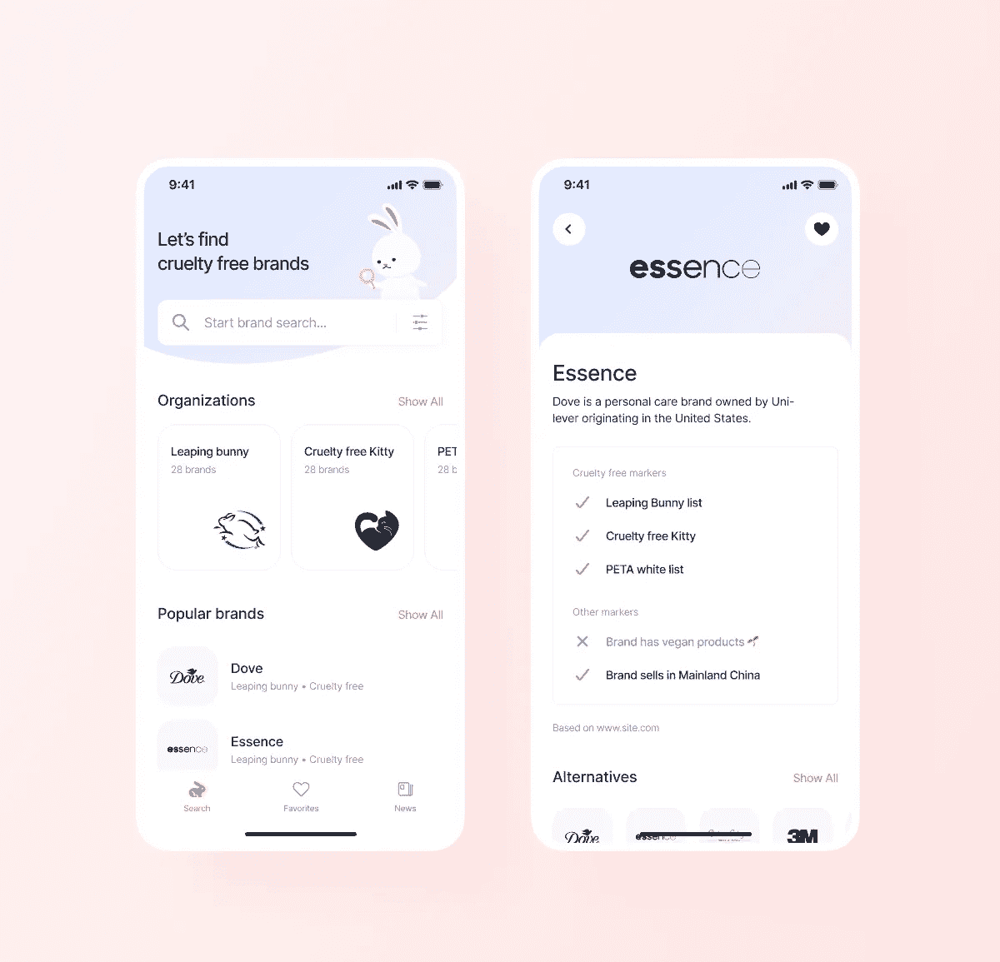

# 达莉亚的颤抖日记#2

> 原文：<https://levelup.gitconnected.com/darias-flutter-diaries-2-2a2924c264c9>


[https://unsplash.com/photos/xrVDYZRGdw4](https://unsplash.com/photos/xrVDYZRGdw4)

# 显示本用户信息

所以，如果你以前没有看过我的帖子，来个快速介绍吧。我的名字是 Daria，我是一个在移动工作室 [Chili Labs](https://chililabs.io/) 的 Flutter 开发者。我们的主要专长是客户项目，我目前正在做其中的一个项目，并监督其他几个项目。

# 这是怎么回事？

在这个系列中，我将讲述我作为一名 Flutter 开发人员的日常工作，以及我晚上最喜欢的项目。基本上是我一周内遇到的挑战、问题、有趣的任务和想法的概述。还有一个小小的免责声明:这不是一个教程，以防我谈论任何解决方案，它们只是我自己对这些问题的看法，你可以提出不同的解决方案。带着这个想法，让我们在🤿潜水吧

# #技术

如果说上周我是[迁徙女王达里娅](https://medium.com/@daria.orlova/darias-flutter-diaries-1-990ba611cf9e)，那么本周我就扮演了打虫人达里娅的角色😂知道下周我会是谁吗？😁

# 1.缓慢的 API 请求

我的一周开始于客户的一个(合法的)投诉，即最初的应用程序加载(冷启动)似乎很慢，并询问我们是否能对此做些什么。Tbh，我以前也想过这个问题，我们和 QA 讨论过这个问题，但是从来没有真正去调查过。

我最初的想法是，可能在 be 端有些东西太慢了(当然这是我最初的想法，并不是我这边有什么问题，pfft😂)，但是邮差很快证明我错了😬然后我开始查看我们的 HTTP 客户端库([顺便说一下是 dio](https://pub.dev/packages/dio))，并询问我的同事是否有任何问题，因为我记得他最近在聊天中提到过一些事情。

他建议我删除推荐的[转换器](https://github.com/flutterchina/dio#transformer)，它通过`compute`函数在后台解析响应，这是一个用于生成分离物的包装器。和...加载时间减少了 2-3 倍！这可能与我们有多个连续的 API 调用并且为每个调用产生了一个隔离的事实有关。这个其实是在 Flutter 2.8 上测试过的，这让我想起他们[承诺](https://medium.com/dartlang/dart-2-15-7e7a598e508a) `[compute](https://medium.com/dartlang/dart-2-15-7e7a598e508a)` [函数](https://medium.com/dartlang/dart-2-15-7e7a598e508a)升级到 Flutter 2.8 后会自动获得性能增益，但是到目前为止我都没有注意到🤔也许我应该深入调查一下🤪

此外，我的同事指出了一个小技巧，这可能是显而易见的，但仍然在代码的某些地方遗漏了:如果你有独立的请求，最好并行调用它们，而不是连续等待每个请求

```
final future1 = getListOfStuff1()
final future2 = getListOfStuff2()final listOfStuff1 = await future1
final listOfStuff2 = await future2
```

# 2.应用程序启动时出现白屏

标题听起来已经像一场噩梦，对不对？😂最近我们开始收到一些用户的报告，说应用程序发生了一些问题，现在它只显示一个白屏。其中一人写道，清理缓存有所帮助。用户只在安卓系统上，但在不同版本的操作系统和应用程序以及不同的设备上。在 Crashlytics 中，我找到了一些报告，这些报告引导我找到了几个与`flutter_secure_storage`相关的线程([其中之一](https://github.com/mogol/flutter_secure_storage/issues/161))。

这看起来确实像是我们的问题，因为我们在应用启动时确实`read`确定用户是否登录，平台异常会导致“白屏”，但我们自己仍然无法重现。

更重要的是，我们很久以前就已经提出了解决方案(禁用 Android 自动备份)，但问题仍然发生。不幸的是，我们不得不回到安全存储操作的老办法😅这个“修复”还没有上线，所以我不能确定是不是这个问题，但是我们下周会看到🙈

# 3.对无效令牌响应强制注销用户

现在，别说那些虫子了😂我在 Crashlytics 中发现了一些更好的东西，但没有什么真正值得讨论的。

但是我有另一个有趣的任务。我最近遇到了一个问题，我们的分期付款遇到了一些问题。结果是，当任何 API 请求(除了刷新令牌)返回 401 时，我们没有处理强制注销。所以我们的算法如下:

1.  为了执行 API 请求，从`SessionRepository`发送`getToken`
2.  在`getToken`中，我们检查当前令牌`expiresAt`是否过期
3.  如果是，我们尝试刷新令牌。如果失败，我们强制注销用户。
4.  如果成功或者`expiresAt`还没有过期，我们就返回当前令牌。
5.  所以问题出在`expiresAt`还没到期的部分，但是不管什么原因，令牌在 BE 上已经失效了。然后任何带有无效令牌的 API 调用都返回 401，用户被卡在应用程序中。

这是一种非常罕见的情况，因为我们的令牌非常短暂，通常如果出现任何故障，都是在刷新期间。但这仍然是一个有效的案例，应该得到解决。

现在，最明显、最简单、也可能是最正确的解决方案，就是将一个拦截器挂接到 HTTP 客户端库，当它在`onError`中捕获到 401 时，强制注销用户。这是我最初的想法，但问题是当我们注销用户时，我们需要在他之后清理(缓存、数据等。).在我们的例子中，这是`SessionRepository`的责任，但是`SessionRepository`本身需要一个 API 客户端，它需要`dio`实例。因此，由于循环依赖，我们不能向`dio`提供`SessionRepository`实例。所以我想出了一个方法，它处理这种情况，仍然在`SessionRepository`中封装与会话相关的逻辑，并且完全不依赖于 HTTP 库。

```
@override
  Future<T> withToken<T>(Future<T> Function(String token) action) async {
  // note for readers: getToken() also handles the refresh in case of expired token
    final token = await getToken(); 
    try {
      final result = await action(token);
      return result;
    } catch (ex, st) {
      if (ex is ApiException && ex.statusCode == 401) {
        Fimber.w('Invalid token exception', ex: ex, stacktrace: st);
        await clearData();
        throw const NotSignedInException();
      } else {
        rethrow;
      }
    }
  }
```

然后我可以这样使用它:

```
sessionRepository.withToken((token) {
    apiClient.doSomethingWithToken(token);
});
```

如果你想知道的话，这里有更多的代码(超出了本文的范围)在应用程序层面处理`not signed in status`。

# #2 社区

你还在吗？我还没让你烦死吗？😂

所以我在社区部分也有一些更新😛

# [1。RigaTechGirls 的导师](http://www.rigatechgirls.com/mentorship2022)

首先，我很高兴成为 RigaTechGirls 导师计划的导师！今年我将有两个学员，我们将学习 Flutter。这是我第一次在工作之外做扑导师，所以更有意思😁该计划为期 6 个月，从 2022 年 1 月开始，其目标是支持女性踏上 IT 世界的征程🙂

# 2.状态管理和应用架构

这些话题总是非常热门，但本周由于 Android 发布了新的应用架构指南，它们再次成为人们关注的焦点。除了讨论实际的指导方针，我已经看到相当多的人认为应用程序架构在概念上是过度工程化的，因为大多数应用程序都很小&基本上是“带有彩色按钮的 JSON 解析器”，它们不需要任何架构。

作为一名在过去几年中参与多个客户项目的开发人员，我不同意这种观点，因为根据我的经验，一个通用的、定义良好的应用程序架构，除了所有明显的好处(如可伸缩性、可测试性、代码质量等。)，还有一个更重要的好处，那就是可预测性。它允许其他开发人员无缝地加入和退出我们的项目，这使得团队和开发更加高效。[我也在推特上讨论过这个话题😉](https://twitter.com/dariadroid/status/1471211668508221442)

顺便说一下，我最近听了两个关于状态管理和应用架构的精彩演讲，所以我也可以推荐一下:

1.  [《颤振状态管理的建筑思考》马吉德·哈简](https://www.youtube.com/watch?v=BGD2j9jjQ3k&list=PLxcvsYzLfaTAhMPcEk9PzkVsGxoHdBcVn&index=8&t=743s)
2.  [阿莱西奥·萨尔瓦多里尼的《颤振建筑部件》](https://youtu.be/Tk4xKfgmcYs?t=5345)

# 3.颤振学徒

本节最后想提一下的是[颤振学徒书](https://www.raywenderlich.com/books/flutter-apprentice)，免费到 1 月 6 日(其实也没那么远！)，所以如果你还没有检查它，当你能的时候做它。我真的很喜欢它的内容，也很喜欢它的格式！

# #3 个人

我在这一部分没有太多的更新，因为本周的宠物项目不是我的任何应用程序，而是我作为一个圣诞老人，为我的家人买礼物😁此时此刻，我正在去我家乡的火车上(度周末)，我的父母和兄弟住在那里，我有一大包玩具，这是本周“宠物计划”的成果😂

但我确实设法开发了兔子搜索 1.1 版。在星期天



兔子搜索是一个搜索无虐待品牌的应用程序

在 1.1 版本中，将会有一些变化:

1.  该应用程序将提供俄语版本。我已经翻译了，那是容易的部分😂对于本地化，我们通常在工作中使用 [EasyLocalization](https://pub.dev/packages/easy_localization) 包，所以我也在 Bunny 中使用了它。因为这很容易😁
2.  我忽略了几个错误修复，试图尽快推出 1.0 版本😅
3.  而最大的特点就是模糊搜索。目前，这是最简单的`contains`搜索，但并不完美，因为你并不总是知道如何正确拼写品牌名称，或者它可能有一些发音符号。例如，如果你搜索`dave`，搜索仍然会在结果中返回`Dove`(目前没有)。

在我的一个工作项目中，出于同样的原因，我必须实现 Levenshtein 距离算法。

> *通俗地说，两个单词之间的 Levenshtein 距离是* ***将一个单词变成另一个*** *所需的最小单字符编辑(插入、删除或替换)次数。它是以苏联数学家弗拉基米尔·列文斯坦的名字命名的，他在 1965 年考虑了这个距离。维基百科*

但是这个应用程序中的数据集非常小，所以它运行得足够快。兔女郎就不是这样了，因为有成千上万的品牌需要迭代。我试过了😁这是我个人今年的“代码的来临”😂必须想出一些复杂的解决方案和优化这个有趣的任务🤪

同时，你可以下载兔宝宝搜索 1.0 版🙂

苹果公司:https://apps.apple.com/us/app/bunny-search/id1592571643

谷歌:[https://play.google.com/store/apps/details?id=lv.chi.bunny_search](https://play.google.com/store/apps/details?id=lv.chi.bunny_search)

再次感谢你的阅读，我希望你已经为自己找到了一些有趣的东西:)我很乐意在 Twitter (@dariadroid)上联系，并感谢你的掌声、评论、关注和分享🙂

直到(希望😅)下周！

达里亚💙