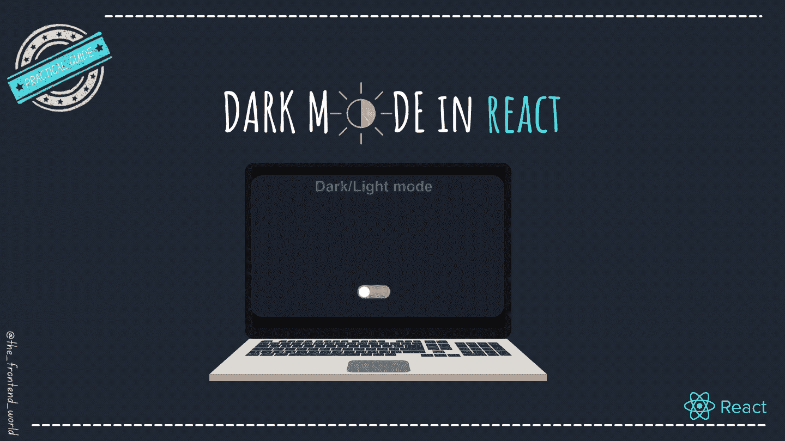
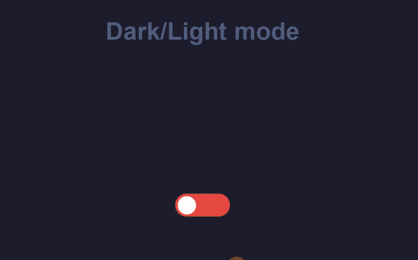

# React 中的黑暗模式

> 原文：<https://levelup.gitconnected.com/dark-mode-in-react-533faaee3c6e>

## 如何在 react JS 中制作黑暗主题？



作者:FAM

你喜欢应用程序中的黑暗模式吗？你喜欢跟风，想在你的 app 里实现黑暗模式吗？或者，你看了我写的关于你的应用程序采用黑暗模式的原因的文章了吗？

不管是什么原因，在这篇文章中，你会看到它的作用！

以下是我们将要构建的内容:

*   [现场演示](https://dark-mode-demo-bd6bwspf0-famzila.vercel.app/)

下面是我们在本文中经历的步骤:

*   创建一个 React 应用程序(用 ***react-scripts，*** 因为我们的目标是切换模式，而不是应用程序本身)
*   创建主题(暗/亮)
*   提供并使用主题
*   创建一个简单的切换按钮来测试我们到目前为止设置的所有东西
*   运球中增加了一个由[@哈提卜](https://dribbble.com/khatib")设计的性感拨动按钮。
*   佩服切换从黑暗到光明模式❤.

准备好了，让我们尽情享受吧！

# 第一步:创建一个 React 应用程序(如果已经完成，请跳过)

这一步非常简单快捷。我们将使用[反应脚本](https://github.com/facebook/create-react-app)

```
npx create-react-app my-app
cd my-app
npm start
```

其他依赖项:

安装应用程序后，我们需要 bootstrap、reactstrap 和 fontawesome(可选)。(我选择使用框架 bootstrap 是因为它的简单性和普及性，你可以选择任何你想要的作为 UI 框架)。如果您想了解更多关于 React 的流行 UI 框架:

[](https://medium.com/geekculture/6-best-react-ui-frameworks-and-kits-for-2021-14ae9611ca1d) [## 创建卓越 web 应用程序的最佳 UI React 框架！

### 2021 年的 6 个最佳 React UI 框架和套件

medium.com](https://medium.com/geekculture/6-best-react-ui-frameworks-and-kits-for-2021-14ae9611ca1d) 

# 步骤 2:创建主题(暗/亮)

现在，为了创建一个黑暗的模式，我更喜欢通过一个主题来了解我们使用的颜色和每个主题的清晰易读的东西。

为此，我将创建一个主题上下文提供者:

*   创建 react 上下文挂钩

> Context 旨在共享可以被视为 React 组件树的“全局”数据，例如当前经过身份验证的用户、主题或首选语言。

当我们切换黑暗模式时，整个应用程序需要重新渲染。这就是为什么我使用 context 来为我们的应用包装一个全球主题:

*   创建一个主题包装器，它将使用创建的上下文并传递新的更改:

如你所见，我使用 CSS 类`white-content`从白色模式切换到黑色模式。有很多方法可以做到这一点。

# 步骤 3:提供并使用主题

既然我们已经设置好主题并准备好使用，我们将把它添加到`index.js`文件中的 add:

# 步骤 4:创建一个简单的切换按钮来测试我们到目前为止设置的所有东西

它已经准备好并被使用。我们现在需要一个切换按钮来触发主题变化。为此，我将从一个简单的按钮开始，检查一切是否按我们想要的方式工作:

当动作被触发时:

*   我需要将深色模式切换到相反的颜色。
*   通过用正确的值(暗或白)触发`changeTheme()`来改变主题
*   然后我们看到它是有效的。


# 第五步:在运球中加入@哈提卜设计的性感切换按钮。

*   [风格](https://codepen.io/faria09/pen/mdVjjXL)(CSS 中)

有点太长了:

[](https://github.com/famzila/dark-mode-demo) [## GitHub-fam zila/黑暗模式-演示

### 这是一个演示反应应用程序演示切换之间的黑暗和白色。该应用程序使用主题上下文和主题包装器。对于…

github.com](https://github.com/famzila/dark-mode-demo) 

ToggleDark 组件

*   该应用程序

# 第六步:欣赏从黑暗到光明模式的切换。



黑暗模式演示

就是这样！我希望你喜欢它。

这最初是作为一个潜在的未来文章提出的。然后是伊尔霍姆·达达贾诺夫要求的。顺便说一句，我希望你喜欢它，^^

> 【源代码】- [回购](https://github.com/famzila/dark-mode-demo)

如果你想让我在以后的文章中涉及其他主题或网络相关的东西，请在评论中告诉我😉

> 每当有新的热门文章发布时，成为第一个被通知的人！

如果你有兴趣成为付费会员，你可以使用我的推荐链接。下次见

亲爱的读者，感谢你在我生命中的存在。

**让我们联系一下** [**中**](https://medium.com/@famzil/)**[**Linkedin**](https://www.linkedin.com/in/fatima-amzil-9031ba95/)**[**脸书**](https://www.facebook.com/The-Front-End-World)**[**insta gram**](https://www.instagram.com/the_frontend_world/)**[**Youtube**](https://www.youtube.com/channel/UCaxr-f9r6P1u7Y7SKFHi12g)**或**********

****看我的关于网络要素和一般文化的电子书。****

# ****分级编码****

****感谢您成为我们社区的一员！升级正在改变技术招聘。 [**在最好的公司**找到你最完美的工作](https://jobs.levelup.dev/talent) **。******

****[](https://jobs.levelup.dev/talent) [## 提升——改变招聘流程

### 🔥让软件工程师找到他们热爱的完美角色🧠寻找人才是最痛苦的部分…

作业. levelup.dev](https://jobs.levelup.dev/talent)****