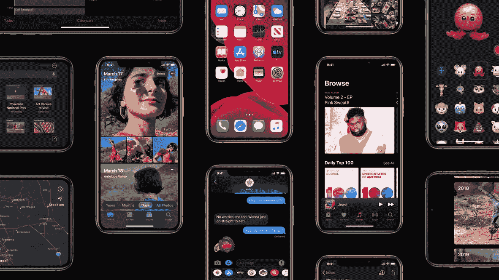

# iOS 黑暗模式提示

> 原文：<https://levelup.gitconnected.com/dark-mode-one-year-later-d8b01c3a0d8c>



自从 iOS 13 引入黑暗模式已经有一段时间了，已经有很多关于动态颜色、颜色集、动态图像/材质和其他工具的文章来支持这种新风格。

在面临一些挑战后，我想使用一些 UIKit 工具，这些工具可能对特殊需求有用。开始吧！🧑🏼‍💻💡

## 基础:自定义动态颜色

您可能已经知道，动态颜色可以通过 3 种不同的方式获得:通过使用系统定义的语义颜色(如 *systemBackground* 、 *label* 、 *systemRed* 等)，通过在 Assets.xcassets 中定义自定义 UIColor 集，或者通过对动态颜色进行编码，如:

## 用户界面级别和特征

想想黑暗模式下的苹果应用程序，比如 Messages:同样的*背景色*在主视图上看起来是黑色的，但在采用新`.automatic`模态风格的控制器上是深灰色的。这是一个小细节，给用户(结合动画)的**感觉。通过在代码中定义您的自定义动态颜色，您能够获得相同的结果，只需使用 UITraitCollection 的`userInterfaceLevel`属性和已知的`userInterfaceStyle` :**

```
case .dark: return traits.userInterfaceLevel == .elevated ? elevatedDark : dark
```

这些类型的定制不仅适用于颜色，还适用于其他 UI 元素，比如图像，您可能希望适应不同的样式。

更一般地说，用户界面的风格和级别只是你可以用来使你的 UI 适应黑暗模式的最常见的特征，但是 UITraitCollection 提供了一套完整的工具来微调我们的 UI，基于许多不同的环境条件:你可以在[官方文档](https://developer.apple.com/documentation/uikit/uitraitcollection)中找到更多关于它的信息。

## 解析动态颜色/图像

有些情况下，出于特殊需要，您可能需要知道动态颜色的当前 RGB 值；在其他一些用例中，比如使用 CALayer，你必须知道动态颜色的当前值。在这些情况下，我们可以使用系统定义的 API 解析动态颜色(以及图像):

## 让用户选择(覆盖)

遵循系统定义的风格是适应我们应用程序风格的主要(并且总是好的)方法；但是，假设我们想让我们的用户自由选择应用程序应该采用哪种风格，是亮、暗还是系统，因为应用程序的特定类型，或者只是作为一个定制选项。Info.plist 的`UIUserInterfaceStyle` 键对我们没有帮助，因为它将 UI 锁定在单一样式。`overrideUserInterfaceStyle` 方法覆盖了屏幕、窗口、视图和控制器(以及它们的后代)上的样式，但是我们如何有效地使用它呢？让我们看看这个非常简单的实现:

*   用户可以选择浅色、深色和系统风格:最后一种是指 UIScreen 的`userInterfaceStyle`，它总是系统级别的风格；
*   当用户切换风格时，我们通过调用`updateTheme` 函数来覆盖`keyWindow`的风格，因此这种变化会自动在整个应用程序中传播，并且我们会存储用户的偏好；
*   注意:如果你使用新的`UISceneDelegate`来管理多个窗口，你应该依赖那个 API 而不是`keyWindow`。

就这些了，感谢阅读！☕️你可以在以下链接找到一些关于黑暗模式的官方资源:

 [## 在你的界面中支持黑暗模式

### 在 macOS 和 iOS 中，用户可以选择采用全系统的浅色或深色外观。黑暗的外表，被称为黑暗…

developer.apple.com](https://developer.apple.com/documentation/xcode/supporting_dark_mode_in_your_interface) [](https://developer.apple.com/design/human-interface-guidelines/ios/visual-design/dark-mode/) [## 黑暗模式-视觉设计- iOS -人机界面指南-苹果开发者

### 在 iOS 13.0 和更高版本中，人们可以选择采用一种黑暗的全系统外观，称为黑暗模式。在黑暗模式下…

developer.apple.com](https://developer.apple.com/design/human-interface-guidelines/ios/visual-design/dark-mode/)