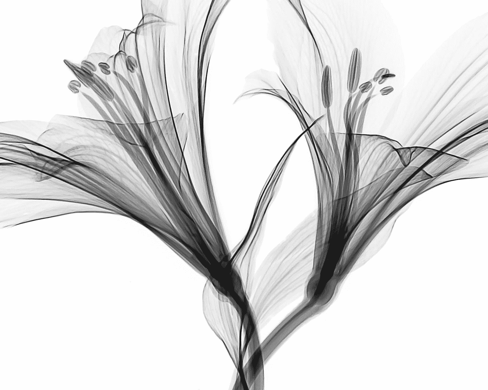
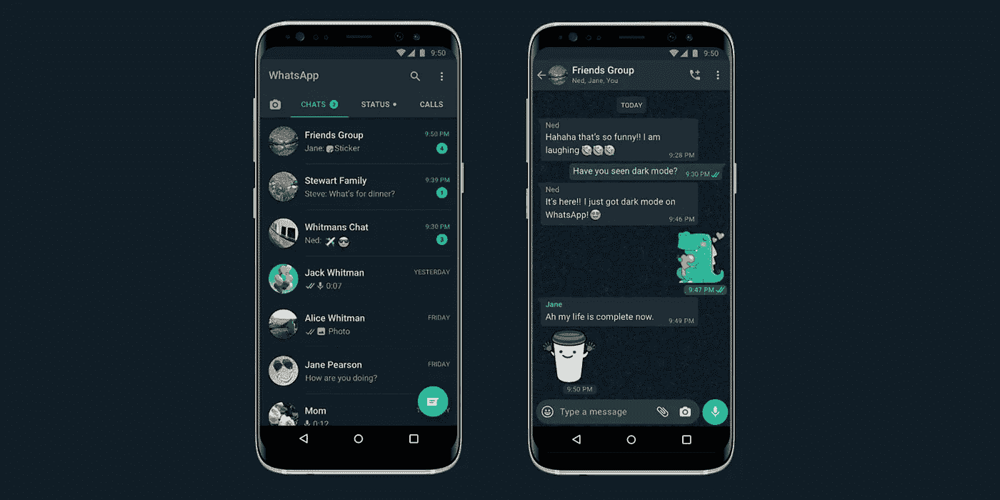
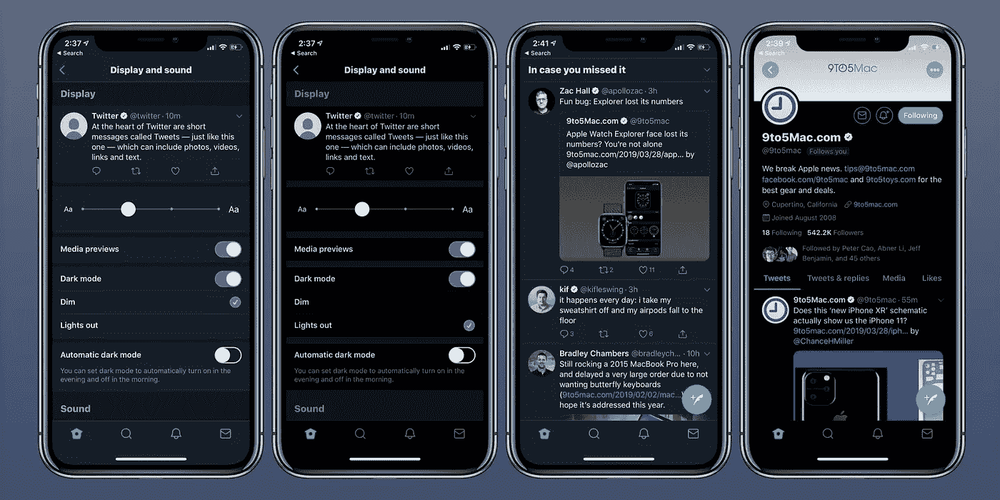
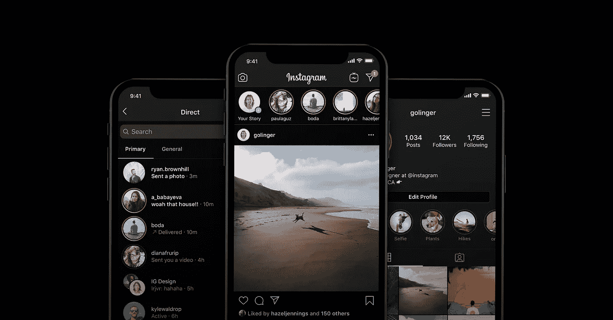

# 黑暗主题:现代用户界面设计

> 原文：<https://levelup.gitconnected.com/dark-theme-a-modern-ui-design-dec879313194>

## 在 UI 设计中正确使用黑色

马修·施瓦茨在 [Unsplash](https://unsplash.com?utm_source=medium&utm_medium=referral) 上的照片

用户体验和用户界面是任何成功软件的基本关注点。因此，开发人员已经确定并采用了黑暗主题界面(作为可选主题)来为用户服务，并帮助他们减少眼睛疲劳，特别是在弱光或黑暗中。

昏暗的灯光以减压和节能著称。黑暗模式是一种低光界面，使用较暗的颜色，通常是黑色或灰色阴影，作为其主要背景色。这是设计师们多年来一直使用的默认白色用户界面的反转。

夜间模式和黑暗主题已经成为现代 UI 设计中的一个新兴事物，许多大公司，如 [WhatsApp](https://faq.whatsapp.com/iphone/account-and-profile/how-to-use-dark-mode/?lang=fb) 、 [Instagram](https://www.facebook.com/help/instagram/897760233943762?helpref=search&sr=1&query=dark%20mode&search_session_id=b3d02d9c67450e4b3c3ade2ee6125d3a) 、 [Google](https://support.google.com/chrome/answer/9275525?co=GENIE.Platform%3DAndroid&hl=en#:~:text=Turn%20on%20Dark%20theme,Dark%20theme%20in%20device%20settings.) 、[脸书](https://www.facebook.com/help/community/question/?id=126591948482539)、[苹果](https://developer.apple.com/design/human-interface-guidelines/ios/visual-design/dark-mode)都已经采用了这种新趋势。

# 为什么是黑暗模式？

作为软件工程师，我们的主要目标之一是让客户满意，这主要取决于最终用户的体验。这意味着 UI 的设计和实现应该简单易行。

为什么人们更喜欢黑暗模式:

*   增加屏幕时间
*   在弱光/黑暗环境下，减轻眼睛疲劳
*   提高低环境照明下的可见度
*   更少的眼疲劳意味着更少的头痛和更好的工作体验。

尽管高色彩对比度可以提高可读性，但纯黑白对比度可能需要用户花费更多时间来阅读。

# 选择调色板

纯黑纯白都不好。白色是 100%，黑色是 0%。因此，这种差异产生了过度刺激眼睛的强光水平。这种对眼睛的干扰会引起眼睛疲劳，许多人都不喜欢。以下是一些填充调色板时可以考虑的建议:

## 避免纯黑色

没有书用纯黑或纯白。这是因为黑白之间的直接对比过于鲜明，迫使读者眯着眼睛，最终导致读者头痛和糟糕的体验。因此，避免使用纯黑色作为背景色。

## 使用适当的对比度

暗模式背景必须足够暗，以显示白色文本。否则，用户会觉得文本可读性较差。Google Material Design 建议使用至少 15.8:1 的文本与背景对比度。因此，最好明智地对比你的调色板。

## 使用不饱和的颜色

当在黑暗的表面上观看时，完全饱和的颜色*会振动*，妨碍可读性，使人非常不舒服。因此，避免完全饱和的颜色。用包括灰色和白色在内的淡色和浅色来替换它。

## 不要立即倒置

要得到暗主题是**T5 而不是 T7 来简单地反转颜色。用户界面中的一些颜色具有心理目的，立即反转这些颜色会使它变得毫无意义和荒谬。因此，在为你的调色板选择颜色时，一定要深思熟虑。**

## 将层级可视化

对所有层使用相同的颜色会妨碍良好的 UI 设计实践，并可能导致可读性差。因此，建议对较高的图层使用较浅的色调，对较低的图层使用较暗的色调。这创造了一个视觉层次，从你的显示器中最常用的元素到最少的元素。

# 白色文本的建议背景颜色

美国验光配镜协会(AOA)的一项调查发现，58%的美国成年人因在电脑上工作而感到眼睛疲劳。因此，这里有一些来自[UX 木桶](https://www.instagram.com/rushabhuix/?hl=en)[的拉沙布·库尔卡尼](https://uxbucket.com/author/rushabh-kulkarni/)关于设计黑暗主题的建议。

我建议在中型移动应用程序(测试版)上以黑暗模式查看这些颜色，以获得更好的视觉清晰度。遗憾的是，黑暗模式不适用于网络。不过，你可以通过安装一个 [chrome 扩展](https://chrome.google.com/webstore/detail/medium-dark-mode/kofkfocgjmlajkbkecljhbalihcpliih?hl=en)来实现。

## #303030

 [## 十六进制颜色#303030，颜色名称:夜骑士，RGB(48，48，48)，窗口:3158064。- HTML CSS 颜色

### 303030(或 0x303030)是未知颜色:约夜骑。十六进制三连音:30，30，30。RGB 值为(48，48，48)。…的总和

www.htmlcsscolor.com](https://www.htmlcsscolor.com/hex/303030) 

## #2B2B2B

 [## 十六进制颜色#2B2B2B，颜色名称:暗夜骑士，RGB(43，43，43)，Windows: 2829099。- HTML CSS 颜色

### 2B2B2B(或 0x2B2B2B)未知颜色:约夜骑。十六进制三重奏:2B、2B 和 2B。RGB 值为(43，43，43)。…的总和

www.htmlcsscolor.com](https://www.htmlcsscolor.com/hex/2B2B2B) 

## #1F1F1F

 [## 十六进制颜色#1F1F1F，颜色名称:Nero，RGB(31，31，31)，Windows: 2039583。- HTML CSS 颜色

### 1F1F1F(或 0x1F1F1F)未知颜色:约为 Nero。十六进制三连音:1F，1F，1F。RGB 值为(31，31，31)。RGB 总和…

www.htmlcsscolor.com](https://www.htmlcsscolor.com/hex/1F1F1F) 

## #1B1C1E

 [## 十六进制颜色#1B1C1E，颜色名称:黑色俄罗斯，RGB(27，28，30)，窗口:1973275。- HTML CSS 颜色

### 1B1C1E(或 0x1B1C1E)未知颜色:近似黑色俄罗斯。十六进制三连音:1B，1C 和 1E。RGB 值为(27，28，30)。总和…

www.htmlcsscolor.com](https://www.htmlcsscolor.com/hex/1B1C1E) 

正如你自己所看到的，这些阴影不是纯粹的黑色和白色，可读性很强。而从#303030 向下滚动到#1B1C1E，我们可以直观的看到向下滚动时背景颜色越来越深。

# 黑暗模式不是黑色模式！

以上建议是针对纯黑白的。然而，当谈到黑暗模式，也有其他颜色组合。这可以是用于背景的任何颜色的较暗阴影。

我将浏览一些我最喜欢和最常用的应用程序，以及它们的黑暗模式功能。下面让我们快速浏览一下。

## Whatsapp

图片来源:[https://9 to 5 Google . com/WP-content/uploads/sites/4/2020/03/WhatsApp-dark-mode-official . jpg？质量=82 &条=全部](https://9to5google.com/wp-content/uploads/sites/4/2020/03/WhatsApp-dark-mode-official.jpg?quality=82&strip=all)

Whatsapp 使用了*深绿色*主题，与通常的绿色主题完美融合。在上面的图片中，你可以看到他们是如何根据组件的重要性和控制水平在屏幕上排列组件的优先级的。

## 推特

图片来源:[https://9 to 5 MAC . com/WP-content/uploads/sites/6/2019/03/Twitter-black-dark-mode-iOS-iPhone-lead . JPEG？质量=82 &条=全部](https://9to5mac.com/wp-content/uploads/sites/6/2019/03/Twitter-black-dark-mode-iOS-iPhone-lead.jpeg?quality=82&strip=all)

Twitter 使用了深蓝色和浅黑色的奇妙混合。此外，请注意，组件的优先级已从较浅的阴影分割为较深的阴影。

## 照片墙

图片来源:[https://miro . medium . com/max/16424/1 * D8-4 iyqquj 0 ygikz 3 bjzwg . png](https://miro.medium.com/max/16424/1*d8-4IYqquJ0yGIKZ3bjzWg.png)

Instagram 使用的主题与其他应用相比黑色更多。黑色与较暗的灰色阴影相互妥协，将主要控件推到更高的层次，将内容推到更深的层次。

正如我上面提到的，还有其他大公司，如谷歌、脸书、苹果等。，这些公司将深色模式引入到他们的产品中，并使用他们喜欢的配色。

因此，黑暗模式并不总是黑色和白色的阴影。它可以是不同的，并根据企业、组织或客户的偏好定制颜色组合。

# 结论

技术正呈指数级发展，环顾四周，每个人都在使用电脑或移动设备。这证明了作为软件工程师，我们有责任为最终用户提供最好的用户体验。

黑暗主题时代刚刚开始，这是黑暗和创造性的最佳时机！发挥创意，让结果说话！

我希望这个故事已经教育了你在现代 UI 中设计黑暗主题时要考虑的因素。快乐学习，享受发展！