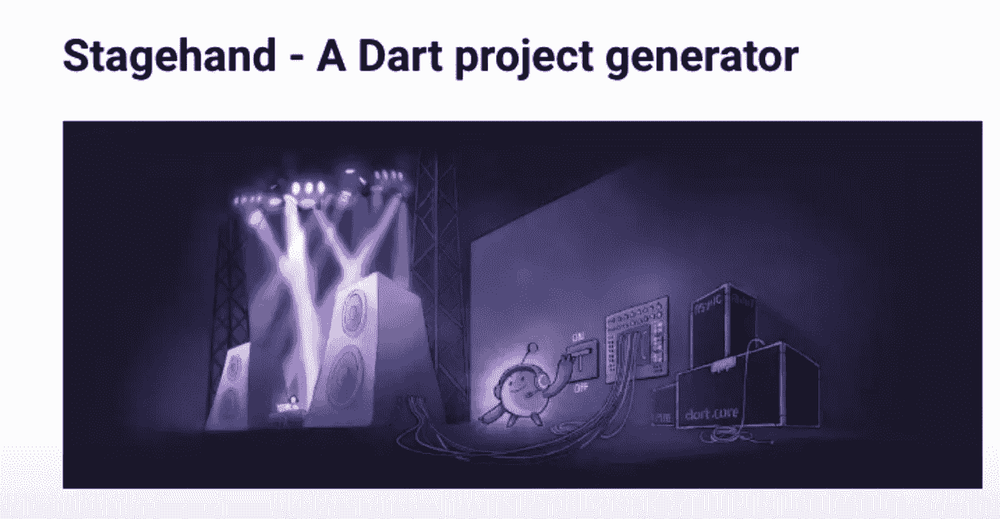
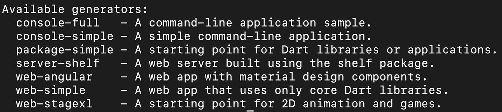
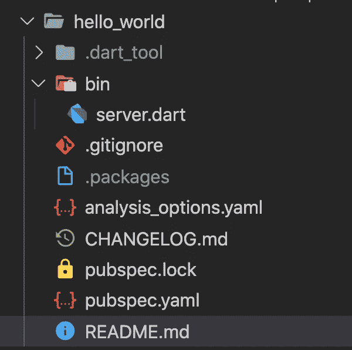
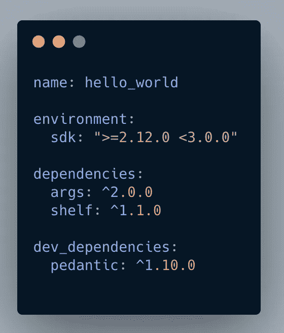

# 飞镖和云跑

> 原文：<https://levelup.gitconnected.com/dart-and-cloud-run-a31a3d129880>

飞镖和云跑

*这里的文章:*[*【https://flatteredwithflutter.com/dart-and-cloud-run/】*](https://flatteredwithflutter.com/dart-and-cloud-run/)

飞镖和云跑

# 介绍

***等级:初级***

我们将简要介绍:

1.  编写 dart 服务器 API
2.  在云上部署

> 注意:本文假设读者了解云运行和 GCP。


飞镖和云跑

# 编写 dart 服务器 API

升级至 [Dart 2.13](https://medium.com/dartlang/announcing-dart-2-13-c6d547b57067) 的最新版本


Dart 版本 2.13

有两种编写服务器 API 的方法

1.  手动创建每个文件，正确放置它们，然后失败
2.  使用脚手架(预定义的文件夹结构，包含最少的必要文件)

> **我们将采用第 2 点**

[介绍 stage hand](https://pub.dev/packages/stagehand/install):Dart 项目生成器



舞台管理

*   这将有助于我们将所有必要的文件打包到一个文件夹中。
*   通过以下方式安装

```
dart pub global activate stagehand
```

*   安装后，您现在可以访问以下生成器命令



舞台发电机

*   对于我们的情况，我们将与

```
stagehand server-shelf
```

我们得到的文件夹结构是



Web 服务器文件夹结构

*   查看 **pubspec.yaml，**我们有[](https://pub.dev/packages/shelf)**和 [**args**](https://pub.dev/packages/args) 的依赖关系**

****

**公共规范**

**对于包参数:**

*   **它对于命令行应用程序很有用，在那里我们提供参数**

**[](/dart-ffi-and-cli-app-8cc5ed2f8aae) [## Dart FFI 和 CLI 应用程序

### Dart FFI 和 CLI 应用程序

Dart FFI 和 Applevelup.gitconnected.com CLI](/dart-ffi-and-cli-app-8cc5ed2f8aae) 

## 什么是架子？

它有助于创建和组成 web 服务器。

```
import 'package:shelf/shelf.dart';
import 'package:shelf/shelf_io.dart' as shelf_io;// For Google Cloud Run, set _hostname to '0.0.0.0'
const _hostname = '0.0.0.0';void main() async {
  var handler =
      const  Pipeline().addMiddleware(logRequests()).addHandler(_echoRequest);var server = await shelf_io.serve(handler, _hostname, 8080);}Response _echoRequest(Request request) =>
    Response.ok('Hello world');
```

*   在我们的 **server.dart** 中默认导入包架
*   我们创建一个处理程序 **_echoRequest**

处理程序基本上是处理请求的东西。请求并返回响应([上架)。响应](https://pub.dev/documentation/shelf/latest/shelf/Response-class.html)

在我们的例子中，我们返回响应为**“Hello World”。**

*   假设我们想要将请求( **logRequests** )记录到我们的 API 中，我们需要添加另一个处理程序。

这里出现了[管道](https://pub.dev/documentation/shelf/latest/shelf/Pipeline-class.html)的概念

> 管道是中间件和处理程序的结合。

*   我们添加了 [**logRequests**](https://pub.dev/documentation/shelf/latest/shelf/logRequests.html) ，这是在货架内部预定义的。

> 可以把中间件想象成一个函数，它接受一个处理程序并把它包装在另一个处理程序中，以提供额外的功能

*   为了启动服务器，我们调用 [serve](https://pub.dev/documentation/shelf/latest/shelf_io/serve.html) 函数。

> 启动一个 [HttpServer](https://api.dart.dev/stable/2.13.1/dart-io/HttpServer-class.html) ，它监听指定的`address`和`port`，并向`handler`发送请求。

**处理程序**:之前定义的

**地址**:我们正在使用 0.0.0.0(对于云运行，请参见下一步)

**端口** : 8080** 

# **在云上部署**

**谷歌 I/O 2021 宣布，Dart 现在可以作为 [Docker 官方图片](https://docs.docker.com/docker-hub/official_images/)使用。**

**根据公告**

> **“Docker 按照最佳实践对[新 Dart 图像](https://hub.docker.com/_/dart)进行了测试和验证”。**

**它们还支持提前(AOT)编译，这可以极大地减少构建容器的大小，并可以提高容器环境中的部署速度——如[云运行](https://cloud.google.com/run)。**

**现在让我们部署我们的 **hello_world** 应用程序**

*   **创建一个 docker 文件，并将[中的内容放在这里](https://hub.docker.com/_/dart)**
*   **我们将使用命令构建一个 docker 映像**

```
docker build -t hello_world .
```

> **注意:这需要在您的机器上安装 docker。[参考这个](https://docs.docker.com/get-docker/)**

*   **使用以下命令在本地运行映像(在步骤 2 中构建)**

```
docker run -it -p 8080:8080 \hello_world:latest
```

*   **测试时，您可以使用**

```
// For getting container id, you can use
docker psdocker stop [YOUR CONTAINER ID]
```

**是时候**部署这个映像**(从上面)到云运行了。**

*   **确保你的机器上安装了 Google Cloud SDK。[参考这个](https://cloud.google.com/sdk/docs/install)。**

> **注:您还需要一个启用了开单的 GCP 项目。**

*   **使用 gcloud CLI 验证您的用户帐户**

```
[gcloud auth login](https://cloud.google.com/sdk/gcloud/reference/auth/login)
```

*   **列出您的项目并设置首选项目**

```
// List your GCP projects
gcloud projects list // Set your project
gcloud config set project \
'YOUR PROJECT ID'
```

*   **现在我们需要在 [Google 容器注册表](https://cloud.google.com/container-registry)中发布我们的图像(在 GCP 存储我们的 docker 图像),使用**

```
gcloud builds submit --tag gcr.io/[YOUR-PROJECT-ID]/hello_world// Replace [YOUR-PROJECT-ID] with your project id
```

*   **最后，我们使用**

```
gcloud run deploy --image gcr.io/[YOUR-PROJECT-ID]/hello_world// Replace [YOUR-PROJECT-ID] with your project id
```

**[此处引用命令](https://cloud.google.com/sdk/gcloud/reference/run/deploy)**

*   **如果全部成功，您将在上一步之后看到一个端点。**

> **端点(对于我的例子):[https://hello world-rahizluroq-UC . a . run . app](https://helloworld-rahizluroq-uc.a.run.app)**

## **下一步是什么**

**Dart 团队带来了 Dart 的[功能框架，](https://pub.dev/packages/functions_framework)**

*   **用于编写 Dart 函数的包、工具和示例的集合，部署这些函数是为了处理 HTTP 请求和 CloudEvents。**

****

```
[Source code](https://github.com/AseemWangoo/flutter_programs/blob/master/dart_on_server.zip)
```

**感兴趣的文章:**

**[](/using-room-in-jetpack-compose-d2b6b674d3a5) [## 在 Jetpack Compose 中使用房间

### 在 Jetpack Compose 中使用房间

使用喷气背包 Composelevelup.gitconnected.com 的房间](/using-room-in-jetpack-compose-d2b6b674d3a5) [](/using-state-in-jetpack-compose-b7445b697736) [## 在 Jetpack 撰写中使用状态

### 介绍 Jetpack 编写和使用状态

levelup.gitconnected.com](/using-state-in-jetpack-compose-b7445b697736) [](/flutter2-widgets-link-rawautocomplete-cupertinoformsection-6e75f8f1127a) [## Flutter2 小部件—链接| raw autocomplete | CupertinoFormSection

### link | raw autocomplete | CupertinoFormSection 等

levelup.gitconnected.com](/flutter2-widgets-link-rawautocomplete-cupertinoformsection-6e75f8f1127a)**